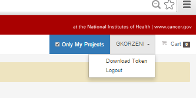

# Authentication and Authorization

The GDC API provides access to open-access data without authentication. Submitting data to the GDC and downloading controlled-access data requires authentication and appropriate authorization.  

## Authorization

Authorization for downloading controlled-access data or for submitting data to the GDC is obtained via dbGaP. See [Obtaining Access to Controlled Data](https://gdc-dev.nci.nih.gov/access-data/obtaining-access-controlled-data) and [Obtaining Access to Submit Data](https://gdc.nci.nih.gov/submit-data/obtaining-access-submit-data) for instructions on getting the appropriate authorization.

## Authentication

### About Authentication Tokens

To perform functions for which authorization is required, the GDC API requires users to authenticate using a token generated using the [GDC Data Portal](https://gdc-portal.nci.nih.gov) or the [GDC Data Submission Portal](https://gdc-portal.nci.nih.gov/submission). Users can obtain authentication tokens only after receiving appropriate authorization via dbGaP.

  

Tokens are alphanumeric strings of characters like this one:

	ALPHANUMERICTOKEN-01234567890+AlPhAnUmErIcToKeN=0123456789-ALPHANUMERICTOKEN-01234567890+AlPhAnUmErIcToKeN=0123456789-ALPHANUMERICTOKEN-01234567890+AlPhAnUmErIcToKeN=0123456789-ALPHANUMERICTOKEN-01234567890+AlPhAnUmErIcToKeN=0123456789-ALPHANUMERICTOKEN-01234567890+AlPhAnUmErIcToKeN=0123456789-ALPHANUMERICTOKEN-01234567890+AlPhAnUmErIcToKeN=0123456789-ALPHANUMERICTOKEN-01234567890+AlPhAnUmErIcToKeN=0123456789-ALPHANUMERICTOKEN-01234567890+AlPhAnUmErIcToKeN=0123456789-ALPHANUMERICTOKEN-01234567890+AlPhAnUmErIcToKeN=0123456789-ALPHANUMERICTOKEN-01234567890+AlPhAnUmErIcToKeN=0123456789-ALPHANUMERICTOKEN-01234567890+AlPhAnUmErIcToKeN=0123456789-ALPHANUMERICTOKEN-01234567890+AlPhAnUmErIcToKeN=0123456789-ALPHANUMERICTOKEN-01234567890+AlPhAnUmErIcToKeN=0123456789-ALPHANUMERICTOKEN-01234567890+AlPhAnUmErIcToKeN=0123456789-ALPHANUMERICTOKEN-01234567890+AlPhAnUmErIcToKeN=0123456789-ALPHANUMERICTOKEN-01234567890+AlPhAnUmErIcToKeN=0123456789-ALPHANUMERICTOKEN-01234567890+AlPhAnUmErIcToKeN=0123456789-ALPHANUMERICTOKEN-01234567890+AlPhAnUmErIcToKeN=0123456789-ALPHANUMERICTO

### Using a Token

A token must be passed to the GDC API with each request that requires authorizationFor transactions that require authorization, each request submitted to the GDC API must include an `X-Auth-Token` custom header.


#### Example: Downloading Controlled Data

In the following example, the token is saved as an environment variable and passed to `curl`, making it easy to re-use the token:

``` shell
export token=ALPHANUMERICTOKEN-01234567890+AlPhAnUmErIcToKeN=0123456789-ALPHANUMERICTOKEN-01234567890+AlPhAnUmErIcToKeN=0123456789-ALPHANUMERICTOKEN-01234567890+AlPhAnUmErIcToKeN=0123456789-ALPHANUMERICTOKEN-01234567890+AlPhAnUmErIcToKeN=0123456789-ALPHANUMERICTOKEN-01234567890+AlPhAnUmErIcToKeN=0123456789-ALPHANUMERICTOKEN-01234567890+AlPhAnUmErIcToKeN=0123456789-ALPHANUMERICTOKEN-01234567890+AlPhAnUmErIcToKeN=0123456789-ALPHANUMERICTOKEN-01234567890+AlPhAnUmErIcToKeN=0123456789-ALPHANUMERICTOKEN-01234567890+AlPhAnUmErIcToKeN=0123456789-ALPHANUMERICTOKEN-01234567890+AlPhAnUmErIcToKeN=0123456789-ALPHANUMERICTOKEN-01234567890+AlPhAnUmErIcToKeN=0123456789-ALPHANUMERICTOKEN-01234567890+AlPhAnUmErIcToKeN=0123456789-ALPHANUMERICTOKEN-01234567890+AlPhAnUmErIcToKeN=0123456789-ALPHANUMERICTOKEN-01234567890+AlPhAnUmErIcToKeN=0123456789-ALPHANUMERICTOKEN-01234567890+AlPhAnUmErIcToKeN=0123456789-ALPHANUMERICTOKEN-01234567890+AlPhAnUmErIcToKeN=0123456789-ALPHANUMERICTOKEN-01234567890+AlPhAnUmErIcToKeN=0123456789-ALPHANUMERICTOKEN-01234567890+AlPhAnUmErIcToKeN=0123456789-ALPHANUMERICTO

curl -O -J -H "X-Auth-Token: $token" 'https://gdc-api.nci.nih.gov/data/a1c1b23b-cc41-4e85-b1b7-62a42873c5af'
```
```Output
  % Total    % Received % Xferd  Average Speed   Time    Time     Time  Current
                                 Dload  Upload   Total   Spent    Left  Speed
100 31.4M  100 31.4M    0     0   290k      0  0:01:50  0:01:50 --:--:--  172k
curl: Saved to filename 'ACOLD_p_TCGA_Batch17_SNP_N_GenomeWideSNP_6_A03_466078.tangent.copynumber.data.txt'
```


### Token Expiration

Tokens are valid for 90 days from the time of download.

Any request to the GDC API that uses an expired token will fail and receive an HTTP error response.
