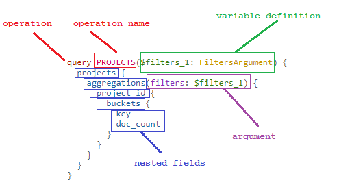

# Introduction to GDC GraphQL
[GraphQL](https://graphql.org/) is a query language for APIs. The [GDC REST API](https://docs.gdc.cancer.gov/API/Users_Guide/Getting_Started/) has structured and specifically defined query parameters as well as endpoints that have set requests and responses. The GDC GraphQL provides advanced GDC users greater flexibility to specify the data they would like to be returned. This allows queries to be cleaner and easier to understand, especially when combining multiple queries into one request.

To produce queries in a visual interface, the GDC recommends using [GraphiQL](https://github.com/graphql/graphiql). See below for the correct endpoint URLs.

## Using GDC GraphQL vs GDC REST API

If the query requires only a subset of the data to be returned, GDC GraphQL may speed up requests as GraphQL queries return only the specified data. This may require less work on the GDC server-side to fulfill those requests. Conversely, if an entire data-set is required for each request, the GDC REST API may be a better fit. No matter which method is used, the data returned by the GDC REST API and the GraphQL query will be identical as they query the same source.

## GDC GraphQL Overview
GraphQL is not a storage model or a database query language. The graph refers to graph structures defined in the schema, where nodes define objects and edges define relationships between objects. The API traverses and returns application data based on the schema definitions, independent of how the data is stored.

## GDC GraphQL Endpoints

The GDC GraphQL has only two endpoints:
* __GDC Search and Retrieval Endpoint:__ https://api.gdc.cancer.gov/v0/graphql
* __GDC Submission Endpoint:__ https://api.gdc.cancer.gov/v0/submission/graphql

This page covers the search and retrieval endpoint, see the [GDC Submission API](Submission.md) for additional details on the submission endpoint.

## GDC GraphQL Schema
All GDC GraphQL queries are validated and executed against the [GDC GraphQL schema]( https://github.com/NCI-GDC/portal-ui/blob/92f0dfa17838746093c3c011141d08391016da91/data/schema.graphql). Because the GraphQL parameters are discoverable, the GDC GraphQL schema can be queried for details about itself.

The `__schema` keyword can be queried to list all types defined in the schema and retrieve details about each:

```GraphQL
{
  __schema {
    types {
      name
      kind
      fields {
        name
      }
    }
  }
}
```
The `__type` keyword can also be queried to retrieve details about any type such as "Explore" or "Case":
```GraphQL

{
  __type(name: "Explore") {
    name
    kind
    description
    fields {
      name
    }
  }
}
```

```GraphQL
{
  __type(name: "Case") {
    name
    kind
    description
    fields {
      name
    }
  }
}
```

## Basic GraphQL queries in GDC
The two types of allowed operations in GDC GraphQL API are queries and mutations. Comparing GraphQL to REST, queries operate like `GET` requests, while mutations operate like `POST`/`PATCH`/`DELETE`.

__Note:__ This guide does not cover GDC GraphQL mutation operations.

GraphQL queries return only the data that is specified. Queries are built by specifying fields within fields (also called nested *subfields*) until only scalars are returned.  Scalars are primitive values such as: `Int`, `Float`, `String`, `Boolean`, or `ID`.

## Anatomy of a typical GDC GraphQL Query

 [](images/graphql-query.png "Click to see the full image.")

- __Operation type:__ Describes what type of operation that is being performed, such as query, mutation, or subscription
- __Operation name:__ Similar to a function name, gives queries meaningful names
- __Field:__ Denotes the specific fields on objects that will be included with the response data
- __Arguments:__ A set of key-value pairs associated with a specific field. The parameters can be literal values or variables. __NOTE:__ Arguments can appear on any field, even fields nested deep in an operation.
- __Variable definitions:__ As GraphQL is strong typed, it validates the variable being passed dynamically. __NOTE:__ Variables are passed separately from the query document as JSON such as:

```json
    { "filters_1": {"op":"in","content":{"field":"projects.program.name","value":["TARGET"]}}}
```

## GDC GraphQL Examples
### Nodes And Edges Example
A very powerful feature of GDC GraphQL API is that the graph structures defined in the [GDC GraphQL schema]( https://github.com/NCI-GDC/portal-ui/blob/92f0dfa17838746093c3c011141d08391016da91/data/schema.graphql ) can be queried and traversed. In these queries, nodes define objects and edges define relationships between objects.

```GraphQL

query PROJECTS_EDGES($filters_1: FiltersArgument) {
  projects {
    hits(filters: $filters_1) {
      total
      edges {
        node {
          primary_site
          disease_type
          project_id
          dbgap_accession_number
        }
      }
    }
  }
}

    variable:
    { "filters_1": {"op": "in", "content": {"field": "projects.primary_site", "value": ["Kidney"]}}}
```

### Query Case File Counts

```GraphQL
query CaseFileCounts($filters: FiltersArgument) {
  viewer {
    repository {
      cases {
        hits(first: 1, filters: $filters) {
          edges {
            node {
              case_id
              files {
                hits(first: 0) {
                  total
                }
              }
              summary {
                experimental_strategies {
                  experimental_strategy
                  file_count
                }
                data_categories {
                  data_category
                  file_count
                }
              }
            }
          }
        }
      }
    }
  }
}

variable:
{"filters":{"op":"in","content":{"field":"cases.case_id","value":["dcd5860c-7e3a-44f3-a732-fe92fe3fe300"]}}}
```

### Query Simple Static Mutations Based on Gene IDs

```GraphQL

query PROJECTS_EDGES($filters_2: FiltersArgument) {
  explore {
    ssms {
      hits(filters: $filters_2) {
        total
        edges {
          node {
            ssm_id
            gene_aa_change
          }
        }
      }
    }
  }
}

variable:
{"filters_2": {"op":"in","content":{"field":"consequence.transcript.gene.gene_id","value":["ENSG00000155657"]}}}
```
