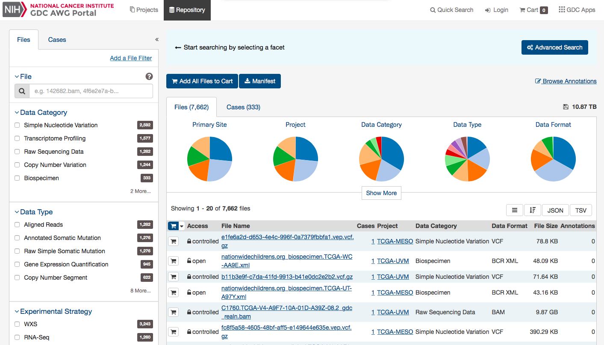
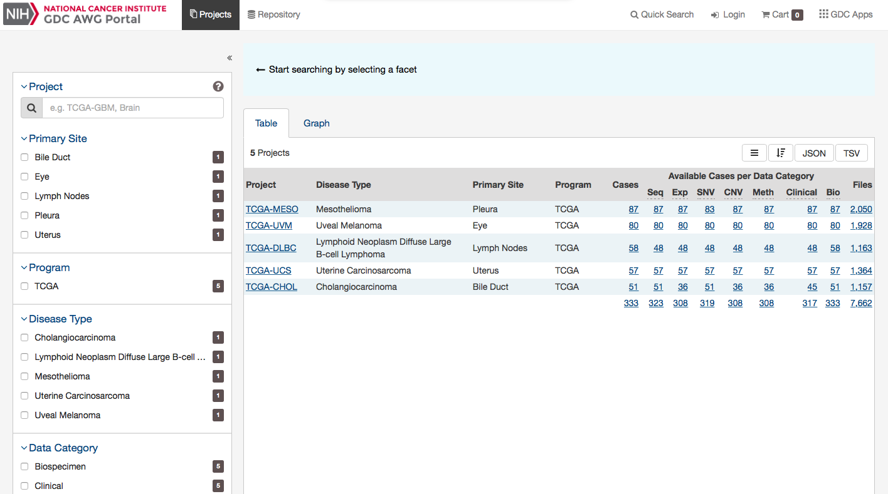
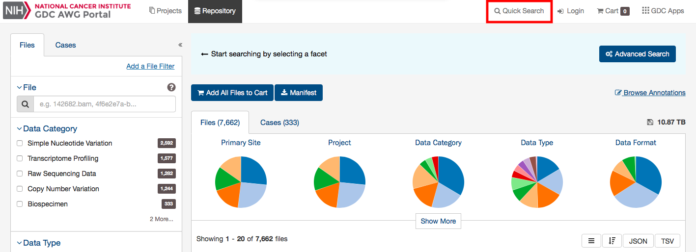

# Getting Started

## The GDC AWG Portal: An Overview

The Genomic Data Commons (GDC) AWG Portal provides users with web-based access to pre-released data from cancer genomics studies that have been harmonized by the GDC, but not yet released in the main GDC Data Portal. Key GDC AWG Portal features include:

*   Repository page for browsing data by project / file / case
*   File / case faceted searches to filter data
*   Cart for collecting data files of interest
*   Authentication using eRA Commons credentials for access to controlled data files
*   Secure data download directly from the cart or using the [GDC Data Transfer Tool](https://gdc.cancer.gov/access-data/gdc-data-transfer-tool)

## Accessing the GDC AWG Data Portal

The GDC AWG Portal is accessible using a web browser such as Chrome, Internet Explorer, and Firefox at the following URL:

[https://portal.awg.gdc.cancer.gov](https://portal.awg.gdc.cancer.gov)

You must also connect to the correct VPN in order to have access.  Please contact GDC User Support ([support@nci-gdc.datacommons.io](mailto:support@nci-gdc.datacommons.io)) to assist in setting up VPN access.

## Navigation

### Views

The GDC AWG Portal provides 2 main navigation options (*Views*) for browsing available pre-release harmonized datasets:

* __Repository__: The [Repository Page](3_Repository.md) displays data files available for download and provides file/case filters to narrow down a user's search.

* __Projects__: The [Projects Page](2_Projects.md) gives an overall summary of project-level information, including the available data for each project.

Each view provides a distinct representation of the same underlying set of GDC data and metadata.

### Toolbar

The toolbar available at the top of all pages in the GDC AWG Portal provides convenient navigation links to various pages.

The left portion of this toolbar provides access to the __Projects Page__ and __Repository Page__:

The right portion of this toolbar provides access to [quick search](#quick-search), [authentication functions](Authentication.md), the [cart](4_Cart.md), and the GDC Apps menu:

The GDC Apps menu provides links to all resources provided by the GDC.

### Tables

Tabular listings are the primary method of representing available data in the GDC AWG Portal. Tables are available in all views and in the file cart. Users can customize each table by specifying columns, size, and sorting.

#### Table Sort

The *sort table* button is available in the top right corner of each table. To sort by a column, place a checkmark next to it and select the preferred sort direction. If multiple columns columns are selected for sorting, data is sorted column-by-column in the order that columns appear in the sort menu: the topmost selected column becomes the primary sorting parameter; the selected column below it is used for secondary sort, etc.

#### Table Arrangement

The *arrange columns* button allows users to adjust the order of columns in the table and select which columns are displayed.

#### Table Size

Table size can be adjusted using the menu in the bottom left corner of the table. The menu sets the maximum number of rows to display. If the number of entries to be displayed exceeds the maximum number of rows, then the table will be paginated, and navigation buttons will be provided in the bottom right corner of the table to navigate between pages.

#### Table Export

In the Repository, Projects, and Annotations views, tables can be exported in either a JSON or TSV format. The `JSON` button will export the entire table's contents into a JSON file.  The `TSV` button will export the current view of the table into a TSV file.

### Filtering and Searching

The GDC AWG Portal offers two different means of searching and filtering the available data: facet filters and quick search.

#### Facet Filters

Facets on the left of each view (Projects and Repository) represent properties of the data that can be used for filtering. Some of the available facets are project name, disease type, patient gender and age at diagnosis, and various data formats and categories. Each facet displays the name of the data property, the available values, and numbers of matching entities for each value (files, cases, annotations, or projects, depending on the context).

Below are two file facets available in the Repository view. A _Data Type_ facet filter is applied, filtering for "Aligned Reads" files.

Multiple selections within a facet are treated as an "OR" query: e.g. "Aligned Reads" OR "Annotated Somatic Mutation". Selections in different facets are treated as "AND" queries: e.g. Data Type: "Aligned Reads" AND Experimental Strategy: "RNA-Seq".

The information displayed in each facet reflects this: in the example above, marking the "Aligned Reads" checkbox does not change the numbers or the available values in the _Data Type_ facet where the checkbox is found, but it does change the values available in the _Experimental Strategy_ facet. The _Experimental Strategy_ facet now displays only values from files of _Data Type_ "Aligned Reads".

Custom facet filters can be added in [Repository View](3_Repository.md) to expand the GDC AWG Portal's filtering capabilities.

#### Quick Search

The quick search feature allows users to find cases or files using a search query (i.e. UUID, filename, project name, id, disease type or primary site). Quick search is available by clicking on the magnifier in the right section of the toolbar (which appears on every page) or by using the search bar on the Home Page.

Search results are displayed as the user is typing, with labels indicating the type of each search result in the list (project, case, or file). Users users will see a brief description of the search results, which may include the UUID, submitter ID, or file name. Clicking on a selected result or pressing enter will open a detail page with additional information.
