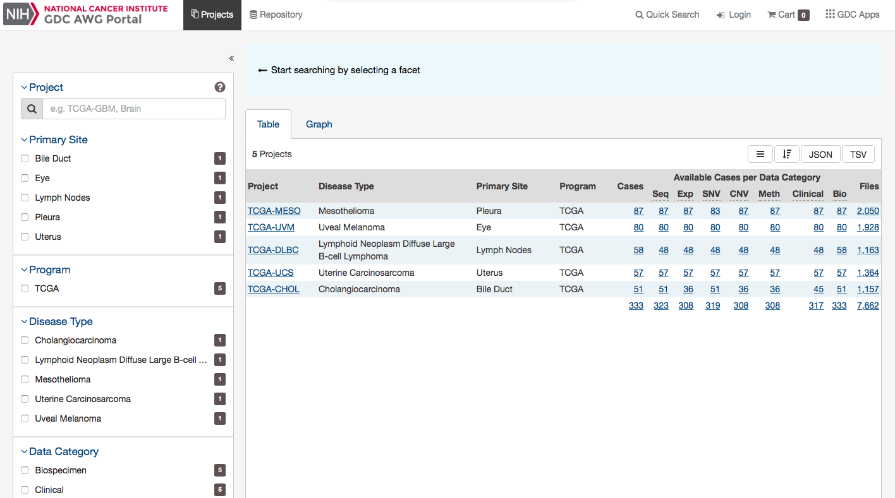
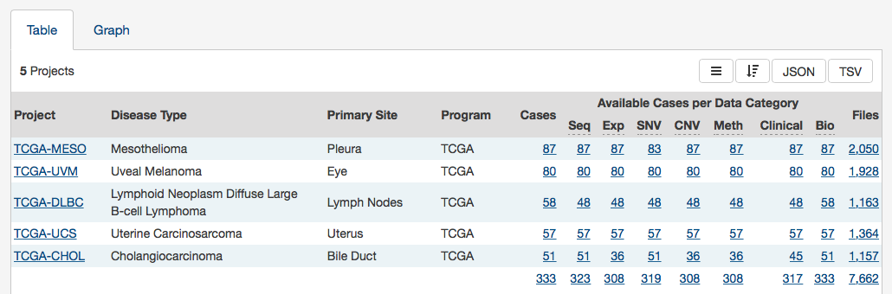

# Projects

## Summary
At a high level, data in the Genomic Data Commons is organized by project. Typically, a project is a specific effort to look at particular type(s) of cancer undertaken as part of a larger cancer research program. The GDC AWG Portal allows users to access aggregate project-level information via the Projects Page and Project Summary pages.

## Projects Page

The Projects Page provides an overview of all harmonized data available in the Genomic Data Commons, organized by project. It also provides filtering, navigation, and advanced visualization features that allow users to identify and browse projects of interest. Users can access Projects from the Data Portal toolbar, or directly at [https://portal.awg.gdc.cancer.gov/projects](https://portal.awg.gdc.cancer.gov/projects).

On the left, a panel of facets allow users to apply filters to find projects of interest. When facet filters are applied, the table and visualizations on the right are updated to display only the matching projects. When no filters are applied, all projects are displayed.

The right side of this page displays a table that contains a list of projects and select details about each project, such as the number of cases and data files. The Graph tab provides a visual representation of this information.

### Projects Table

The `Table` tab lists projects by Project ID and provides additional information about each project. If no facet filters have been applied, the table will display all available projects; otherwise it will display only those projects that match the selected criteria.

The table provides links to Project Summary pages in the Project ID column. Columns with file and case counts include links to open the corresponding files or cases in [Repository Page](Repository.md).

### Projects Graph

The `Graph` tab contains an interactive view of information in the Table tab. The numerical values in Case Count, File Count, and File Size columns are represented by bars of varying length according to size. These columns are sorted independently in descending order. Mousing over an element of the graph connects it to associated elements in other columns, including Project ID and Primary Site

Most elements in the graph are clickable, allowing the user to open the associated cases or files in [Repository Page](Repository.md).

Like the projects table, the graph will reflect any applied facet filters.

### Facets Panel

Facets represent properties of the data that can be used for filtering. The facets panel on the left allows users to filter the projects presented in the Table and Graph tabs as well as visualizations.

Users can filter by the following facets:

*   __Project__: Individual project ID
*   __Primary Site__: Anatomical site of the cancer under investigation or review
*   __Program__: Research program that the project is part of
*   __Disease Type__: Type of cancer studied
*   __Data Category__: Type of data available in the project
*   __Experimental Strategy__: Experimental strategies used for molecular characterization of the cancer

Filters can be applied by selecting values of interest in the available facets, for example "WXS" and "RNA-Seq" in the "Experimental Strategy" facet and "Brain" in the "Primary Site" facet. When facet filters are applied, the Table and Graph tabs are updated to display matching projects, and the banner above the tabs  summarizes the applied filters. The banner allows the user to click on filter elements to remove the associated filters, and includes a link to view the matching cases and files.

For information on how to use facet filters, see [Getting Started](Getting_Started.md#facet-filters).

## Project Summary Page

Each project has a summary page that provides an overview of all available cases, files, and annotations available. Clicking on the numbers in the summary table will display the corresponding data.

Three download buttons in the top right corner of the screen allow the user to download the entire project dataset, along with the associated project metadata:

* __Download Biospecimen__: Downloads biospecimen metadata associated with all cases in the project in either TSV or JSON format.
* __Download Clinical__: Downloads clinical metadata about all cases in the project in either TSV or JSON format.
* __Download Manifest__: Downloads a manifest for all data files available in the project. The manifest can be used with the GDC Data Transfer Tool to download the files.
