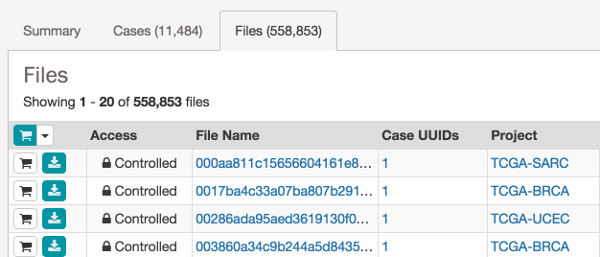

# About the Data

## Overview

The GDC receives, processes, harmonizes, and distributes clinical, biospecimen, and genomic data from multiple cancer research programs. Among the datasets available in the GDC are data from the following programs:

* [The Cancer Genome Atlas (TCGA)](https://wiki.nci.nih.gov/display/TCGA/TCGA+Data+Primer)
* [Therapeutically Applicable Research to Generate Effective Treatments (TARGET)](https://ocg.cancer.gov/programs/target/using-target-data)
* [the Cancer Genome Characterization Initiative (CGCI)](https://ocg.cancer.gov/programs/cgci)

At the highest level, data in the GDC is organized by **program** (e.g. *TCGA*). Each program contains one or more **projects** (e.g. *TCGA-LAML*, Acute Myeloid Leukemia).

## Open vs Controlled Access

The NIH promotes broad and responsible sharing of genomic research data and respects the privacy and intentions of research participants.

Some data in the GDC are open access, which means that no authentication or authorization is necessary to access it. Other data are controlled access, which means that dbGaP authorization and eRA Commons authentication are necessary for access. Whether data is open or controlled is determined according to the [NIH Genomic Data Sharing Policy](https://gds.nih.gov/) in a process that is driven by informed consent of research participants.

Open access data generally includes high level genomic data that is not individually identifiable, as well as most clinical and all biospecimen data elements.

Controlled data generally includes individually identifiable data such as low level genomic sequencing data, germline variants, SNP6 genotype data, and certain clinical data elements. Access to controlled data is granted by program-specific *Data Access Committees*. See [Obtaining Access to Controlled Data](https://gdc.nci.nih.gov/access-data/obtaining-access-controlled-data) for details.

## Browsing GDC Metadata

The GDC Data Portal provides granular access to metadata that describes all data released to the GDC. The Portal uses a "lock" icon to indicate whether each individual data file is open or controlled-access:

**NOTE:** The "lock" icon does not indicate whether the user has access to the file. Authenticated users can use the "Only My Projects" checkbox to display only those files to which they have access.
