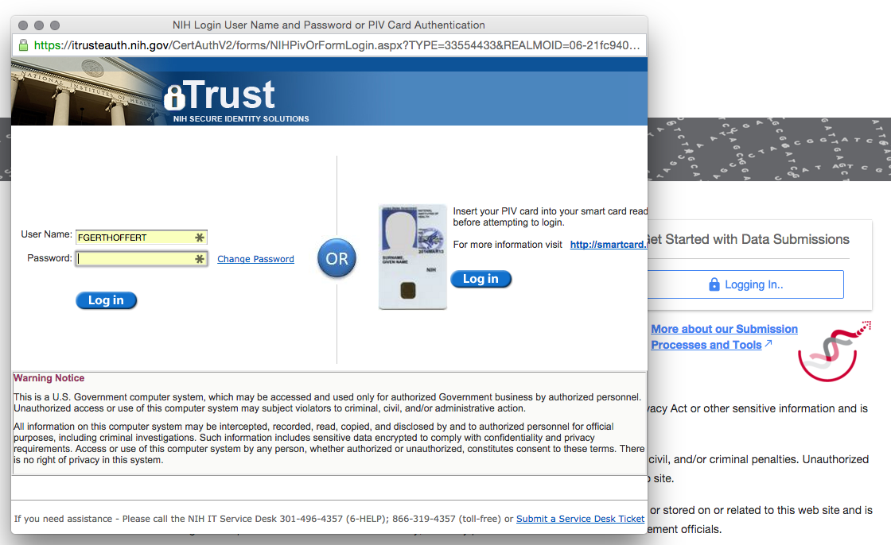
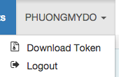
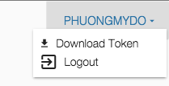

# Overview

Accessing the GDC Data Submission Portal requires eRA Commons credentials with appropriate dbGap authorization. See [Obtaining Access to Submit Data]( https://gdc.nci.nih.gov/submit-data/obtaining-access-submit-data) for more details.

Permissions are attached to each user account. Access can be granted to one or more projects. Those permissions will apply throughout the GDC Data Portal and GDC Data Submission Portal and will define how data is being displayed.

# Authentication via eRA Commons

By Clicking on "Login", users will be invited to authentication through eRA Commons. If successful, the user will be redirected to the GDC Data Portal or GDC Data Submission Portal.

# GDC Authentication Token

A Token is required to upload data to GDC, as well as to download controlled-access files, using the GDC Data Transfer Tool or the GDC Application Programming Interface.

The GDC Data Transfer Tool is optimized for large transfers with multi-part upload and integrity checking, making it the most efficient tool for molecular data submission.

Tokens are strings of characters provided with every GDC call requiring authentication. A file containing a token can be obtained through GDC Data Submission Portal once your NIH eRA Commons account has been established. Your GDC account will be automatically established upon first login and you will see a drop down menu next to your user name.

## Obtain a Token From GDC Data Portal

After successful authentication, users can obtain their Token be clicking on their username on the top right corner of the screen.

## Obtain a Token From GDC Data Submission Portal

After successful authentication, users can obtain their Token be clicking on their username on the top right corner of the screen.

# Logout from GDC

By clicking on logout, GDC will be redirected to an eRA Commons page, displaying the logout status.

