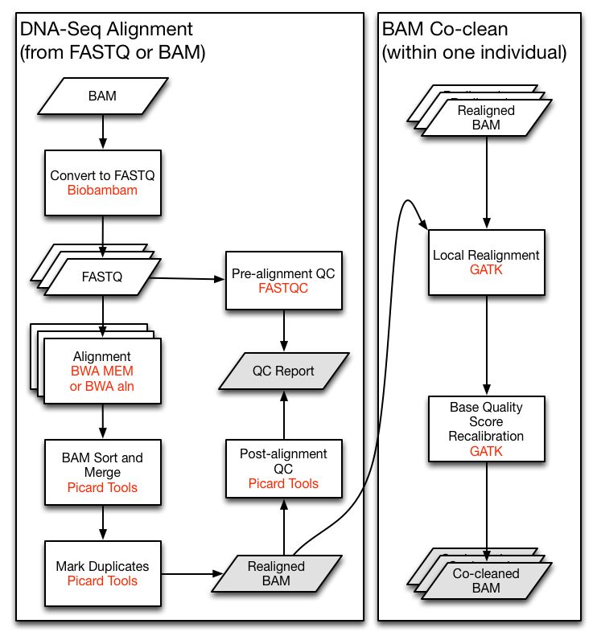

# DNA-Seq Analysis Pipeline

## Introduction

The GDC DNA-Seq analysis pipeline identifies somatic variants within whole exome sequencing (WXS) and whole genome sequencing (WGS) data. It identifies somatic variants by comparing allele frequencies in normal and tumor sample reads, annotating each mutation, and aggregating mutations from multiple cases into one project file. The first pipeline starts with a reference alignment step followed by co-cleaning to increase the alignment quality. Four different variant calling pipelines are then implemented separately to identify somatic mutations. Somatic-caller-identified variants are further filtered and then annotated. An aggregation pipeline incorporates variants from multiple cases from one project into a MAF file for each pipeline.


DNA-Seq analysis is implemented across six main procedures:

- Genome Alignment
- Alignment Co-Cleaning
- Somatic Variant Calling
- Variant Annotation
- Mutation Aggregation
- Aggregated Mutation Masking

## Data Processing Steps

### Pre-Alignment
Prior to alignment, BAM files that were submitted to the GDC are split by read groups and converted to FASTQ files. Reads that failed the Illumina chastity test are removed. Note that this filtering step is distinct from trimming reads using base quality scores.


### Alignment Workflow
DNA-Seq analysis begins with the [Alignment Workflow](/Data_Dictionary/viewer/#?view=table-definition-view&id=alignment_workflow). Read groups are aligned to the reference genome using one of two [BWA](http://bio-bwa.sourceforge.net) algorithms [[1]](http://www.ncbi.nlm.nih.gov/pubmed/19451168). BWA-MEM is used if mean read length is greater than or equal to 70 bp. Otherwise BWA-aln is used.
Each read group is aligned to the reference genome separately and all read group alignments that belong to a single aliquot are merged using [Picard Tools](http://broadinstitute.github.io/picard) [SortSam](https://broadinstitute.github.io/picard/command-line-overview.html#SortSam) and [MergeSamFiles](https://broadinstitute.github.io/picard/command-line-overview.html#MergeSamFiles). Duplicate reads, which may persist as PCR artifacts, are then flagged to prevent downstream variant call errors.

#### Quality Control

Quality control metrics are collected before and after the alignment workflow and reviewed to identify potential low-quality data files.  Basic metrics such as GC content and mean read length as well as quality score metrics are collected from unaligned reads using [FASTQC](http://www.bioinformatics.babraham.ac.uk/projects/fastqc/). Quality metrics collected by the GDC for aligned reads include samtools idxstat and flagstat. Alignment information is collected using Picard [CollectMultipleMetrics](https://broadinstitute.github.io/picard/command-line-overview.html#CollectMultipleMetrics) for both WGS and WXS. Coverage information is collected using picard [CollectWgsMetrics](https://broadinstitute.github.io/picard/command-line-overview.html#CollectWgsMetrics) for WGS and picard [CollectHsMetrics](https://broadinstitute.github.io/picard/command-line-overview.html#CollectHsMetrics) for WXS.

Quality control metrics for each file endpoint can be accessed through the API using the `expand=analysis.metadata.read_groups,analysis.metadata.read_groups.read_group_qcs` parameter. Click [here](https://gdc-api.nci.nih.gov/files/40e311a4-67aa-468a-8e09-1c7daa2d10bb?pretty=true&expand=analysis.metadata.read_groups,analysis.metadata.read_groups.read_group_qcs) for an example query.  

#### Reference Genome

All alignments are performed using the human reference genome GRCh38.d1.vd1. Decoy viral sequences are included in the reference genome to prevent erroneous read alignments and attract reads from viruses known to be present in human samples. Ten types of human viral genomes are included: human cytomegalovirus (CMV), Epstein-Barr virus (EBV), hepatitis B (HBV), hepatitis C (HCV), human immunodeficiency virus (HIV), human herpes virus 8 (HHV-8), human T-lymphotropic virus 1 (HTLV-1), Merkel cell polyomavirus (MCV), Simian vacuolating virus 40 (SV40), and human papillomavirus (HPV). Reference sequences can be downloaded [here](https://gdc.cancer.gov/download-gdc-reference-files).


| I/O | Entity | Format |
|---|---|---|
| Input | [Submitted Unaligned Reads](/Data_Dictionary/viewer/#?view=table-definition-view&id=submitted_unaligned_reads) or [Submitted Aligned Reads](/Data_Dictionary/viewer/#?view=table-definition-view&id=submitted_aligned_reads) | FASTQ or BAM |
| Output | [Aligned Reads](/Data_Dictionary/viewer/#?view=table-definition-view&id=aligned_reads) | BAM |



### DNA-Seq Alignment Command Line Parameters

#### Step 1: Converting BAMs to FASTQs with Biobambam - biobambam2 2.0.54
```Shell
bamtofastq \
collate=1 \
exclude=QCFAIL,SECONDARY,SUPPLEMENTARY \
filename= <input.bam> \
gz=1 \
inputformat=bam
level=5 \
outputdir= <output_path> \
outputperreadgroup=1 \
outputperreadgroupsuffixF=_1.fq.gz \
outputperreadgroupsuffixF2=_2.fq.gz \
outputperreadgroupsuffixO=_o1.fq.gz \
outputperreadgroupsuffixO2=_o2.fq.gz \
outputperreadgroupsuffixS=_s.fq.gz \
tryoq=1 \
```
#### Step 2: BWA Alignment - bwa 0.7.15 - samtools 1.3.1
If mean read length is greater than or equal to 70bp:
```Shell
bwa mem \
-t 8 \
-T 0 \
-R <read_group> \
<reference> \
<fastq_1.fq.gz> \
<fastq_2.fq.gz> |
samtools view \
-Shb
-o <output.bam> -
```
If mean read length is less than 70bp:
```Shell
bwa aln -t 8 <reference> <fastq_1.fq.gz> > <sai_1.sai> &&
bwa aln -t 8 <reference> <fastq_2.fq.gz> > <sai_2.sai> &&
bwa sampe -r <read_group> <reference> <sai_1.sai> <sai_2.sai> <fastq_1.fq.gz> <fastq_2.fq.gz> | samtools view -Shb -o <output.bam> -
```
If the quality scores are encoded as Illumina 1.3 or 1.5, use BWA aln with the "-l" flag.  

#### Step 3: BAM Sort - picard 2.6.0

```Shell
java -jar picard.jar SortSam \
CREATE_INDEX=true \
INPUT=<input.bam> \
OUTPUT=<output.bam> \
SORT_ORDER=coordinate \
VALIDATION_STRINGENCY=STRICT
```
#### Step 4: BAM Merge - picard 2.6.0
```Shell
java -jar picard.jar MergeSamFiles \
ASSUME_SORTED=false \
CREATE_INDEX=true \                 
[INPUT= <input.bam>]  \
MERGE_SEQUENCE_DICTIONARIES=false \
OUTPUT= <output_path> \
SORT_ORDER=coordinate \
USE_THREADING=true \
VALIDATION_STRINGENCY=STRICT
```
#### Step 5: Mark Duplicates - picard 2.6.0
```Shell
java -jar picard.jar MarkDuplicates \
CREATE_INDEX=true \
INPUT=<input.bam> \
VALIDATION_STRINGENCY=STRICT
```

### Co-cleaning Workflow

The alignment is further improved in the [Co-cleaning workflow](/Data_Dictionary/viewer/#?view=table-definition-view&id=alignment_cocleaning_workflow). Co-cleaning is performed as a separate pipeline as it uses multiple BAM files (i.e. the tumor BAM and normal tissue BAM) associated with the same patient. Both steps of this process are implemented using [GATK](https://software.broadinstitute.org/gatk/).  

#### Indel Local Realignment

First, insertion and deletion local realignment is performed using [IndelRealigner](https://software.broadinstitute.org/gatk/gatkdocs/org_broadinstitute_gatk_tools_walkers_indels_IndelRealigner.php). This step locates regions that contain misalignments across BAM files, which can often be caused by insertion-deletion (indel) mutations with respect to the reference genome. Misalignment of indel mutations, which can often be erroneously scored as substitutions, reduces the accuracy of downstream variant calling steps.

#### Base Quality Score Recalibration

A base quality score recalibration (BQSR) step is then performed using  [BaseRecalibrator](https://software.broadinstitute.org/gatk/gatkdocs/org_broadinstitute_gatk_tools_walkers_bqsr_BaseRecalibrator.php). This step adjusts base quality scores based on detectable and systematic errors. This step also increases the accuracy of downstream variant calling algorithms. Note that the original quality scores are kept in the OQ field of co-cleaned BAM files. These scores should be used if conversion of BAM files to FASTQ format is desired.


| I/O | Entity | Format |
|---|---|---|
| Input | [Aligned Reads](/Data_Dictionary/viewer/#?view=table-definition-view&id=aligned_reads)  | BAM |
| Output | Harmonized Aligned Reads | BAM |

### DNA-Seq Co-Cleaning Command Line Parameters

#### __Step 1:__ RealignTargetCreator
```Shell
java -jar GenomeAnalysisTK.jar \
-T RealignerTargetCreator \
-R <reference>
-known <known_indels.vcf>
[ -I <input.bam> ]
-o <realign_target.intervals>
```

#### __Step 2:__ IndelRealigner
```Shell
java -jar GenomeAnalysisTK.jar \
-T IndelRealigner \
-R <reference> \
-known <known_indels.vcf> \
-targetIntervals <realign_target.intervals> \
--noOriginalAlignmentTags \
[ -I <input.bam> ] \
-nWayOut <output.map>
```

#### __Step 3:__ BaseRecalibrator
```Shell
java -jar GenomeAnalysisTK.jar \
-T BaseRecalibrator \
-R <reference> \
-I <input.bam> \
-knownSites <dbsnp.vcf>
-o <bqsr.grp>
```

#### __Step 4:__ PrintReads
```Shell
java -jar GenomeAnalysisTK.jar \
-T PrintReads \
-R <reference> \
-I <input.bam> \
--BQSR <bqsr.grp> \
-o <output.bam>
```


### Somatic Variant Calling Workflow
Aligned and co-cleaned BAM files are processed through the [Somatic Mutation Calling Workflow](/Data_Dictionary/viewer/#?view=table-definition-view&id=somatic_mutation_calling_workflow) as tumor-normal pairs. Variant calling is performed using four separate pipelines:

- [MuSE](http://bioinformatics.mdanderson.org/main/MuSE) [[2]](http://www.biorxiv.org/content/early/2016/05/25/055467.abstract),
- [MuTect2](https://www.broadinstitute.org/cancer/cga/mutect) [[3]](http://www.nature.com/nbt/journal/v31/n3/abs/nbt.2514.html),  
- [VarScan2](http://dkoboldt.github.io/varscan/) [[4]](http://genome.cshlp.org/content/22/3/568.short), and
- [SomaticSniper](http://gmt.genome.wustl.edu/packages/somatic-sniper/) [[5]](http://bioinformatics.oxfordjournals.org/content/28/3/311.short).

Variant calls are reported by each pipeline in a VCF formatted file. See the GDC [VCF Format](/File_Formats/VCF_Format/) documentation for details on each available field. At this point in the DNA-Seq pipeline, all downstream analyses are branched into four separate paths that correspond to their respective variant calling pipeline.

#### Pipeline Descriptions
Four separate variant calling pipelines are implemented for GDC data harmonization. There is currently no scientific consensus on the best variant calling pipeline so the investigator is responsible for choosing the pipeline(s) most appropriate for the data. Some details about the pipelines are indicated below.

The [MuTect2 pipeline](https://gdc.cancer.gov/files/public/image/Broad_MuTect_0.png) employs a "Panel of Normals" to identify additional germline mutations. This panel is generated using genomes from TCGA blood normal samples from thousands of individuals that were curated and confidently assessed to be cancer-free. This method allows for a higher level of confidence to be assigned to somatic variants that were called by the MuTect2 pipeline.

Basic outlines for the other three pipelines can be found here:

- [VarScan2 pipeline](https://gdc.cancer.gov/files/public/image/varscan-somatic-variant-calling-pipeline.png)
- [MuSE pipeline](https://gdc.cancer.gov/files/public/image/muse-somatic-variant-calling-pipeline.png)  
- [SomaticSniper pipeline](https://gdc.cancer.gov/files/public/image/somaticsniper-variant-calling-pipeline.png).

#### Indels
Indel mutations that were generated with the MuTect2 pipeline are detected and reported in GDC VCF files. Indels detected with the VarScan pipeline are currently removed from the VCF output.

#### Germline Variants
At this time, germline variants are deliberately excluded as harmonized data. The GDC does not recommend using germline variants that were previously detected and stored in the Legacy Archive as they do not meet the GDC criteria for high-quality data.  

| I/O | Entity | Format |
|---|---|---|
| Input | [Aligned Reads](/Data_Dictionary/viewer/#?view=table-definition-view&id=aligned_reads) |  BAM |
| Output | [Raw Simple Somatic Mutation](/Data_Dictionary/viewer/#?view=table-definition-view&id=simple_somatic_mutation) | VCF  |

### Variant Call Command-Line Parameters

#### MuSE

MuSEv1.0rc_submission_c039ffa

__Step 1:__ MuSE call

```Shell
MuSE call \
-f <reference> \
-r <region> \                               	
<tumor.bam> \
<normal.bam> \
-O <intermediate_muse_call.txt>
```

__Step 2:__ MuSE sump
```Shell
MuSE sump \
-I <intermediate_muse_call.txt> \                        	
-E \                          		
-D <dbsnp_known_snp_sites.vcf> \
-O <muse_variants.vcf>  
```
__Note:__ -E is used for WXS data and -G can be used for WGS data.  


#### MuTect2

GATK nightly-2016-02-25-gf39d340

```Shell
java -jar GenomeAnalysisTK.jar \
-T MuTect2 \
-R <reference> \
-L <region> \
-I:tumor <tumor.bam> \
-I:normal <normal.bam> \
--normal_panel <pon.vcf> \                        
--cosmic <cosmic.vcff> \
--dbsnp <dbsnp.vcf> \
--contamination_fraction_to_filter 0.02 \                   
-o <mutect_variants.vcf> \
--output_mode EMIT_VARIANTS_ONLY \
--disable_auto_index_creation_and_locking_when_reading_rods
```


#### SomaticSniper
Somatic-sniper v1.0.5.0

```Shell
bam-somaticsniper \
-q 0 \
-Q 15 \
-s 0.01 \
-T 0.85 \
-N 2 \
-r 0.001 \
-n NORMAL \
-t TUMOR \
-F vcf \
-f ref.fa \
<tumor.bam> \
<normal.bam> \
<somaticsniper_variants.vcf>
```

#### VarScan


__Step 1:__ Mpileup; Samtools 1.1
```Shell
samtools mpileup \
-f <reference> \
-q 1 \
-B \
<normal.bam> \
<tumor.bam> >
<intermediate_mpileup.pileup>
```

__Step 2:__ Varscan Somatic; Varscan.v2.3.9
```Shell
java -jar VarScan.jar somatic \
<intermediate_mpileup.pileup> \
<output_path> \
--mpileup      1 \
--min-coverage 8 \
--min-coverage-normal 8 \
--min-coverage-tumor 6 \
--min-var-freq 0.10 \
--min-freq-for-hom 0.75 \
--normal-purity 1.0 \
--tumor-purity 1.00 \
--p-value 0.99 \
--somatic-p-value 0.05 \
--strand-filter 0 \
--output-vcf
```

__Step 3:__ Varscan ProcessSomatic; Varscan.v2.3.9
```Shell
java -jar VarScan.jar processSomatic \
<intermediate_varscan_somatic.vcf> \
--min-tumor-freq 0.10 \
--max-normal-freq 0.05 \
--p-value 0.07
```

### Variant Call Annotation Workflow

Raw VCF files are then annotated in the [Somatic Annotation Workflow](/Data_Dictionary/viewer/#?view=table-definition-view&id=somatic_annotation_workflow) with the [Variant Effect Predictor (VEP)](http://useast.ensembl.org/info/docs/tools/vep/index.html) v84 [[6]](http://dx.doi.org/10.1093/bioinformatics/btq330) along with VEP GDC plugins.   

The VEP uses the coordinates and nucleotides in the VCF file to infer biological context for each variant including the location of each mutation, its biological consequence (frameshift/ silent mutation), and the affected genes. See the documentation on the [GDC VCF Format](/Data/File_Formats/VCF_Format/) for more details. Variants in the VCF files are also matched to known variants from external mutation databases. The following databases are used for VCF annotation:  

*   GENCODE v.22
*   sift v.5.2.2
*   ESP v.20141103
*   polyphen v.2.2.2
*   dbSNP v.146
*   Ensembl genebuild v.2014-07
*   Ensembl regbuild v.13.0
*   HGMD public v.20154
*   ClinVar v.201601

Due to licensing constraints COSMIC is not utilized for annotation in the GDC VEP workflow.


In addition to annotation, [False Positive Filter](https://github.com/ucscCancer/fpfilter-tool) is used to label low quality variants in VarScan and SomaticSniper outputs. Variants with SSQ < 25 in SomaticSniper are also removed.

| I/O | Entity | Format |
|---|---|---|
| Input | [Simple Somatic Mutation](/Data_Dictionary/viewer/#?view=table-definition-view&id=simple_somatic_mutation) | VCF  |
| Output | [Annotated Somatic Mutation](/Data_Dictionary/viewer/#?view=table-definition-view&id=annotated_somatic_mutation) | VCF  |

### Somatic Aggregation Workflow

The Somatic Aggregation Workflow generates one MAF file from multiple VCF files; see the [GDC MAF Format](/Data/File_Formats/MAF_Format/) guide for details on file structure.  In this step, one MAF file is generated per variant calling pipeline for each project, and contains all available cases within this project.  


| I/O | Entity | Format |
|---|---|---|
| Input | Multiple [Annotated Somatic Mutation](/Data_Dictionary/viewer/#?view=table-definition-view&id=annotated_somatic_mutation) | VCF  |
| Output | [Aggregated Somatic Mutation](/Data_Dictionary/viewer/#?view=table-definition-view&id=aggregated_somatic_mutation) | MAF  |

### Masked Somatic Aggregation Workflow

The MAF files generated by Somatic Aggregation Workflow are controlled-access due to the presence of germline mutations. Open-access MAF files are modified for public release by removing 1) called variants with `FILTER` values that are not `PASS`; 2) variants that are not flagged as somatic; 3) variants that do not affect protein coding, unless they are experimentally validated by an orthogonal platform; 4) variants that are annotated as anything other than somatic in [dbSNP](http://www.ncbi.nlm.nih.gov/SNP/), [COSMIC](http://cancer.sanger.ac.uk/cosmic) or [OMIM](http://www.ncbi.nlm.nih.gov/omim).

While these criteria cause the pipeline to over-filter some of the true positive somatic variants in open-access MAF files, they prevent personally identifiable germline mutation information from becoming openly available. The GDC recommends that investigators explore both controlled and open-access MAF files if potential omission of certain somatic mutations is a concern.  

| I/O | Entity | Format |
|---|---|---|
| Input | [Aggregated Somatic Mutation](/Data_Dictionary/viewer/#?view=table-definition-view&id=aggregated_somatic_mutation) | Protected MAF |
| Output | [Masked Somatic Mutation](/Data_Dictionary/viewer/#?view=table-definition-view&id=masked_somatic_mutation) | Somatic MAF |

## File Access and Availability

Files from the GDC DNA-Seq analysis pipeline are available in the [GDC Data Portal](https://gdc-portal.nci.nih.gov) as BAMs, VCFs, and MAFs.  Below is a description for all available data types and their respective file formats.


| Data Type | Description | File Format |
|---|---|---|
| [Aligned Reads](/Data_Dictionary/viewer/#?view=table-definition-view&id=aligned_reads) | Reads that have been aligned to the GRCh38 reference and co-cleaned. Unaligned reads and reads that map to decoy sequences are also included in the BAM files.  | BAM |
| [Raw Simple Somatic Mutation](/Data_Dictionary/viewer/#?view=table-definition-view&id=simple_somatic_mutation)| A tab-delimited file with genotypic information related to genomic positions. Genomic variants are first identified here.  | VCF |
| [Annotated Somatic Mutation](/Data_Dictionary/viewer/#?view=table-definition-view&id=annotated_somatic_mutation)  | An annotated version of a raw simple somatic mutation file. Annotated files include biological context about each observed mutation. |  VCF |
| [Aggregated Somatic Mutation](/Data_Dictionary/viewer/#?view=table-definition-view&id=aggregated_somatic_mutation) | A tab-delimited file derived from multiple VCF files. Contains information from all available cases in a project.  | MAF |
| [Masked Somatic Mutation](/Data_Dictionary/viewer/#?view=table-definition-view&id=masked_somatic_mutation) | A modified version of the Aggregated Somatic Mutation MAF file with sensitive or potentially erroneous data removed. | MAF |

- - -

[1]. Li, Heng, and Richard Durbin. "Fast and accurate short read alignment with Burrows-Wheeler transform." Bioinformatics 25, no. 14 (2009): 1754-1760.

[2]. Fan, Yu, Liu Xi, Daniel ST Hughes, Jianjun Zhang, Jianhua Zhang, P. Andrew Futreal, David A. Wheeler, and Wenyi Wang. "Accounting for tumor heterogeneity using a sample-specific error model improves sensitivity and specificity in mutation calling for sequencing data." bioRxiv (2016): 055467.

[3]. Cibulskis, Kristian, Michael S. Lawrence, Scott L. Carter, Andrey Sivachenko, David Jaffe, Carrie Sougnez, Stacey Gabriel, Matthew Meyerson, Eric S. Lander, and Gad Getz. "Sensitive detection of somatic point mutations in impure and heterogeneous cancer samples." Nature biotechnology 31, no. 3 (2013): 213-219.

[4]. Koboldt, Daniel C., Qunyuan Zhang, David E. Larson, Dong Shen, Michael D. McLellan, Ling Lin, Christopher A. Miller, Elaine R. Mardis, Li Ding, and Richard K. Wilson. "VarScan 2: somatic mutation and copy number alteration discovery in cancer by exome sequencing." Genome research 22, no. 3 (2012): 568-576.

[5]. Larson, David E., Christopher C. Harris, Ken Chen, Daniel C. Koboldt, Travis E. Abbott, David J. Dooling, Timothy J. Ley, Elaine R. Mardis, Richard K. Wilson, and Li Ding. "SomaticSniper: identification of somatic point mutations in whole genome sequencing data." Bioinformatics 28, no. 3 (2012): 311-317.

[6] McLaren, William, Bethan Pritchard, Daniel Rios, Yuan Chen, Paul Flicek, and Fiona Cunningham. "Deriving the consequences of genomic variants with the Ensembl API and SNP Effect Predictor." Bioinformatics 26, no. 16 (2010): 2069-2070.
