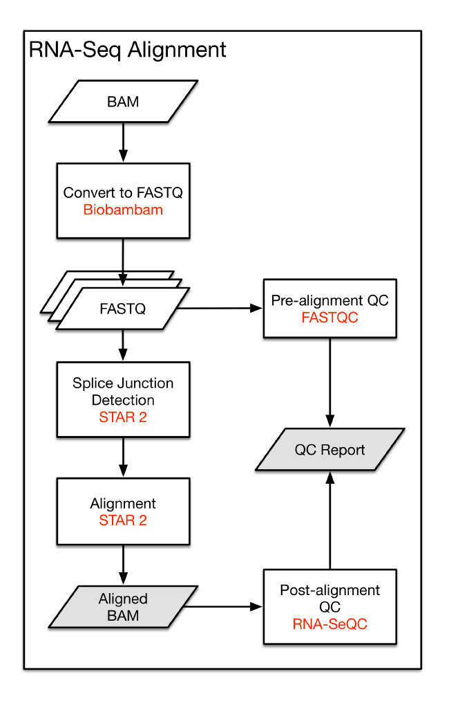
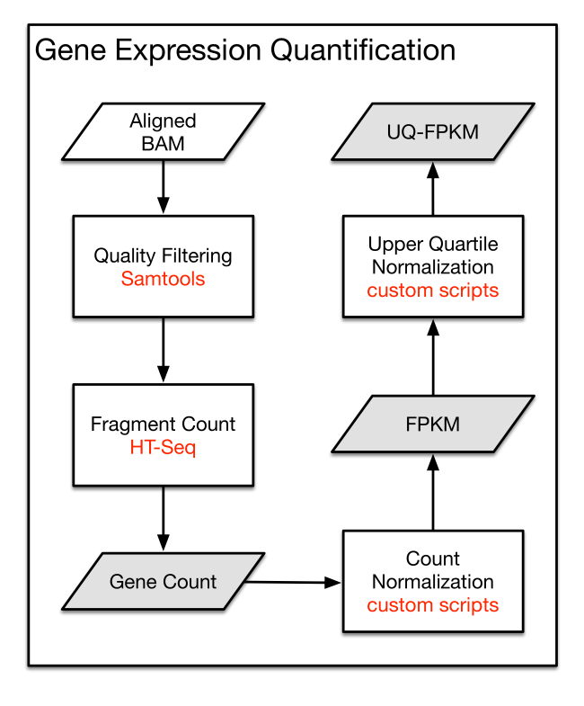
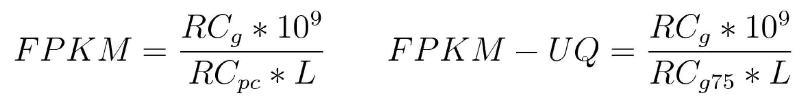

# mRNA Analysis Pipeline

## Introduction
The GDC mRNA quantification analysis pipeline measures gene level expression in [HT-Seq](http://www-huber.embl.de/HTSeq/doc/overview.html) raw read count, Fragments per Kilobase of transcript per Million mapped reads (FPKM), and FPKM-UQ (upper quartile normalization). These values are generated through this pipeline by first aligning reads to the GRCh38 [reference genome](https://gdc.cancer.gov/download-gdc-reference-files) and then by quantifying the mapped reads. To facilitate harmonization across samples, all RNA-Seq reads are treated as unstranded during analyses.    

## Data Processing Steps

### RNA-Seq Alignment Workflow
The mRNA Analysis pipeline begins with the [Alignment Workflow](/Data_Dictionary/viewer/#?view=table-definition-view&id=alignment_workflow), which is performed using a two-pass method with [STAR](http://labshare.cshl.edu/shares/gingeraslab/www-data/dobin/STAR/STAR.posix/doc/STARmanual.pdf). STAR aligns each [read group](/Data_Dictionary/viewer/#?view=table-definition-view&id=read_group) separately and then merges the resulting alignments into one. Following the methods used by the International Cancer Genome Consortium [ICGC](https://icgc.org/) ([github](https://github.com/akahles/icgc_rnaseq_align)), the two-pass method includes a splice junction detection step, which is used to generate the final alignment. This workflow outputs a BAM file, which contains both aligned and unaligned reads. Quality assessment is performed pre-alignment with [FASTQC](http://www.bioinformatics.babraham.ac.uk/projects/fastqc/) and post-alignment with [RNA-SeQC](https://www.broadinstitute.org/cancer/cga/rna-seqc) and [Picard Tools](http://broadinstitute.github.io/picard/).

[](images/gene-expression-quantification-pipeline.png "Click to see the full image.")

| I/O | Entity | Format |
|---|---|---|
| Input | [Submitted Unaligned Reads](/Data_Dictionary/viewer/#?view=table-definition-view&id=submitted_unaligned_reads) or [Submitted Aligned Reads](/Data_Dictionary/viewer/#?view=table-definition-view&id=submitted_aligned_reads) |  FASTQ or BAM |
| Output | [Aligned Reads](/Data_Dictionary/viewer/#?view=table-definition-view&id=aligned_reads) | BAM  |

### RNA-Seq Alignment Command Line Parameters

####STAR-2.4.2a

####ICGC STAR alignment pipeline

__For users with access to the ICGC pipeline:__

```Shell
python star_align.py \
--genomeDir <star_index_path> \
--FastqFileIn <input_fastq_path> \
--workDir <work_dir> \
--out <output_bam> \
--genomeFastaFiles <reference> \
--runThreadN 8 \
--outFilterMultimapScoreRange 1 \
--outFilterMultimapNmax 20 \
--outFilterMismatchNmax 10 \
--alignIntronMax 500000 \
--alignMatesGapMax 1000000 \
--sjdbScore 2 \
--limitBAMsortRAM 0 \
--alignSJDBoverhangMin 1 \
--genomeLoad NoSharedMemory \
--outFilterMatchNminOverLread 0.33 \
--outFilterScoreMinOverLread 0.33 \
--twopass1readsN -1 \
--sjdbOverhang 100 \
--outSAMstrandField intronMotif \
--outSAMunmapped Within
```

__For users without access to the ICGC pipeline:__

#### Step 1: Building the STAR index.*
```Shell
STAR
--runMode genomeGenerate
--genomeDir <star_index_path>
--genomeFastaFiles <reference>
--sjdbOverhang 100
--sjdbGTFfile <gencode.v22.annotation.gtf>
--runThreadN 8
```
\*These indices are available for download at the [GDC Website](https://gdc.cancer.gov/about-data/data-harmonization-and-generation/gdc-reference-files) and do not need to be built again.

#### Step 2: Alignment 1st Pass.
```Shell
STAR
--genomeDir <star_index_path>
--readFilesIn <fastq_left_1>,<fastq_left2>,... <fastq_right_1>,<fastq_right_2>,...
--runThreadN <runThreadN>
--outFilterMultimapScoreRange 1
--outFilterMultimapNmax 20
--outFilterMismatchNmax 10
--alignIntronMax 500000
--alignMatesGapMax 1000000
--sjdbScore 2
--alignSJDBoverhangMin 1
--genomeLoad NoSharedMemory
--readFilesCommand <bzcat|cat|zcat>
--outFilterMatchNminOverLread 0.33
--outFilterScoreMinOverLread 0.33
--sjdbOverhang 100
--outSAMstrandField intronMotif
--outSAMtype None
--outSAMmode None
```
#### Step 3: Intermediate Index Generation.
```Shell
STAR
--runMode genomeGenerate
--genomeDir <output_path>
--genomeFastaFiles <reference>
--sjdbOverhang 100
--runThreadN <runThreadN>
--sjdbFileChrStartEnd <SJ.out.tab from previous step>
```
#### Step 4: Alignment 2nd Pass.
```Shell
STAR
--genomeDir <output_path from previous step>
--readFilesIn <fastq_left_1>,<fastq_left2>,... <fastq_right_1>,<fastq_right_2>,...
--runThreadN <runThreadN>
--outFilterMultimapScoreRange 1
--outFilterMultimapNmax 20
--outFilterMismatchNmax 10
--alignIntronMax 500000
--alignMatesGapMax 1000000
--sjdbScore 2
--alignSJDBoverhangMin 1
--genomeLoad NoSharedMemory
--limitBAMsortRAM 0
--readFilesCommand <bzcat|cat|zcat>
--outFilterMatchNminOverLread 0.33
--outFilterScoreMinOverLread 0.33
--sjdbOverhang 100
--outSAMstrandField intronMotif
--outSAMattributes NH HI NM MD AS XS
--outSAMunmapped Within
--outSAMtype BAM SortedByCoordinate
--outSAMheaderHD @HD VN:1.4
--outSAMattrRGline <formatted RG line provided by wrapper>
```
### mRNA Expression Workflow
Following alignment, BAM files are processed through the [RNA Expression Workflow](/Data_Dictionary/viewer/#?view=table-definition-view&id=rna_expression_workflow).

First the BAM files are filtered for aligned reads using the [samtools](http://samtools.sourceforge.net) view function. The reads mapped to each gene are enumerated using HT-Seq count. Expression values are provided in a tab-delimited format. [GENCODE v22](http://www.gencodegenes.org/releases/22.html) was used for gene annotation.

[](images/gene-expression-quantification-pipeline.png "Click to see the full image.")


| I/O | Entity | Format |
|---|---|---|
| Input | [Aligned Reads](/Data_Dictionary/viewer/#?view=table-definition-view&id=aligned_reads) |  BAM |
| Output | [Gene Expression (HTSeq count/ FPKM/ FPKM-UQ)](/Data_Dictionary/viewer/#?view=table-definition-view&id=gene_expression) | TXT  |

### mRNA Quantification Command Line Parameters

Samtools v1.1; HTSeq-0.6.1p1

```Shell
samtools view -F 4 <input.bam> |
htseq-count \
-m intersection-nonempty \
-i gene_id \
-r pos \
-s no \
- gencode.v22.annotation.gtf

```

## mRNA Expression Normalization

RNA-Seq expression level read counts are normalized using two related methods: FPKM and FPKM-UQ. Normalized values should be used only within the context of the entire gene set. Users are encouraged to normalize raw read count values if a subset of genes is investigated.

### FPKM

The Fragments per Kilobase of transcript per Million mapped reads (FPKM) calculation normalizes read count by dividing it by the gene length and the total number of reads mapped to protein-coding genes.

### Upper Quartile FPKM

The upper quartile FPKM (FPKM-UQ) is a modified FPKM calculation in which the total protein-coding read count is replaced by the 75th percentile read count value for the sample.

### Calculations

[](images/fpkm.gif "Click to see the full image.")

- __RC<sub>g</sub>:__ Number of reads mapped to the gene
- __RC<sub>pc</sub>:__ Number of reads mapped to all protein-coding genes
- __RC<sub>g75</sub>:__ The 75th percentile read count value for genes in the sample
- __L:__ Length of the gene in base pairs; Calculated as the sum of all exons in a gene

__Note:__ The read count is multiplied by a scalar (10<sup>9</sup>) during normalization to account for the kilobase and 'million mapped reads' units.

### Examples

__Sample 1: Gene A__

* Gene length: 3,000 bp
* 1,000 reads mapped to Gene A
* 1,000,000 reads mapped to all protein-coding regions
* Read count in Sample 1 for 75th percentile gene: 2,000

__FPKM for Gene A__ = (1,000)\*(10^9)/[(3,000)\*(1,000,000)] = __333.33__

__FPKM-UQ for Gene A__ = (1,000)\*(10^9)/[(3,000)\*(2,000)] = __166,666.67__

## File Access and Availability

To facilitate the use of harmonized data in user-created pipelines, RNA-Seq gene expression is accessible in the GDC Data Portal at several intermediate steps in the pipeline. Below is a description of each type of file available for download in the GDC Data Portal.   

| Type | Description | Format |
|---|---|---|
| RNA-Seq Alignment | RNA-Seq reads that have been aligned to the GRCh38 build. Reads that were not aligned are included to facilitate the availability of raw read sets  |  BAM |
| Raw Read Counts | The number of reads aligned to each gene, calculated by HT-Seq |  TXT |
| FPKM | A normalized expression value that takes into account each gene length and the number of reads mapped to all protein-coding genes |  TXT |
| FPKM-UQ | A modified version of the FPKM formula in which the 75th percentile read count is used as the denominator in place of the total number of protein-coding reads |  TXT |
