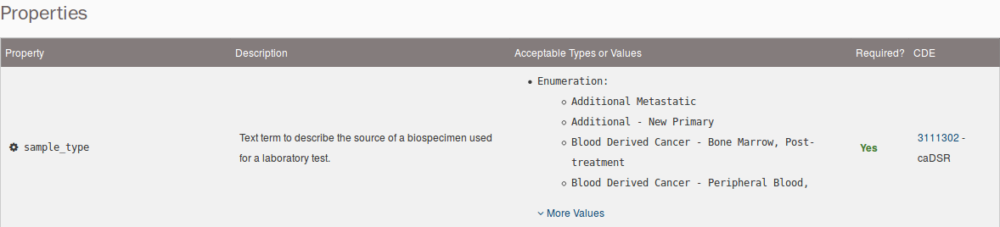
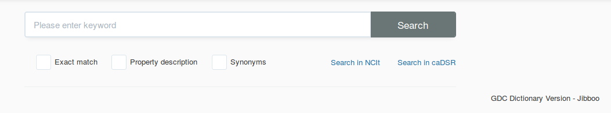
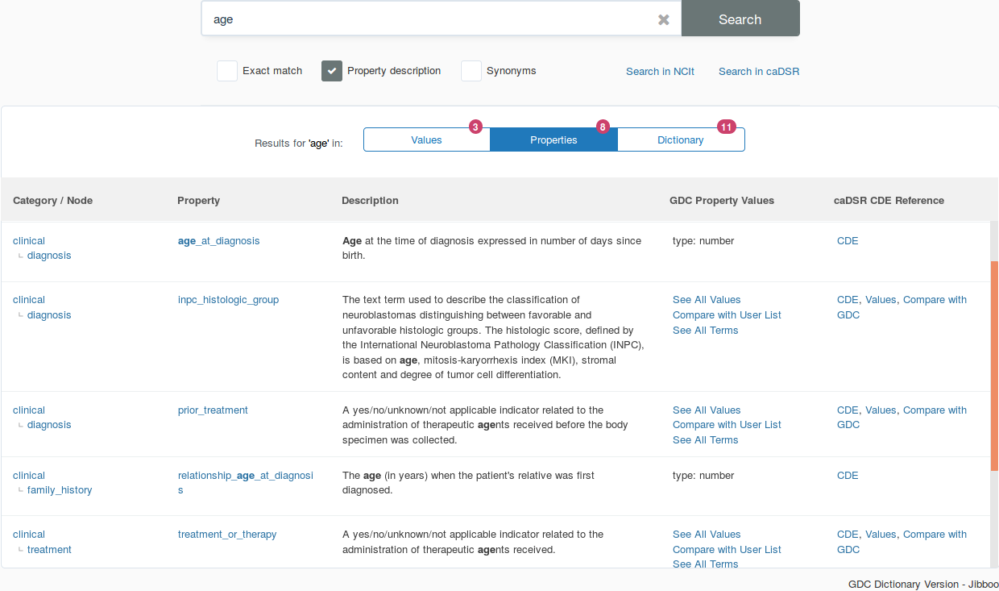

# GDC Data Dictionary

## Introduction

The GDC Data Dictionary is a resource that describes the clinical, biospecimen, administrative, and genomic metadata that can be used in parallel with the genomic data generated by the GDC. The dictionary defines the structure of a database, the [data model](../Data/Data_Model/GDC_Data_Model.md), and the rules the data need to follow. In addition, the dictionary includes information about the relationships between entities within the data model.

### Data Dictionary Components:

The GDC Data Dictionary consists of the following components:

* Comprehensive list of nodes, which represent entities in the data model and help to group metadata into categories.
* Comprehensive list of properties in the database and their schemas, which describe specific data elements that can be submitted to the GDC.
* Comprehensive list of unique keys and links between properties.
* Constraints and requirements defined on nodes and properties, including acceptable values and data types.

### Standards and Conventions

All properties and values in the GDC Data Dictionary include references to external standards defined and maintained by the [NCI Thesaurus](https://ncit.nci.nih.gov/ncitbrowser/) (NCIt) and the [Cancer Data Standards Registry and Repository](https://wiki.nci.nih.gov/display/caDSR/caDSR+Wiki) (caDSR). Both of these standards are operated by groups at [NCI's Center for Bioinformatics and Information Technology](https://cbiit.cancer.gov/) (CBIIT).

Each property is assigned a [Common Data Element](https://cdebrowser.nci.nih.gov/cdebrowserClient/cdeBrowser.html#/search) (CDE) created by the caDSR. The CDE provides detailed information about the property including links to the NCIt through assigned concept codes. NCIt concepts are also assigned at the permissible value level for enumerated properties. The images below are an example of a caDSR CDE and its related property-level NCIt concepts.

In addition to the caDSR and NCIt references, many of the properties are defined by additional standards including, but not limited to the following: [International Classification of Diseases](https://www.who.int/health-topics/international-classification-of-diseases) ([ICD-O-3](http://codes.iarc.fr/) and [ICD-10](https://www.cdc.gov/nchs/icd/icd10cm.htm)), [American Joint Committee on Cancer](https://cancerstaging.org/Pages/default.aspx) staging classifications, [Children's Oncology Group](https://www.childrensoncologygroup.org/) (COG) categorizations, and the [International Federation of Gynecology and Obstetrics](https://www.figo.org/) (FIGO) classifications. When these additional standards are used to describe a property, this is referenced in the description and the list of allowable values will reflect the criteria defined by the standard.

Using external standards benefits both data contributors and data consumers at the GDC.  For example, the curated lists of synonyms provided by NCIt allows for easy mapping of other study-specific clinical data standards to the GDC data dictionary.  The available synonyms can be leveraged using the [GDC Data Dictionary Search](gdcmvs/).

## Data Dictionary Viewer

The [GDC Data Dictionary Viewer](viewer.md) is a user-friendly interface for accessing the dictionary. It includes the following functionality:

*   __Dictionary contents:__ Display of entities defined in the dictionary, including their descriptions, values or types, and links.
*   __Links to semantic resources:__ Links to semantic data resources that define [Common Data Elements (CDEs)](http://cde.nih.gov) used in the dictionary
*   __Submission templates:__ JSON and TSV template generation for use in GDC data submission.

### Components of the Data Dictionary Viewer

The sections below provide an example of the information available for each specific node in the GDC Data Dictionary.

#### Summary

* __Type:__ The name of the node.
* __Category:__ The type of metadata; some examples are Clinical, Biospecimen, Analysis and Submittable Data Files.
* __Description:__ This section contains a written explanation for the type of data that would be found in this node.
* __Unique Keys:__ The properties or list of properties that can be used to identify this node, and only this node, within the commons.

This section also contains a "Download Template" link with a drop-down menu containing the two template file types: TSV and JSON. These files will contain all properties that are found in the node, but not all [properties are required](#properties) to upload the node.

#### Links

* __Links to Entity:__ Other nodes that can be connected to the focal node.
* __Link Name:__ A simplified stand in for the node link structure (requirement, target type, multiplicity, label). Its declaration categorizes the relationship between nodes.
* __Relationship:__ The written description for the association between the focal node and the other connected node.
* __Required:__ Displays whether the link to the node is required for the existence of the focal node. To link the focal node to a parent node, use the __<Link Name\>.submitter_id__ with the value of that field set to the appropriate `submitter_id` in the parent node. For more information on creating links between nodes, please see the [Data Submission Walkthrough](Data_Submission_Portal/Users_Guide/Data_Submission_Walkthrough).

#### Properties

* __Property:__ The name of the property.

* __Description:__ The written explanation for the expected type and characterization of data found in this property.

* __Acceptable Types or Values:__ The values that can be entered into the field based on the type category.
    * Enumeration: A list of predetermined strings. The user must select the exact string from the list to be a valid entry. Case does matter. Many of these properties with enumerations have numerous values.  To see all of the values, click the "More Values" link at the bottom of the property row under the __Acceptable Types or Values__ column.
    * Integer: A field that only accepts whole numbers.
    * Number: A field that can accept any number including numbers with decimal places.
    * String: A field in which alphanumeric characters and `_`, `.`, `-`, up to a length of 32,767, can be entered. Do not use other characters as it will create submission errors. Some string fields contain regex restrictions to coerce data to a specific pattern.
    * Boolean: A field that only accepts `true` or `false` as acceptable values. If these values are not entered as lowercase, the dictionary will not recognize the value and an error will occur.

* __Required:__ This informs the user whether this field is necessary for the submission of the node. If information for a required field is unknown or not reported, there is often a value to reflect that missing information.

* __CDE:__ The caDSR CDE Public ID, with the direct link to its respective Data Element Details page.

## Search Tool

The Search Tool enables easier query of the GDC Data Dictionary for data submitters and recommends GDC properties and values based on synonyms. Created by the NCI CBIIT EVS Team, it leverages NCI vocabulary systems caDSR and NCIt. Below are some of the features included in the Search Tool:

*   Users can complete partial or exact match searches.
*   Searches can include terms that are synonymous to the GDC allowable values.
*   Users can compare their list of values to the GDC allowable values.
*   Dictionary paths are described so users can find the specific node where a property is located.

### Components of the Search Tool

The sections below provide an example of the information available for each portion of the Search Tool.

#### Search Tool Modifiers

The Search Tool is equipped with the following modifiers to customize searches in the GDC Data Dictionary:

* __Exact match:__ This will return matches for only the exact value entered into the search field.

     
     

* __Property description:__ This will return matches for the value found not only in the property, but also searches within the description of the property.

     
     

* __Synonyms:__ This will return matches that not only match the value entered, but other values that NCIt consider to be synonymous with the entered value.

     
     

#### Result Fields

The results from searches can be sorted into three different result fields:

* __Values:__ This result section will return three columns that displays matches to values that are found in the GDC Data Dictionary:
     
    * __Category / Node / Property:__ This section displays the GDC Data Dictionary hierarchy that precedes the search term. This section can also contain information such as:
        * __See All Values:__ This window will display all GDC values for this property.
        
        * __Compare with User List:__ This window allows the user to input a list of values to check against the acceptable values for that property.
        
        * __See All Terms:__ This window will display the NCIt code assigned to the specific term and the synonymous NCIt terms associated.
        
        * __caDSR: CDE , Values , Compare with GDC:__ This group of links can send the user to the CDE property page (CDE), opens a window that displays the caDSR values for that property (Values), or opens a window that compares the caDSR values with GDC values (Compare wth GDC).
        
    * __Matched GDC Values:__ This column will display all GDC values that match the term with ICD-O-3 and NCIt values if they are available.
     
    * __CDE Permissible Values:__ This column displays GDC dictionary properties that have corresponding caDSR clinical data elements (CDE).
* __Properties:__ This result section will return five columns that displays matches to properites of the GDC Data Dictionary:
     
    * __Category / Node:__ This column displays the Category and Node hierarchy for the search value.
    * __Property:__ This column displays the name of the Property for the search value.
    * __Description:__ This column displays the description for the returned property.
    * __GDC Property Values:__ This column displays the value type for the returned property. For more information see the Acceptable Types or Values section under [Properties](#properties).
    * __caDSR CDE Reference:__ This column displays the CDE link for the returned property.
* __Dictionary:__ This result section will return two columns that display matches to values within the structure of the GDC Data Dictionary:
     
    * __Name:__ This column displays the name of the Category, Node, or Property with a returned value total for each level.
    * __Description:__ This column displays the GDC Data Dictionary description for each level. 

## Data Dictionary API

In technical terms, the dictionary is a set of YAML files that define JSON schemas for each entity in the dictionary. The files are available [on GitHub](https://github.com/NCI-GDC/gdcdictionary/tree/develop/gdcdictionary/schemas).

The GDC API can generate entity JSON schemas in JSON format. The API also provides the template generation functionality accessible via the GDC Data Dictionary Viewer. See [API documentation](../API/Users_Guide/Submission/#gdc-data-dictionary-endpoints) for details on how to access these functions programmatically.
