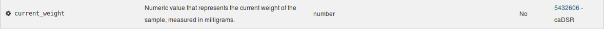

# GDC Data Dictionary

## Introduction

The GDC Data Dictionary is a resource that describes the clinical, biospecimen, administrative, and genomic metadata that can be used in parallel with the genomic data generated by the GDC. The dictionary defines the structure of a database, the [data model](../Data/Data_Model/GDC_Data_Model.md), and the rules the data need to follow. In addition, the dictionary includes information about the relationships between entities within the data model.

### The Data Dictionary Includes the Following:

* Comprehensive list of nodes, which represent entities in the data model and help to group metadata into categories.
* Comprehensive list of properties in the database and their schemas, which describe specific data elements that can be submitted to the GDC.
* Comprehensive list of unique keys and links between properties.
* Constraints and requirements defined on nodes and properties, including acceptable values and data types.

### Standards and Conventions

The GDC Data Dictionary includes references to external standards including the [NCI Thesaurus](https://ncit.nci.nih.gov/ncitbrowser/) (NCIt) and the [Cancer Data Standards Registry and Repository](https://wiki.nci.nih.gov/display/caDSR/caDSR+Wiki) (caDSR). Both of these standards are operated by groups at [NCI’s Center for Bioinformatics and Information Technology](https://cbiit.cancer.gov/) (CBIIT).

Each property is assigned a [Common Data Element](https://cdebrowser.nci.nih.gov/cdebrowserClient/cdeBrowser.html#/search) (CDE) created by the caDSR. The CDE includes detailed information about the property including links to the NCIt through assigned concept codes. NCIt concepts are also assigned at the permissible value level for enumerated properties. The images below is an example of a caDSR CDE and its related property-level NCIt concepts.  

Using external standards benefits both data contributors and data consumers at the GDC.  For example, the curated lists of synonyms provided by NCIt allows for easy mapping of other study-specific clinical data standards to the GDC data dictionary.  The available synonyms can be levered using the [GDC Data Dictionary Search](gdcmvs/).

## Data Dictionary Viewer

The [GDC Data Dictionary Viewer](viewer.md) is a user-friendly interface for accessing the dictionary. It includes the following functionality:

*   __Dictionary contents:__ Display of entities defined in the dictionary, including their descriptions, values or types, and links.
*   __Links to semantic resources:__ Links to semantic data resources that define [Common Data Elements (CDEs)](http://cde.nih.gov) used in the dictionary
*   __Submission templates:__ JSON and TSV template generation for use in GDC data submission.

### Components of the Data Dictionary Viewer

#### Summary

The following example details are found for each specific node in the GDC Data Dictionary.

* __Type:__ The name of the node.
* __Category:__ The type of metadata; some examples are Clinical, Biospecimen, Analysis and Submittable Data Files.
* __Description:__ This section contains a written explanation for the type of data that would be found in this node.
* __Unique Keys:__ The properties or combination of properties that are specific to this node.

This section also contains a "Download Template" link with a drop-down menu containing the two template file types:  TSV and JSON. These files will contain all properties that are found in the node, but not all [properties are required](#properties) to upload the node.

#### Links

* __Links to Entity:__ Other nodes that are connected to the focal node.
* __Link Name:__ A simplified stand-in for the node-link structure. Its declaration categorizes the relationship between nodes.
* __Relationship:__ The written description for the association between the focal node and the other connected node.
* __Required:__ Displays whether the node is required for the existence of the focal node.

#### Properties

* __Property:__ The name of the property.

* __Description:__ The written explanation for the expected type and characterization of data found in this property.

* __Acceptable Values:__ The values that can be entered into the field based on the type category.
    * Enumeration: A list of predetermined strings. The user must select the exact string from the list to be a valid entry. Case does matter. Many of these properties with enumerations have numerous values.  To see all of the values, click the "More Values" link at the bottom of the property row under the __Acceptable Types or Values__ column.
    * Integer: A field that only accepts whole numbers.
    * Number: A field that can accept any number including numbers with decimal places.
    * String: A field in which alphanumeric characters and `_`, `.`, `-`, up to a length of 32,767, can be entered. Do not use other characters as it will create submission errors.
    * Boolean: A field that only accepts `true` or `false` as acceptable values. If these values are not entered as lowercase, the dictionary will not recognize the value and an error will occur.

* __Required:__ This informs the user whether this field is necessary for the submission of the node.

* __CDE:__ The CDE Public ID, with the direct link to its respective Data Element Details page.

## Search Tool

The Search Tool enables easier query of the GDC Data Dictionary for data submitters and recommends GDC properties and values based on user-supplied synonyms.  Created by the NCI CBIIT EVS Team, it leverages NCI vocabulary systems caDSR and NCIt. Below are some of the features included in the Search Tool:

*   Users can complete partial or exact match searches.
*   Searches can include terms that are synonymous to the GDC allowable values.
*   Users can compare their list of values to the GDC allowable values.
*   Dictionary paths are described so users can find the specific node where a property is located.

## Entity JSON Schemas

In technical terms, the dictionary is a set of YAML files that define JSON schemas for each entity in the dictionary. The files are available [on GitHub](https://github.com/NCI-GDC/gdcdictionary/tree/develop/gdcdictionary/schemas).

The GDC API can generate entity JSON schemas in JSON format. The API also provides the template generation functionality accessible via the GDC Data Dictionary Viewer. See [API documentation](../API/Users_Guide/Submission/#gdc-data-dictionary-endpoints) for details on how to access these functions programmatically.
