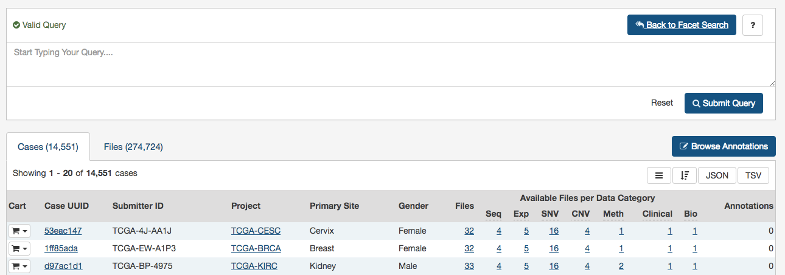
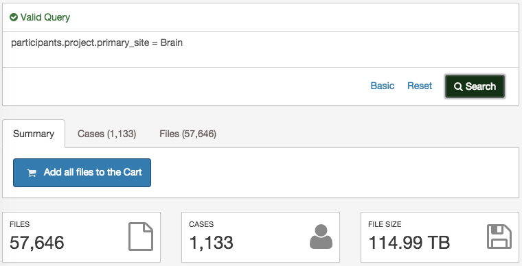
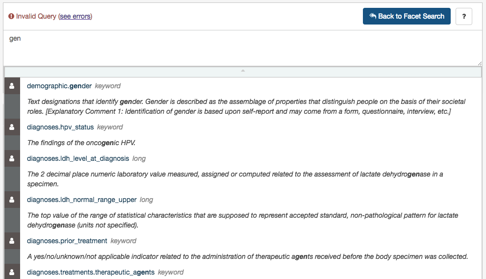
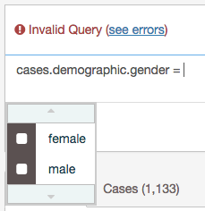

# Advanced Search

## Overview

An advanced search allows, via Genomic Query Language (GQL), to use structured queries to search for files and cases.

[](images/gdc-data-portal-advanced-search.png "Click to see the full image.")

The advanced search provides more filters than the faceted search.

A simple query in GQL (also known as a 'clause') consists of a __field__, followed by an __operator__, followed by one or more __values__. For example, the following simple query will find all files in the "TEST" project:

```
cases.project.primary_site = Brain
```

[](images/gdc-data-portal-advanced-search-example.png "Click to see the full image.")

Be aware that it is not possible to compare two fields (e.g. disease_type = project.name).

__Note__: GQL is not a database query language. For example, GQL does not have a "SELECT" statement.

### Switch between 'Advanced' and 'Faceted' Search

A query created using 'Faceted Search' will be automatically translated to 'Advanced Search' (i.e. GQL) when clicking on the "Advanced" button.

However, a query created using 'Advanced Search' is not translated to 'Faceted Search'. From the advanced search, click on Basic and you will be redirected to a reset faceted search.

## Use the Advanced Search

When opening the advanced search page (via the Data view), the search field will be automatically populated with facets fileters already applied (if any).

This default query can be removed by pressing "Reset".

Once the query has been entered and is identified as a "Valid Query", click on "Search" to run your query.

## Auto-complete

As a query is being written, the GDC Data Portal will analyse the context and offer a list of "auto-complete".

### Field Auto-complete

The list of auto-complete suggestions includes __all__ the fields authorized in the advanced search matching the user text input. The user has to scroll down to see more fields in the dropdown.

[](images/gdc-data-portal-advanced-search-project.png "Click to see the full image.")

### Value Auto-complete

The list of auto-complete suggestions includes top 100 values that match the user text input. The user has to scroll down to see more values in the dropdown.

The value auto-complete is not aware of the general context of the query, the system will display all available values in GDC for the selected field.
It means the query could return 0 result depending of other filters.

[](images/gdc-data-portal-advanced-search-value.png "Click to see the full image.")

__Note__: Quotes are automatically added to the value if it contains spaces.

## Setting Precedence of Operators

You can use parentheses in complex GQL statements to enforce the precedence of operators.

For example, if you want to find all the open files in TCGA program as well as the files in TARGET program, you can use parentheses to enforce the precedence of the boolean operators in your query, i.e.:

```
(files.access = open and cases.project.program.name = TCGA) or cases.project.program.name = TARGET
```

__Note__: Without parentheses, the statement will be evaluated left-to-right.

## Keywords

A GQL keyword is a word that joins two or more clauses together to form a complex GQL query.

**List of Keywords:**

*   AND
*   OR  

__Note__: parentheses can be used to control the order in which clauses are executed.

### AND Keyword

Used to combine multiple clauses, allowing you to refine your search.

Examples:

* Find all open files in breast cancer

```
cases.project.primary_site = Breast and files.access = open
```

* Find all open files in breast cancer and data type is copy number variation

```
cases.project.primary_site = Breast and files.access = open and files.data_type = "Copy number variation"
```

### OR Keyword

Used to combine multiple clauses, allowing you to expand your search.

__Note__: __IN__ keyword can be an alternative to OR and result in simplified queries.

Examples:

*   Find all files that are raw sequencing data or raw microarray data:

```
files.data_type = "Raw microarray data" or files.data_type = "Raw sequencing data"
```

*   Find all files where donors are male or vital status is alive:

```
cases.demographic.gender = male or cases.diagnoses.vital_status = alive
```

## Operators

An operator in GQL is one or more symbols or words comparing the value of a field on its left with one or more values on its right, such that only true results are retrieved by the clause.

### List of Operators and Query format

| Operator | Description |
| --- | --- |
| = | Field EQUAL Value (String or Number) |
| != | Field NOT EQUAL Value (String or Number) |
| < | Field LOWER THAN Value (Number or Date) |
| <= | Field LOWER THAN OR EQUAL Value (Number or Date) |
| \> | Field GREATER THAN Value (Number or Date) |
| \>= | Field GREATER THAN OR EQUAL Value (Number or Date) |
| IN | Field IN [Value 1, Value 2] |
| EXCLUDE | Field EXCLUDE [Value 1, Value 2] |
| IS MISSING | Field IS MISSING |
| NOT MISSING | Field NOT MISSING |


### "=" operator - EQUAL

The "=" operator is used to search for files where the value of the specified field exactly matches the specified value.

Examples:

*   Find all files that are gene expression:

```
files.data_type = "Gene expression"
```

*   Find all cases whose gender is female:

```
cases.demographic.gender = female
```

### "!=" operator - NOT EQUAL

The "!=" operator is used to search for files where the value of the specified field does not match the specified value.

The "!=" operator will not match a field that has no value (i.e. a field that is empty). For example, 'gender != male' will only match cases who have a gender and the gender is not male. To find cases other than male or with no gender populated, you would need to type gender != male or gender is missing.

Example:

*   Find all files with an experimental different from genotyping array:

```
files.experimental_strategy != "Genotyping array"
```

### ">" operator - GREATER THAN

The ">" operator is used to search for files where the value of the specified field is greater than the specified value.

Example:

* Find all cases whose number of days to death is greater than 60:

```
cases.diagnoses.days_to_death > 60
```


### ">=" operator - GREATER THAN OR EQUALS

The ">=" operator is used to search for files where the value of the specified field is greater than or equal to the specified value.

Example:

* Find all cases whose number of days to death is equal or greater than 60:

```
cases.diagnoses.days_to_death >= 60
```

### "<" operator - LESS THAN

The "<" operator is used to search for files where the value of the specified field is less than the specified value.

Example:

*   Find all cases whose age at diagnosis is less than 400 days:

```
cases.diagnoses.age_at_diagnosis < 400
```

### "<=" operator - LESS THAN OR EQUALS

The "<=" operator is used to search for files where the value of the specified field is less than or equal to the specified value.

Example:

*   Find all cases with a number of days to death less than or equal to 20:

```
cases.diagnoses.days_to_death <= 20
```
### "IN" Operator

The "IN" operator is used to search for files where the value of the specified field is one of multiple specified values. The values are specified as a comma-delimited list, surrounded by brackets [ ].

Using "IN" is equivalent to using multiple 'EQUALS (=)' statements, but is shorter and more convenient. That is, typing 'project IN [ProjectA, ProjectB, ProjectC]' is the same as typing 'project = "ProjectA" OR project = "ProjectB" OR project = "ProjectC"'.

Examples:

*   Find all files in breast, breast and lung and cancer:

```
cases.project.primary_site IN [Brain, Breast,Lung]
```

*   Find all files tagged with exon or junction or hg19:

```
files.data_type IN ["Aligned reads", "Unaligned reads"]
```

### "EXCLUDE" Operator

The "EXCLUDE" operator is used to search for files where the value of the specified field is not one of multiple specified values.

Using "EXCLUDE" is equivalent to using multiple 'NOT_EQUALS (!=)' statements, but is shorter and more convenient. That is, typing 'project EXCLUDE [ProjectA, ProjectB, ProjectC]' is the same as typing 'project != "ProjectA" OR project != "ProjectB" OR project != "ProjectC"'

The "EXCLUDE" operator will not match a field that has no value (i.e. a field that is empty). For example, 'experimental strategy EXCLUDE ["WGS","WXS"]'' will only match files that have an experimental strategy **and** the experimental strategy is not "WGS" or "WXS". To find files with an experimental strategy different from than "WGS" or "WXS" **or is not assigned**, you would need to type: files.experimental_strategy in ["WXS","WGS"] or files.experimental\_strategy is missing.

Examples:

*   Find all issues where experimental strategy is not WXS, WGS, Genotyping array:

```
files.experimental_strategy EXCLUDE [WXS, WGS, "Genotyping array"]
```


### "IS MISSING" Operator 

The "IS" operator can only be used with "MISSING". That is, it is used to search for files where the specified field has no value.

Examples:

*   Find all cases where gender is missing: 

```
cases.demographic.gender is MISSING
```

### "NOT MISSING" Operator 

The "NOT" operator can only be used with "MISSING". That is, it is used to search for files where the specified field has a value.

Examples:

*   Find all cases where race is not missing: 

```
cases.demographic.race NOT MISSING
```

## Special Cases

### Date format

The date format should be the following: **YYYY-MM-DD** (without quotes).

Example:

```
files.updated_datetime > 2015-12-31
```


### Using Quotes

A value must be quoted if it contains a space. Otherwise the advanced search will not be able to interpret the value.

Quotes are not necessary if the value consists of one single word.

* Example: Find all cases with primary site is brain and data type is copy number variation:

```
cases.project.primary_site = Brain and files.data_type = "Copy number variation"
```

### Age at Diagnosis - Unit in Days

The unit for age at diagnosis is in **days**. The user has to convert the number of years to number of days.

The __conversion factor__ is 1 year = 365.25 days

*   Example: Find all cases whose age at diagnosis > 40 years old (40 * 365.25)

```
cases.diagnoses.age_at_diagnosis > 14610
```


## Fields Reference

The full list of fields available on the GDC Data Portal can be found through the GDC API using the following endpoint:

[https://gdc-api.nci.nih.gov/gql/_mapping](https://gdc-api.nci.nih.gov/gql/_mapping)

Alternatively, a static list of fields is available below (not exhaustive).

### Files

+ files.access
+ files.acl
+ files.archive.archive_id
+ files.archive.revision
+ files.archive.submitter_id
+ files.center.center_id
+ files.center.center_type
+ files.center.code
+ files.center.name
+ files.center.namespace
+ files.center.short_name
+ files.data_format
+ files.data_subtype
+ files.data_type
+ files.experimental_strategy
+ files.file_id
+ files.file_name
+ files.file_size
+ files.md5sum
+ files.origin
+ files.platform
+ files.related_files.file_id
+ files.related_files.file_name
+ files.related_files.md5sum
+ files.related_files.type
+ files.state
+ files.state_comment
+ files.submitter_id
+ files.tags

### Cases

+ cases.case_id
+ cases.submitter_id
+ cases.diagnoses.age_at_diagnosis
+ cases.diagnoses.days_to_death
+ cases.demographic.ethnicity
+ cases.demographic.gender
+ cases.demographic.race
+ cases.diagnoses.vital_status
+ cases.project.disease_type
+ cases.project.name
+ cases.project.program.name
+ cases.project.program.program_id
+ cases.project.project_id
+ cases.project.state
+ cases.samples.sample_id
+ cases.samples.submitter_id
+ cases.samples.sample_type
+ cases.samples.sample_type_id
+ cases.samples.shortest_dimension
+ cases.samples.time_between_clamping_and_freezing
+ cases.samples.time_between_excision_and_freezing
+ cases.samples.tumor_code
+ cases.samples.tumor_code_id+ cases.samples.current_weight
+ cases.samples.days_to_collection
+ cases.samples.days_to_sample_procurement
+ cases.samples.freezing_method
+ cases.samples.initial_weight
+ cases.samples.intermediate_dimension
+ cases.samples.is_ffpe
+ cases.samples.longest_dimension
+ cases.samples.oct_embedded
+ cases.samples.pathology_report_uuid
+ cases.samples.portions.analytes.a260_a280_ratio
+ cases.samples.portions.analytes.aliquots.aliquot_id
+ cases.samples.portions.analytes.aliquots.amount
+ cases.samples.portions.analytes.aliquots.center.center_id
+ cases.samples.portions.analytes.aliquots.center.center_type
+ cases.samples.portions.analytes.aliquots.center.code
+ cases.samples.portions.analytes.aliquots.center.name
+ cases.samples.portions.analytes.aliquots.center.namespace
+ cases.samples.portions.analytes.aliquots.center.short_name
+ cases.samples.portions.analytes.aliquots.concentration
+ cases.samples.portions.analytes.aliquots.source_center
+ cases.samples.portions.analytes.aliquots.submitter_id
+ cases.samples.portions.analytes.amount
+ cases.samples.portions.analytes.analyte_id
+ cases.samples.portions.analytes.analyte_type
+ cases.samples.portions.analytes.concentration
+ cases.samples.portions.analytes.spectrophotometer_method
+ cases.samples.portions.analytes.submitter_id
+ cases.samples.portions.analytes.well_number
+ cases.samples.portions.center.center_id
+ cases.samples.portions.center.center_type
+ cases.samples.portions.center.code
+ cases.samples.portions.center.name
+ cases.samples.portions.center.namespace
+ cases.samples.portions.center.short_name
+ cases.samples.portions.is_ffpe
+ cases.samples.portions.portion_id
+ cases.samples.portions.portion_number
+ cases.samples.portions.slides.number_proliferating_cells
+ cases.samples.portions.slides.percent_eosinophil_infiltration
+ cases.samples.portions.slides.percent_granulocyte_infiltration
+ cases.samples.portions.slides.percent_inflam_infiltration
+ cases.samples.portions.slides.percent_lymphocyte_infiltration
+ cases.samples.portions.slides.percent_monocyte_infiltration
+ cases.samples.portions.slides.percent_necrosis
+ cases.samples.portions.slides.percent_neutrophil_infiltration
+ cases.samples.portions.slides.percent_normal_cells
+ cases.samples.portions.slides.percent_stromal_cells
+ cases.samples.portions.slides.percent_tumor_cells
+ cases.samples.portions.slides.percent_tumor_nuclei
+ cases.samples.portions.slides.section_location
+ cases.samples.portions.slides.slide_id
+ cases.samples.portions.slides.submitter_id
+ cases.samples.portions.submitter_id
+ cases.samples.portions.weight
