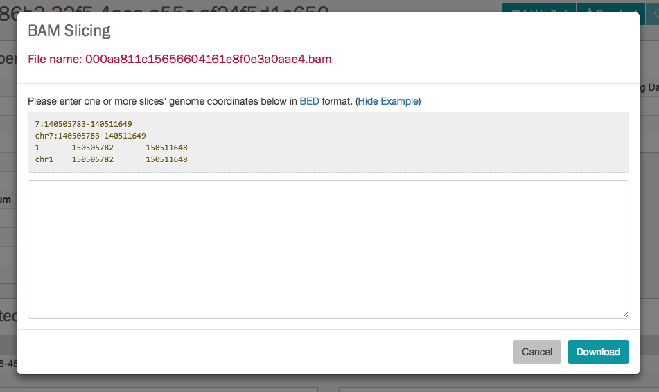

# Overview

! __Section to be further completed__ !

If the file listed in the entity page is a BAM file, a "BAM Slicing" button will be available. Clicking on it will open the BAM slicing window.

During preparation of the slice, the icon on the BAM Slicing button will be spinning, and the file will be offered for download to the user as soon as ready.
