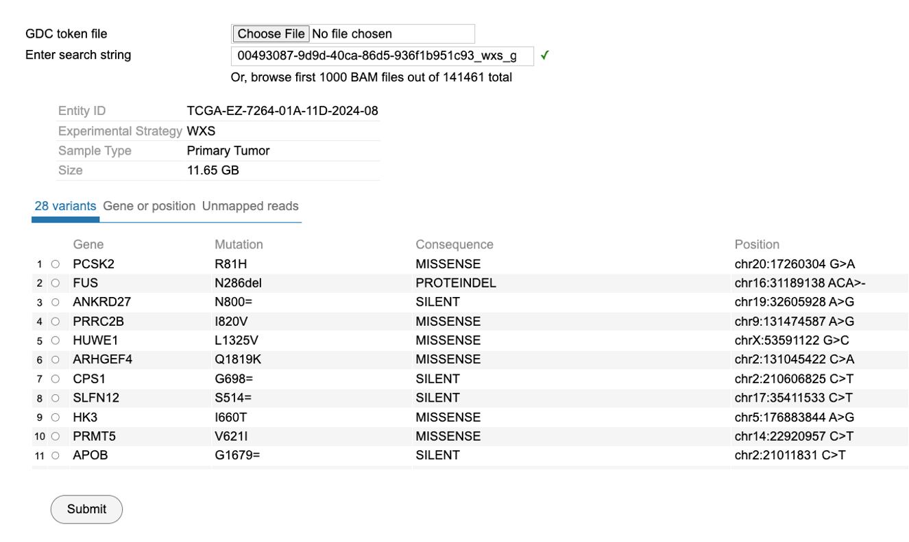
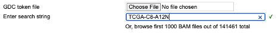
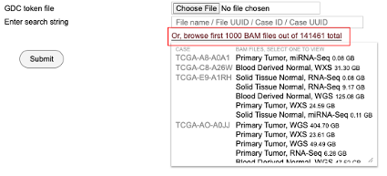
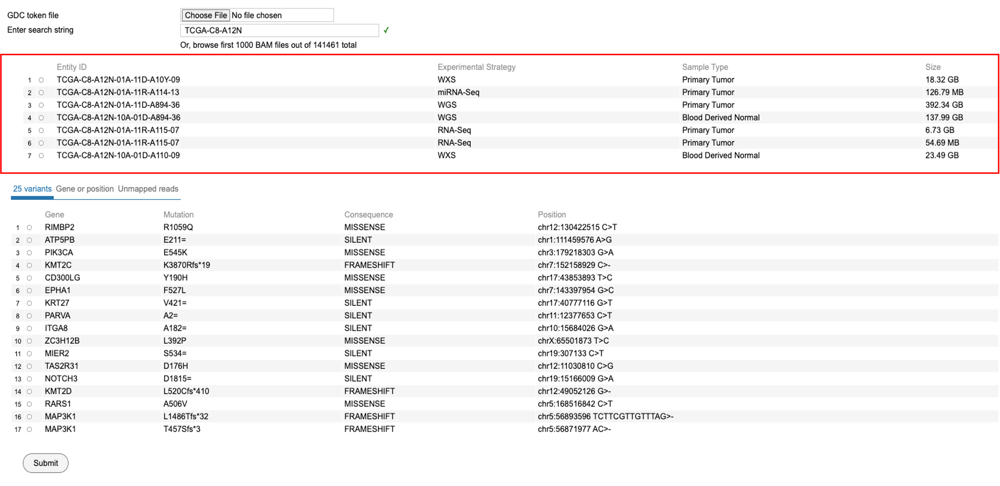
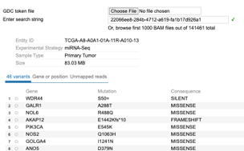
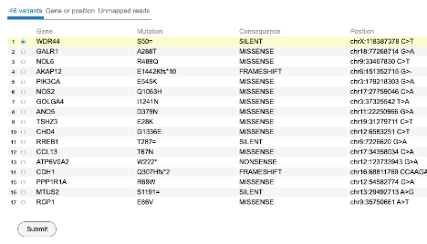
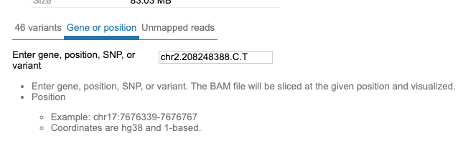
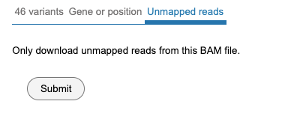

# GDC BAM Slicing Download User Guide

## Introduction to BAM slicing
The GDC BAM slicing download feature is a tool for slicing individual BAM files based on the variant, gene, position, or SNPs for individual case/entities in the NCI GDC. In addition, it also allows users to download unmapped reads from a BAM file. To begin, follow the following steps as outlined.

## Download

### Searching for a case
To search for a case, enter a string id which could be a file name, file id, case UUID or case ID. For example, enter and search for the case 'TCGA-C8-A12N' as shown. Please note that the complete id must be used. Partial ids are not allowed.

A user may also choose to browse the first thousand BAM files. Click on the label "Or, browse first 1000 BAM files out of 141461 total" to load the following view. Scroll and select the case of interest.

### Selecting Variant/Gene, Position or Unmapped reads

Upon searching by a string id, the following view is displayed. User must select an Entity ID associated with the case ID as shown. This view shows the 'Experimental strategy', 'Sample Type', and 'Size' of the file associated with that entity id.

Choosing a BAM file directly from the thousand files will display the following view. This view has selected an entity id chosen by the user with 'miRNA-Seq' as the experimental strategy, sample type being the 'Primary Tumor' with a file size of 83.03 MB.

### Selecting a Variant

From the view as shown above, user can choose from 48 variants. Select WDR44 as shown and click 'Submit' to download the BAM slice for this case and gene variant.

### Selecting a Gene

Click on the next tab to access the view that allows selecting BAM files for a particular gene, snp or a specific position/range in the genome. After making your selection, click the 'Submit' button at the bottom of the view to download the slices.

### Selecting unmapped reads

Click the tab for accessing the 'Unmapped reads' as shown below. Click 'Submit' to download the unmapped reads.

## Saved Downloads

All downloads are saved in the 'Downloads' folder. 
