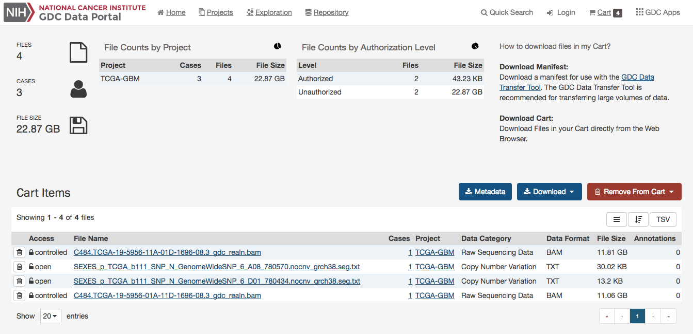

# Cart and File Download

## Overview

While browsing the GDC Data Portal, files can either be downloaded individually from [file detail pages](Cases_and_Files.md#file-detail-page) or collected in the file cart to be downloaded as a bundle.

## GDC Cart

[](images/cart-overview.png "Click to see the full image.")

### Cart Summary

The cart page shows a summary of all files currently in the cart:

* Number of files
* Number of cases associated with the files
* Total file size

The Cart page also displays two charts:

* File count by project
* File count by authorization level to those files: this number takes into account the user authorization to download a file upon his authentication to the GDC Data Portal.

The charts can be converted to tables by clicking the table button in the top right corner of each chart.

### Cart table

The Cart table shows the list of all the files that were added to the Cart.

The user can click on the links to get more information on each file, it will link to:

* The file entity page
* The case entity page
* The project entity page


## Download Options

From the cart, the following download options are available:

* __Metadata__: GDC harmonized clinical, biospecimen, and file metadata associated with the files in the cart.
* __Download Manifest__: Download a manifest for use with the GDC Data Transfer Tool to download files.
* __Download Cart__: Download the files in the Cart directly through the browser. Users have to be cautious of the amount of data in the cart since this option will not optimize bandwidth and will not provide resume capabilities.
* __SRA XML, MAGE-TAB__: This option is available in the GDC Legacy Archive only. It is used to download metadata files associated with the files in the cart.

The cart allows users to download up to 5 GB of data directly through the web browser. This is not recommended for downloading large volumes of data, in particular due to the absence of a retry/resume mechanism. For downloads over 5 GB we recommend using the GDC Data Transfer Tool.

__Note__: when downloading multiple files from the cart, they are automatically bundled into one single Gzipped (.tar.gz) file.

### GDC Data Transfer Tool

The "Download Manifest" button will download a manifest that can be imported into the GDC Data Transfer Tool.

```manifest
id	filename	md5	size	state
4ea9c657-8f85-44d0-9a77-ad59cced8973	mdanderson.org_ESCA.MDA_RPPA_Core.mage-tab.1.1.0.tar.gz		2516051	live
b8342cd5-330e-440b-b53a-1112341d87db	mdanderson.org_SARC.MDA_RPPA_Core.mage-tab.1.1.0.tar.gz		4523632	live
c57673ac-998a-4a50-a12b-4cac5dc3b72e	mdanderson.org_KIRP.MDA_RPPA_Core.mage-tab.1.2.0.tar.gz		4195746	live
3f22dd8d-59c8-43a4-89cf-3b595f2e5a06	14-3-3_beta-R-V_GBL1112940.tif	56df0e4b4fc092fc3643bd2e316ac05b	6257840	live
7ce05059-9197-4d38-830f-04356f5f851a	14-3-3_beta-R-V_GBL11066140.tif	6abfee483974bc2e61a37b5499ae9a07	6261580	live
8e00d22a-ca6f-4da8-a1c3-f23144cb21b7	14-3-3_beta-R-V_GBL1112940.tif	56df0e4b4fc092fc3643bd2e316ac05b	6257840	live
96487cd7-8fa8-4bee-9863-17004a70b2e9	14-3-3_beta-R-V_GBL1112940.tif	56df0e4b4fc092fc3643bd2e316ac05b	6257840	live
```

The Manifest contains a list of the file UUIDs in the cart and can be used together with the GDC Data Transfer Tool to download all files.

Information on the GDC Data Transfer Tool is available in the [GDC Data Transfer Tool User's Guide](/node/8196/).


### Individual Files Download

Similar to the files page, each row contains a download button to download a particular file individually.

## Controlled Files

If a user tries to download a cart containing controlled files and without being authenticated, a pop-up will be displayed to offer the user either to download only open access files or to login into the GDC Data Portal through eRA Commons. See [Authentication](Authentication.md) for details.

[](images/gdc-data-portal-download-cart.png "Click to see the full image.")
