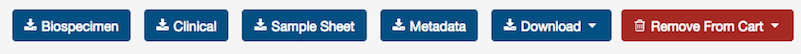
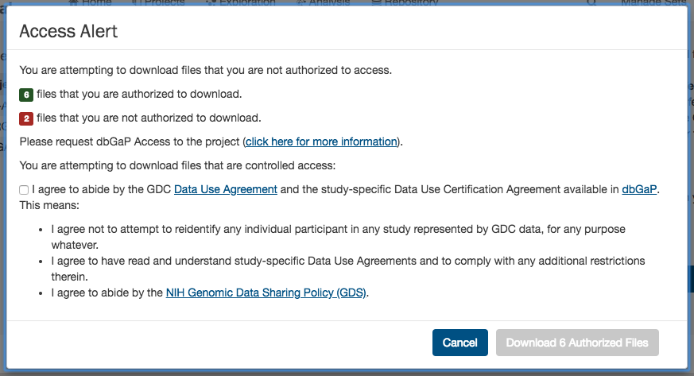
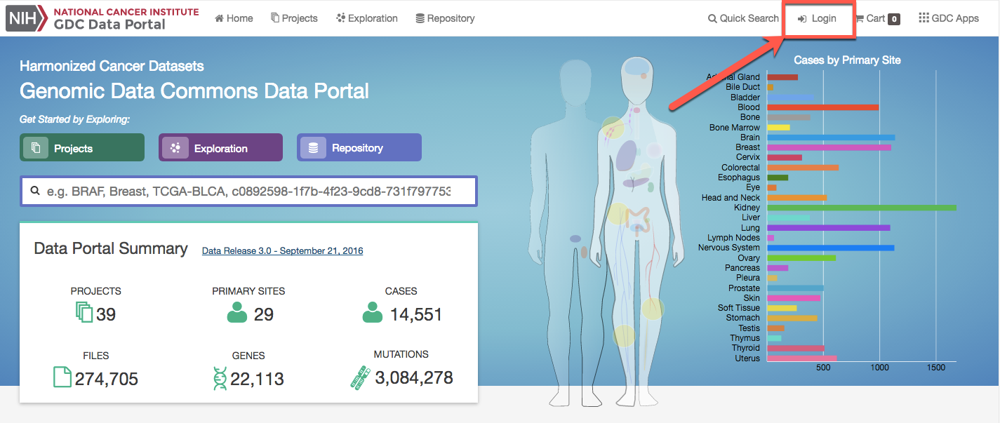
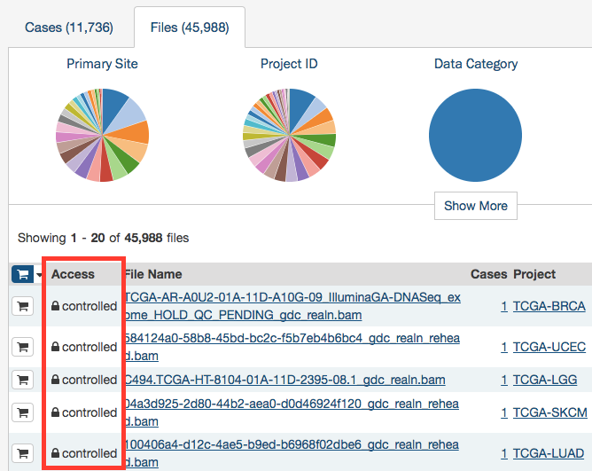
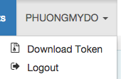

# Cart and File Download

While browsing the GDC Data Portal, files can either be downloaded individually from [File Summary Pages](Repository.md#file-summary-page) or collected in the file cart to be downloaded as a bundle.  Clicking on the shopping cart icon that is next to any item in the GDC will add the item to your cart.

## GDC Cart

[](images/cart-overview_v2.png "Click to see the full image.")

## Cart Summary

The Cart Summary Page shows a summary of all files currently in the cart:

* Number of files.
* Number of cases associated with the files.
* Total file size.

The Cart page also displays two tables:

* __File count by project__: Breaks down the files and cases by each project.
* __File count by authorization level__: Breaks down the files in the cart by authorization level.  A user must be logged into the GDC in order to download 'Controlled-Access files'.

The cart also directs users how to download files in the cart.  For large data files, it is recommended that the [GDC Data Transfer Tool](https://gdc.cancer.gov/access-data/gdc-data-transfer-tool) be used.

## Cart Items

[](images/gdc-cart-items_v2.png "Click to see the full image.")

The Cart Items table shows the list of all the files that were added to the Cart.  The table gives the folowing information for each file in the cart:

* __Access__: Displays whether the file is open or controlled access.  Users must login to the GDC Portal and have the appropriate credentials to access these files.
* __File Name__: Name of the file.  Clicking the link will bring the user to the [File Summary Page](#file-summary-page).
* __Cases__: How many cases does the file contain.  Clicking the link will bring the user to the [Case Summary Page](Exploration.md#case-summary-page).
* __Project__: The Project that the file belongs to.  Clicking the link will bring the user to the [Project Summary Page](Projects.md#project-summary-page).
* __Category__: Type of data.
* __Format__: The file format.
* __Size__: The size of the file.
* __Annotations__: Whether there are any annotations.

# Download Options

[](images/gdc-download-options_v2.png "Click to see the full image.")

The following buttons on the Cart page allows users to download files that are related to the ones in the cart.  The following download options are available:

* __Biospecimen:__ Downloads biospecimen data related to files in the cart in either TSV or JSON format.
* __Clinical:__ Downloads clinical data related to files in the cart in either TSV or JSON format.
* __Sample Sheet:__ Downloads a tab-separated file which contains the associated case/sample IDs and the sample type (Tumor/Normal) for each file in the cart.
* __Metadata:__ GDC harmonized clinical, biospecimen, and file metadata associated with the files in the cart.
* __Download:__
    * __Manifest:__ Download a manifest file for use with the GDC Data Transfer Tool to download files.  A manifest file contains a list of the UUIDs that correspond to the files in the cart.
    * __Cart:__ Download the files in the Cart directly through the browser. Users have to be cautious of the amount of data in the cart since this option will not optimize bandwidth and will not provide resume capabilities.
* __Remove from Cart:__ Remove all files or unauthorized files from the cart.
* __SRA XML, MAGE-TAB:__ This option is available in the GDC Legacy Archive only. It is used to download metadata files associated with the files in the cart.

The cart allows users to download up to 5 GB of data directly through the web browser. This is not recommended for downloading large volumes of data, in particular due to the absence of a retry/resume mechanism. For downloads over 5 GB we recommend using the `Download Manifest` button and download a manifest file that can be imported into [GDC Data Transfer Tool](https://docs.gdc.cancer.gov/Data_Transfer_Tool/Users_Guide/Getting_Started/).

>__Note__: when downloading multiple files from the cart, they are automatically bundled into one single Gzipped (.tar.gz) file.

## [GDC Data Transfer Tool](https://gdc.cancer.gov/access-data/gdc-data-transfer-tool)

The `Download Manifest` button will download a manifest file that can be imported into the GDC Data Transfer Tool.   Below is an example of the contents of a manifest file used for download:

```manifest
id	filename	md5	size	state
4ea9c657-8f85-44d0-9a77-ad59cced8973	mdanderson.org_ESCA.MDA_RPPA_Core.mage-tab.1.1.0.tar.gz		2516051	live
b8342cd5-330e-440b-b53a-1112341d87db	mdanderson.org_SARC.MDA_RPPA_Core.mage-tab.1.1.0.tar.gz		4523632	live
c57673ac-998a-4a50-a12b-4cac5dc3b72e	mdanderson.org_KIRP.MDA_RPPA_Core.mage-tab.1.2.0.tar.gz		4195746	live
3f22dd8d-59c8-43a4-89cf-3b595f2e5a06	14-3-3_beta-R-V_GBL1112940.tif	56df0e4b4fc092fc3643bd2e316ac05b	6257840	live
7ce05059-9197-4d38-830f-04356f5f851a	14-3-3_beta-R-V_GBL11066140.tif	6abfee483974bc2e61a37b5499ae9a07	6261580	live
8e00d22a-ca6f-4da8-a1c3-f23144cb21b7	14-3-3_beta-R-V_GBL1112940.tif	56df0e4b4fc092fc3643bd2e316ac05b	6257840	live
96487cd7-8fa8-4bee-9863-17004a70b2e9	14-3-3_beta-R-V_GBL1112940.tif	56df0e4b4fc092fc3643bd2e316ac05b	6257840	live
```

The Manifest contains a list of the file UUIDs in the cart and can be used together with the GDC Data Transfer Tool to download all files.

Information on the GDC Data Transfer Tool is available in the [GDC Data Transfer Tool User's Guide](../../Data_Transfer_Tool/Users_Guide/Getting_Started.md).

# Controlled Files

If a user tries to download a cart containing controlled files and without being authenticated, a pop-up will be displayed to offer the user either to download only open access files or to login into the GDC Data Portal through eRA Commons. See [Authentication](#Authentication) for details.

Once a user is logged in, controlled files that they have access to can be downloaded. To download files from the portal, users must agree to the GDC and individual project Data Use Agreements by selecting the agreement checkbox on the Access Alert message. 

[](images/gdc-data-portal-download-cart_v2.png "Click to see the full image.")

# Authentication

The GDC Data Portal provides granular metadata for all datasets available in the GDC. Any user can see a listing of all available data files, including controlled-access files. The GDC Data Portal also allows users to download open-access files without logging in. However, downloading of controlled-access files is restricted to authorized users and requires authentication.

## Logging into the GDC

To login to the GDC, users must click on the `Login` button on the top right of the GDC Website.



After clicking Login, users authenticate themselves using their eRA Commons login and password.  If authentication is successful, the eRA Commons username will be displayed in the upper right corner of the screen, in place of the "Login" button.

Upon successful authentication, GDC Data Portal users can:

- See which controlled-access files they can access.
- Download controlled-access files directly from the GDC Data Portal.
- Download an authentication token for use with the GDC Data Transfer Tool or the GDC API.
- See controlled-access mutation data they can access.

Controlled-access files are identified using a "lock" icon:

[](images/gdc-data-portal-controlled-files.png "Click to see the full image.")

The rest of this section describes controlled data access features of the GDC Data Portal available to authorized users. For more information about open and controlled-access data, and about obtaining access to controlled data, see [Data Access Processes and Tools](https://gdc.cancer.gov/access-data/data-access-processes-and-tools).

## User Profile

After logging into the GDC Portal, users can view which projects they have access to by clicking the `User Profile` section in the dropdown menu in the top corner of the screen.

[](images/gdc-user-profile-dropdown.png "Click to see the full image.")

Clicking this button shows the list of projects.

[](images/gdc-user-profile.png "Click to see the full image.")

## GDC Authentication Tokens

The GDC Data Portal provides authentication tokens for use with the GDC Data Transfer Tool or the GDC API. To download a token:

1. Log into the GDC using your eRA Commons credentials.
2. Click the username in the top right corner of the screen.
3. Select the "Download token" option.



A new token is generated each time the `Download Token` button is clicked.

For more information about authentication tokens, see [Data Security](../../Data/Data_Security/Data_Security.md#authentication-tokens).

>__Note:__ The authentication token should be kept in a secure location, as it allows access to all data accessible by the associated user account.

## Logging Out

To log out of the GDC, click the username in the top right corner of the screen, and select the Logout option.


