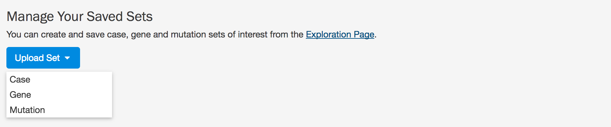
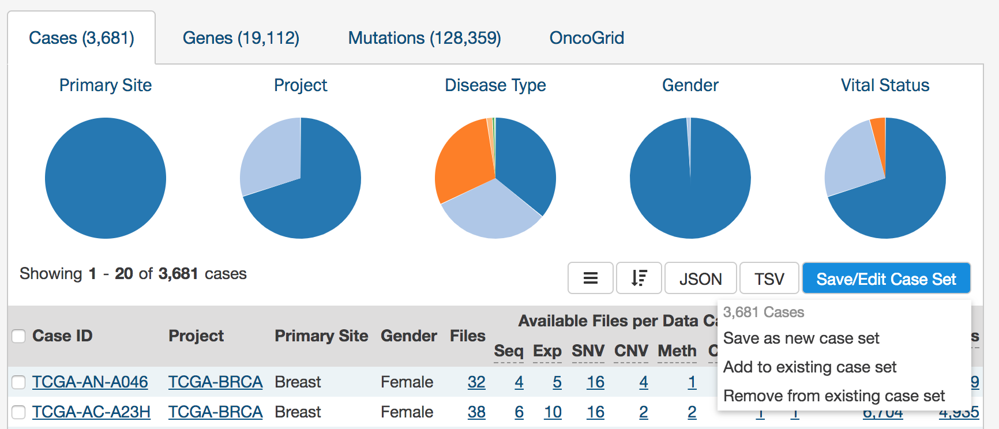
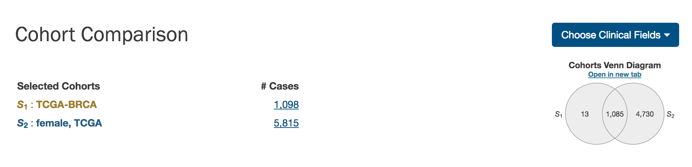
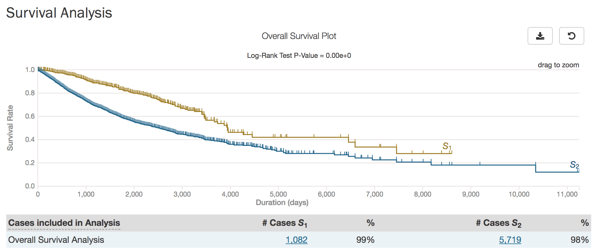
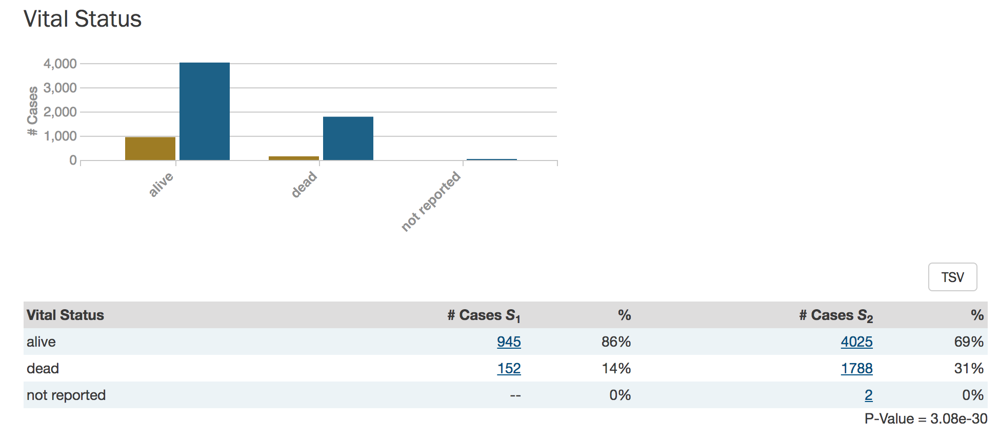

# Custom Set Analysis

In addition to the [Exploration page](Exploration.md), the GDC Data Portal also has features used to save and compare sets of cases, genes, and mutations. These sets can either be generated with existing filters (e.g. males with lung cancer) or through custom selection (e.g. a user-generated list of patient IDs).

Note that saving a set only saves the type of entity included in the set. For example, a saved case set will not include filters that were applied to genes or mutations.

## Generating a cohort for analysis

Cohort sets are completely customizable and can be generated for cases, genes, or mutations using the following methods:

__Upload ID Set:__ This feature is available in the "Manage Sets" link at the top right of the Portal. Choose "Upload Set" and then select whether the set comprises cases, genes, or mutations. A set of IDs (IDs* or UUIDs) can then be uploaded in a text file or copied and pasted into the field.

\* This is referred to as a `submitter_id` in the GDC API, which is a non-UUID identifier such as a TCGA barcode.

__Apply Filters in Exploration:__ Sets can be assembled using the existing filters in the exploration page.  They can be saved by choosing the "Save/Edit Case Set" button under the pie charts. This will prompt a decision to:

* Save as new case set
* Add to existing case set
* Remove from existing case set

## Analysis Tab: Set Operations

Up to three sets of the same entity type can be compared and exported based on complex overlapping subsets. The features of this page include:

* __Venn Diagram:__ Visually displays the overlapping items included within the three sets. Subsets based on overlap can be selected by clicking one or many sections of the Venn diagram. As sections of the Venn Diagram become highlighted in blue, their corresponding row in the overlap table becomes highlighted.  

* __Summary Table:__ Displays the alias, type, and name for each set included in this analysis

* __Overlap Table:__ Displays the number of overlapping items with text operators rather than a visual diagram.  Subsets can be selected by checking boxes in the "Select" column, which will highlight the corresponding section of the Venn Diagram. As rows are selected, the "Union of selected sets" row is populated. Each row has an option to save the subset as a cohort or export the set as a TSV. The links that correspond to the number of items in each row will open the cohort in the Exploration page.  

## Analysis Tab: Cohort Comparison

The "Cohort Comparison" analysis displays a series of graphs and tables that demonstrate the similarities and differences between two case sets. The following features are displayed for each two sets:

* A key detailing the number of cases in each cohort and the color that represents each (blue/gold)

* A venn diagram, which shows the overlap between the two cohorts

* A survival plot that compares both sets with information about the proportion of each set that is represented

* A breakdown of each cohort by selectable clinical facets with a bar graph and table. Facets include `vital_status`, `gender`, `race`, `ethnicity`, and `age_at_diagnosis`.  A p-value that demonstrates whether the statuses are proportionally represented is displayed for the `vital_status`, `gender`, and `ethnicity` facets.  

## Analysis Tab: Results

The results of the previous analyses are displayed here. Each tab at the left side of the page is labeled according to the analysis type and the date that the analysis was performed and can be reviewed as long as it is present. The "Delete All" button will remove all of the previous analyses.  
