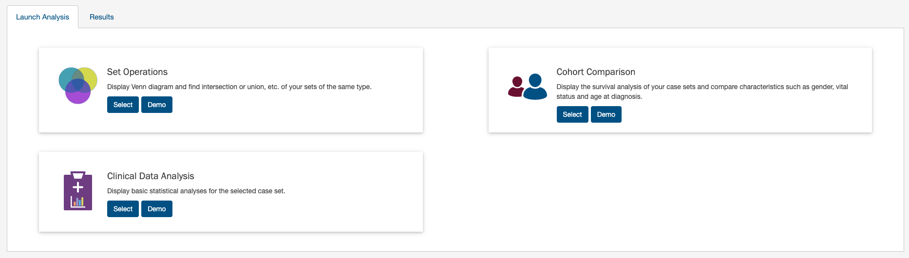
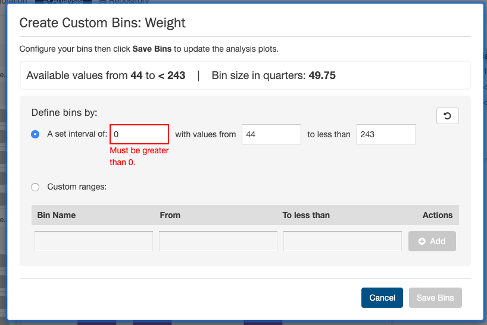

# Analysis

In addition to the [Exploration Page](Exploration.md), the GDC Data Portal also has features used to save and compare sets of cases, genes, and mutations. These sets can either be generated with existing filters (e.g. males with lung cancer) or through custom selection (e.g. a user-generated list of case IDs).

Note that saving a set only saves the type of entity included in the set. For example, a saved case set will not include filters that were applied to genes or mutations. Please be aware that your custom sets are deleted during each new GDC data release. You can export them and re-upload them in the "Manage Sets" link at the top right of the Portal.

## Generating a Cohort for Analysis

Cohort sets are completely customizable and can be generated for cases, genes, or mutations using the following methods:

__Apply Filters in Exploration:__ Sets can be assembled using the existing filters in the Exploration page.  They can be saved by choosing the "Save/Edit Case Set" button under the pie charts for case sets. This will prompt a decision to save as new case set. The same can be done for both gene and mutation filters, and can be applied and saved in the Genes and Mutations tab, respectively.

__Upload ID Set:__ This feature is available in the "Manage Sets" link at the top right of the Portal. Choose "Upload Set" and then select whether the set comprises cases, genes, or mutations. A set of IDs or UUIDs can then be uploaded in a text file or copied and pasted into the list of identifiers field along with a name identifying the set. Once the list of identifiers is uploaded, the IDs are validated and grouped according to whether or not the identifier matched an existing GDC ID.

### Upload Case Set

In the `Cases` filters panel, instead of supplying cases one-by-one, users can supply a list of cases.  Clicking on the `Upload Case Set` button will launch a dialog as shown below, where users can supply a list of cases or upload a comma-separated text file of cases.

After supplying a list of cases, a table below will appear which indicates whether the case was found.

Clicking on `Submit` will filter the results in the Exploration Page by those cases.

### Upload Gene Set

In the `Genes` filters panel, instead of supplying genes one-by-one, users can supply a list of genes.  Clicking on the `Upload Gene Set` button will launch a dialog as shown below, where users can supply a list of genes or upload a comma-separated text file of genes.

After supplying a list of genes, a table below will appear which indicates whether the gene was found.

Clicking on `Submit` will filter the results in the Exploration Page by those genes.

### Upload Mutation Set

In the `Mutations` filters panel, instead of supplying mutation id's one-by-one, users can supply a list of mutations.  Clicking on the `Upload Mutation Set` button will launch a dialog as shown below, where users can supply a list of mutations or upload a comma-separated text file of mutations.

After supplying a list of mutations, a table below will appear which indicates whether the mutation was found.

Clicking on `Submit` will filter the results in the Exploration Page by those mutations.

## Analysis Page
Clicking on the `Analysis` button in the top toolbar will launch the Analysis Page which displays the various options available for comparing saved sets.

There are three tabs on this page:

* __Launch Analysis__: Where users can select either to do `Set Operations`, `Cohort Comparison` or `Clinical Data Analysis`.
* __Results__: Where users can view the results of current or previous set analyses.

## Analysis Page: Set Operations

Up to three sets of the same set type can be compared and exported based on complex overlapping subsets. The features of this page include:

* __Venn Diagram:__ Visually displays the overlapping items included within the three sets. Subsets based on overlap can be selected by clicking one or many sections of the Venn diagram. As sections of the Venn Diagram become highlighted in blue, their corresponding row in the overlap table becomes highlighted.  

* __Summary Table:__ Displays the alias, item type, and name for each set included in this analysis.

* __Overlap Table:__ Displays the number of overlapping items with set operations rather than a visual diagram. Subsets can be selected by checking boxes in the "Select" column, which will highlight the corresponding section of the Venn Diagram. As rows are selected, the "Union of selected sets" row is populated. Each row has an option to save the subset as a new set,  export the set as a TSV, or view files in the repository. The links that correspond to the number of items in each row will open the cohort in the Exploration Page.  

## Analysis Tab: Cohort Comparison

The "Cohort Comparison" analysis displays a series of graphs and tables that demonstrate the similarities and differences between two case sets. The following features are displayed for each two sets:

* A key detailing the number of cases in each cohort and the color that represents each (blue/gold).

* A Venn diagram, which shows the overlap between the two cohorts.  The Venn diagram can be opened in a 'Set Operations' tab by choosing "Open Venn diagram in new tab".

* A selectable [survival plot](Exploration.md#survival-analysis) that compares both sets with information about the percentage of represented cases.

* A breakdown of each cohort by selectable clinical facets with a bar graph and table. Facets include `vital_status`, `gender`, `race`, `ethnicity`, and `age_at_diagnosis`.  A p-value (if it can be calculated from the data) that demonstrates whether the statuses are proportionally represented is displayed for the `vital_status`, `gender`, and `ethnicity` facets.  

## Analysis Tab: Clinical Data Analysis

The "Clinical Data Analysis" feature allows users to specifically examine the clinical data of a single case set in more detail.  Users can select which clinical fields they want to display and visualize the data using various supported plot types.  The clinical analysis features include:

* Ability to select which clinical fields to display
* Examine the clinical data of each field using these visualizations:
    * Histogram
    * Survival Plot
    * Box Plot
    * QQ Plot
* Create custom bins for each field and re-visualize the data with those bins
* Select specific cases from a clinical field and use them to create a new set, or modify/remove from an existing set
* Download the visualizations of each plot type for each variable in SVG, PNG, JSON formats
* Download the data table of each field in TSV format
* Print all clinical variable cards in the analysis with their active plot to a single PDF

### Selecting a Case Set

First, a case set must be selected to run the clinical analysis on:

Click __'Run'__ - The results page loads with a new tab for the new clinical analysis for the selected set:

### Enabling Clinical Variable Cards

Users can use the control panel on the left side of the analysis to display which clinical variables they want.  To enable or disable specific variables for display, click the on/off toggle controls:

The clinical fields are grouped into these categories:

* __Demographic:__ Data for the characterization of the patient by means of segmenting the population (e.g. characterization by age, sex, race, etc.).
* __Diagnoses:__ Data from the investigation, analysis, and recognition of the presence and nature of disease, condition, or injury from expressed signs and symptoms; also, the scientific determination of any kind; the concise results of such an investigation.
* __Treatments:__ Records of the administration and intention of therapeutic agents provided to a patient to alter the course of a pathologic process.
* __Exposures:__ Clinically-relevant patient information not immediately resulting from genetic predispositions.

Since the list of fields can be long, users can collapse and expand the field list for each clinical category for easier browsing, or use the search box:

### Exploring Clinical Card Visualizations

Users can explore different visualizations for each clinical field they have enabled for display. Each card supports theses plot types:

* Histogram
* Survival Plot
* Box Plot & QQ Plot (these plots are visualized side-by-side)

To switch between plot types, click the different plot type icons in the top-right of each card.

#### Histogram

The histogram plot type suppports these features:

* View the distribution of cases (# and % of cases) in the cohort for the clinical field's data categories as a histogram
* View the distribution of cases in tabular format
* Select the cases for specific data categories to create new sets, append to existing sets, or remove from existing sets
* Download the histogram visualization in SVG or PNG format
* Download the raw data used to generate the histogram in JSON format

Note that the histogram plot applies to, and can be displayed for, both categorical and continuous variables.

#### Survival Plot

The survival plot type supports these features:

* View the distribution of cases (# and % of cases) in the cohort for the clinical field's data categories as a table
* Select and plot the survival analysis for the cases of specific data categories in the table:
    * By default the top 2 categories (highest # of cases) are displayed
    * Users can manually select and plot up to 5 categories at a time
* Download the survival plot visualization in SVG or PNG format
* Download the raw data used to generate the survival plot in JSON or TSV format

Note that the survival plot applies to, and can be displayed for, both categorical and continuous variables.

#### Box Plot & QQ Plot

The box plot and QQ plot are displayed side-by-side in the same visualization.  This visualization supports these features:

* View standard summary statistics for the clinical field's data across the cohort as both a box plot visualization and a data table:
    * Minimum
    * Maximum
    * Mean
    * Median
    * Standard Deviation
    * Interquartile Range (IQR)
* View a QQ plot visualization to explore whether the clinical field's data across the cohort is normally distributed, where:
    * The clinical data values are plotted as the sample quantiles on the vertical axis
    * The the quantiles of the normal distribution are plotted on the horizontal axis
* Download the box plot and QQ plot visualizations in SVG or PNG format
* Download the raw data used to generate the QQ plot in JSON or TSV format

Note that the box plot and QQ plot only apply to continuous variables.  They cannot be displayed for categorical variables.

### Creating Custom Bins

For each clinical variable, whether categorical or continuous, users can create custom bins to group the data in ways they find scientifically interesting or significant.  Once saved, the bins are applied to these visualizations and they are then re-rendered:

* Histogram and associated data table
* Survival plot and associated data table

Custom bins can be reset to their defaults at any time for each card.  Note that custom bins are __saved per analysis__.

#### Categorical Binning

To create custom bins for a categorical variable, click *__Customize Bins__*, then *__Edit Bins__*.  A configuration window appears where the user can create their bins:

The user can:

* Group existing individual values into a single group
* Give a custom name to each group
* Ungroup previously grouped values
* Completely hide values from being shown in the visualization
* Re-show previously hidden values

#### Continuous Binning

To create custom bins for a continuous variable, click *__Customize Bins__*, then *__Edit Bins__*.  A configuration window appears where the user can create their bins:

The user can choose one of these continuous binning methods:

* (1) Create equi-distant bins based on a set interval:
    * User must choose the interval (e.g. equi-distant bins of 1,825 days for the Age of Diagnosis field)
    * User can optionally define the starting and ending value between which the equi-distant bins will be created
* (2) Create completely custom ranges:
    * User manually enters 1 or more bins with custom ranges
    * User must enter a name for each range and the start and end values
    * The ranges can be of different interval lengths

Before saving the bins, if there are errors in the configuration, the user will be notified to correct them and try saving again.  For example:

### Other Useful Functions

Clinical Analysis also provides these additional useful functions:

* Like other analysis types, all Clinical Analysis tabs are saved to the browser's local storage:
    * Each Analysis tab and its associated configurations (active cards, active plots, custom bins) is saved and is not deleted until local storage is cleared
    * The currently-enabled clinical cards and their currently-selected plot types are __saved per analysis__
    * Custom bins are __saved per analysis__
* Switch the current set that the analysis applies to - This does the following:
    * Applies all currently-enabled clinical cards and their currently-selected plot types to the data in the set being switched to
    * Re-renders all active visualizations to reflect the data in the set being switched to
* Rename your analysis with a custom name
* Copy your current analysis to a new analysis:
    * User is prompted to name the new copy
    * All currently-enabled clinical cards and their currently-selected plot types are copied to the new analysis
    * A new vertical tab appears on the left for the new copy
* Print the current analysis to PDF format:
    * All currently-enabled clinical cards and their currently-selected plot types are printed
    * 3 cards per page, with the fixed Overall Survival Plot displayed as the first card in the entire file

## Analysis Page: Results

The results of the previous analyses are displayed on this page.

Each tab at the left side of the page is labeled according to the analysis type and the date that the analysis was performed and can be reviewed as long as it is present. The "Delete All" button will remove all of the previous analyses.  
