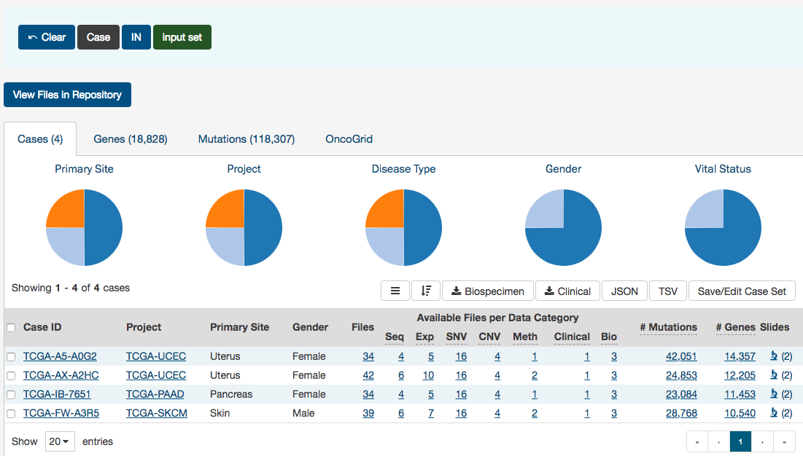

# Analysis

In addition to the [Exploration Page](Exploration.md), the GDC Data Portal also has features used to save and compare sets of cases, genes, and mutations. These sets can either be generated with existing filters (e.g. males with lung cancer) or through custom selection (e.g. a user-generated list of case IDs).

Note that saving a set only saves the type of entity included in the set. For example, a saved case set will not include filters that were applied to genes or mutations. Please be aware that your custom sets are deleted during each new GDC data release. You can export them and re-upload them in the "Manage Sets" link at the top right of the Portal.

## Generating a Cohort for Analysis

Cohort sets are completely customizable and can be generated for cases, genes, or mutations using the following methods:

__Apply Filters in Exploration:__ Sets can be assembled using the existing filters in the Exploration page.  They can be saved by choosing the "Save/Edit Case Set" button under the pie charts for case sets. This will prompt a decision to save as new case set. The same can be done for both gene and mutation filters, and can be applied and saved in the Genes and Mutations tab, respectively.

__Upload ID Set:__ This feature is available in the "Manage Sets" link at the top right of the Portal. Choose "Upload Set" and then select whether the set comprises cases, genes, or mutations. A set of IDs or UUIDs can then be uploaded in a text file or copied and pasted into the list of identifiers field along with a name identifying the set. Once the list of identifiers is uploaded, the IDs are validated and grouped according to whether or not the identifier matched an existing GDC ID.

### Upload Case Set

In the `Cases` filters panel, instead of supplying cases one-by-one, users can supply a list of cases.  Clicking on the `Upload Case Set` button will launch a dialog as shown below, where users can supply a list of cases or upload a comma-separated text file of cases.

After supplying a list of cases, a table below will appear which indicates whether the case was found.

Clicking on `Submit` will filter the results in the Exploration Page by those cases.

### Upload Gene Set

In the `Genes` filters panel, instead of supplying genes one-by-one, users can supply a list of genes.  Clicking on the `Upload Gene Set` button will launch a dialog as shown below, where users can supply a list of genes or upload a comma-separated text file of genes.

After supplying a list of genes, a table below will appear which indicates whether the gene was found.

Clicking on `Submit` will filter the results in the Exploration Page by those genes.

### Upload Mutation Set

In the `Mutations` filters panel, instead of supplying mutation id's one-by-one, users can supply a list of mutations.  Clicking on the `Upload Mutation Set` button will launch a dialog as shown below, where users can supply a list of mutations or upload a comma-separated text file of mutations.

After supplying a list of mutations, a table below will appear which indicates whether the mutation was found.

Clicking on `Submit` will filter the results in the Exploration Page by those mutations.

## Analysis Page
Clicking on the `Analysis` button in the top toolbar will launch the Analysis Page which displays the various options available for comparing saved sets.

There are two tabs on this page:

* __Launch Analysis__: Where users can select either to do `Set Operations` or `Cohort Comparison`.
* __Results__: Where users can view the results of current or previous set analyses.

## Analysis Page: Set Operations

Up to three sets of the same set type can be compared and exported based on complex overlapping subsets. The features of this page include:

* __Venn Diagram:__ Visually displays the overlapping items included within the three sets. Subsets based on overlap can be selected by clicking one or many sections of the Venn diagram. As sections of the Venn Diagram become highlighted in blue, their corresponding row in the overlap table becomes highlighted.  

* __Summary Table:__ Displays the alias, item type, and name for each set included in this analysis.

* __Overlap Table:__ Displays the number of overlapping items with set operations rather than a visual diagram. Subsets can be selected by checking boxes in the "Select" column, which will highlight the corresponding section of the Venn Diagram. As rows are selected, the "Union of selected sets" row is populated. Each row has an option to save the subset as a new set,  export the set as a TSV, or view files in the repository. The links that correspond to the number of items in each row will open the cohort in the Exploration Page.  

## Analysis Tab: Cohort Comparison

The "Cohort Comparison" analysis displays a series of graphs and tables that demonstrate the similarities and differences between two case sets. The following features are displayed for each two sets:

* A key detailing the number of cases in each cohort and the color that represents each (blue/gold).

* A Venn diagram, which shows the overlap between the two cohorts.  The Venn diagram can be opened in a 'Set Operations' tab by choosing "Open Venn diagram in new tab".

* A selectable [survival plot](Exploration.md#survival-analysis) that compares both sets with information about the percentage of represented cases.

* A breakdown of each cohort by selectable clinical facets with a bar graph and table. Facets include `vital_status`, `gender`, `race`, `ethnicity`, and `age_at_diagnosis`.  A p-value (if it can be calculated from the data) that demonstrates whether the statuses are proportionally represented is displayed for the `vital_status`, `gender`, and `ethnicity` facets.  

## Analysis Page: Results

The results of the previous analyses are displayed on this page.

Each tab at the left side of the page is labeled according to the analysis type and the date that the analysis was performed and can be reviewed as long as it is present. The "Delete All" button will remove all of the previous analyses.  
