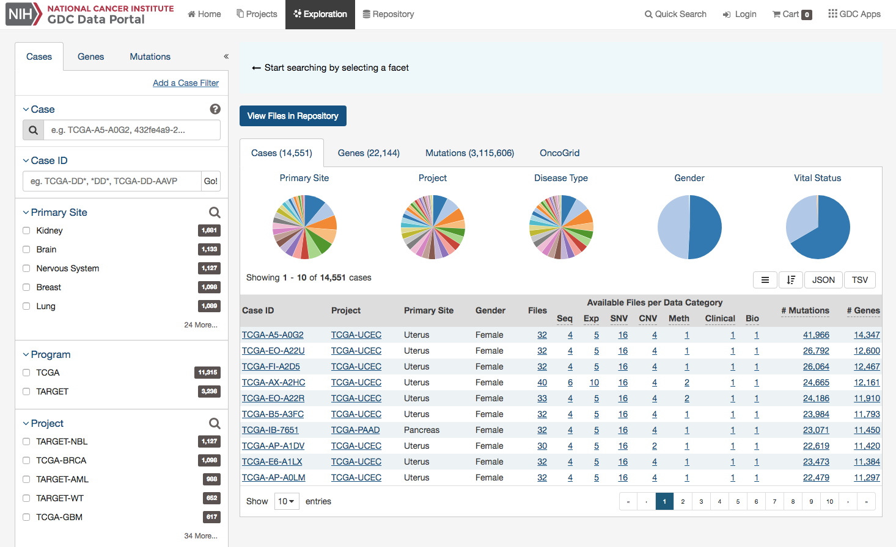

# Exploration

The Exploration page allows users to explore data in the GDC using advanced filters/facets, which includes those on a gene and mutation level.  Users choose filters on specific `Cases`, `Genes`, and/or `Mutations` on the left of this page and then can visualize these results on the right.

## Filters / Facets
On the left of this page, users can create advanced filters to narrow down results to create synthetic cohorts.

### Case Filters

The first tab of filters is for cases in the GDC.

These criteria limit the results only to specific cases within the GDC. The default filters available are:

* __Case__: Specify individual cases using submitter ID (barcode) or UUID.
* __Case Submitter ID__: Search for cases using a part (prefix) of the submitter ID (barcode).
* __Primary Site__: Anatomical site of the cancer under investigation or review.
* __Program__: A cancer research program, typically consisting of multiple focused projects.
* __Project__: A cancer research project, typically part of a larger cancer research program.
* __Disease Type__: Type of cancer studied.
* __Gender__: Gender of the patient.
* __Age at Diagnosis__: Patient age at the time of diagnosis.
* __Vital Status__: Indicator of whether the patient was living or deceased at the date of last contact.
* __Days to Death__: Number of days from date of diagnosis to death of the patient.
* __Race__: Race of the patient.
* __Ethnicity__: Ethnicity of the patient.

In addition to the defaults, users can add additional case filters by clicking on the link titled 'Add a Case Filter'

### Gene Filters

The second tab of filters are for specific genes.  Users can filter by:

* __Gene__ - Entering in a specific Gene Symbol or ID
* __Biotype__ - Classification of the type of gene
* __Is Cancer Gene Census__ - Whether or not a gene is part of [The Cancer Gene Census](http://cancer.sanger.ac.uk/census/)

### Mutation Filters

The final tab of filters is for specific mutations.  Users can filter by:

* __Mutation__ - Unique ID for that mutation.  Users can use the following:
    * UUID - c7c0aeaa-29ed-5a30-a9b6-395ba4133c63
    * DNA Change - 	chr12:g.121804752delC
    * COSMIC ID - COSM202522
* __Impact (VEP)__ - A subjective classification of the severity of the variant consequence. This information comes from the [Ensembl VEP](http://www.ensembl.org/info/genome/variation/predicted_data.html). The categories are:
    * __HIGH__: The variant is assumed to have high (disruptive) impact in the protein, probably causing protein truncation, loss of function, or triggering nonsense mediated decay
    * __MODERATE__: A non-disruptive variant that might change protein effectiveness
    * __LOW__: Assumed to be mostly harmless or unlikely to change protein behavior
    * __MODIFIER__: Usually non-coding variants or variants affecting non-coding genes, where predictions are difficult or there is no evidence of impact
* __Consequence Type__ - Consequence type of this variation; [sequence ontology](http://www.sequenceontology.org/) terms
* __Mutation Type__ - The type of mutation
* __Variant Caller__ - The variant caller used to identify the mutation
* __COSMIC ID__ - The identifier of the gene or mutation maintained in COSMIC, the Catalogue Of Somatic Mutations In Cancer
* __dbSNP rs ID__ - The reference SNP identifier maintained in dbSNP

## Results

As users add filters to the data on the Exploration Page, the Results section will automatically be updated.  Results are divided into different tabs:  `Cases`, `Genes`, `Mutations`, and `OncoGrid`.  

To illustrate these tabs, Case, Gene, and Mutation filters have been chosen ( Genes in the Cancer Gene Census, that have HIGH Impact for the TCGA-BRCA project) and a description of what each tab displays follows.

#### Cases

The `Cases` tab will give an overview of all the cases/patients who correspond to the filters chosen (Cohort).

The top of this section contains a few pie graphs with categorical information regarding the Primary Site, Project, Disease Type, Gender, and Vital Status.

Below these pie charts is a tabular view (which can be exported and sorted using the buttons on the right) of the cases affected, which includes the following information:

* __Case UUID:__ The UUID of the case/patient
* __Submitter ID:__ The submitter ID of that case/patient (i.e. TCGA Barcode)
* __Project:__ The study name for the project for which the case belongs
* __Primary Site:__ The primary site of the cancer/project
* __Gender:__ The gender of the case
* __Files:__ The total number of files available for that case
* __Available Files per Data Category:__ Five columns displaying the number of files available in each of the five data categories.  These link to the files for the specific case.
* __# Mutations:__ The number of SSMs (simple somatic mutations) detected in that case
* __# Genes:__ The number of genes detected in that case

#### Genes

The `Genes` tab will give an overview of all the genes that match the criteria of the filters (Cohort).

The top of this section contains a survival plot of all the cases within the specified Exploration page search, in addition to a bar graph of the most frequently mutated genes. Hovering over each bar in the plot will display information about the percentage of cases affected. Users may choose to download the underlying data in JSON or TSV format or an image of the graph in SVG or PNG format by clicking the `download` icon at the top of each graph.

Below these graphs is a tabular view of the genes affected, which includes the following information:

* __Symbol:__ The gene symbol, which links to the Gene Summary Page
* __Name:__ Full name of the gene
* __Cytoband:__ The location of the mutation on the chromosome in terms of Giemsa-stained samples.
* __Type:__ The type of gene
* __# Affected Cases in Cohort:__ The number of cases affected in the Cohort
* __# Affected Cases Across all Projects:__ The number of cases within all the projects in the GDC that contain a mutation on this gene.  Clicking the red arrow will display the cases broken down by project
* __# Mutations:__ The number of SSMs (simple somatic mutations) detected in that gene
* __Annotations:__ Includes a COSMIC symbol if the gene belongs to [The Cancer Gene Census](http://cancer.sanger.ac.uk/census/)
* __Survival Analysis:__ An icon that, when clicked, will plot the survival rate between cases in the project with mutated and non-mutated forms of the gene

#### Mutations

The `Mutations` tab will give an overview of all the mutations who match the criteria of the filters (Cohort).

At the top of this tab is a bar graph of the 20 most frequent somatic mutations in the cohort as a bar graph that indicates the percentage of cases that are affected by each mutation. Hovering over each bar in the plot will show information about the number of cases affected.  The top of this tab also includes a survival plot of all the cases within the specified exploration page filters.

A table is displayed below that lists information about each mutation:

* __Mutation ID:__ A UUID for the mutation assigned by the GDC, when clicked will bring a user to the Mutation Summary Page
* __DNA Change:__ The chromosome and starting coordinates of the mutation are displayed along with the nucleotide differences between the reference and tumor allele
* __Type:__ A general classification of the mutation
* __Consequences:__ The effects the mutation has on the gene coding for a protein (i.e. synonymous, missense, non-coding transcript).  A link to the Gene Summary Page for the gene affected by the mutation is included
* __# Affected Cases in Cohort:__ The number of affected cases in the Cohort
* __# Affected Cases in Across all Projects:__ The number of affected cases, expressed as number across all projects. Choosing the arrow next to the percentage will display a breakdown of each affected project
* __Impact:__ A subjective classification of the severity of the variant consequence. The categories are:
    * __HIGH__: The variant is assumed to have high (disruptive) impact in the protein, probably causing protein truncation, loss of function, or triggering nonsense mediated decay
    * __MODERATE__: A non-disruptive variant that might change protein effectiveness
    * __LOW__: Assumed to be mostly harmless or unlikely to change protein behavior
    * __MODIFIER__: Usually non-coding variants or variants affecting non-coding genes, where predictions are difficult or there is no evidence of impact
* __Survival Analysis:__ An icon that when clicked, will plot the survival rate between the gene's mutated and non-mutated cases

#### OncoGrid

The Exploration page includes an OncoGrid plot of the cases with the most mutations, for the top 50 mutated genes affected by high impact mutations. Genes displayed on the left of the grid (Y-axis) correspond to individual cases on the bottom of the grid (X-axis).  

The grid is color-coded with a legend at the top left which describes what type of mutation consequence is observed for each gene/case combination. Clinical information and the available data for each case are available at the bottom of the grid.

The right side of the grid displays additional information about the genes:

* __Gene Sets:__ Describes whether a gene is part of [The Cancer Gene Census](http://cancer.sanger.ac.uk/census/).  (The Cancer Gene Census is an ongoing effort to catalogue those genes for which mutations have been causally implicated in cancer)
* __GDC:__ Identifies all cases in the GDC affected with a mutation in this gene

### OncoGrid Options

To facilitate readability and comparisons, drag-and-drop can be used to reorder the gene rows.  Double clicking a row in the "# Cases Affected" bar at the right side of the graphic launches the respective Gene Summary Page page. Hovering over a cell will display information about the mutation such as its ID, affected case, and biological consequence. Clicking on the cell will bring the user to the respective Mutation Summary page.  

A tool bar at the top right of the graphic allows the user to export the data as a JSON object, PNG image, or SVG image.  Seven buttons are available in this toolbar:

* __Download:__ Users can choose to export the contents either to a static image file (PNG or SVG format) or the underlying data in JSON format
* __Reload Grid:__ Sets all OncoGrid rows, columns, and zoom levels back to their initial positions
* __Cluster Data:__ Clusters the rows and columns to place mutated genes with the same cases and cases with the same mutated genes together
* __Toggle Heatmap:__ The view can be toggled between cells representing mutation consequences or number of mutations in each gene
* __Toggle Gridlines:__ Turn the gridlines on and off
* __Toggle Crosshairs:__ Turns crosshairs on, so that users can zoom into specific sections of the OncoGrid
* __Fullscreen:__ Turns Fullscreen mode on/off
