# Sitemap

[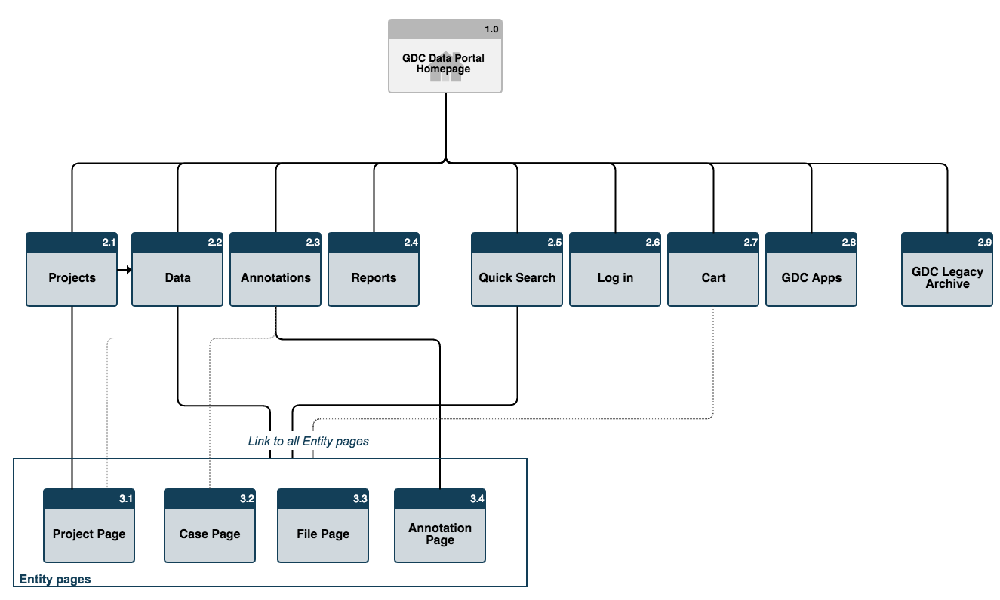](images/gdc-data-portal-sitemap.png "Click to see the full image.")

The portal is composed by 8 major sections available to the user through a toolbar on the upper level of the GDC Data Portal.

# Main Menu

## Left Section

[](images/gdc-data-portal-top-menu-bar-left.png "Click to see the full image.")

The left portion of this toolbar provides access to the following elements:

* __Projects__: High-level overview of all data
* __Data__: Search through all cases and files
* __Annotations__: Search through all annotations
* __Reports__: Reports about data available
* __Help__: A link to this user guide

Each _'Projects'_, _'Data'_, and _'Annotations'_ view enables the user to set filters from within the view to either browse the data or select it for export or download. It provides different and independent ways of organizing GDC data and metadata.   

## Right Section

[](images/gdc-data-portal-top-menu-bar-right.png "Click to see the full image.")

The right portion of this toolbar provides access to the following elements:

* __Quick Search__: Quickly search for more information about a specific entity
* __Login__: Log into the GDC Data Portal through eRA Commons
* __Cart__: Access to user populated cart mechanism

# Filtering and Searching

The GDC Data Portal provide three different means to search and navigate throughout available data:

* __Faceted Navigation__: By clicking on relevant items on the left portion of _'Projects'_ & _'Data'_ views, a user can filter down displayed elements
* __Advanced Search__: Provides access to advanced and complex queries using a purpose-built query language.
* __Quick Search__: Provide, from any place on the GDC Data Portal, a quick access to specific entities

## Faceted Navigation

Available on the left side of _'Projects'_ & _'Data'_ views, _'Faceted Navigation'_ enable filtering by selecting relevant data. Facets are attributes of the data that are being searched. Faceted Navigation filters the overall data set based on the set of Facets chosen.

_'Faceted Navigation'_ is composed by three elements:

* __Query facets__: used to select relevant data
* __Query Field__: showing filters currently being applied
* __Results__: showing filtered results corresponding to the query

[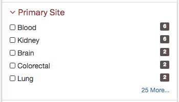](images/gdc-data-portal-primary-site-facet.png "Click to see the full image.")

__Note__: In facets, the end of each filter line contains a number. This number corresponds to the number of entities corresponding to this filter.

By clicking on an element, a filter is automatically applied. If the user clicks on multiple elements, an __OR__ filter will be applied and the query will be displayed at the top of the page.

The count (in grey cell) next to each Facet, indicates the number of results corresponding to the field.

[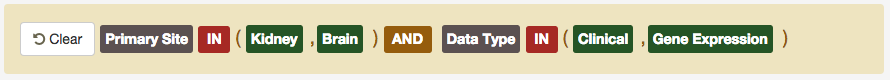](images/gdc-data-portal-facet-query.png "Click to see the full image.")

By clicking on a query term will automatically remove the corresponding filter.

The above query could be translated to:

```
Return all projects where primary site is Kidney OR Brain and containing Data Type Clinical OR Gene Expression
```

The resulting set is displayed below the query.

[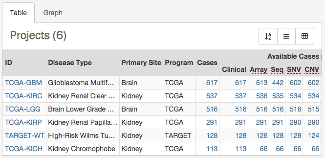](images/gdc-data-portal-faceted-navigation-resulting-set.png "Click to see the full image.")

## Advanced Search

Only available in the _'Data'_ view, the Advanced Search page offers complex query building capabilities to  identify specific set of cases and files.

[](images/gdc-data-portal-access-advanced-search-data-view.png "Click to see the full image.")

The [Advanced Search](Advanced_Search.md) section of the documentation provides more details about this feature.

## Quick Search

The GDC Data Portal is equipped with a Quick search feature available either by clicking on the magnifier in the right section of the toolbar or by pressing CTRL SPACE on a keyboard.

[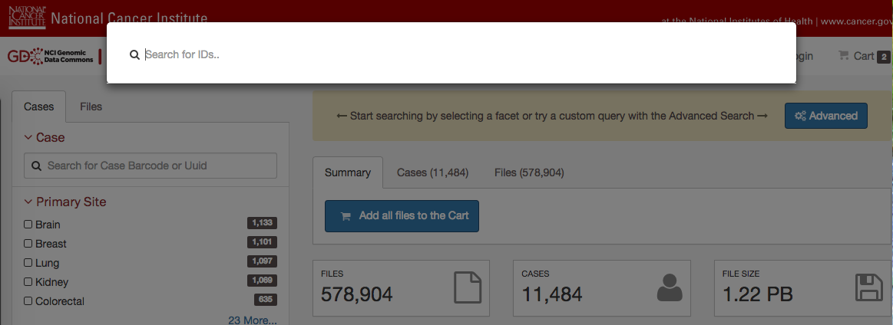](images/gdc-quick-search.png "Click to see the full image.")

Search results are automatically displayed while the user is typing.

[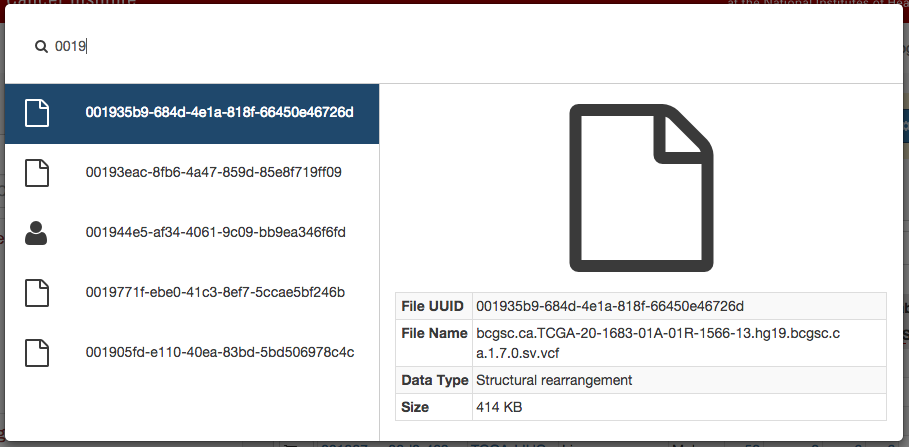](images/quick-search-entity-search.png "Click to see the full image.")

Pressing enter or clicking on the result will open the corresponding entity page.

# Tables

Most tables available throughout the GDC Data portal are equipped with export, sorting and filtering capabilities.

[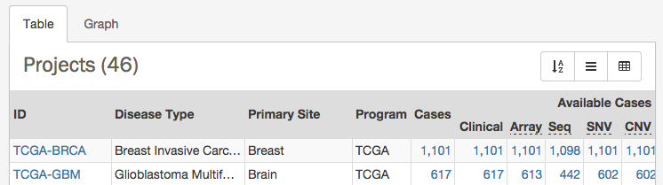](images/gdc-data-portal-table.png "Click to see the full image.")

## Sorting

Users can sort content by selecting the corresponding column to apply sorting to.

[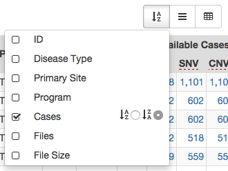](images/gdc-data-portal-table-sorting.png "Click to see the full image.")

In situations where multiple columns are selected for sorting, the system will take columns in order and progressively apply sorting.
If a column with unique values (such as ID) is selected as the first column for sorting, sorting will not be available for other columns selected (since sorting is first applied on unique values subsorting is not possible).

## Columns Filtering

Users can select which column they want to display and in which order, preferences will be maintained throughout user visits.

By default not all columns might be displayed in the table, this options provides access to advanced values.

[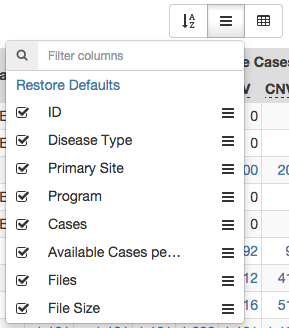](images/gdc-data-portal-table-column-filtering.png "Click to see the full image.")

## Exporting

Tables can be exported in four different formats:

* JSON
* XML
* CSV
* TSV

[](images/gdc-data-portal-table-export.png "Click to see the full image.")

# Pie Charts

Most Pie charts in the GDC Data Portal are interactive. Mousing over a slice of the pie chart display detailed about the slice. Users are also offered the option to switch to a table view for more details.

[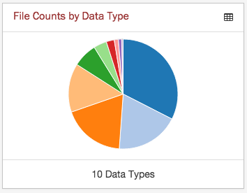](images/gdc-pie-chart-view.png "Click to see the full image.")

[](images/gdc-pie-chart-mouse-over.png "Click to see the full image.")

The pie chart can also be converted to a table by clicking on an small table icon available on the top right corner of the widget.

[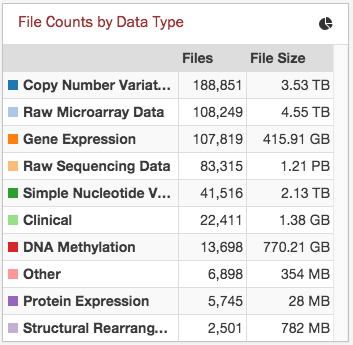](images/gdc-pie-chart-table.png "Click to see the full image.")
