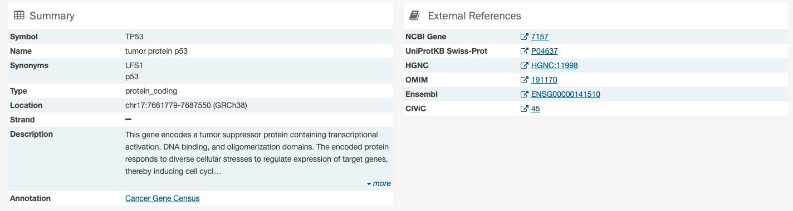

# Gene and Mutation Summary Pages

Many parts of the GDC website contain links to Gene and Mutation summary pages. These pages display information about specific genes and mutations, along with visualizations and data showcasing the relationship between themselves, the projects, and cases within the GDC. The gene and mutation data that is visualized on these pages are produced from the Open-Access MAF files available for download on the GDC Portal.

## Gene Summary Page

Gene Summary Pages describe each gene with mutation data and provides results related to the analyses that are performed on these genes.  

### Summary

The summary section of the gene page contains the following information:

* __Symbol:__ The gene symbol
* __Name:__ Full name of the gene
* __Synonyms:__ Synonyms of the gene name or symbol, if available
* __Type:__ A broad classification of the gene
* __Location:__ The chromosome on which the gene is located and its coordinates
* __Strand:__ If the gene is located on the forward (+) or reverse (-) strand
* __Description:__ A description of gene function and downstream consequences of gene alteration
- __Annotation:__ A notation/link that states whether the gene is part of [The Cancer Gene Census](http://cancer.sanger.ac.uk/census/)

### External References

A list with links that lead to external databases with additional information about each gene is displayed here. These external databases include: [Entrez](https://www.ncbi.nlm.nih.gov/gquery/), [Uniprot](http://www.uniprot.org/), [Hugo Gene Nomenclature Committee](http://www.genenames.org/), [Online Mendelian Inheritance in Man](https://www.omim.org/), [Ensembl](http://may2015.archive.ensembl.org/index.html), and [CIViC](https://civicdb.org/home).

### Cancer Distribution

A table and two bar graphs (one for mutations, one for CNV events) show how many cases are affected by mutations and CNV events within the gene as a ratio and percentage. Each row/bar represents the number of cases for each project.  The final column in the table lists the number of unique mutations observed on the gene for each project.

### Protein Viewer

Mutations and their frequency across cases are mapped to a graphical visualization of protein-coding regions with a lollipop plot. Pfam domains are highlighted along the x-axis to assign functionality to specific protein-coding regions. The bottom track represents a view of the full gene length. Different transcripts can be selected by using the drop-down menu above the plot.  

The panel to the right of the plot allows the plot to be filtered by mutation consequences or impact. The plot will dynamically change as filters are applied.  Mutation consequence and impact is denoted in the plot by color.

Note: The impact filter on this panel will not display the annotations for alternate transcripts.

The plot can be viewed at different zoom levels by clicking and dragging across the x-axis, clicking and dragging across the bottom track, or double clicking the pfam domain IDs. The `Reset` button can be used to bring the zoom level back to its original position. The plot can also be exported as a PNG image, SVG image or as JSON formatted text by choosing the `Download` button above the plot.

### Most Frequent Mutations

The 20 most frequent mutations in the gene are displayed as a bar graph that indicates the number of cases that share each mutation.  

A table is displayed below that lists information about each mutation including:

* __DNA Change:__ The chromosome and starting coordinates of the mutation are displayed along with the nucleotide differences between the reference and tumor allele
* __Type:__ A general classification of the mutation
* __Consequences:__ The effects the mutation has on the gene coding for a protein (i.e. synonymous, missense, non-coding transcript)
* __# Affected Cases in Gene:__ The number of affected cases, expressed as number across all mutations within the Gene
* __# Affected Cases Across GDC:__ The number of affected cases, expressed as number across all projects. Choosing the arrow next to the percentage will expand the selection with a breakdown of each affected project
* __Impact:__ A subjective classification of the severity of the variant consequence. This determined using [Ensembl VEP](http://www.ensembl.org/info/genome/variation/predicted_data.html), [PolyPhen](http://genetics.bwh.harvard.edu/pph/), and [SIFT](http://sift.jcvi.org/). The categories are outlined [here](https://docs.gdc.cancer.gov/Data/File_Formats/MAF_Format/#impact-categories).

*Note: The Mutation UUID can be displayed in this table by selecting it from the drop-down represented by three parallel lines*

Clicking the `Open in Exploration` button will navigate the user to the Exploration page, showing the same results in the table (mutations filtered by the gene).

## Mutation Summary Page

  The Mutation Summary Page contains information about one somatic mutation and how it affects the associated gene. Each mutation is identified by its chromosomal position and nucleotide-level change.

### Summary

  

  - __ID:__ A unique identifier (UUID) for this mutation
  - __DNA Change:__ Denotes the chromosome number, position, and nucleotide change of the mutation
  - __Type:__ A broad categorization of the mutation
  - __Reference Genome Assembly:__ The reference genome in which the chromosomal position refers to
  - __Allele in the Reference Assembly:__ The nucleotide(s) that compose the site in the reference assembly
  - __Functional Impact:__ A subjective classification of the severity of the variant consequence.

#### External References

  A separate panel contains links to databases that contain information about the specific mutation. These include [dbSNP](https://www.ncbi.nlm.nih.gov/projects/SNP/), [COSMIC](http://cancer.sanger.ac.uk/cosmic), and [CIViC](https://civicdb.org/home).

### Consequences

The consequences of the mutation are displayed in a table.  The set of consequence terms, defined by the [Sequence Ontology](http://www.sequenceontology.org).

  

The fields that describe each consequence are listed below:

  * __Gene:__ The symbol for the affected gene
  * __AA Change:__ Details on the amino acid change, including compounds and position, if applicable
  * __Consequence:__ The biological consequence of each mutation
  * __Coding DNA Change:__ The specific nucleotide change and position of the mutation within the gene
  * __Strand:__ If the gene is located on the forward (+) or reverse (-) strand
  * __Transcript(s):__ The transcript(s) affected by the mutation. Each contains a link to the [Ensembl](https://www.ensembl.org) entry for the transcript   

### Cancer Distribution

A table and bar graph shows how many cases are affected by the particular mutation. Each row/bar represents the number of cases for each project.

  

The table contains the following fields:

  * __Project ID__: The ID for a specific project
  * __Disease Type__: The disease associated with the project
  * __Site__: The anatomical site affected by the disease
  * __# Affected Cases__: The number of affected cases and total number of cases displayed as a fraction and percentage

### Protein Viewer

  

  The protein viewer displays a plot representing the position of mutations along the polypeptide chain. The y-axis represents the number of cases that exhibit each mutation, whereas the x-axis represents the polypeptide chain sequence. [Pfam domains](http://pfam.xfam.org/) that were identified along the polypeptide chain are identified with colored rectangles labeled with pfam IDs. See the Gene Summary Page for additional details about the protein viewer.

  The panel to the right of the plot allows the plot to be filtered by mutation consequences or impact.  The plot will dynamically change as filters are applied.  Mutation consequence and impact is denoted in the plot by color.

  Note: The impact filter on this panel will not display the annotations for alternate transcripts.

  The plot can be viewed at different zoom levels by clicking and dragging across the x-axis, clicking and dragging across the bottom track, or double clicking the pfam domain IDs. The `Reset` button can be used to bring the zoom level back to its original position. The plot can also be exported as a PNG image, SVG image or as JSON formatted text by choosing the `Download` button above the plot.
