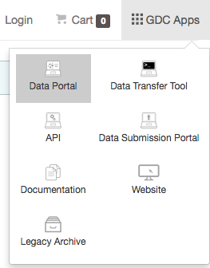

# Getting Started

## The GDC Data Portal: An Overview

The Genomic Data Commons (GDC) Data Portal provides users with web-based access to data from cancer genomics studies. Key GDC Data Portal features include:

*   Open, granular access to information about all datasets available in the GDC
*   Advanced search and visualization-assisted filtering of data files
*   Cart for collecting data files of interest
*   Authentication using eRA Commons credentials for access to controlled data files
*   Secure data download directly from the cart or using the [GDC Data Transfer Tool](https://gdc.cancer.gov/access-data/gdc-data-transfer-tool)

For more information about available datasets, see the [GDC Website](https://gdc.cancer.gov/about-data).

## Accessing the GDC Data Portal

The GDC Data Portal is accessible using a web browser such as Chrome, Internet Explorer, and Firefox at the following URL:

[https://gdc-portal.nci.nih.gov](https://gdc-portal.nci.nih.gov)

The front page displays an overview of all available datasets:

## Navigation

### Views

The GDC Data Portal provides three sections (*Views*) for browsing available harmonized datasets:

* __Projects View__: Project-level information
* __Data View__: Access to granular clinical and biospecimen metadata and experimental data files
* __Annotations View__: Browse annotations attached to data

Each view provides a distinct representation of the same underlying set of GDC data and metadata. The GDC also provides access to certain unharmonized data files generated by GDC-hosted projects. These files and their associated metadata are not represented in the views above; instead they can be found in the __GDC Legacy Archive__.

Projects and Data views can be accessed from the GDC Data Portal front page and from the toolbar (see below). Annotations view is accessible from [Data view](Data_View.md). A link to the GDC Legacy Archive is available in the GDC Apps menu (see below).

### Toolbar

The toolbar available at the top of all pages in the GDC Data Portal provides convenient navigation links and access to authentication and quick search.

The left portion of this toolbar provides access to the front page, the Project and Data views, and a link to data analysis resources:

The right portion of this toolbar provides access to [quick search](#quick-search), [authentication functions](Authentication.md), the [cart](Cart.md), and the GDC Apps menu:

The GDC Apps menu provides links to all resources provided by the GDC, including the [GDC Legacy Archive](Legacy_Archive.md).

### Tabular Listings

Tabular listings are the primary method of representing available data in the GDC Data Portal. Tables are available in all views and in the file cart. Users can customize each table by specifying columns, size, and sorting.

The *sort table* button is available in the top right corner of each table. To sort by a column, place a checkmark next to it and select the preferred sort direction. If multiple columns columns are selected for sorting, data is sorted column-by-column in the order that columns appear in the sort menu: the topmost selected column becomes the primary sorting parameter; the selected column below it is used for secondary sort, etc.

The *arrange columns* button allows users to adjust the order of columns in the table and select which columns are displayed.

Table size can be adjusted using the menu in the bottom left corner of the table. The menu sets the maximum number of rows to display. If the number of entries to be displayed exceeds the maximum number of rows, then the table will be paginated, and navigation buttons will be provided in the bottom right corner of the table to navigate between pages.

### Filtering and Searching

The GDC Data Portal offers three different means of searching and filtering the available data: facet filters, quick search, and advanced search.

#### Facet Filters

Facets on the left of each view (Projects, Data, and Annotations) allow users to apply filters based on various properties of the data, such as project name, disease, patient gender and age at diagnosis, and various data formats and categories. Each facet displays the name of the data property, the available values, and numbers of matching entities for each value (files, cases, annotations, or projects, depending on the context).

Below are two file facets available in the Data view. A _Data Type_ facet filter is applied, filtering for "Aligned Reads" files.

Note that information displayed in each facet takes into account filters applied in other facets, and disregards filters applied in the same facet. In the example below, marking the "Aligned Reads" checkbox does not change the numbers or the available values in the _Data Type_ facet where the checkbox is found, but it does change the values available in the _Experimental Strategy_ facet below. The _Experimental Strategy_ facet now displays only values from files of _Data Type_ "Aligned Reads". This allows the user to filter for multiple values in each facet by checking multiple boxes. For example, selecting "Aligned Reads" and "Copy Number Segment" in the _Data Type_ facet would filter for files that have either one of these values.

Custom facet filters can be added in Data View to expand the GDC Data Portal's filtering capabilities. See [Data View](Data_View.md) for more details.

#### Quick Search

The quick search feature allows users to find records and files using UUID, filename, or project name, id, disease type or primary site. Quick search is available by clicking on the magnifier in the right section of the toolbar.

Search results are displayed as the user is typing, with icons indicating the type of each search result in the list (project, case, or file). Users can get a brief description each search result by mousing over it or selecting it using keyboard arrow keys. Clicking on a selected result or pressing enter will open a detail page with additional information.

#### Advanced Search

Advanced search expands on the filtering capabilities of [facet filters](#facet-filters). It allows users to construct complex queries using a custom query language and auto-complete suggestions. See [Advanced Search](Advanced_Search.md) for details.
