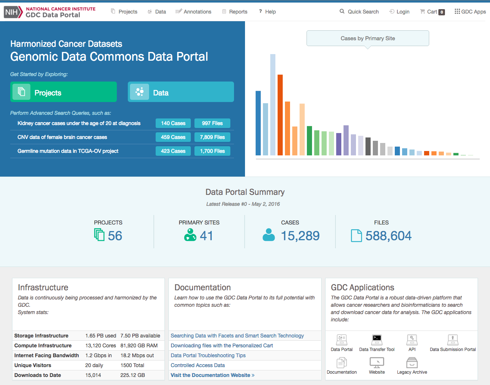

# Getting Started

## The Genomic Data Commons (GDC) Data Portal: An Overview

The National Cancer Institute (NCI) Genomic Data Commons (GDC) Data Portal User's Guide is the companion documentation to the [GDC Data Portal](https://gdc-portal.nci.nih.gov/). The GDC User's Guide provides detailed information and instructions for using the GDC Data Portal.

The GDC Data Portal is a robust data-driven platform that allows users to search and download cancer data sets for analysis using modern web technologies. Key GDC Data Portal features include:

*   Data browsing by project, file, case, or annotation
*   Visualization allowing users to perform fine-grained filtering of search results
*   Data search using advanced smart search technology
*   Data selection into a personalized cart
*   Data download directly from the cart or from GDC Data Transfer Tool using a manifest

Additional descriptions of key GDC Data Portal features are provided in the section that follows.

## Accessing the GDC Data Portal

The GDC Data Portal is accessible using a web browser such as Chrome, Internet Explorer, and Firefox at the following URL: [https://gdc-portal.nci.nih.gov](https://gdc-portal.nci.nih.gov).
When navigating to the site, the GDC Data Portal homepage is displayed.

The GDC Data Portal allows download of open access data without requiring a user login. To retrieve controlled access data, users must have access to the controlled access data set through dbGaP and use the [Login](../../Commons/Authentication.md) functionality on the top-right corner of the screen.

## Key Features

### Data Browsing

By browsing through the GDC Data Portal, users can obtain details about specific aspects of the data, such as the associated project, files, cases and annotations (explanatory comments about the data). For example, from a project page a user can view files or cases within the project. While users are browsing through the Data Portal, they can progressively add more elements to a cart for data download.

### Visualization

The GDC Data Portal allows researchers to identify data they are looking for and narrow their search using multiple visualization mechanisms such as tables, charts, and plots. Whenever possible, cross-references are enabled so that users can dive into the data directly from a plot.

### Data Searching

GDC Data Portal contains two primary mechanisms for searching data: 1) searching using filters (also called Facets) or 2) searching via advanced search technology and the advanced query language. When a user clicks on a Facet, the GDC smart search is automatically populated to help users get familiar with the advanced query language. At any time, when a need for a more specific query arises, users can switch to smart search and update their query with more specific filters.

### Cart Facilities for Data Selection

While navigating and searching through the GDC Data Portal, researchers can add files to their cart. The cart provides some statistics about the files it contains to inform the user about the overall number and size of files the user will download through the cart.

### Data Download

The GDC Data Portal provides two primary channels to allow users to download data from a cart:

1) Download directly from the browser (Cart Download) or

2) Download using the [GDC Data Transfer Tool](https://gdc.nci.nih.gov/access-data/gdc-data-transfer-tool). The GDC Data Portal generates a manifest based on all the files selected in the Cart. This manifest can then be easily imported into the GDC Data Transfer Tool to execute the download. Note that users can download all files that are under the GDC open access policy as well as any controlled access files that they have authorization for through dbGaP. Please visit [Obtaining Access to GDC Controlled Data](https://gdc.nci.nih.gov/node/8035/) for information on how to obtain authorization to access controlled data sets through dbGaP.

### BAM Slicing

The GDC Data Portal allows BAM slicing. Users can submit their slicing request in [BED](https://genome.ucsc.edu/FAQ/FAQformat.html#format1) format and download only the requested slice of a BAM file.

## Release Notes

The GDC Data Portal is regularly being updated with new features. The [Release Notes](../../Data_Portal/Release_Notes/Data_Portal_Release_Notes.md) sections of the documentation contains details about new features, bug fixes and known issues.
