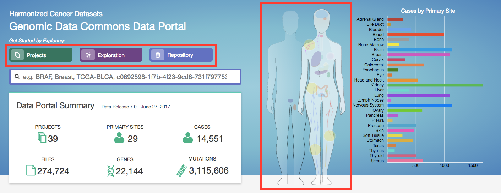
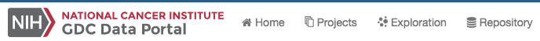
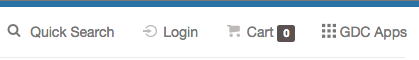
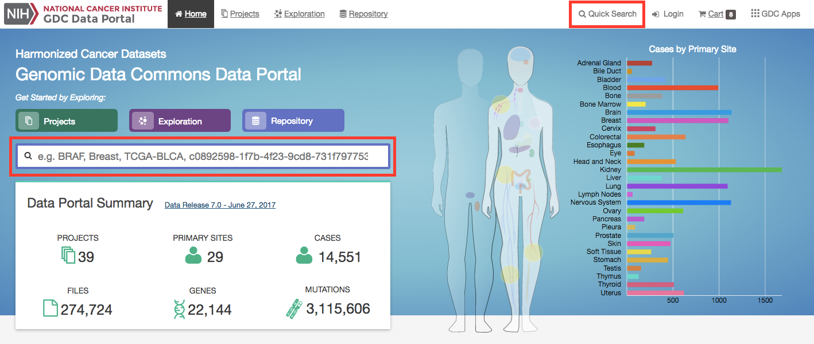

# Getting Started

## The GDC Data Portal: An Overview

The Genomic Data Commons (GDC) Data Portal provides users with web-based access to data from cancer genomics studies. Key GDC Data Portal features include:

*   Open, granular access to information about all datasets available in the GDC.
*   Advanced search and visualization-assisted filtering of data files.
*   Data visualization tools to support the analysis and exploration of data (including on a gene and mutation level from Open-Access MAF files).
*   Cart for collecting data files of interest.
*   Authentication using eRA Commons credentials and auathorization using dbGaP for access to controlled data files.
*   Secure data download directly from the cart or using the [GDC Data Transfer Tool](https://gdc.cancer.gov/access-data/gdc-data-transfer-tool).

For more information about available datasets, see the [GDC Website](https://gdc.cancer.gov/about-data).

## Accessing the GDC Data Portal

The GDC Data Portal is accessible using a web browser such as Chrome, Firefox, and Microsoft Edge at the following URL:

[https://portal.gdc.cancer.gov](https://portal.gdc.cancer.gov)

The front page displays a summary of all available datasets:

## Views

The GDC Data Portal provides five navigation options (*Views*) for browsing available harmonized datasets:

* __Projects__: The Projects link directs users to the [Projects Page](Projects.md), which gives an overall summary of project-level information, including the available data for each project.

* __Exploration__: The Exploration link takes users to the [Exploration Page](Exploration.md), which allows users to explore data by utilizing various case, genes and mutation filters.

* __Analysis__: The Analysis link directs users to the [Analysis Page](Custom_Set_Analysis.md).  This page has features available for users to compare different cohorts or analyze the clinical variables of a specific cohort.  These cohorts can either be generated with existing filters (e.g. males with lung cancer) or through custom selection.

* __Repository__: The Repository link directs users to the [Repository Page](Repository.md).  Here users can see the data files available for download at the GDC and apply file/case filters to narrow down their search.

* __Human Outline__: The home page displays a human anatomical outline that can be used to refine their search. Choosing an associated organ will direct the user to a listing of all projects associated with that primary site. For example, clicking on the human brain will show only cases and projects associated with brain cancer (TCGA-GBM and TCGA-LGG).  The number of cases associated with each primary site is also displayed here and separated by project.

Each view provides a distinct representation of the same underlying set of GDC data and metadata. The GDC also provides access to certain unharmonized data files generated by GDC-hosted projects. These files and their associated metadata are not represented in the views above; instead they can be found in the [GDC Legacy Archive](Legacy_Archive.md).

The Projects, Exploration, Analysis and Repository pages can be accessed from the GDC Data Portal front page and from the toolbar (see below). The annotations view is accessible from Repository view. A link to the GDC Legacy Archive is available on the GDC Data Portal front page and in the GDC Apps menu (see below).

## Toolbar

The toolbar available at the top of all pages in the GDC Data Portal provides convenient navigation links and access to authentication and quick search.

The left portion of this toolbar provides access to the __Home Page__, __Projects Page__, __Exploration Page__, __Analysis Page__, and a link to __Repository Page__:

The right portion of this toolbar provides access to [quick search](#quick-search), [manage sets](#manage-sets), [authentication functions](Repository.md#authentication), the [cart](Cart.md), and the GDC Apps menu:

The GDC Apps menu provides links to all resources provided by the GDC, including the [GDC Legacy Archive](Legacy_Archive.md).

## Tables

Tabular listings are the primary method of representing available data in the GDC Data Portal. Tables are available in all views and in the file cart. Users can customize each table by specifying columns, size, and sorting.

### Table Sort

The sort button is available in the top right corner of each table. To sort by a column, place a checkmark next to it and select the preferred sort direction. If multiple columns are selected for sorting, data is sorted column-by-column in the order that the columns appear in the sort menu: the topmost selected column becomes the primary sorting parameter; the selected column below it is used for secondary sort, etc.

### Table Arrangement

The arrange button allows users to adjust the order of columns in the table and select which columns are displayed.

### Table Size

Table size can be adjusted using the menu in the bottom left corner of the table. The menu sets the maximum number of rows to display. If the number of entries to be displayed exceeds the maximum number of rows, then the table will be paginated, and navigation buttons will be provided in the bottom right corner of the table to navigate between pages.

### Table Export

In the Repository, Projects, and Annotations views, tables can be exported in either a JSON or TSV format. The `JSON` button will export the entire table's contents into a JSON file.  The `TSV` button will export the current view of the table into a TSV file.

## Filtering and Searching

The GDC Data Portal offers three different means of searching and filtering the available data: facet filters, quick search, and advanced search.

### Facet Filters

Facets on the left of each view (Projects, Exploration, and Repository) represent properties of the data that can be used for filtering. Some of the available facets are project name, disease type, patient gender and age at diagnosis, and various data formats and categories. Each facet displays the name of the data property, the available values, and numbers of matching entities for each value (files, cases, mutations, genes, annotations, or projects, depending on the context).

Below are two file facets available in the Repository view. A _Data Type_ facet filter is applied, filtering for "Aligned Reads" files.

Multiple selections within a facet are treated as an "OR" query: e.g. "Aligned Reads" OR "Annotated Somatic Mutation". Selections in different facets are treated as "AND" queries: e.g. Data Type: "Aligned Reads" AND Experimental Strategy: "RNA-Seq".

The information displayed in each facet reflects this: in the example above, marking the "Aligned Reads" checkbox does not change the numbers or the available values in the _Data Type_ facet where the checkbox is found, but it does change the values available in the _Experimental Strategy_ facet. The _Experimental Strategy_ facet now displays only values from files of _Data Type_ "Aligned Reads".

Custom facet filters can be added in the [Repository View](Repository.md) to expand the GDC Data Portal's filtering capabilities.

### Quick Search

The quick search feature allows users to find cases, files, mutations, or genes using a search query (i.e. UUID, filename, gene name, DNA Change, project name, id, disease type or primary site). Quick search is available by clicking on the magnifier in the right section of the toolbar (which appears on every page) or by using the search bar on the Home Page.

Search results are displayed as the user is typing, with labels indicating the type of each search result in the list (project, case, or file). Users will see a brief description of the search results, which may include the UUID, submitter ID, or file name. Clicking on a selected result or pressing enter will open a detail page with additional information.

__Home Page Quick Search:__

__Toolbar Quick Search:__

### Advanced Search

Advanced Search is available in Repository View. It allows users to construct complex queries with a custom query language and auto-complete suggestions. See [Advanced Search](Advanced_Search.md) for details.

## Manage Sets
The `Manage Sets` button at the top of the GDC Portal stores sets of cases, genes, or mutations of interest.  On this page, users can review the sets that have been saved as well as upload new sets and delete existing sets.

### Upload Sets

Clicking the `Upload Set` button shows options for creating Case, Gene, or Mutation sets.  

Upon clicking one of the menu items, users are shown a dialog where they can enter unique identifiers (i.e. UUIDs, TCGA Barcodes, gene symbols, mutation UUIDs, etc.) that describe the set.

Clicking the `Submit` button will add the set of items to the list of sets on the Manage Sets page.

### Export Sets

Users can export selected sets on this page by first clicking the checkboxes next to each set, then clicking the `Export selected` button at the top of the table.

A text file containing the UUID of each case, gene or mutation is downloaded after clicking this button.

### Review Sets

There are a few buttons in the list of sets that allows a user to get further information about each one.

* __# Items__: Clicking the link under the # Items column navigates the user to the Exploration page using the set as a filter.

* __Download/View__: To the right of the # Items column are buttons that will download the list as a TSV or open the cases in the Repository Page.

### Creating Sets from GDC Portal Filters
Many pages on the GDC Portal have an option called `Save Sets` that allows users to save a group of cases, mutations, or genes for further analysis.  After using the filtering options on the `Exploration` Page as an example, users can click the `Save Case/Gene/Mutation Set` button to save this set.

