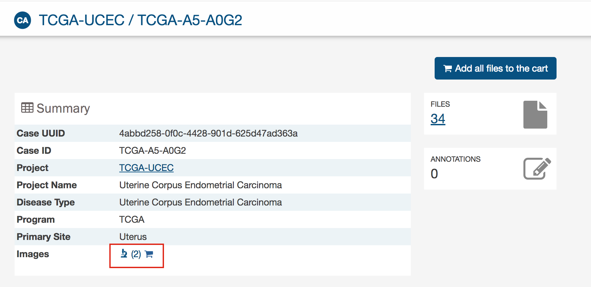
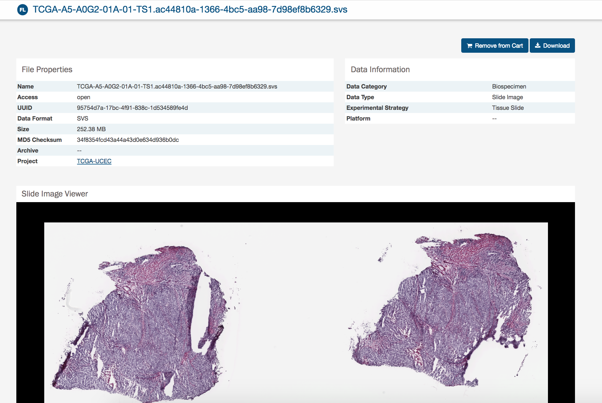

# Image Viewer

The Image viewer allows users to visualize tissue slide images.

## How to access the image viewer

The image viewer is available from:
* __Case entity page__: Click on the image viewer icon in the Case summary section or in the Biospecimen section - Slides detail. It will display in the image viewer the tissue slide images attached to the Case.

 
 

* __Case table in Exploration and Repository pages__: Click on the image viewer icon in the Case table. It will display in the image viewer all the tissue slide images attached to the Case.

 

* __Repository page - main search__: After selecting your query, click on "View images" in Repository. It will display the tissue slide images of all the cases resulting from the query.

* __Directly in the File entity page__: You can visualize the tissue slide image directly in the file entity page.

## Image viewer features
In the image viewer, you can:
* Zoom in and zoom out by clicking on + and - icons
* Reset to default display by clicking on the Home icon
* Display the image in full screen mode by clicking on the Expand icon
* View the slide detail by clicking on "Details" button
* Selecting the area of interest with the thumbnail at the top-right corner

## Example of navigation to the image viewer

1. Go to Repository - Case facet and click on Add a Case/Biospecimen filter
2. In the search box of the filter pop-up, look to percent_tumor_cells and add this filter to the Repository
3. Enter a percentage between 60% and 80% then click on Go!
4. Click on "View Images" button

__Result__: The images displayed on the image viewer are filtered based on your query.

