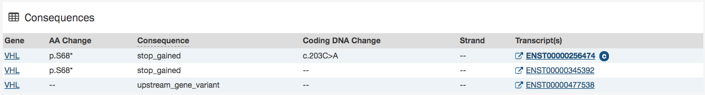
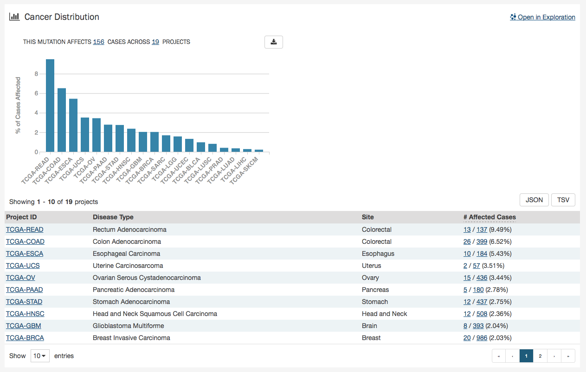
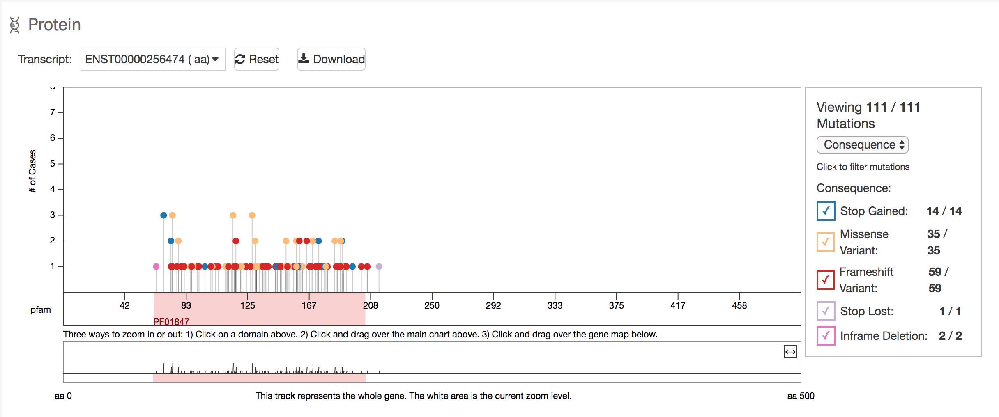

# Mutation Summary Page

The Mutation Summary Page contains information about one somatic mutation and how it affects the associated gene. Each mutation is identified by its chromosomal position and nucleotide-level change.

## Summary

- __ID:__ A unique identifier (UUID) for this mutation
- __DNA Change:__ Denotes the chromosome number, position, and nucleotide change of the mutation
- __Type:__ A broad categorization of the mutation
- __Reference Genome Assembly:__ The reference genome in which the chromosomal position refers to
- __Allele in the Reference Assembly:__ The nucleotide(s) that compose the site in the reference assembly
- __Functional Impact:__ A subjective classification of the severity of the variant consequence. The categories are:
  - __HIGH__: The variant is assumed to have high (disruptive) impact in the protein, probably causing protein truncation, loss of function or triggering nonsense mediated decay
  - __MODERATE__: A non-disruptive variant that might change protein effectiveness
  - __LOW__: Assumed to be mostly harmless or unlikely to change protein behavior

### External References

A separate panel contains links to databases that contain information about the specific mutation. These include [dbSNP](https://www.ncbi.nlm.nih.gov/projects/SNP/), [COSMIC](http://cancer.sanger.ac.uk/cosmic), and [CIViC](https://civicdb.org/home).

## Consequences

The consequences of the mutation are displayed in a table. The fields that detail each mutation are listed below:

* __Gene:__ The symbol for the affected gene
* __AA Change:__ Details on the amino acid change, including compounds and position, if applicable
* __Consequence:__ The biological consequence of each mutation
* __Coding DNA Change:__ The specific nucleotide change and position of the mutation within the gene
* __Strand:__ If the gene is located on the forward (+) or reverse (-) strand
* __Transcript(s):__ The transcript(s) affected by the mutation. Each contains a link to the [Ensembl](https://www.ensembl.org) entry for the transcript   

## Cancer Distribution

The Cancer Distribution table contains information about how the mutation affects each project, which can be exported as a JSON object. The table contains the following fields:

* __Project ID__: The ID for a specific project
* __Disease Type__: The disease associated with the project
* __Site__: The anatomical site affected by the disease
* __# Affected Cases__: The number of affected cases and total number of cases displayed as a fraction and percentage

## Protein Viewer

The protein viewer displays a plot representing the position of mutations along the polypeptide chain associated with the mutation. The y-axis represents the number of cases that exhibit each mutation, whereas the x-axis represents the polypeptide chain sequence. [Pfam domains](http://pfam.xfam.org/) that were identified along the polypeptide chain are identified with colored rectangles labeled with pfam IDs. See the Gene Summary Page for additional details about the protein viewer.
