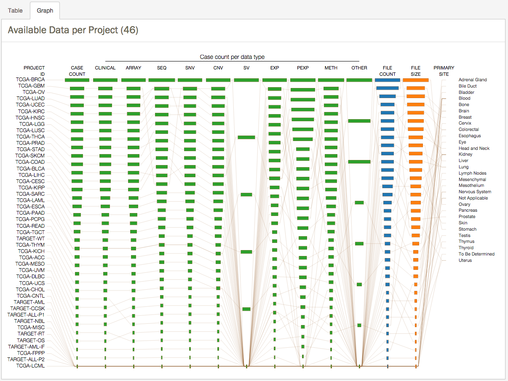
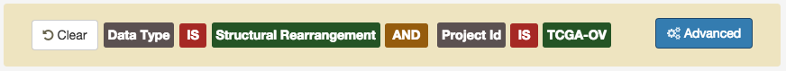

# Projects

## Overview

The Projects view provides an overview of all the data contained in the GDC Data Portal, organized by Project. Administratively, a _'Project'_ is a specific effort undertaken as part of an overarching Program. Many projects were set up to study one tumor type, so project names and disease names can often be the same, as is the case for TCGA data, but this is not always the case.

## Projects Search

### Overview

When accessing the Projects view, the initial screen will display a table summarizing the information about the cases (i.e. sample donors) and data types for which data is available for each project. This table displays for each project, the number of cases, number of files of each data type contained in the GDC for that project, and total file size of all the files in the project. With no Facets selected, this view includes all GDC Data Portal data.

This view focuses on the number of cases available at GDC within each program and project. Each case will have multiple types of data associated with it. Selections in the facets allows filtering of the number of cases in each project to those that have associated data files relevant to any of the selected data types or selected experimental strategies.

Clicking on any cell in the Project View Table will display filtered results in the "Data" view described in this documentation.

### Available Facets

As mentioned previously in this documentation, the projects view offer the ability to filter results using facets. The following facets are available in the projects page:

*   __Project__: Projects are described above.
*   __Primary Site__: Originating or primary anatomic site of the cancer under investigation or review.
*   __Cancer Program__: Programs are overarching activities meant to fulfill a broad scientific objective.  As mentioned above, Projects fulfill more specific requirements within a Program.
*   __Disease Type__: type of cancer studied in the project.
*   __Data Category__: Kind of data contained in the file. Note that each of these data types may have subtypes, and that the numbers given in the table reflect the numbers of latest files for all subtypes of that data type.  Data Subtypes can be explored in Facets contained in the "Files" tab in the "Data" view described below.

    *   _Seq_ – Raw Sequencing Data
    *   _Exp_ – Raw Microarray Data   
    *   _SNV_ – Single Nucleotide Variation
    *   _CNV_ – Copy Number Variation
    *   _SV_ – Structural Rearrangement
    *   _Meth_ – Methylation
    *   _Clinical_ – Clinical Data about the case, as well as Biospecimen data about the sample and aliquots     
    *   _Biospecimen_ – Clinical Data about the case, as well as Biospecimen data about the sample and aliquots
*   __Experimental Strategy__: This describes NGS sequencing strategies or microarray technological platforms/array types and other experimental assays.

### Graph View

Clicking the _'Graph'_ tab will display an interactive view of the data currently being displayed according to selected filters. The top number in each column representing the highest count of that type.

When a user mouse-over an element of the graph, the whole line corresponding to the project is automatically highlighted

This graph has been configured to be clickable, on the above example, clicking on the 'SV' element will automatically redirect the user to the Data view with the following filter applied:

## Project Entity Page

Each project has its own entity page aimed at providing an overview of all cases, files and annotations available for the selected project.

Clicking on various numbers will link to the corresponding search page (data or annotations) with filters already applied.

For example, if the cases link in the ‘Clinical’ row in the ‘Available Data’ Table is chosen, the user will see a case view with the appropriate filters already applied.

On the top right section of the screen, two download options are available:

* __Download Clinical JSON__: Downloads a list of all Cases associated with this project.
* __Download Biospecimen JSON__: Downloads Biospecimen data from all cases associated with this project.
