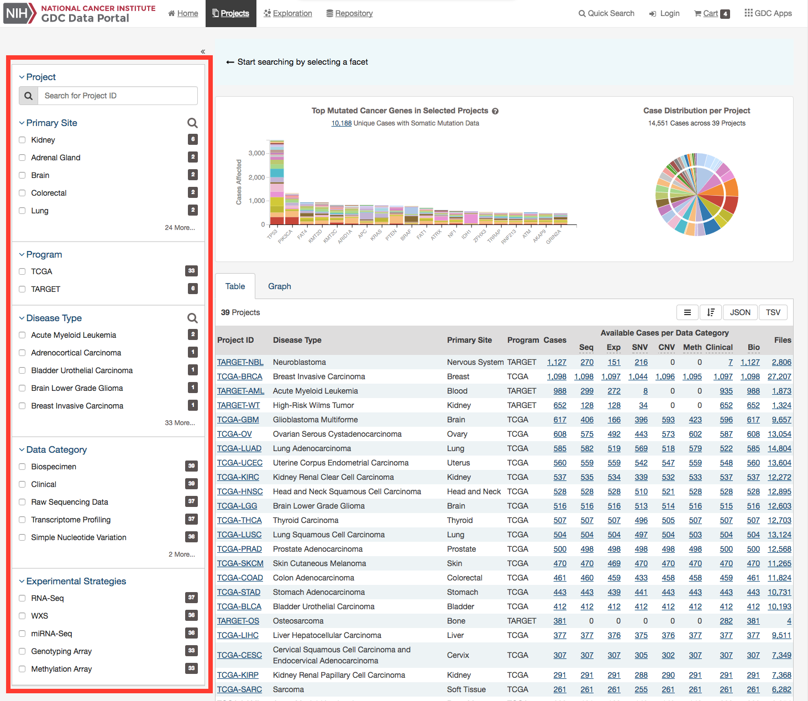
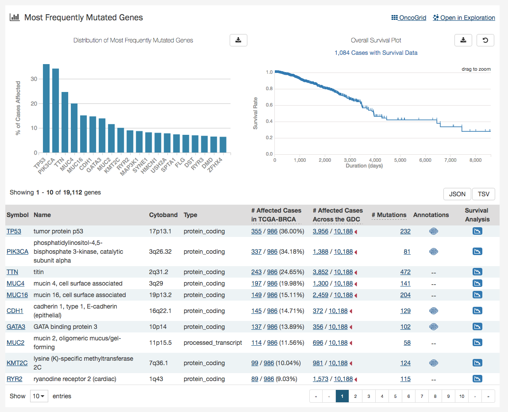
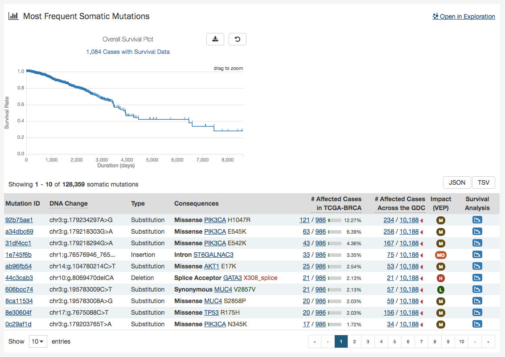

# Projects

## Summary
At a high level, data in the Genomic Data Commons is organized by project. Typically, a project is a specific effort to look at particular type(s) of cancer undertaken as part of a larger cancer research program. The GDC Data Portal allows users to access aggregate project-level information via the Projects Page and Project Summary pages.

## Projects Page

The Projects Page provides an overview of all harmonized data available in the Genomic Data Commons, organized by project. It also provides filtering, navigation, and advanced visualization features that allow users to identify and browse projects of interest. Users can access Projects Page from the GDC Data Portal Home page, from the Data Portal toolbar, or directly at [https://portal.gdc.cancer.gov/projects](https://portal.gdc.cancer.gov/projects).

On the left, a panel of facets allow users to apply filters to find projects of interest. When facet filters are applied, the table and visualizations on the right are updated to display only the matching projects. When no filters are applied, all projects are displayed.

The right side of this page displays a few visualizations of the data (Top Mutated Genes in Selected Projects and Case Distribution per Project). Below these graphs is a table that contains a list of projects and select details about each project, such as the number of cases and data files. The Graph tab provides a visual representation of this information.

### Visualizations

#### Top Mutated Cancer Genes in Selected Projects

This dynamically generated bar graph shows the 20 genes with the most mutations across all projects. The genes are filtered by those that are part of the Cancer Gene Census and that have the following types of mutations: `missense_variant, frameshift_variant, start_lost, stop_lost, initiator_codon_variant, and stop_gained`. The bars represent the frequency of each mutation and is broken down into different colored segments by project and disease type. The graphic is updated as filters are applied for projects, programs, disease types, and data categories available in the project. Note, that due the these filters the number of cases displayed here will be less that the total number of cases per project.

Hovering the cursor over each bar will display information about the number of cases affected by the disease type and clicking on each bar will launch the Gene Summary Page page for the gene associated with the mutation.

Users can toggle the Y-Axis of this bar graph between a percentage or raw number of cases affected.

#### Case Distribution per Project

A pie chart displays the relative number of cases for each primary site (inner circle), which is further divided by project (outer circle). Hovering the cursor over each portion of the graph will display the primary site or project with the number of associated cases. Filtering projects at the left panel will update the pie chart.

### Projects Table

The `Table` tab lists projects by Project ID and provides additional information about each project. If no facet filters have been applied, the table will display all available projects; otherwise it will display only those projects that match the selected criteria.

The table provides links to Project Summary pages in the Project ID column. Columns with file and case counts include links to open the corresponding files or cases in [Repository Page](Repository.md).

### Projects Graph

The `Graph` tab contains an interactive view of information in the Table tab. The numerical values in Case Count, File Count, and File Size columns are represented by bars of varying length according to size. These columns are sorted independently in descending order. Mousing over an element of the graph connects it to associated elements in other columns, including Project ID and Primary Site

Most elements in the graph are clickable, allowing the user to open the associated cases or files in [Repository Page](Repository.md).

Like the projects table, the graph will reflect any applied facet filters.

### Facets Panel

Facets represent properties of the data that can be used for filtering. The facets panel on the left allows users to filter the projects presented in the Table and Graph tabs as well as visualizations.

Users can filter by the following facets:

*   __Project__: Individual project ID
*   __Primary Site__: Anatomical site of the cancer under investigation or review
*   __Program__: Research program that the project is part of
*   __Disease Type__: Type of cancer studied
*   __Data Category__: Type of data available in the project
*   __Experimental Strategy__: Experimental strategies used for molecular characterization of the cancer

Filters can be applied by selecting values of interest in the available facets, for example "WXS" and "RNA-Seq" in the "Experimental Strategy" facet and "Brain" in the "Primary Site" facet. When facet filters are applied, the Table and Graph tabs are updated to display matching projects, and the banner above the tabs  summarizes the applied filters. The banner allows the user to click on filter elements to remove the associated filters, and includes a link to view the matching cases and files.

For information on how to use facet filters, see [Getting Started](Getting_Started.md#facet-filters).

## Project Summary Page

Each project has a summary page that provides an overview of all available cases, files, and annotations available. Clicking on the numbers in the summary table will display the corresponding data.

Three download buttons in the top right corner of the screen allow the user to download the entire project dataset, along with the associated project metadata:

* __Download Biospecimen__: Downloads biospecimen metadata associated with all cases in the project.
* __Download Clinical__: Downloads clinical metadata about all cases in the project.
* __Download Manifest__: Downloads a manifest for all data files available in the project. The manifest can be used with the GDC Data Transfer Tool to download the files.

### Most Frequently Mutated Genes

The Project Summary page also reports the genes that have somatic mutations in the greatest numbers of cases in a graphical and tabular format.

The top of this section contains a bar graph of the most frequently mutated genes as well as a survival plot of all the cases within the specified project. Hovering over each bar in the plot will display information about the number of cases affected. Users may choose to download the underlying data in JSON or TSV format or an image of the graph in SVG or PNG format by clicking the `download` icon at the top of each graph.

Also at the top of this section are two links: `OncoGrid` and `Open in Exploration`.  The `OncoGrid` button will take the user to the [OncoGrid](Exploration.md#OncoGrid) for this project on the [Exploration Page](Exploration.md).  `Open in Exploration` will take the user to the Exploration page with this filters applied for the current project selected.

Below these graphs is a tabular view of the genes affected, which includes the following information:

* __Symbol:__ The gene symbol, which links to the Gene Summary Page
* __Name:__ Full name of the gene
* __Cytoband:__ The location of the mutation on the chromosome in terms of Giemsa-stained samples.
* __# Affected Cases in Project:__ The number of cases within the project that contain a mutation on this gene, which links to the Cases tab in the Exploration Page
* __# Affected Cases Across the GDC:__ The number of cases within all the projects in the GDC that contain a mutation on this gene. Clicking the red arrow will display the cases broken down by project
* __# Mutations:__ The number of SSMs (simple somatic mutations) detected in that gene, which links to the Mutation tab in the Exploration Page
* __Annotations:__ Includes a COSMIC symbol if the gene belongs to [The Cancer Gene Census](http://cancer.sanger.ac.uk/census/)
* __Survival Analysis:__ An icon that, when clicked, will plot the survival rate between cases in the project with mutated and non-mutated forms of the gene

### Survival Analysis

Survival analysis is used to analyze the occurrence of event data over time.  In the GDC, survival analysis is performed on the mortality of the cases. Survival analysis requires:

*  Data on the time to a particular event (days to death or last follow up)
    * Fields:  __diagnoses.days_to_death__ and __diagnoses.days_to_last_follow_up__
*  Information on whether the event has occurred (alive/deceased)
    * Fields:  __diagnoses.vital_status__
*  Data split into different categories or groups (i.e. gender, etc.)
    * Fields:  __demographic.gender__

The survival analysis in the GDC uses a Kaplan-Meier estimator:

Where:

 * S(ti) is the estimated survival probability for any particular one of the t time periods
 * ni is the number of subjects at risk at the beginning of time period ti
 * and di is the number of subjects who die during time period ti

The table below is an example data set to calculate survival for a set of seven cases:

The calculated cumulated survival probability can be plotted against the interval to obtain a survival plot like the one shown below.

### Most Frequent Mutations

At the top of this section is a survival plot of all the cases within the specified exploration page filters.

A table is displayed below that lists information about each mutation:

* __Mutation ID:__ A UUID for the mutation assigned by the GDC, when clicked will bring a user to the Mutation Summary Page
* __DNA Change:__ The chromosome and starting coordinates of the mutation are displayed along with the nucleotide differences between the reference and tumor allele
* __Type:__ A general classification of the mutation
* __Consequences:__ The effects the mutation has on the gene coding for a protein (i.e. synonymous, missense, non-coding transcript).  A link to the Gene Summary Page for the gene affected by the mutation is included
* __# Affected Cases in Project:__ The number of affected cases in the project expressed as a fraction and percentage
* __# Affected Cases in Across the GDC:__ The number of affected cases, expressed as number across all projects. Choosing the arrow next to the percentage will display a breakdown of each affected project
* __Impact:__ A subjective classification of the severity of the variant consequence. This determined using [Ensembl VEP](http://www.ensembl.org/info/genome/variation/predicted_data.html), [PolyPhen](http://genetics.bwh.harvard.edu/pph/), and [SIFT](http://sift.jcvi.org/). The categories are outlined [here](https://docs.gdc.cancer.gov/Data/File_Formats/MAF_Format/#impact-categories).
* __Survival Analysis:__ An icon that when clicked, will plot the survival rate between the gene's mutated and non-mutated cases

### Most Affected Cases

The final section of the Project Summary page is a display of the top 20 cases in a specified project, with the greatest number of affected genes.

Below the bar graph is a table contains information about these cases:

* __UUID:__ The UUID of the case, which links to the Case Summary Page
* __Submitter ID:__ The Submitter ID of the case (i.e. the TCGA Barcode)
* __Site:__  The anatomical location of the site affected
* __Gender:__ Text designations that identify gender. Gender is described as the assemblage of properties that distinguish people on the basis of their societal roles
* __Age at Diagnosis:__ Age at the time of diagnosis expressed in number of days since birth
* __Stage:__ The extent of a cancer in the body. Staging is usually based on the size of the tumor, whether lymph nodes contain cancer, and whether the cancer has spread from the original site to other parts of the body. The accepted values for tumor_stage depend on the tumor site, type, and accepted staging system
* __Survival (days):__ The number of days until death
* __Last Follow Up (days):__ Time interval from the date of last follow up to the date of initial pathologic diagnosis, represented as a calculated number of days
* __Available Files per Data Category:__ Five columns displaying the number of files available in each of the five data categories.  These link to the files for the specific case.
* __# Mutations:__ The number of mutations for the case
* __# Genes:__ The number of genes affected by mutations for the case
