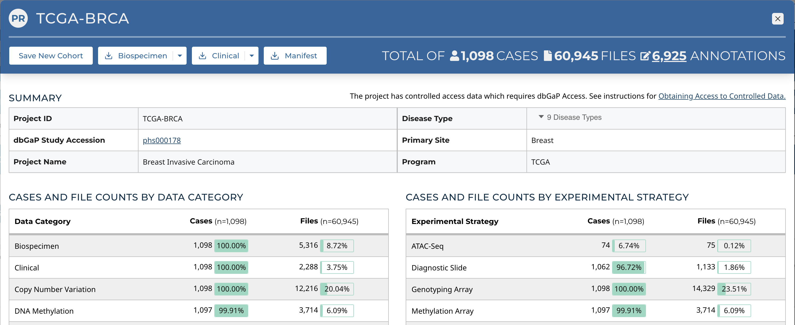

# Projects

At a high level, data in the Genomic Data Commons is organized by project. Typically, a project is a specific effort to study a particular type(s) of cancer undertaken as part of a larger cancer research program. The GDC Data Portal allows users to access aggregate project-level information via the Projects tool and Project Summary Pages.

## Projects Tool

The Projects tool provides an overview of all harmonized data available in the GDC, organized by project. It also provides filtering, navigation, and advanced visualization features that allow users to identify and browse projects of interest. Users can access the Projects tool from the GDC Data Portal header.

On the left, a panel of facets allows users to apply filters to find projects of interest. When filters are applied, the table on the right is updated to display only the matching projects. When no filters are applied, all projects are displayed.

The right side of the Projects tool displays a table that contains a list of projects and specific details about each project, such as the number of cases, types of diseases and primary sites, the program involved, and the experimental strategies available. When a project contains more than one value for the disease type and primary site properties, the full list of values can be expanded by choosing the drop down icon next to the name of the property.

Cohorts can be created by selecting individual projects and using the Save New Cohort button above the table. The checkbox in the header allows all projects on the current page of the table to be selected at the same time.

### Facets Panel

Facets represent properties of the data that can be used for filtering. The facets panel on the left allows users to filter the projects presented in the Table.

Users can filter by the following facets:

*   __Primary Site__: Anatomical site of the cancer under investigation or review
*   __Program__: Research program that the project is part of
*   __Disease Type__: Type of cancer studied
*   __Data Category__: Type of data available in the project
*   __Experimental Strategy__: Experimental strategies used for molecular characterization of the cancer

Filters can be applied by selecting values of interest in the available facets, for example "WXS" and "RNA-Seq" in the "Experimental Strategy" facet, and "Brain" in the "Primary Site" facet. When facet filters are applied, the Table is updated to display matching projects.

## Creating Cohorts From Selected Projects

Custom cohorts consisting of specific projects can be created by selecting those projects in the table using the check boxes next to the project names and clicking the "Save New Cohort" button above the table.

## Project Summary Page

Clicking the link for each project name on the table will bring users to that specific project's summary page.  This page contains basic information about the contents of a project as well as the percentages of cases within the project that contain a specific experimental strategy or data category.

Four buttons on the left of the header allow the user to perform a variety of actions related to the project:

* __Save New Cohort__: Creates a new cohort consisting of all the cases in the project
* __Biospecimen__: Downloads biospecimen metadata associated with all cases in the project in either TSV or JSON format
* __Clinical__: Downloads clinical metadata about all cases in the project in either TSV or JSON format
* __Manifest__: Downloads a manifest for all data files available in the project. The manifest can be used with the GDC Data Transfer Tool to download the files

### Primary Sites Table

Summary pages for projects with multiple primary sites also include a Primary Sites table. Each row of the table contains information relevant to a specific primary site within the project, and additional cohorts can be created using buttons located within the table.

