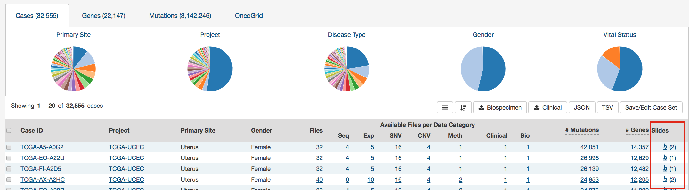
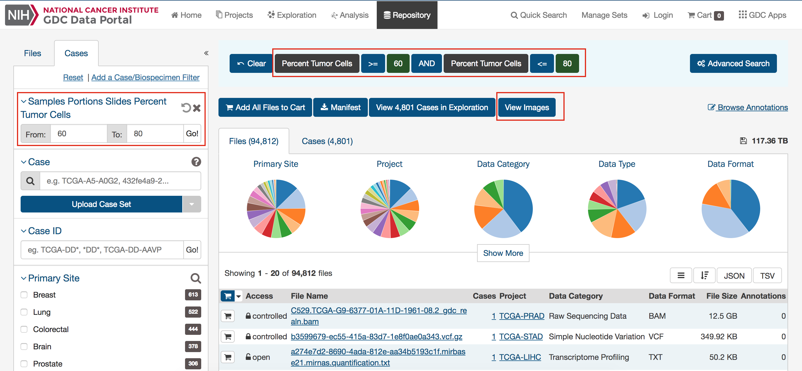
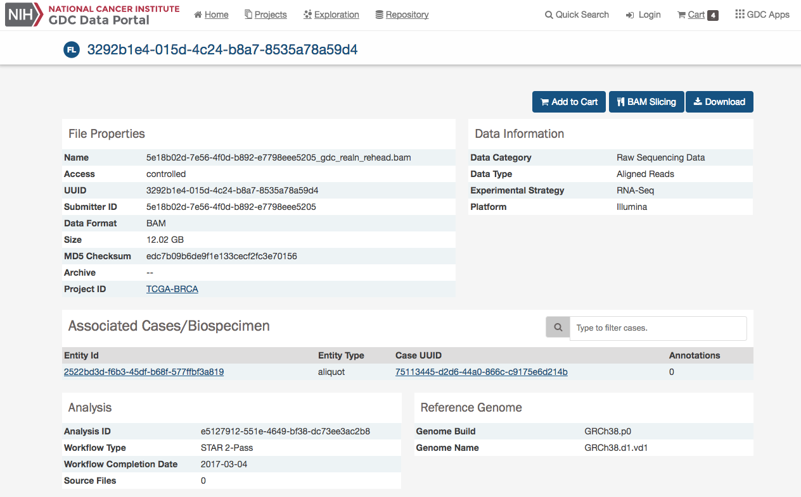

# Repository

The Repository Page is the primary method of accessing data in the GDC Data Portal. It provides an overview of all cases and files available in the GDC and offers users a variety of filters for identifying and browsing cases and files of interest. Users can access the [Repository Page](https://portal.gdc.cancer.gov/repository) from the GDC Data Portal front page, from the Data Portal toolbar.

## Filters / Facets
On the left, a panel of data facets allows users to filter cases and files using a variety of criteria. If facet filters are applied, the tabs on the right will display information about matching cases and files. If no filters are applied, the tabs on the right will display information about all available data.

On the right, two tabs contain information about available data:

* `Files` tab provides a list of files, select information about each file, and links to [individual file detail pages](#file-summary-page).
* `Cases` tab provides a list of cases, select information about each case, and links to [individual case summary pages](Exploration.md#case-summary-page).

The banner above the tabs on the right displays any active facet filters and provides access to advanced search.

The top of the Repository Page contains a few summary pie charts for Primary Sites, Projects, Disease Type, Gender, and Vital Status.  These reflect all available data or, if facet filters are applied, only the data that matches the filters. Clicking on a specific slice in a pie chart, or on a number in a table, applies corresponding facet filters.

[](images/gdc-data-portal-repository-view_v2.png "Click to see the full image.")

### Facets Panel

Facets represent properties of the data that can be used for filtering. The facets panel on the left allows users to filter the cases and files presented in the tabs on the right.

The facets panel is divided into two tabs, with the `Files` tab containing facets pertaining to data files and experimental strategies, while the `Cases` tab containing facets pertaining to the cases and biospecimen information. Users can apply filters in both tabs simultaneously. The applied filters will be displayed in the banner above the tabs on the right, with the option to open the filter in [Advanced Search](Advanced_Search.md) to further refine the query.

[](images/data-view-with-facet-filters-applied_v2.png "Click to see the full image.")

The default set of facets is listed below.

*Files* facets tab:

* __File__: Specify individual files using filename or UUID.
* __Data Category__: A high-level data file category, such as "Raw Sequencing Data" or "Transcriptome Profiling".
* __Data Type__: Data file type, such as "Aligned Reads" or "Gene Expression Quantification". Data Type is more granular than Data Category.
* __Experimental Strategy__: Experimental strategies used for molecular characterization of the cancer.
* __Workflow Type__: Bioinformatics workflow used to generate or harmonize the data file.
* __Data Format__: Format of the data file.
* __Platform__: Technological platform on which experimental data was produced.
* __Access Level__: Indicator of whether access to the data file is open or controlled.

*Cases* facets tab:

* __Case__: Specify individual cases using submitter ID (barcode) or UUID.
* __Case Submitter ID Prefix__: Search for cases using a part (prefix) of the submitter ID (barcode).
* __Primary Site__: Anatomical site of the cancer under investigation or review.
* __Cancer Program__: A cancer research program, typically consisting of multiple focused projects.
* __Project__: A cancer research project, typically part of a larger cancer research program.
* __Disease Type__: Type of cancer studied.
* __Gender__: Gender of the patient.
* __Age at Diagnosis__: Patient age at the time of diagnosis.
* __Vital Status__: Indicator of whether the patient was living or deceased at the date of last contact.
* __Days to Death__: Number of days from date of diagnosis to death of the patient.
* __Race__: Race of the patient.
* __Ethnicity__: Ethnicity of the patient.

### Adding Custom Facets

The Repository page provides access to additional data facets beyond the automatically listed group filters. Facets corresponding to additional properties listed in the [GDC Data Dictionary](../../Data_Dictionary/index.md) can be added using the "Add a Filter" link available at the top of the `Cases` and `Files` facet tabs:

[](images/gdc-data-portal-data-add-facet.png "Click to see the full image.")

The link opens a search window that allows the user to find an additional facet by name or description. Not all facets have values available for filtering; checking the "Only show fields with values" checkbox will limit the search results to only those that do. Selecting a facet from the list of search results below the search box will add it to the facets panel.

[](images/gdc-data-portal-data-facet-search.png "Click to see the full image.")

Newly added facets will show up at the top of the facets panel and can be removed individually by clicking on the "__x__" to the right of the facet name. The default set of facets can be restored by clicking "Reset".

[](images/gdc-data-portal-data-facet-tumor_stage.png "Click to see the full image.")

## Annotations View

The Annotations View provides an overview of the available annotations and allows users to browse and filter the annotations based on a number of annotation properties (facets), such as the type of entity the annotation is attached to or the annotation category. This page can be found by clicking on the [Browse Annotations](https://portal.gdc.cancer.gov/annotations) link, located at the top right of the repository page.

[](images/Browse_Annotations.png "Click to see the full image.")

The view presents a list of annotations in tabular format on the right, and a facet panel on the left that allows users to filter the annotations displayed in the table. If facet filters are applied, the tabs on the right will display only the matching annotations. If no filters are applied, the tabs on the right will display information about all available data.

[](images/gdc-data-portal-annotations.png "Click to see the full image.")

Clicking on an annotation ID in the annotations list will take the user to the Annotation Detail Page. The annotation entity page provides more details about a specific annotation.

[](images/annotations-entity-page.png "Click to see the full image.")

## Image Viewer

The Image viewer allows users to visualize tissue slide images.

[](images/Image_viewer_browser.png "Click to see the full image.")

### How to access the image viewer

The image viewer is available from:

* __Repository page - main search__: After selecting your query, click on "View images" in Repository. It will display the tissue slide images of all the cases resulting from the query.

[](images/Image_Viewer_from_Repository.png "Click to see the full image.")

* __Case table in Exploration and Repository pages__: Click on the image viewer icon in the Case table. It will display in the image viewer all the tissue slide images attached to the Case.

 [](images/Image_viewer_Case_table.png "Click to see the full image.")

* __Case entity page__: Click on the image viewer icon in the Case summary section or in the Biospecimen section - Slides detail. It will display in the image viewer the tissue slide images attached to the Case.

 [](images/Image_viewer_case_summary.png "Click to see the full image.")
 [](images/Image_viewer_case_slide_section.png "Click to see the full image.")

* __Directly in the File entity page__: You can visualize the tissue slide image directly in the file entity page.

[](images/Image_viewer_File_entity.png "Click to see the full image.")


### Image viewer features
In the image viewer, you can:

* Zoom in and zoom out by clicking on + and - icons.
* Reset to default display by clicking on the Home icon.
* Display the image in full screen mode by clicking on the Expand icon.
* View the slide detail by clicking on "Details" button.
* Selecting the area of interest with the thumbnail at the top-right corner.

[](images/Image_viewer_features.png "Click to see the full image.")


### Example of navigation to the image viewer

1. Go to Repository - Case facet and click on Add a Case/Biospecimen filter
2. In the search box of the filter pop-up, look to percent_tumor_cells and add this filter to the Repository
3. Enter a percentage between 60% and 80% then click on Go!
4. Click on "View Images" button

__Result__: The images displayed on the image viewer are filtered based on your query.

[](images/Image_viewer_example-1.png "Click to see the full image.")
[](images/Image_viewer_example-2.png "Click to see the full image.")

## Results

### Navigation

After utilizing the Repository Page to narrow down a specific set of cases, users can choose to continue to explore the mutations and genes affected by these cases by clicking the `View Files in Exploration` button as shown in the image below.

[](images/gdc-view-in-exploration_v3.png "Click to see the full image.")

Clicking this button will navigate the users to the [Exploration Page](Exploration.md), filtered by the cases within the cohort.

### Files List

The `Files` tab on the right provides a list of available files and select information about each file. If facet filters are applied, the list includes only matching files. Otherwise, the list includes all data files available in the GDC Data Portal.

[](images/gdc-data-portal-data-files.png "Click to see the full image.")

The "*File Name*" column includes links to [file summary pages](#file-summary-page) where the user can learn more about each file.

Users can add individual file(s) to the file cart using the cart button next to each file. Alternatively, all files that match the current facet filters can be added to the cart using the menu in the top left corner of the table:

[](images/gdc-data-portal-data-files-add-cart.png "Click to see the full image.")

## File Summary Page

The File Summary page provides information a data file, including file properties like size, md5 checksum, and data format; information on the type of data included; links to the associated case and biospecimen; and information about how the data file was generated or processed.

The page also includes buttons to download the file, add it to the file cart, or (for BAM files) utilize the BAM slicing function.

[](images/gdc-data-portal-files-entity-page.png "Click to see the full image.")

In the lower section of the screen, the following tables provide more details about the file and its characteristics:

* __Associated Cases / Biospecimen__: List of Cases or biospecimen the file is directly attached to.
* __Analysis and Reference Genome__: Information on the workflow and reference genome used for file generation.
* __Read Groups__: Information on the read groups associated with the file.
* __Metadata Files__: Experiment metadata, run metadata and analysis metadata associated with the file.
* __Downstream Analysis Files__: List of downstream analysis files generated by the file.
* __File Versions__: List of all versions of the file.


[](images/gdc-data-portal-files-entity-page-part2_v2.png "Click to see the full image.")

>**Note**: *The Legacy Archive* will not display "Workflow, Reference Genome and Read Groups" sections (these sections are applicable to the GDC harmonization pipeline only). However it may provide information on Archives and metadata files like MAGE-TABs and SRA XMLs. For more information, please refer to the section [Legacy Archive](Legacy_Archive.md).

### BAM Slicing

BAM file detail pages have a "BAM Slicing" button. This function allows the user to specify a region of a BAM file for download. Clicking on it will open the BAM slicing window:

[](images/gdc-data-portal-bam-slicing.png "Click to see the full image.")

During preparation of the slice, the icon on the BAM Slicing button will be spinning, and the file will be offered for download to the user as soon as ready.

### Cases List

The `Cases` tab on the right provides a list of available cases and select information about each case. If facet filters are applied, the list includes only matching cases. Otherwise, the list includes all cases available in the GDC Data Portal.

[](images/gdc-data-portal-data-cases_v3.png "Click to see the full image.")

The list includes links to [case summary pages](Exploration.md#case-summary-page) in the *Case UUID* column, the Submitter ID (i.e. TCGA Barcode), and counts of the available file types for each case. Clicking on a count will apply facet filters to display the corresponding files.

The list also includes a shopping cart button, allowing the user to add all files associated with a case to the file cart for downloading at a later time:

[](images/gdc-data-portal-data-case-add-cart.png "Click to see the full image.")

## Cart and File Download

While browsing the GDC Data Portal, files can either be downloaded individually from [file summary pages](#file-summary-page) or collected in the file cart to be downloaded as a bundle.  Clicking on the shopping cart icon that is next to any item in the GDC will add the item to your cart.

### GDC Cart

[](images/cart-overview_v2.png "Click to see the full image.")

### Cart Summary

The cart page shows a summary of all files currently in the cart:

* Number of files
* Number of cases associated with the files
* Total file size

The Cart page also displays two tables:

* __File count by project__: Breaks down the files and cases by each project.
* __File count by authorization level__: Breaks down the files in the cart by authorization level.  A user must be logged into the GDC in order to download 'Controlled-Access files'.

The cart also directs users how to download files in the cart.  For large data files, it is recommended that the [GDC Data Transfer Tool](https://gdc.cancer.gov/access-data/gdc-data-transfer-tool) be used.

### Cart Items

[](images/gdc-cart-items_v2.png "Click to see the full image.")

The Cart Items table shows the list of all the files that were added to the Cart.  The table gives the folowing information for each file in the cart:

* __Access__: Displays whether the file is open or controlled access.  Users must login to the GDC Portal and have the appropriate credentials to access these files.
* __File Name__: Name of the file.  Clicking the link will bring the user to the [file summary page](#file-summary-page).
* __Cases__: How many cases does the file contain.  Clicking the link will bring the user to the [case summary page](Exploration.md#case-summary-page).
* __Project__: The Project that the file belongs to.  Clicking the link will bring the user to the [project summary page](Projects.md#project-summary-page).
* __Category__: Type of data.
* __Format__: The file format.
* __Size__: The size of the file.
* __Annotations__: Whether there are any annotations.

## Download Options

[](images/gdc-download-options_v2.png "Click to see the full image.")

There are a few buttons on the Cart page that allow users to download files.  The following download options are available:

* __Biospecimen__: Downloads bioscpecimen data related to files in the cart in either TSV or JSON format.
* __Clinical__: Downloads clinical data related to files in the cart in either TSV or JSON format.
* __Sample Sheet__: Downloads a tab-separated file which contains the associated case/sample IDs and the sample type (Tumor/Normal) for each file in the cart.
* __Metadata__: GDC harmonized clinical, biospecimen, and file metadata associated with the files in the cart.
* __Download Manifest__: Download a manifest file for use with the GDC Data Transfer Tool to download files.  A manifest file contains a list of the UUIDs that correspond to the files in the cart.
* __Download Cart__: Download the files in the Cart directly through the browser. Users have to be cautious of the amount of data in the cart since this option will not optimize bandwidth and will not provide resume capabilities.
* __SRA XML, MAGE-TAB__: This option is available in the GDC Legacy Archive only. It is used to download metadata files associated with the files in the cart.

The cart allows users to download up to 5 GB of data directly through the web browser. This is not recommended for downloading large volumes of data, in particular due to the absence of a retry/resume mechanism. For downloads over 5 GB we recommend using the `Download Manifest` button and download a manifest file that can be imported into [GDC Data Transfer Tool](https://docs.gdc.cancer.gov/Data_Transfer_Tool/Users_Guide/Getting_Started/).

>__Note__: when downloading multiple files from the cart, they are automatically bundled into one single Gzipped (.tar.gz) file.

### [GDC Data Transfer Tool](https://gdc.cancer.gov/access-data/gdc-data-transfer-tool)

The `Download Manifest` button will download a manifest file that can be imported into the GDC Data Transfer Tool.   Below is an example of the contents of a manifest file used for download:

```manifest
id	filename	md5	size	state
4ea9c657-8f85-44d0-9a77-ad59cced8973	mdanderson.org_ESCA.MDA_RPPA_Core.mage-tab.1.1.0.tar.gz		2516051	live
b8342cd5-330e-440b-b53a-1112341d87db	mdanderson.org_SARC.MDA_RPPA_Core.mage-tab.1.1.0.tar.gz		4523632	live
c57673ac-998a-4a50-a12b-4cac5dc3b72e	mdanderson.org_KIRP.MDA_RPPA_Core.mage-tab.1.2.0.tar.gz		4195746	live
3f22dd8d-59c8-43a4-89cf-3b595f2e5a06	14-3-3_beta-R-V_GBL1112940.tif	56df0e4b4fc092fc3643bd2e316ac05b	6257840	live
7ce05059-9197-4d38-830f-04356f5f851a	14-3-3_beta-R-V_GBL11066140.tif	6abfee483974bc2e61a37b5499ae9a07	6261580	live
8e00d22a-ca6f-4da8-a1c3-f23144cb21b7	14-3-3_beta-R-V_GBL1112940.tif	56df0e4b4fc092fc3643bd2e316ac05b	6257840	live
96487cd7-8fa8-4bee-9863-17004a70b2e9	14-3-3_beta-R-V_GBL1112940.tif	56df0e4b4fc092fc3643bd2e316ac05b	6257840	live
```

The Manifest contains a list of the file UUIDs in the cart and can be used together with the GDC Data Transfer Tool to download all files.

Information on the GDC Data Transfer Tool is available in the [GDC Data Transfer Tool User's Guide](../../Data_Transfer_Tool/Users_Guide/Getting_Started.md).

### Individual Files Download

Similar to the files page, each row contains a download button to download a particular file individually.

## Controlled Files

If a user tries to download a cart containing controlled files and without being authenticated, a pop-up will be displayed to offer the user either to download only open access files or to login into the GDC Data Portal through eRA Commons. 

[](images/gdc-data-portal-download-cart.png "Click to see the full image.")

## Authentication

The GDC Data Portal provides granular metadata for all datasets available in the GDC. Any user can see a listing of all available data files, including controlled-access files. The GDC Data Portal also allows users to download open-access files without logging in. However, downloading of controlled-access files is restricted to authorized users and requires authentication.

### Logging into the GDC

To login to the GDC, users must click on the `Login` button on the top right of the GDC website.


After clicking Login, users authenticate themselves using their eRA Commons login and password.  If authentication is successful, the eRA Commons username will be displayed in the upper right corner of the screen, in place of the "Login" button.

Upon successful authentication, GDC Data Portal users can:

- See which controlled-access files they can access.
- Download controlled-access files directly from the GDC Data Portal.
- Download an authentication token for use with the GDC Data Transfer Tool or the GDC API.

Controlled-access files are identified using a "lock" icon:

[](images/gdc-data-portal-controlled-files.png "Click to see the full image.")

The rest of this section describes controlled data access features of the GDC Data Portal available to authorized users. For more information about open and controlled-access data, and about obtaining access to controlled data, see [Data Access Processes and Tools](https://gdc.cancer.gov/access-data/data-access-processes-and-tools).

### User Profile

After logging into the GDC Portal, users can view which projects they have access to by clicking the `User Profile` section in the dropdown menu in the top corner of the screen.

[](images/gdc-user-profile-dropdown.png "Click to see the full image.")

Clicking this button shows the list of projects.

[](images/gdc-user-profile.png "Click to see the full image.")

### GDC Authentication Tokens

The GDC Data Portal provides authentication tokens for use with the GDC Data Transfer Tool or the GDC API. To download a token:

1. Log into the GDC using your eRA Commons credentials.
2. Click the username in the top right corner of the screen.
3. Select the "Download token" option.


A new token is generated each time the `Download Token` button is clicked.

For more information about authentication tokens, see [Data Security](../../Data/Data_Security/Data_Security.md#authentication-tokens).

>__Note:__ The authentication token should be kept in a secure location, as it allows access to all data accessible by the associated user account.

### Logging Out

To log out of the GDC, click the username in the top right corner of the screen, and select the Logout option.


