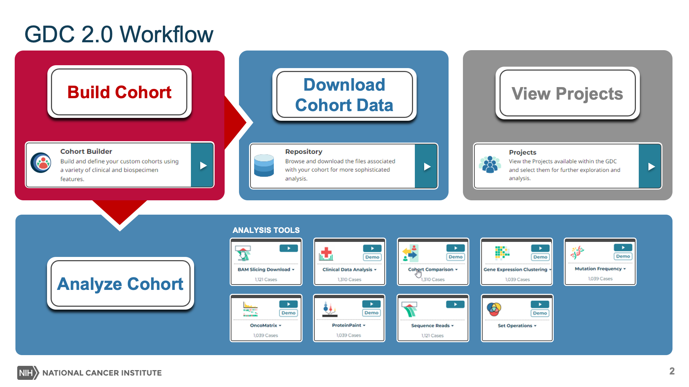

# Tutorial Videos

## Overview

The [GDC Data Portal 2.0](https://portal.gdc.cancer.goc) centers around the idea of building cohorts, or groups of cases, before analyzing or downloading data.

In this GDC 2.0 Video Tutorial, learn how to:

* Build a cohort
* Analyze a cohort using GDC analysis tools
* Download data associated with a cohort
* View projects and available data in the GDC, and filter to create custom cohorts

GDC 2.0 Videos are available in the [NCI GDC YouTube Playlist](XXXLINK2PlaylistXXX). For additional details, please see the [GDC 2.0 User's Guide](quick_start.md).

## Build Cohort

<table>
<tr>
<td>
Cohorts are created using the <b>Cohort Builder</b>, which allows users to specify cases with custom filters for things like disease characteristics, patient demographics, data type, and more.
 
 
In this video, learn how to use the <b>Cohort Builder</b> to build a cohort of patients with lung cancer, that are over the age of 50, and have harmonized RNA-Seq data.
</td>

<td><iframe width="400" height="300" src="https://www.youtube.com/embed/ppEYuxbarGw" frameborder="0" allow="autoplay; encrypted-media" allowfullscreen> </iframe>

</td></tr>
</table>

## Analyze Cohort

### Analysis Center

<table>
<tr>
<td><iframe width="400" height="300" src="https://www.youtube.com/embed/N2my3pTtSiU" frameborder="0" allow="autoplay; encrypted-media" allowfullscreen> </iframe>
</td>
<td>
Once a cohort is created, the cohort can be analyzed using an analysis tool in the <b>Analysis Center</b>.
 
 

In this video, learn how to analyze a cohort in the <b>Analysis Center</b>. Instructional videos are available for each analysis tool.

</td>
</tr>
</table>

### Analysis Tools

A cohort can be analyzed by selecting an analysis tool in the Analysis Center. The GDC provides analysis tools for performing both gene-level variant analysis and clinical data analysis. The table below identifies and describes each tool, and provides video instruction.

<table>
<tr><td><b>Tool</b></td> <td><b>Description</b></td><td><b>Video</b></td></tr>

<tr>
<td><b>Clinical Data Analysis</b></td>
<td>Use clinical variables to perform basic statistical analysis of your cohort</td>
<td><iframe width="240" height="160" src="https://www.youtube.com/embed/0DuI4NEQ6CU" frameborder="0" allow="autoplay; encrypted-media" allowfullscreen > </iframe>
</td>
</tr>
<tr>
<td><b>Cohort Comparison</b></td>
<td>Display the survival analysis of your cohorts and compare characteristics such as gender, vital status and age at diagnosis</td>
<td><iframe width="240" height="160" src="https://www.youtube.com/embed/NT7-TB78VjA" frameborder="0" allow="autoplay; encrypted-media" allowfullscreen > </iframe>
</td>
</tr>
<tr>
<td><b>Gene Expression Clustering</b></td>
<td>Display gene expression visualization </td>
<td><iframe width="240" height="160" src="https://www.youtube.com/embed/f58U6hL4Wok" frameborder="0" allow="autoplay; encrypted-media" allowfullscreen > </iframe>
</td>
</tr>
<tr>
<td><b>Mutation Frequency</b></td>
<td>Visualize most frequently mutated genes and somatic mutations</td>
<td><iframe width="240" height="160" src="https://www.youtube.com/embed/dbbuk-zhmvc" frameborder="0" allow="autoplay; encrypted-media" allowfullscreen > </iframe>
</td>
</tr>
<tr>
<td><b>OncoMatrix</b></td>
<td>Visualize the top most mutated cases and genes affected by high impact mutations in your cohort</td>
<td><iframe width="240" height="160" src="https://www.youtube.com/embed/ZgSeJCqLmzY" frameborder="0" allow="autoplay; encrypted-media" allowfullscreen > </iframe>
</td>
</tr>
<tr>
<td><b>ProteinPaint</b></td>
<td>Visualize mutations in protein-coding genes by consequence type and protein domain</td>
<td><iframe width="240" height="160" src="https://www.youtube.com/embed/5AXvhtFd_Es" frameborder="0" allow="autoplay; encrypted-media" allowfullscreen > </iframe>
</td>
</tr>
<tr>
<td><b>Sequence Reads</b></td>
<td>Visualize sequencing reads for a given gene, position, SNP, or variant</td>
<td><iframe width="240" height="160" src="https://www.youtube.com/embed/PkQ6cEzRCds" frameborder="0" allow="autoplay; encrypted-media" allowfullscreen > </iframe>
</td>
</tr>
<tr>
<td><b>Set Operations</b></td>
<td>Display a Venn diagram and compare/contrast your cohorts or sets of the same type</td>
<td><iframe width="240" height="160" src="https://www.youtube.com/embed/QHJwyL_pLak" frameborder="0" allow="autoplay; encrypted-media" allowfullscreen > </iframe>
</td>
</tr>
<tr>
<td><b>BAM Slicing</b></td>
<td>Slice a specific region, gene, or chromosome from a GDC-harmonized BAM file.</td>
<td><iframe width="240" height="160" src="https://www.youtube.com/embed/Nd9Ex9s_prk" frameborder="0" allow="autoplay; encrypted-media" allowfullscreen > </iframe>
</td>
</tr>
</table>

## Download Cohort Data

<table>
<tr>
<td>
Genomic, clinical, and biospecimen data associated with a cohort can be downloaded using the <b>Repository</b>.
 
 
In this video, learn how to download data associated with a cohort in the <b>Repository</b>.
</td>
<td><iframe width="400" height="300" src="https://www.youtube.com/embed/edipjoF1Tyk" frameborder="0" allow="autoplay; encrypted-media" allowfullscreen> </iframe>
</td>
</tr>
</table>

## View Projects

<table>
<tr>
<td><iframe width="400" height="300" src="https://www.youtube.com/embed/rKn2WJuA850" frameborder="0" allow="autoplay; encrypted-media" allowfullscreen> </iframe>
</td>
<td>

GDC data is organized by projects within a larger cancer research program. Projects are generally composed of a particular type of cancer, such as the low-grade glioma (LGG) and sarcoma (SARC) projects within the TCGA program.
 
In this video, learn how to use The GDC Data Portal to access project-level information via the Projects tool and Project Summary Page and navigate and filter data to create custom cohorts.
</td>
</tr>
</table>
