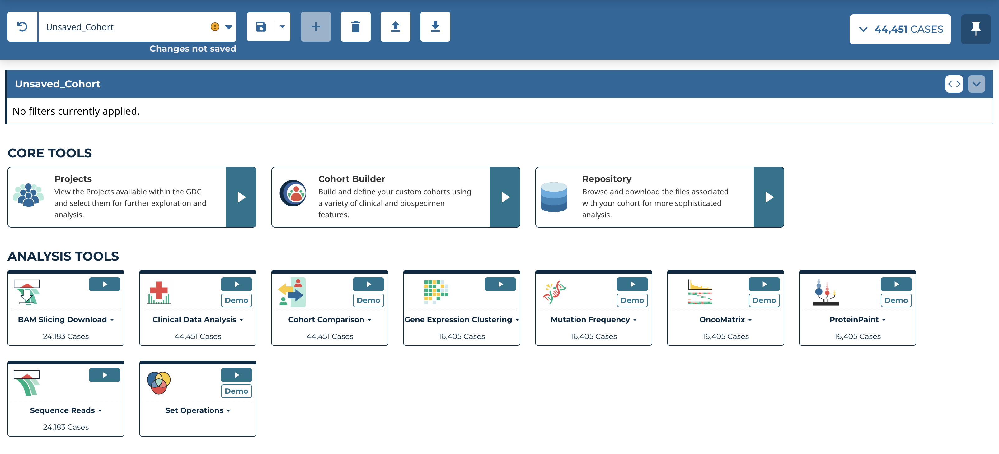
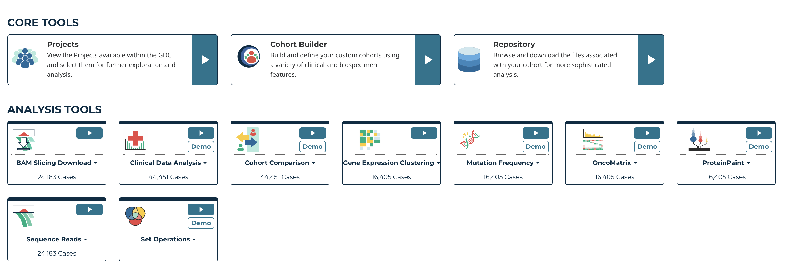
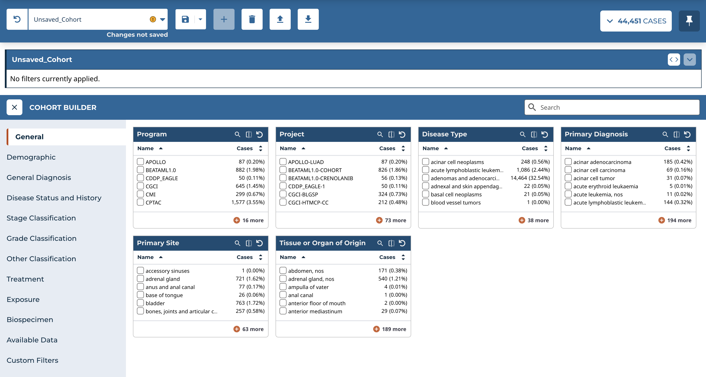

# GDC Analysis Center

The Analysis Center is the central hub for accessing tools to support cohort analysis. To access the Analysis Center, click on the Analysis Center button from the GDC Data Portal's main page.

The Analysis Center consists of a main toolbar and a query expressions section, both of which are always displayed. The main toolbar displays the active cohort and can be used to create and manage custom cohorts. The query expression section displays the filters applied to the active cohort.

A variety of cards are displayed in the Analysis Center. Each card represents an individual tool that is available in the GDC Data Portal.

## Core Tools ##

This section contains the core GDC tools.  This includes the [Projects](LINKHERE) tool, the [Cohort Builder](LINKHERE), and the [Repository](LINKHERE). These can be selected for use with your current cohort by clicking on each from the Core Tools section.

## Analysis Tools ##

The Analysis Tools section contains the analysis tools available in the Analysis Center: [BAM Download](LINKHERE), [Clinical Data Analysis](LINKHERE), [Cohort Comparison](LINKHERE), [Gene Expression](LINKHERE), [MAF Aggregation](LINKHERE), [Mutation Frequency](LINKHERE), [OncoMatrix](LINKHERE), [ProteinPaint](LINKHERE), [Sequence Reads](LINKHERE), and [Set Operations](LINKHERE).

These can be used by directly selecting the tool cards.

If there is not sufficient data in the active cohort to use a particular tool, the play button will be grayed out and will not be usable until a new cohort with sufficient data is selected.

## Tool Panel

As each tool is selected, it is loaded in the Analysis Center within a panel.

To close a tool and return to the default view that displays all the tool cards within the Analysis Center, click the "X" to the left of the tool's header.
