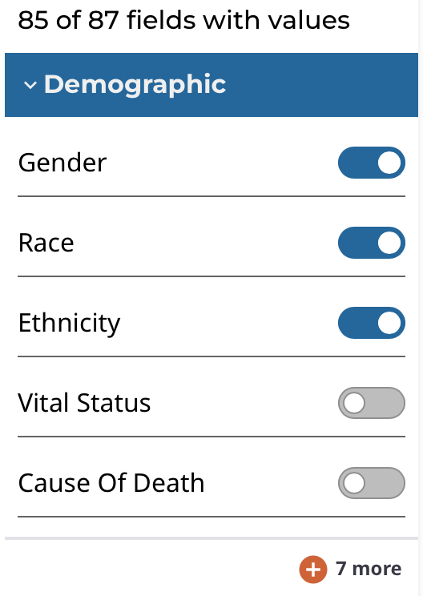
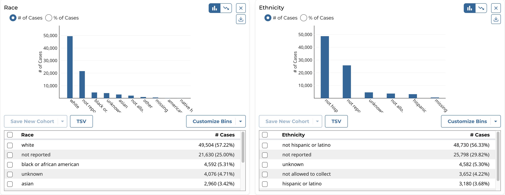
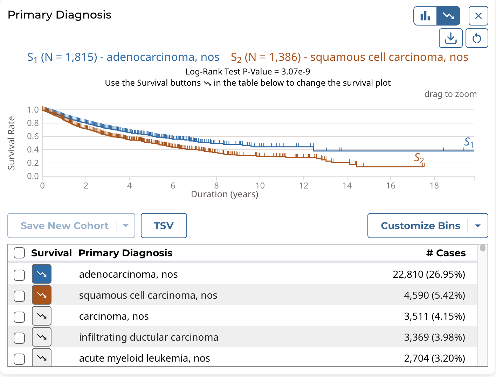
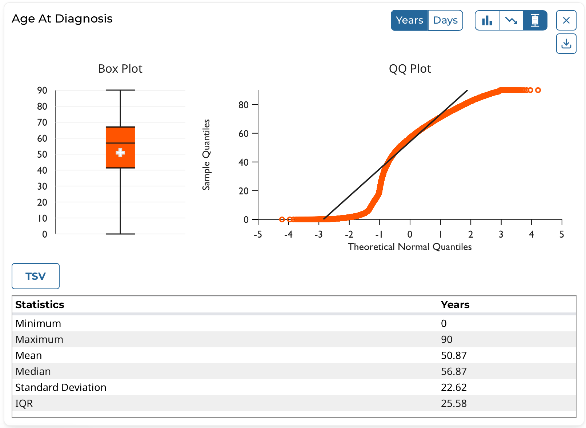
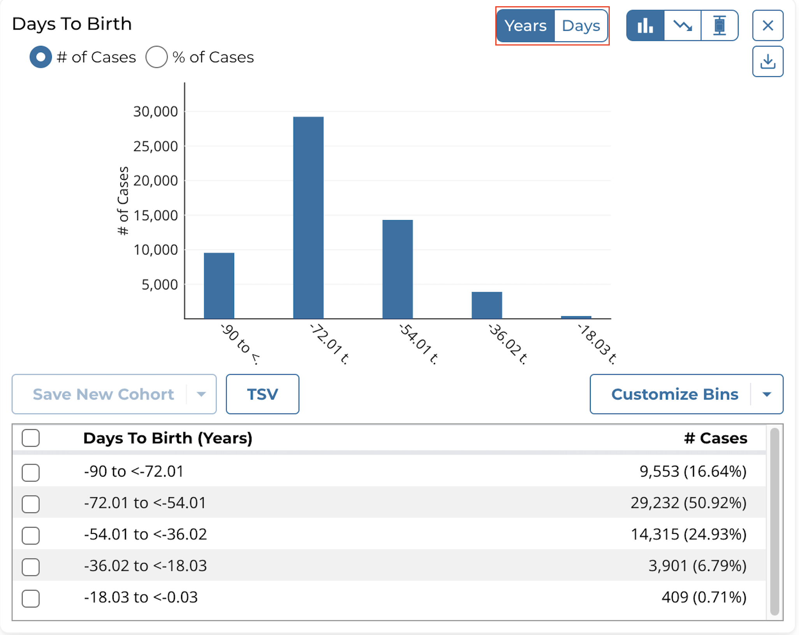
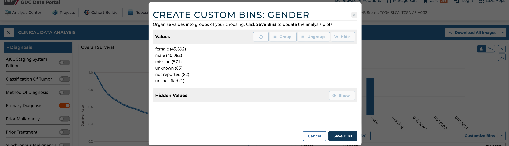
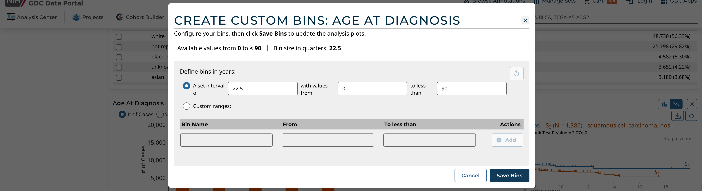

# Clinical Data Analysis

The Clinical Data Analysis tool allows for a set of customizable charts to be generated for a set of clinical attributes. Users can select which clinical fields they want to display and visualize the data using various supported plot types.  The clinical analysis features include:

* Ability to select which clinical fields to display
* Examine the clinical data of each field using these visualizations:
    * Histogram
    * Survival Plot
    * Box and QQ Plots
* Create custom bins for each field and re-visualize the data with those bins
* Select specific cases from a clinical field and use them to create a new cohort, or modify/remove from an existing cohort
* Download the visualizations of each plot type for each variable in SVG or PNG
* Download the data table of each field in JSON or TSV format
* Print all clinical variable cards in the analysis with their active plot to a single PDF

## Enabling Clinical Variable Cards

* In the Analysis Center, select the *Clinical Data Analysis* tool card.

* In the Clinical Data Analysis tool, use the control panel on the left side of the analysis to display which clinical variables you want.  To enable or disable specific variables for display, click the on/off toggle controls:

The clinical fields are grouped into these categories:

* __Demographic:__ Data for the characterization of the patient by means of segmenting the population (e.g. characterization by age, sex, race, etc.).
* __Diagnosis:__ Data from the investigation, analysis, and recognition of the presence and nature of the disease, condition, or injury from expressed signs and symptoms; also, the scientific determination of any kind; the concise results of such an investigation.
* __Treatment:__ Records of the administration and intention of therapeutic agents provided to a patient to alter the course of a pathologic process.
* __Exposure:__ Clinically-relevant patient information not immediately resulting from genetic predispositions.

## Exploring Clinical Card Visualizations

Users can explore different visualizations for each clinical field they have enabled for display. All cards support histograms and survival plots. Additionally, continuous variables can be graphically represented as box and QQ plots. To switch between plot types, click the different plot type icons in the top-right of each card.

### Histogram

The histogram plot type supports these features:

* View the distribution of cases (# and % of cases) in the cohort for the clinical field's data categories as a histogram
* View the distribution of cases in tabular format
* Select the cases for specific data categories to create new cohorts, append to existing cohorts, or remove from existing cohorts
* Download the histogram visualization in SVG or PNG format
* Download the raw data used to generate the histogram in JSON format

Note that the histogram plot applies to, and can be displayed for, both categorical and continuous variables.

### Survival Plot

The survival plot type supports these features:

* View the distribution of cases (# and % of cases) in the cohort for the clinical field's data categories as a table.
* Select and plot the survival analysis for the cases of specific data categories in the table:
    * By default the top 2 categories (highest # of cases) are displayed.
    * Users can manually select and plot up to 5 categories at a time.
* Download the survival plot visualization in SVG or PNG format
* Download the raw data used to generate the survival plot in JSON or TSV format

Note that the survival plot applies to, and can be displayed for, both categorical and continuous variables.

### Box and QQ Plots

The box and QQ plot types support these features:

* View the quartiles (Q1, Q2/median, and Q3) as well as the mean, minimum, and maximum values in the cohort for the clinical field as a box plot
* View the descriptive statistics in the cohort for the clinical field in tabular format
* Plot the quantiles of the clinical field's distribution with quantiles of a theoretical normal distribution as a QQ plot
* Download the box and QQ plot visualizations in SVG or PNG format
* Download the raw data used to generate the QQ plot in JSON or TSV format

Note that the box and QQ plots apply to, and can be displayed for, continuous variables only. 

Certain continuous variables that are measured with units of time, such as Days to Birth, include a toggle to switch between displaying the data in years or days. A standard formula is employed for converting between years and days:

* 1 year = 365.25 days

## Creating Custom Bins

For each clinical variable, whether categorical or continuous, users can create custom bins to group the data in ways they find scientifically interesting or significant.  Once saved, the bins are applied to these visualizations and they are then re-rendered:

* Histogram and associated data table
* Survival plot and associated data table

Custom bins can be reset to their defaults at any time for each card.  Note that custom bins are __saved per analysis__.

### Categorical Binning

To create custom bins for a categorical variable, click *__Customize Bins__*, then *__Edit Bins__*.  A configuration window appears where the user can create their bins:

The user can:

* Group existing individual values into a single group
* Give a custom name to each group
* Ungroup previously grouped values
* Completely hide values from being shown in the visualization
* Re-show previously hidden values

### Continuous Binning

To create custom bins for a continuous variable, click *__Customize Bins__*, then *__Edit Bins__*.  A configuration window appears where the user can create their bins:

The user can choose one of these continuous binning methods:

* (1) Create equidistant bins based on a set interval:
    * User must choose the interval (e.g. equidistant bins of 1,825 days for the Age of Diagnosis field)
    * User can optionally define the starting and ending value between which the equidistant bins will be created
* (2) Create completely custom ranges:
    * User manually enters 1 or more bins with custom ranges
    * User must enter a name for each range and the start and end values
    * The ranges can be of different interval lengths
