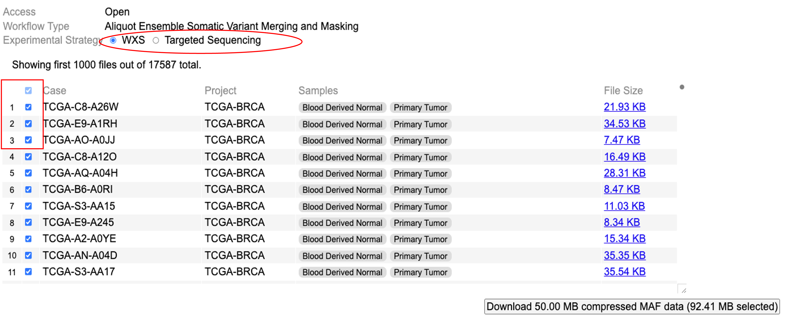
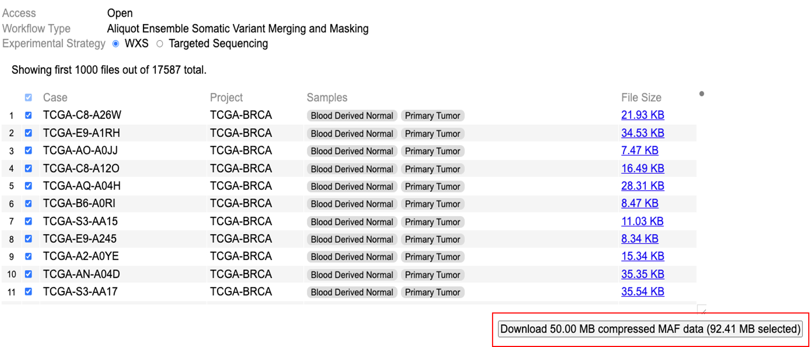

# Cohort MAF

## Introduction to Cohort MAF tool
Cohort MAF tool is a web based tool for searching and selecting a desired set of open-access MAFs from the NCI Genomic Data Commons (GDC), and downloading the aggregated and compressed file. 

## Downloads

### Data query

To retrieve all open-access MAF files with specified workflow type select experimental strategy as illustrated by clicking either ‘WXS’ or ‘Targeted sequencing’. Users can then visualize all MAF files with the specific experimental strategy. Users may choose MAF files of interest by selecting the cases/project of interest from rows as shown in the table.

### Data download

A button in the bottom right corner of the screen displays the total size of all selected file. To download all selected files, click the button as shown. These files are aggregated, sorted, compressed, and downloaded to the browser or the 'Downloads' folder.

