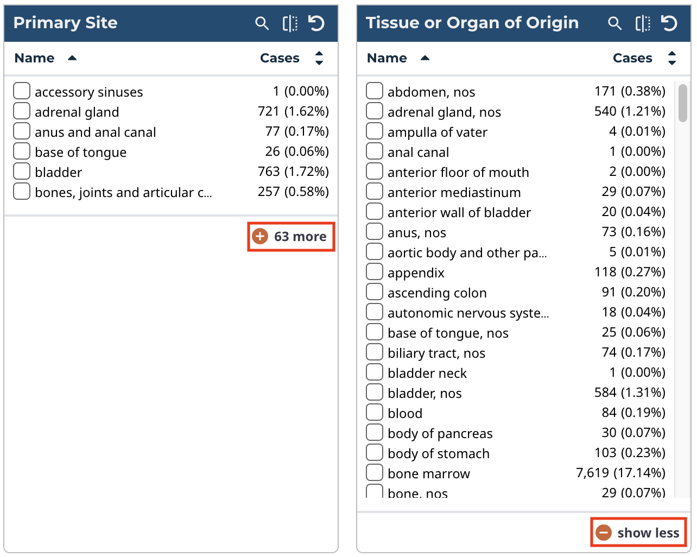
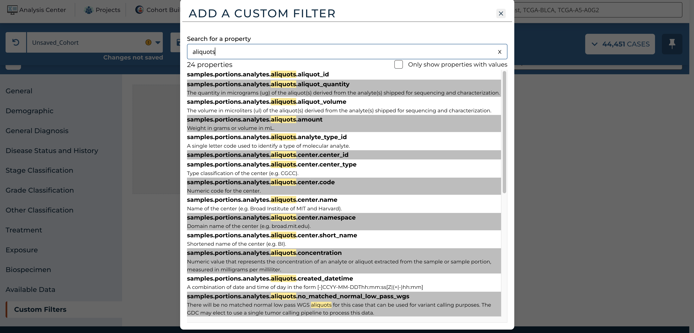
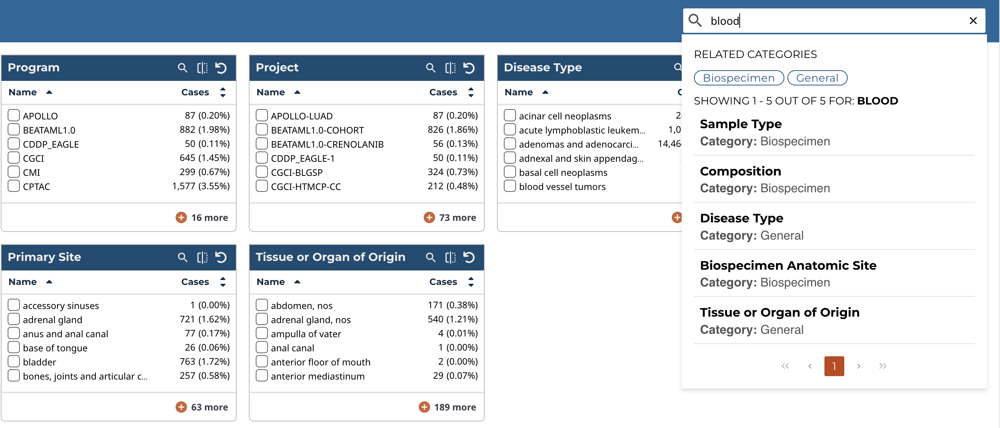

# Cohort Builder

The Cohort Builder is a good starting point for users looking to gather information for a specific disease, project, or group of patients. Building a cohort allows users to download files, perform analyses, and query metadata for the same group of cases in multiple sections of the GDC Data Portal. This section will cover the process of building a cohort and downstream actions will be documented in their respective sections.

The Cohort Builder can be accessed in one of the following ways:

* Selecting the Cohort Builder link in the GDC Data Portal header

* Selecting the play button on the Cohort Builder card in the Analysis Center

## Cohort Builder Panel ##

The Cohort Builder tool will be displayed as a panel in the Analysis Center and is used to filter the current cohort to a specific set of cases. The current cohort is always displayed in the [main toolbar](getting_started.md#main-toolbar) and can be changed from the main toolbar.

At the left side of the panel are a series of broad filter categories can be selected. Each filter category contains a set of specific filters within cohort builder cards that can be used to narrow your cohort to the desired set.

## Cohort Builder Cards
Each card within the Cohort Builder can be used to apply the corresponding filters on the current cohort. As filters are applied, they will be displayed on the [Query Expressions](quick_start.md#query-expressions) section.

Additional features can be accessed at the top right of each card's header to facilitate filtering:

* **Search**: the search icon can be selected to reveal or hide a search field for entering text to search within the values of the current card. This feature is only available when the values are enums.
* **Flip Card**: cards can be flipped to reveal or hide a summary chart. This feature is only available when the values can be meaningfully displayed as bar graphs.
* **Reset Card**: this button will reset any filtering that has been applied within the card

In addition, filters in each card can be sorted, either alphabetically or by the number of cases based on current filters, by selecting one of the two headers directly underneath the card title. The default sort is alphabetical order.

The first six (or fewer) filters are shown for each card, but can be expanded to show 20 filters at once by clicking the "+" button which also indicates the number of additional filters not in view. The expanded view can be toggled off by clicking the resulting "show less" button.

### Available Data Filters

Toward the bottom of the list of filter categories, "Available Data" can be selected.  These filters differ from the other default filters as they allow for cases that have certain types of associated data files. For example, filtering in the "Experimental Strategy" card for "RNA-Seq" will only display cases in the active cohort that have associated RNA-Seq files. These filters may be useful for analyses that requires only cases for which a certain type of analysis was performed.

## Custom Filters ##

If a filter cannot be found within one of the categories, use the "Add a Custom Filter" button in the "Custom Filters" category to access any filters that are not displayed. Browse through the list of additional filters, or use the search box to search for filters by name. Once a filter is selected, it is then added to the "Custom Filters" category.  A custom filter can be removed from this category by choosing the "X" at the top right of the filter card.

Filters that exist in the GDC but do not have any cases that have a value for the filter can also be removed from the "Custom Filters" list by selecting the "Only show properties with values" box.

## Cohort Builder Search

The Cohort Builder includes the ability to search across all the cards within it. This feature is located on the right of the Cohort Builder header.

As a search term is entered, the Cohort Builder Search feature will display a list of properties that contain matching results. When a result is moused over, additional information is displayed to its left, including a description of the property and a list of values that match the search term.

When a result is selected, the card corresponding to the selected result will be displayed.

## Closing the Cohort Builder

Once a custom cohort is built and filtering is complete, users can close the Cohort Builder and use the custom cohort with other tools.

To close the Cohort Builder panel and display all the tools within the Analysis Center, click on the "X" button on the left of the Cohort Builder header.

Alternatively, users can select the Analysis Center link or any of the other links on the GDC Data Portal header to close the Cohort Builder.

Changes made to the cohort with the Cohort Builder will persist through the other sections of the GDC Data Portal.

Users can then perform the following actions:

* Download files associated with the cohort from the [Repository](Repository.md)
* Analyze data from the cohort in the [Analysis Center](analysis_center.md)
