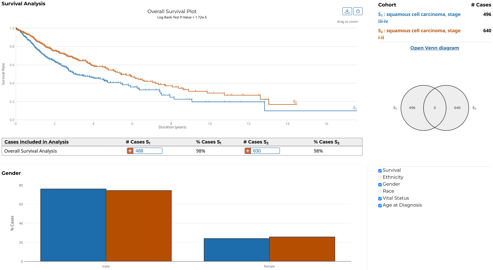

# Cohort Comparison

The Cohort Comparison tool displays graphs and tables that demonstrate the similarities and differences between the active cohort and a different cohort. The following features are displayed for each of the two cohorts:

* A key detailing the number of cases in each cohort and the color that represents each (blue/orange)

* A Venn diagram, which shows the number of cases shared between the cohorts

* A selectable survival plot that compares both sets with information about the percentage of represented cases

* A breakdown of each cohort by selectable clinical facets with a bar graph and table. The facets included are `Vital_Status`, `Gender`, `Race`, `Ethnicity`, and `Age_at_Diagnosis`. A p-value (if it can be calculated from the data) that demonstrates whether the statuses are proportionally represented is displayed for the `Vital_Status`, `Gender`, and `Ethnicity` facets.

* Additional cohorts can be created containing subsets of these two cohorts

Note that clicking the "Open Venn diagram" link will launch the [Set Operations](set_operations.md) tool with the same cohorts used in the Cohort Comparison tool.
