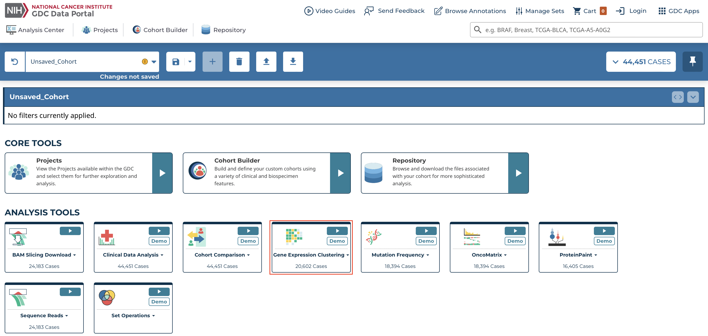
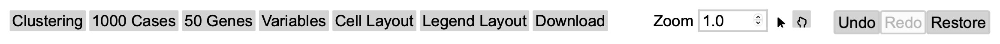
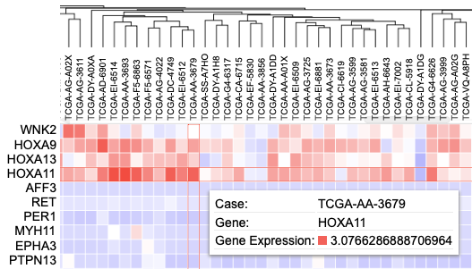
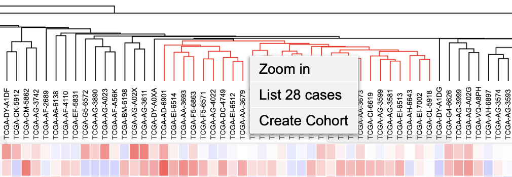
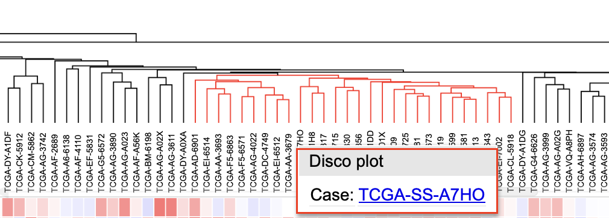
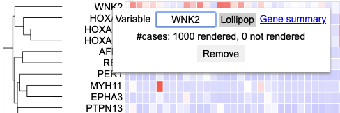
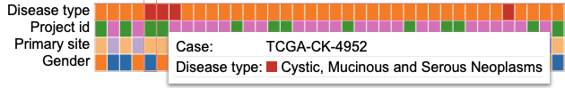
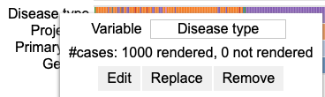
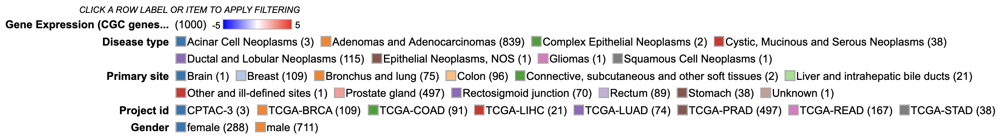
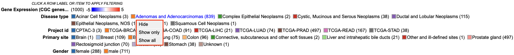

# Gene Expression Clustering Tool

## Introduction to Gene Expression Clustering

The Gene Expression Clustering tool is a web-based tool for performing sample clustering by selecting a desired set of genes from the NCI Genomic Data Commons (GDC), and visualizing a heatmap of a z-score transformed matrix.

## Accessing the Gene Expression Clustering Heatmap

At the analysis center, click the ‘Gene Expression Clustering’ card to launch the heatmap.

Users can view publicly available genes as well as login with credentials to access controlled data.

## Gene Expression Clustering Tool Features

There are four main panels in the Gene Expression Clustering tool: [controls](#Controls), [heatmap](#Heatmap), [variables](#Variables), and [legend](#Legend). 

### Controls

The control panel has various functionalities with which users can change or modify the appearance of the matrix. The control panel provides flexibility and a wide range of options to maximize user control.

__Control Panel:__

* __Clustering:__ Modify the default clustering of the heatmap (Average or Complete), alter the column and row dendrogram measurements, and change the z-score cap
* __Cases:__ Adjust the visible characters of the case labels
* __Genes:__ Modify how cases are represented for each gene (Absolute, Percent, or None), row group and label lengths, rendering style, and the existing gene set
    * __Edit Group:__ Displays a panel of currently selected genes, which can be modified by clicking on a gene to remove it from the gene set, searching for a particular gene to add, loading top variably expressed genes, or loading a pre-defined gene set provided by the MSigDB database
    * __Create Group:__ Create a new gene set by searching for a particular gene, loading top mutated genes, or loading a pre-defined gene set provided by the MSigDB database
* __Variables:__ Search and select variables to add to the matrix below the heatmap
* __Cell Layout:__ Modify the format of the cells by changing colors, cell measurements, and label formatting
* __Legend Layout:__ Alter the legend by changing the font size, measurements, and other formatting preferences
* __Download:__ Download the plot in svg format
* __Zoom:__ Adjust the zoom level by using the up and down arrows on the input box, entering a number, or using the sliding scale to view the case lables
* __Undo:__ Undo changes made to the matrix
* __Redo:__ Redo changes made to the matrix
* __Restore:__ Restore the matrix to its default settings

### Heatmap

The Gene Expression Clustering heatmap displays the active cohort's cases along the top horizontally, genes along the left column, and the z-score transformed gene expression value. 

Hovering over a cell in the heatmap displays the case submitter_id, gene name, and gene expression value.

Clicking on a cell also gives users the option to launch the [Disco plot](oncomatrix.md/#disco-plot), a circos plot displaying copy number data and consequences for that case.

#### Selecting cases on the cluster

Cases on the cluster can be selected by clicking on the dendrogram. Once part of the dendrogram is selected, users can choose to zoom in to the cases, list all highlighted cases, or create a cohort of the selected cases.

#### Clicking a case label

Users can click on a case in the dendrogram to showcase the Disco plot or the GDC [Case Summary Page](quick_start.md/#cohort-case-table).

#### Clicking a gene label

In the column of genes on the left, users can click on a gene to rename it, launch the [ProteinPaint Lollipop plot](proteinpaint_lollipop.md), display the GDC [Gene Summary Page](mutation_frequency.md/#gene-and-mutation-summary-pages), or remove the gene.

### Variables

Any variables added to the matrix appear below the heatmap. Users can hover over a cell to display the case submitter_id and their value for the given variable.

#### Clicking a Variable

Click on a variable to rename it, edit it by excluding categories, replace it with a different variable, or remove it entirely. 

### Legend

In addition to the color coding system for the gene expression values, the legend displays the number of cases from the active cohort in each category for all variables that are selected to appear in the matrix. 

#### Interacting with legend filters

Users can click on a variable in the legend to hide a specific category, only show a specific category, or show all categories for the selected variable.

