# Gene Expression Clustering Tool

## Introduction to Gene Expression Clustering

The Gene Expression Clustering tool is a web-based tool for performing sample clustering by selecting a desired set of genes from the NCI Genomic Data Commons (GDC), and visualizing a heatmap of a z-score transformed matrix.

## Quick Reference Guide

At the Analysis Center, click the 'Gene Expression Clustering' card to launch the heatmap.

[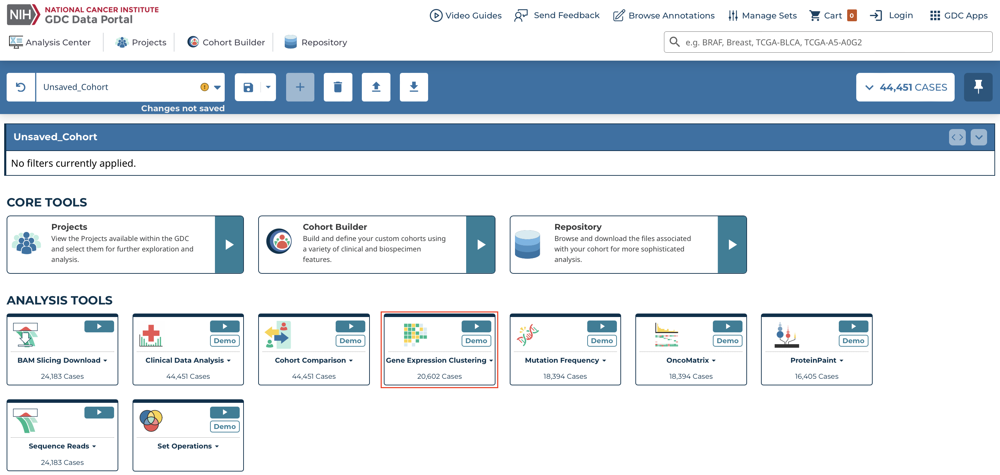](images/analysis_center_GEC_tool.png "Click to see the full image.")

Users can view publicly available genes as well as login with credentials to access controlled data.

There are four main panels in the Gene Expression Clustering tool: [controls](#Controls), [heatmap](#Heatmap), [variables](#Variables), and [legend](#Legend).

[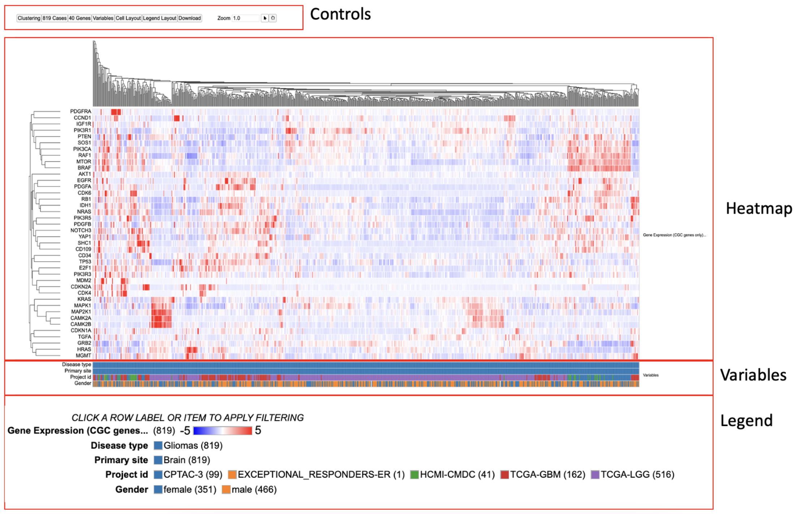](images/GEC_tool_features.png "Click to see the full image.")

### Controls

The control panel can modify the displayed data or the appearance of the matrix. Their functionalities are outlined below.

[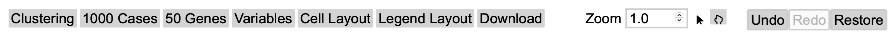](images/GEC_tool_controls.png "Click to see the full image.")

* __Clustering:__ Modify the default clustering of the heatmap (Average or Complete), alter the column and row dendrogram dimensions, and change the z-score cap
* __Cases:__ Adjust the visible characters of the case labels
* __Genes:__ Modify how cases are represented for each gene (Absolute, Percent, or None), row group and label lengths, rendering style, and the existing gene set
    * __Edit Group:__ Displays a panel of currently selected genes, which can be modified by clicking on a gene to remove it from the gene set, searching for a particular gene to add, loading top variably expressed genes, or loading a pre-defined gene set provided by the MSigDB database
    * __Create Group:__ Create a new gene set by searching for a particular gene, loading top mutated genes, or loading a pre-defined gene set provided by the MSigDB database
* __Variables:__ Search and select variables to add to the matrix below the heatmap
* __Cell Layout:__ Modify the format of the cells by changing colors, cell dimensions, and label formatting
* __Legend Layout:__ Alter the legend by changing the font size, dimensions, and other formatting preferences
* __Download:__ Download the plot in svg format
* __Zoom:__ Adjust the zoom level by using the up and down arrows on the input box, entering a number, or using the sliding scale to view the case labels
<!--
* __Undo:__ Undo changes made to the matrix (Coming Soon)
* __Redo:__ Redo changes made to the matrix (Coming Soon)
* __Restore:__ Restore the matrix to its default settings (Coming Soon)
-->

### Heatmap

The Gene Expression Clustering heatmap displays the active cohort's cases along the top horizontally, genes along the left column, and the z-score transformed gene expression value.

[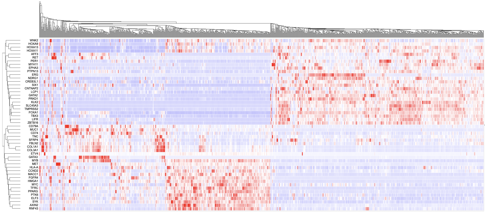](images/GEC_tool_heatmap.png "Click to see the full image.")

Hovering over a cell in the heatmap displays the case submitter_id, gene name, and gene expression value.

Clicking on a cell also gives users the option to launch the [Disco plot](oncomatrix.md#disco-plot), a circos plot displaying copy number data and consequences for that case.

#### Selecting cases on the cluster

Cases on the cluster can be selected by clicking on the dendrogram. Once part of the dendrogram is selected, users can choose to zoom in to the cases, list all highlighted cases, or create a cohort of the selected cases.

[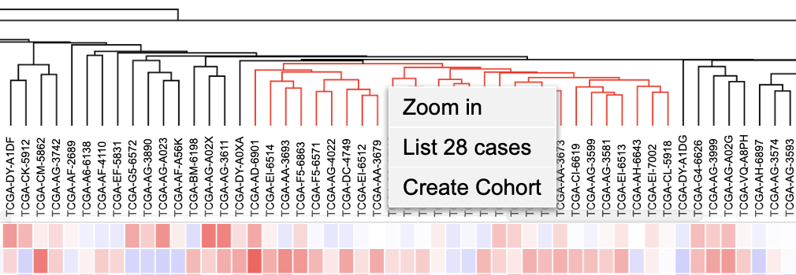](images/GEC_tool_heatmap_cases.png "Click to see the full image.")

Click on a case in the dendrogram to showcase the Disco plot or the GDC [Case Summary Page](getting_started.md#cohort-case-table).

In the column of genes on the left, click on a gene to rename it, launch the [ProteinPaint Lollipop plot](proteinpaint_lollipop.md), display the GDC [Gene Summary Page](mutation_frequency.md#gene-and-mutation-summary-pages), or remove the gene. The lollipop plot displays all cases across the GDC affected by SSMs in the selected gene.

[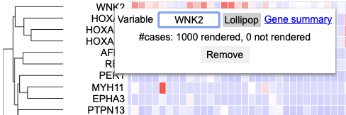](images/GEC_tool_gene.png "Click to see the full image.")

### Variables

Any variables added to the matrix appear below the heatmap. Users can hover over a cell to display the case submitter_id and their value for the given variable.

Click on a variable to rename it, edit it by excluding categories, replace it with a different variable, or remove it entirely.

### Legend

In addition to the color coding system for the gene expression values, the legend displays the number of cases from the active cohort in each category for all variables that are selected to appear in the matrix.

[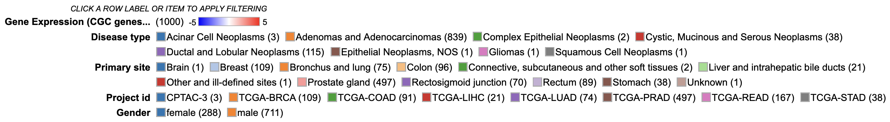](images/GEC_tool_legend.png "Click to see the full image.")

Users can click on a variable in the legend to hide a specific category, only show a specific category, or show all categories for the selected variable.

## Accessing the Tool

At the analysis center, click the 'Gene Expression Clustering' card to launch the heatmap.

[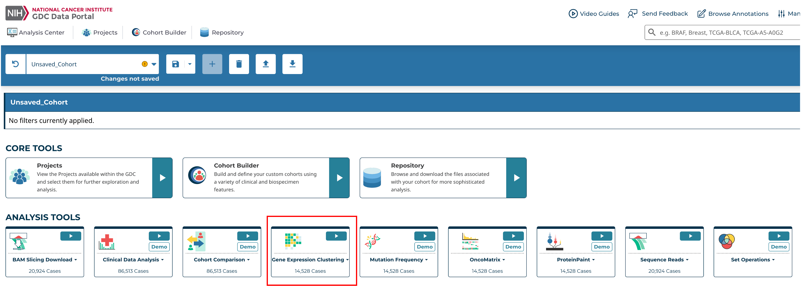](./images/geneexpclust/1-Analysis-center.png 'Click to see the full image.')

 View publicly available genes as well as login with credentials to access controlled data.

## Features

The following features are viewable once the default heatmap is loaded. The default heatmap shows all the glioma cases. There are four main panels as outlined in the figure i.e., the 'Controls', 'Heatmap', 'Variables' and the 'Legend'. Each of the features and functionalities are described in detail in the following sections.

[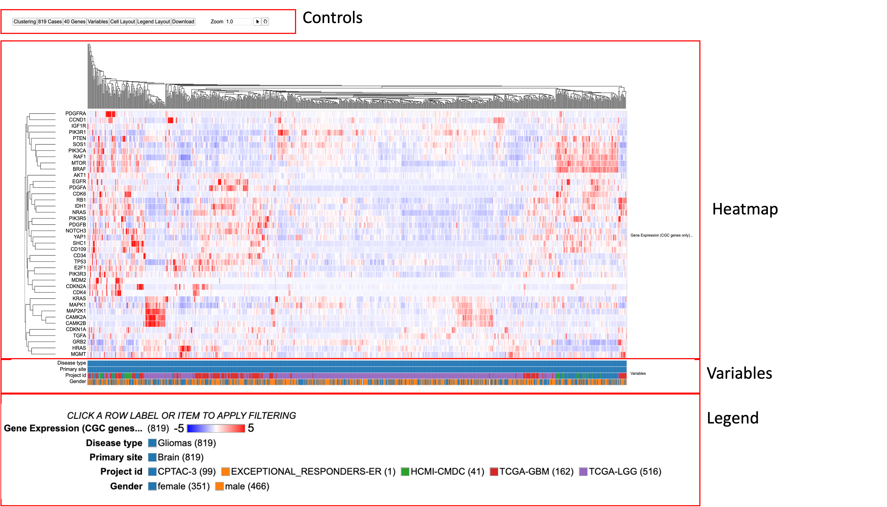](./images/geneexpclust/2-default-view.png 'Click to see the full image.')

## Controls

The control panel as shown has various functionalities with which users can change or modify the appearance of the matrix. The control panel provides flexibility and a wide range of options to maximize user control.

[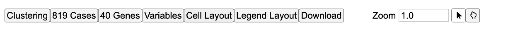](./images/geneexpclust/3-controls.png 'Click to see the full image.')

### Clustering

The clustering control button provides several options to modify the default clustering of the heatmap. Click on the button labeled 'Clustering' to display a menu with options as shown.

[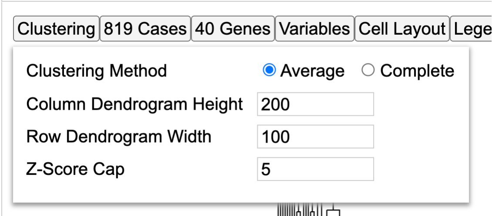](./images/geneexpclust/4-clustering-control.png 'Click to see the full image.')

#### Clustering method

Click on the 'Complete' option as highlighted to change the method of clustering. The heatmap will render again to show the complete clustering method.

[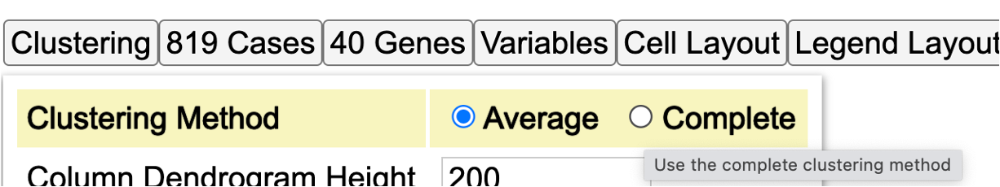](./images/geneexpclust/5-clustering-method.png 'Click to see the full image.')

The maximum height of the column dendrogram is shown in the next highlighted option as shown.

[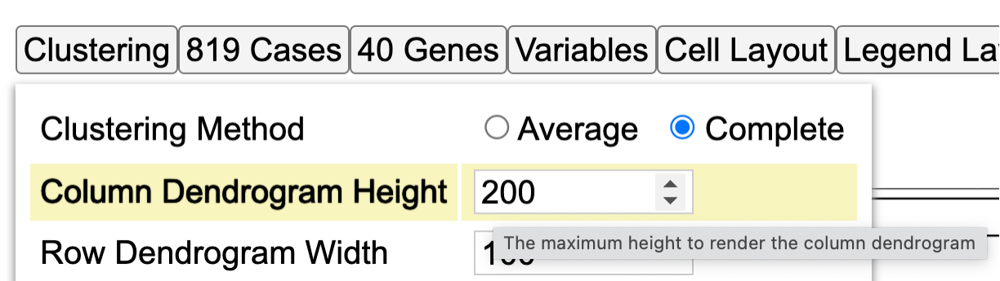](./images/geneexpclust/6-col-dendrogram-height.png 'Click to see the full image.')

Click or edit the number in the input box to adjust the height of the column dendrograms as shown.

[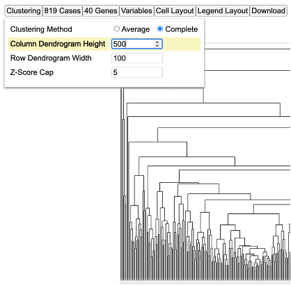](./images/geneexpclust/7-adj-dend-height.png 'Click to see the full image.')

#### Row Dendrogram Width

Similary, row dendrogram width can also be modified as per user requirement as shown.

[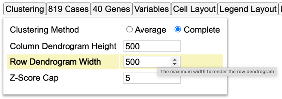](./images/geneexpclust/8-row-dend-height.png 'Click to see the full image.')

[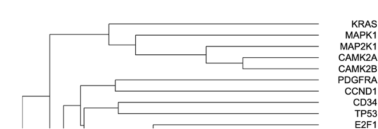](./images/geneexpclust/9-adj-row-dend-height.png 'Click to see the full image.')

#### Z-score Cap

Z scores are used to compare gene expression across samples. A Z-score of zero indicates that the gene's expression level is the same as the mean expression level across all samples, while a positive Z-score indicates that the gene is expressed at a higher level than the mean, and a negative Z-score indicates that the gene is expressed at a lower level than the mean.

User can increase or decrease the Z-score Capping. Increase the Z-score cap from 5 to 10 as shown. Samples with lower gene expression gets lighter to allow highlighting of clusters with higher expression values as shown in red in the heatmap.

[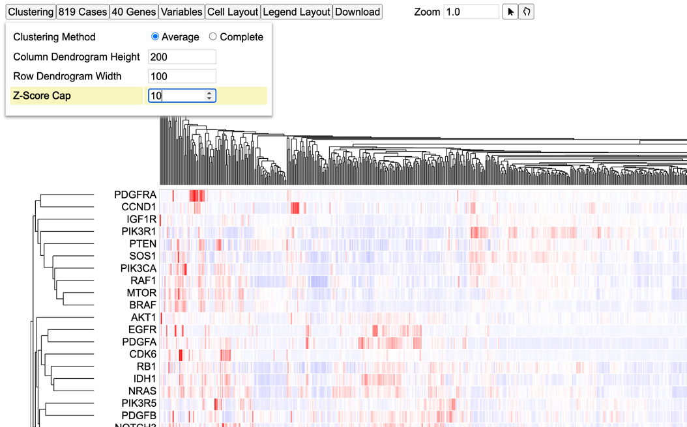](./images/geneexpclust/10-zscore-capt.png 'Click to see the full image.')

### Cases

#### Adjusting the zoom using the zoom buttons

Adjust the zoom level by using arrows on the input box or entering a number to be able to view the sample lables as shown.

[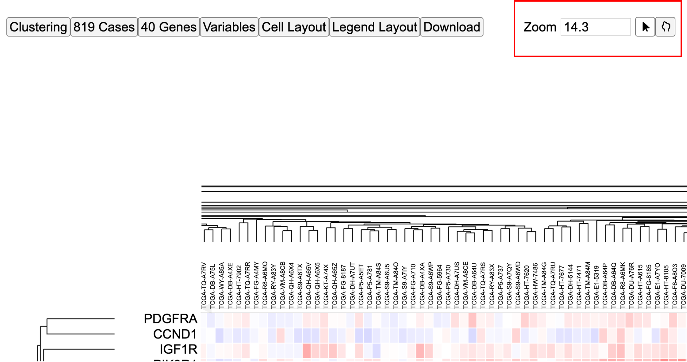](./images/geneexpclust/11-adj-zoom.png 'Click to see the full image.')

The 'Cases' control has the option 'Case Label Character Limit' to adjust the visible characters of these sample labels. The default is '32'. Change that to '10' to see the new limit applied to the sample labels as shown. Note that reducing the character limit truncates the labels.

[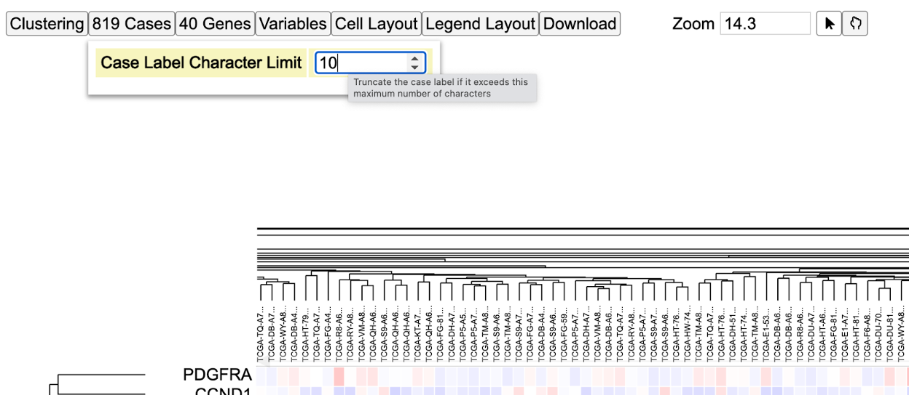](./images/geneexpclust/case-label-char.png 'Click to see the full image.')

### Genes

User can modify the existing default gene set by clicking the 'Genes' button in the controls as shown. This displays the option to edit genes as well as variables from the dropdown as shown.

[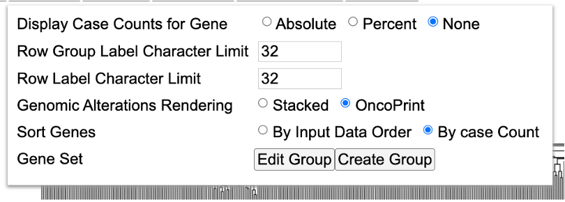](./images/geneexpclust/12-geneset-edit.png 'Click to see the full image.')

#### Modifying Genes

Click the 'Edit Group' button as shown in the 'Gene set' to display a panel of current selected genes.

[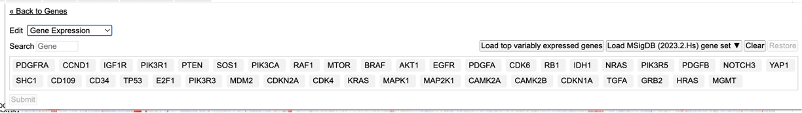](./images/geneexpclust/13-geneset-editing.png 'Click to see the full image.')

#### Add/Delete a gene

In the search box, type in any gene name for example 'Wee1' as shown and click submit.

[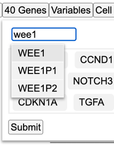](./images/geneexpclust/14-search-wee1.png 'Click to see the full image.')

The heatmap loads again after performing a clustering that includes 'WEE1' as shown.

[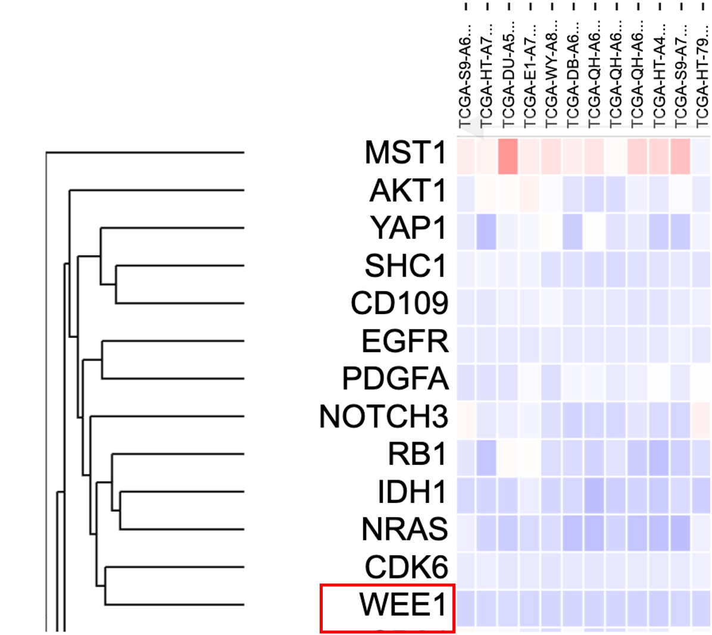](./images/geneexpclust/15-wee1-heatmap.png 'Click to see the full image.')

Click on the 'Edit' functionality again within the 'Gene set' menu option. To delete a gene, hover over the gene as shown. A red cross mark will appear as shown.

[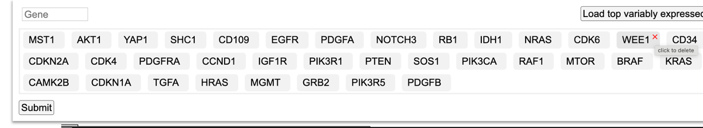](./images/geneexpclust/16-delete-genes.png 'Click to see the full image.')

Click on the gene 'Wee1' to delete the gene from the gene set. Click submit to redo the clustering.

#### Load top variably expressed genes

User has the option to load the top genes that are variably expressed. To do so, click on the 'Edit Group' button under the 'Genes' controls. Click on the button that reads 'Load top variably expressed genes'. The genes will change to the top most variable genes as shown in this selected cohort.

Click submit to reload the heatmap.

#### Load MSigDB gene set

The gene expression clustering tool also enables users to load a pre-defined gene set provided by the MSigDB database. The current version enabled is the latest. Click on the dropdown button 'Load MSigDB (2023.2.Hs) gene set' and choose one of the following gene sets as shown.

[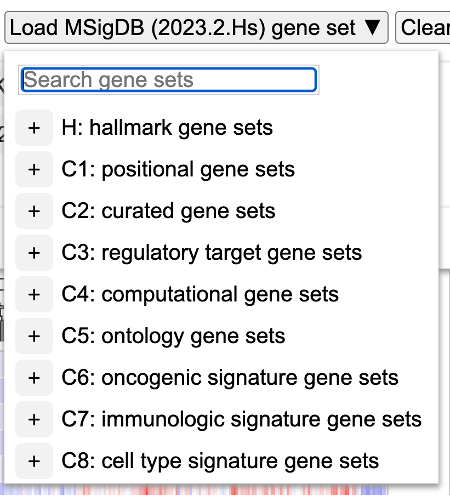](./images/geneexpclust/msigdb-tree.pngg 'Click to see the full image.')

For example, select a hallmark gene set for 'Hypoxia' as shown.

[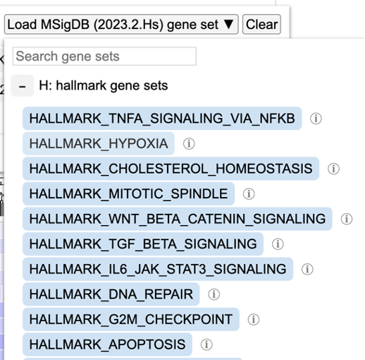](./images/geneexpclust/18-msigdb-tree.png 'Click to see the full image.')

Note the info icon next to the gene set that provides additional information about this gene set as well as a link to the database and the original publication PMID as shown.

[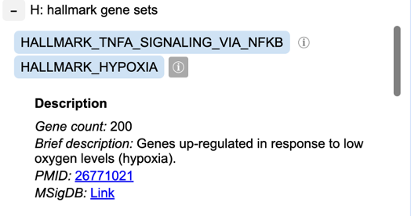](./images/geneexpclust/19-geneset-info-i.png 'Click to see the full image.')

Upon selecting a MSigDB gene set, the genes get updated as shown.

[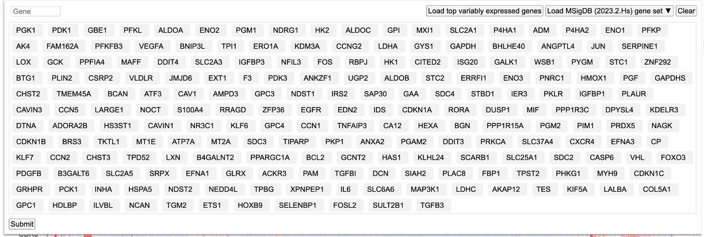](./images/geneexpclust/20-geneset-hypoxia.png 'Click to see the full image.')

Click 'Submit' to reload the heatmap with the new gene set from MSigDB.

#### Adding gene as a variable

User also has the option to add gene variant terms as variable to line up mutation consequences with clustered gene expression data.

To do so, click the button 'Genes' and click 'Edit Group'.

[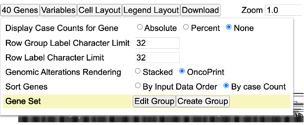](./images/geneexpclust/21-gene-as-var.png 'Click to see the full image.')

From the dropdown, select 'Variables' as shown.

[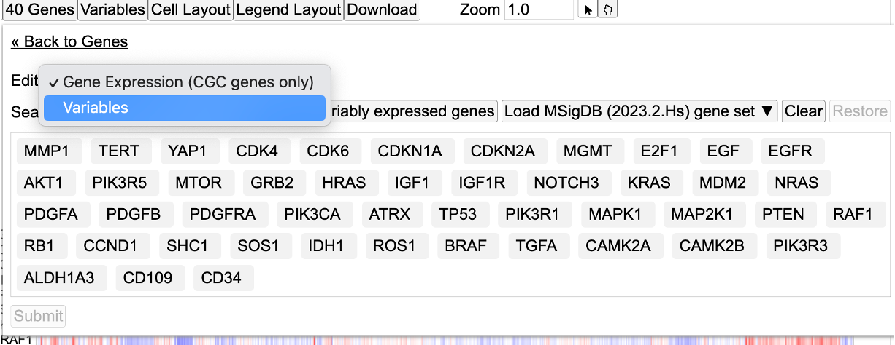](./images/geneexpclust/22-dropdown-var.png 'Click to see the full image.')

Search and select 'KRAS'.

[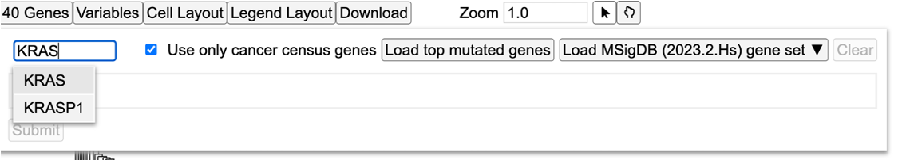](./images/geneexpclust/23-kras-var.png 'Click to see the full image.')

Click 'Submit' to reload the heatmap with the newly added KRAS gene as a variable. This displays the consequence type for the clustered samples for which KRAS has both the mutation calls and the gene expression data as shown.

### Variables

The button 'Variables' in the controls allows the user to search and select variables that get added below the heatmap.

Click the button 'Variables' to show the following dictionary tree.

[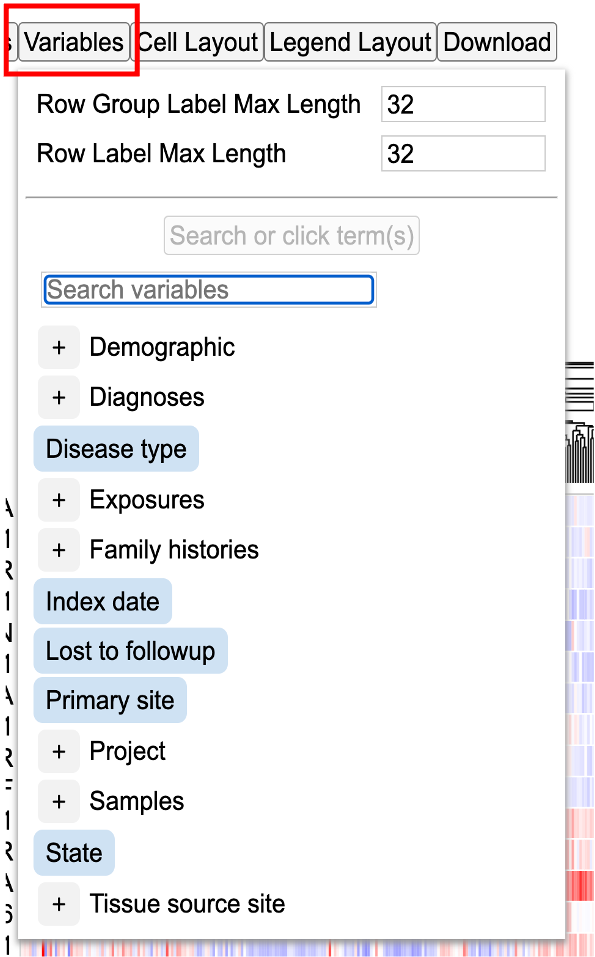](./images/geneexpclust/25-add-var.png 'Click to see the full image.')

Click the '+' button on the 'Demographic' to display all the terms under the parent term as shown. Select terms 'Ethnicity' and 'Year of birth' and click 'Submit 2 terms'.

[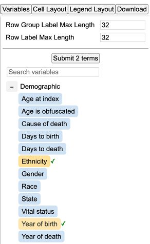](./images/geneexpclust/26-selecting-vars.png 'Click to see the full image.')

Once the variable terms are submitted, the heatmap will display the added variables as shown.

[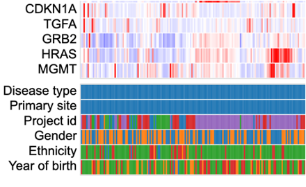](./images/geneexpclust/27-var-heatmap.png 'Click to see the full image.')

### Download

The control panel shows an option to download the plot as an svg after user has specified their customizations. Select the 'Download' button as shown below to save the svg.

[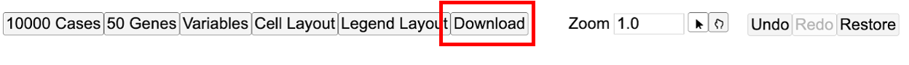](./images/geneexpclust/28-download-btn.png 'Click to see the full image.')

The download will get saved to the default download folder as shown at the bottom of the browser window.

## Heatmap

### Selecting cases on the cluster

Cases on the cluster can be selected interactively by clicking on the column dendrograms. Click on the dendrograms above the heatmap as shown. The dendrograms get highlighted in red.

[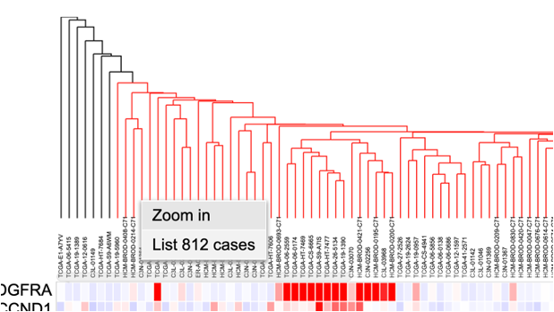](./images/geneexpclust/30-selecting-sample-cluster.png 'Click to see the full image.')

Once the dendrograms are selected, two options are displayed. A user can choose to zoom in the cases or list all the cases highlighted in the dendrograms.

### Clicking a case column

Click on a case label to display the options as shown.

[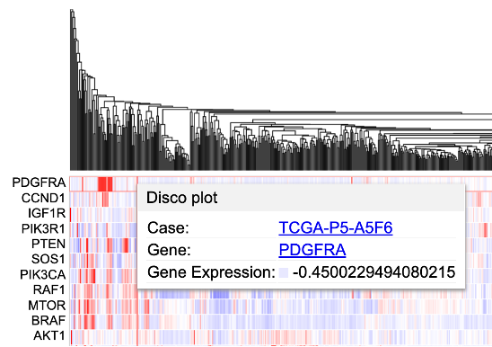](./images/geneexpclust/31-clicking-case-col.png 'Click to see the full image.')

User may choose to launch:
- a circos plot by clicking 'Disco plot' button,
- a webpage containing information about the case by clicking the case id
- Gene summary page by clicking on the gene name 'PDGFRA'

### Clicking a gene label

Click on a gene row label to display the following options

[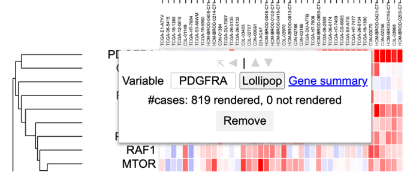](./images/geneexpclust/32-clicking-gene-label.png 'Click to see the full image.')

User can choose to change variable name by deleting and typing in a new name in the box where 'PDGFRA' is currently applied. User may also choose to launch the lollipop plot or gene summary page or remove this row entirely.

### Hovering over/Clicking a cell

Hover over a cell of the heatmap to show information about the case. The information displayed shows the case id, the gene name (CCND1) and the z-score transformed value (4.04..)

[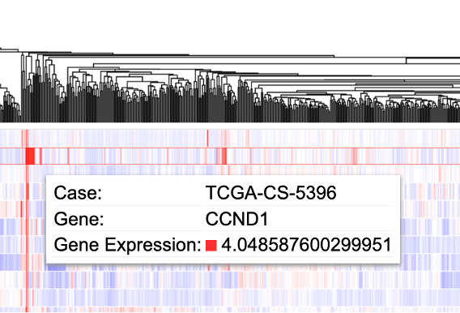](./images/geneexpclust/33-hover-over-case.png 'Click to see the full image.')

## Variables

### Clicking a Variable

Click on a variable (for example 'Project id' here) row label to display the options as shown.

[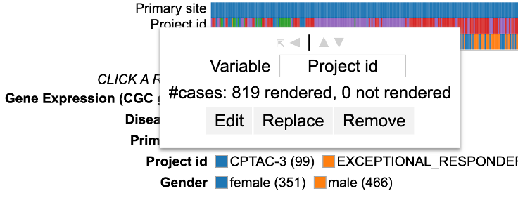](./images/geneexpclust/34-clicking-var.png 'Click to see the full image.')

User can change the variable name (input box), edit the variable to exclude categories ('Edit' button), replace the variable by another one ('Replace' button) or remove the row containing the variable entirely by clicking the 'Remove' button.

### Renaming a variable

To rename a variable, edit the default name of the variable in the input box as shown.

[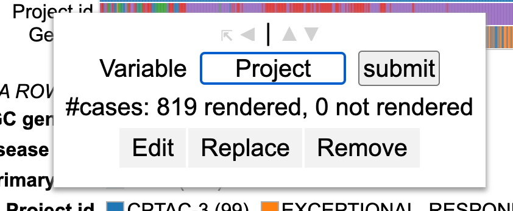](./images/geneexpclust/35-renaming-var.png 'Click to see the full image.')

After renaming the variable as per user preference, click 'submit'. The row now shows a new variable name.

### Editing a variable

To edit groups within the variable, click the 'Edit' button. Now, user can drag the categories from group 1 into group 2 to create two separate groups and also have the option to exclude a category. After making the choice, click 'Apply' to reload the chart.

[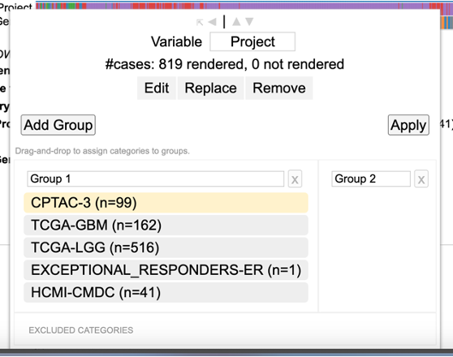](./images/geneexpclust/36-editing-var.png 'Click to see the full image.')

### Replacing a variable

To replace a variable, click on the row label for that variable and click 'Replace'. This shows the GDC dictionary from which a user can select a variable of choice as shown.

[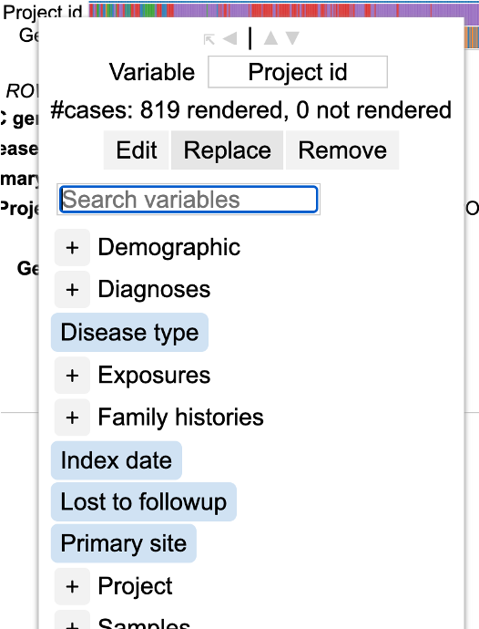](./images/geneexpclust/37-replacing-var.png 'Click to see the full image.')

### Removing a variable

To remove a row containing a variable entirely, click on the row label for that variable and click 'Remove'. This removes the entire row from the heatmap.

[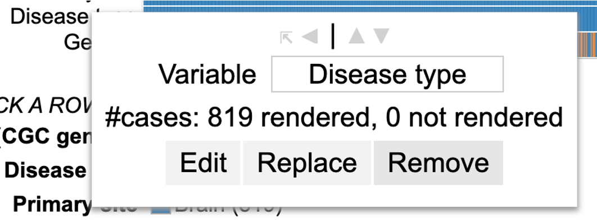](./images/geneexpclust/38-remove-var.png 'Click to see the full image.')

## Legend

### Interacting with legend filters

Variables can be filtered upon via the legend. Click a legend item to display the following options. User may choose to 'Hide', 'Show only', or 'Show all' categories from a selected variable. This would allow the user to filter down on the category of choice.

[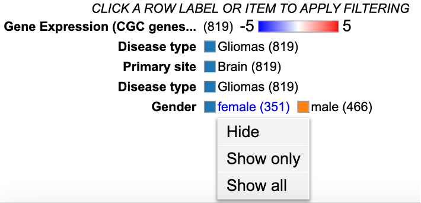](./images/geneexpclust/39-clicking-legend-icons.png 'Click to see the full image.')
