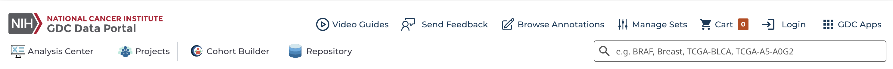
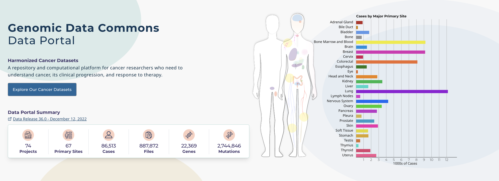
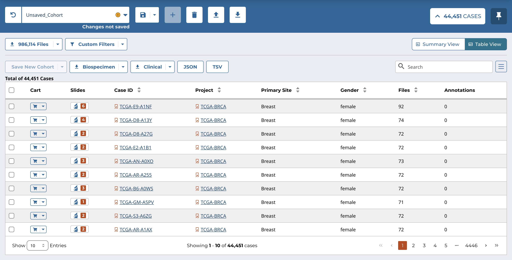
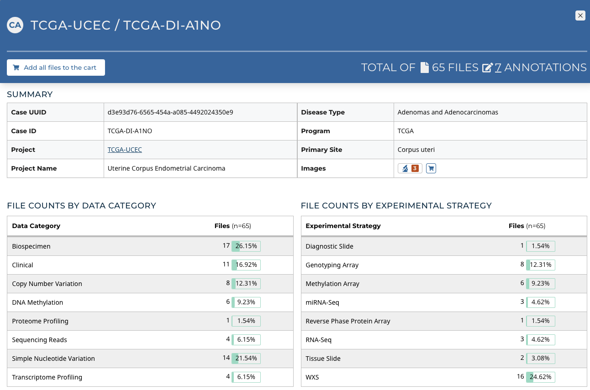
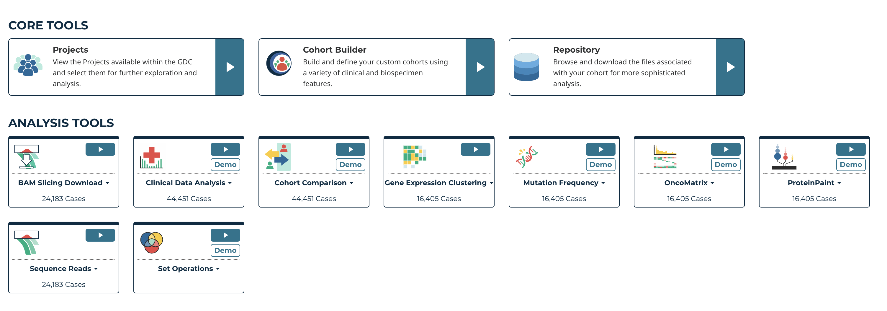
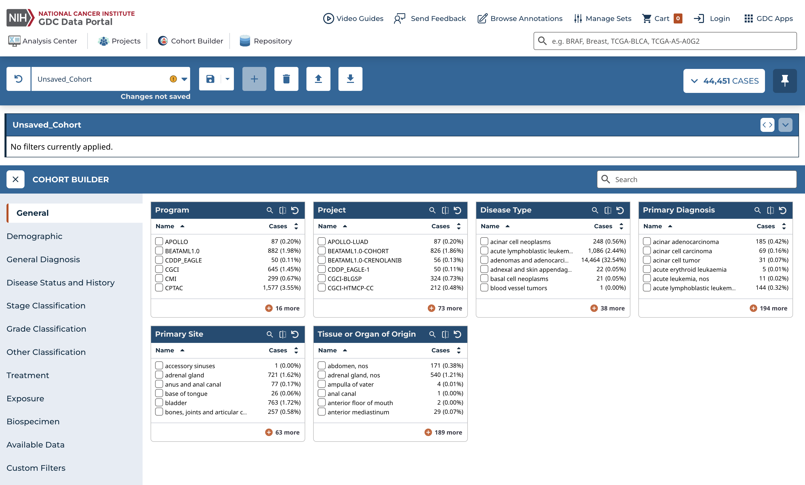
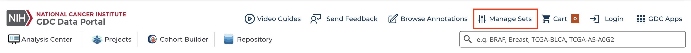

# Getting Started with the GDC Data Portal

## Accessing the GDC Data Portal
First, go to [https://portal.gdc.cancer.gov/](https://portal.gdc.cancer.gov/).

## GDC Data Portal Header

The header of the GDC Data Portal contains frequently used links and features.

On the upper-left is the GDC Data Portal logo, which links to the home page of the GDC Data Portal. Below the logo are links in the following order:

* [Analysis Center](analysis_center.md): the central hub for accessing all the tools in the GDC Data Portal
* [Projects](Projects.md): allows exploration of all the projects within the GDC Data Portal
* [Cohort Builder](cohort_builder.md): the Cohort Builder tool consists of a variety of clinical and biospecimen filters for building custom cohorts for analysis
* [Repository](Repository.md): allows exploration of files associated with a cohort

On the right are the following features:

* **Video Guides**: [videos](Video_Tutorials.md) that demonstrate the various features of the Data Portal
* **Send Feedback**: send feedback to the GDC team
* **Browse Annotations**: the Annotations Browser, where the user can view and search for [annotations](../../Encyclopedia/pages/Annotations.md) that may provide additional context when analyzing GDC data
* **Manage Sets**: review gene and mutation sets that have been saved, upload new sets, and delete existing sets
* **Cart**: the data files that are ready for download
* **Login**: allows authentication for access to [controlled access datasets](../../Encyclopedia/pages/Controlled_Access.md). Once authentication is successful, the eRA Commons username will be displayed in place of the "Login" button. Clicking on the username will then allow users to see which projects they have access to and to download an [authentication token](../../Data/Data_Security/Data_Security.md#authentication-tokens) for use with the [GDC Data Transfer Tool](../../Data_Transfer_Tool/Users_Guide/Getting_Started.md) and the [API](../../API/Users_Guide/Getting_Started.md).
* **GDC Applications**: contains links to other GDC sites and applications
* **Search**: search for projects, cases, files, genes, mutations, and annotations within the GDC Data Portal

## Cohorts

The GDC Data Portal 2.0 is a cohort-centric cancer research platform. Users can create custom cohorts based on specific projects, primary sites, disease types, or any combination of clinical, biospecimen, and molecular features. Custom cohorts can then be used with various tools in the Analysis Center to perform further analysis. Files from custom cohorts can also be downloaded for further analysis with other research tools.

If the user does not already have a custom cohort when they are in the Analysis Center, a custom cohort ("Unsaved_Cohort") containing all cases in the GDC will be automatically created. This allows the user to explore the Analysis Center without first needing to create a cohort.

Additional cohorts can be created using the main toolbar in the Analysis Center. Cohorts can also be saved or deleted using the main toolbar. See the section below on the Analysis Center for more information on the main toolbar.

Unsaved cohorts are not retained once the browser tab is closed. Saved cohorts continue to be accessible as long as the same browser is used and should be available through data releases.

## Home Page

The Analysis Center can be accessed by clicking on the "Explore Our Cancer Datasets" button on the left side of the home page.

On the right side of the home page are a human anatomical outline and a bar graph. Choosing a site on the outline or graph will lead the user to the Analysis Center and automatically create a custom cohort consisting of cases corresponding to that site.

## Analysis Center

The Analysis Center can be accessed by clicking on the corresponding link in the GDC Data Portal header, on the "Explore Our Cancer Datasets" button on the home page, or on one of the sites in the human anatomical outline or bar graph.

The Analysis Center has the following sections:

* **Main Toolbar**: manage and create custom cohorts
* **Query Expressions**: displays the filters applied to the current cohort
* **Analysis Tools**: all analysis tools available are located in the Analysis Center as individual cards. When individual analysis tools are launched, they are displayed in this section of the [Analysis Center](analysis_center.md).

### Main Toolbar ##

By default, the main toolbar is always visible in the Analysis Center and Tools. Users can use the main toolbar to view information and perform a number of actions on their cohorts.

The name of the current cohort is displayed in a field on the left. Previously created cohorts can be accessed by choosing this field and selecting their names from the dropdown menu.

The main toolbar also contains a set of buttons that are used to manage or create new cohorts. To the left of the cohort name is the "Discard Changes" button, which discards unsaved changes that have been made to the current cohort.

To the right of the cohort name are the following buttons:

* **Save Cohort:** Two options for saving cohorts are available in the dropdown menu. Select the "Save" option to save the active cohort and any changes made to it. Select the "Save As" option to save the active cohort, along with any changes made to it, as a new cohort. Cohorts with unsaved changes have a yellow exclamation mark icon displayed next to their names. Custom cohorts that are saved should persist through releases and continue to be accessible if the same browser is used. **It is recommended that users export and securely store any cohort that cannot be easily recreated in case the browser session is cleared.**
* **Create New Unsaved Cohort:** Adds a new unsaved cohort with all the cases in the GDC and changes the active cohort to this new cohort
* **Delete Cohort:** Deletes the current active cohort.  This action cannot be undone.
* **Import New Cohort:** Imports a set of cases as a cohort. These can be imported as a plain text list of UUIDs or submitter_ids (barcodes).
* **Export Cohort:**  Exports the active cohort to a file. A cohort will be exported as a list of UUIDs.

Two other buttons are located on the far right of the toolbar:

* __Expand/Collapse:__ Displays the number of cases associated with the current cohort. Displays summary charts of the current cohort, as well as a table of the cases in the current cohort. The Summary View and Table View buttons can be used to toggle between a display of the summary charts and the table.
* __Pin/Unpin Cohort Bar:__ Toggles between pinning the main toolbar to the top of the Analysis Center so that it is always in view, and unpinning it from the top of the Analysis Center.

#### Cohort Summary Charts

Cohort summary charts display graphics that show the number of cases with each value of a set of commonly used properties. The following buttons are available at the top of the summary charts:

* __Files:__  Displays the number of files associated with the active cohort and provides the ability to add these files to the cart, download a manifest, or download metadata associated with the files
* __Custom Filters:__ Allows for the cohort to be filtered by a custom set of cases, mutations, or genes
* __Biospecimen/Clinical:__ Downloads the biospecimen/clinical metadata for the cohort in JSON or TSV format

In the default view, the number of cases for the top five most common values are displayed. Other values can be searched by choosing the magnifying glass button at the top right of each card.

The middle button at the top right of each card displays the selection view. The selection view displays the same values as the default view as a number instead of a graph. In addition, each value can be selected to filter the active cohort for cases with a specific set of values.

#### Cohort Case Table

The case table displays a list of cases in the active cohort along with associated metadata.  It also allows for each case to be selected with a checkbox for saving a new cohort or exporting metadata. All cases on the current page of the table can be selected at the same time by using the checkbox in the header. Note that expanding the case table, with the cohort bar pinned, may obscure the view of the analysis center or analysis tools.

The top right of the case table features a search function that can be used to query specific cases. The following buttons are available at the top left of the case table:

* __Save New Cohort:__  Allows for a new cohort to be created based on the selected cases from the table. The new cohort can comprise only the selected cases, the selected cases added to the active cohort, or the selected cases subtracted from the active cohort.
* __Biospecimen/Clinical:__ Downloads the biospecimen/clinical metadata for the cohort in JSON or TSV format. When no cases are selected, the metadata pertains to the entire cohort. When cases are selected, the metadata pertains to only the selected cases.
* __JSON/TSV:__ Downloads the information in the case table in JSON or TSV format

The case summary panel can be collapsed by selecting the 'Collapse' button that replaces the 'Expand' button.

### Case Summary Page

Users can launch the Case Summary Page by clicking a Case ID in the Cohort Case Table. The Case Summary Page displays case details including the project and disease information, data files that are available for that case, and the experimental strategies employed. A button in the top-left corner of the page allows the user to add all files associated with the case to the file cart.

### Import New Cohort

The Import New Cohort button in the main toolbar allows for a set of cases to be imported. These can be entered directly into the text box as a plain text list of UUIDs or submitter_ids (barcodes) or imported as a CSV, TSV, or TXT file. Users can hover over the orange (i) to verify accepted case identifiers, delimiters, and file formats.

Clicking the `Submit` button will prompt users to name and save their new cohort, after which it will be made the active cohort.

### Query Expressions
The query expressions section displays information about the filters applied to the current cohort and allows convenient operations to be performed on those filters.

In the top-left corner of this section is the name of the current cohort. To its right is a "Clear All" option, which will remove all filtering applied on the current cohort.

On the top-right corner of this section are the following two buttons:

* **Collapse/Expand Selected Values**: by default, a full list of all the values that have been selected for each property is displayed. This button allows the user to switch from this default expanded view to a minimized view, which only displays the number of values selected for each property.
* **Collapse/Expand Filters Section**: by default, a maximum of three rows will be displayed at a time for the filters selected for the current cohort. This button allows the user to switch from displaying a maximum of three rows for the selected filters to displaying an unlimited number of rows. This button is only enabled if the display of the selected filters for the current cohort exceeds three rows.

The main area of the query expressions section displays the filters applied to the active cohort. Individual values can be removed by clicking on them. Properties can be removed by clicking on the "X" to the extreme right of each property group of values.

If desired, selected values can be collapsed by clicking on the left arrow on the left of the values. When collapsed, values can be expanded again by clicking on the right arrow.

### Analysis Center Tools

Available tools are displayed under the Query Expression section of the Analysis Center.

Each analysis tool is showcased within a tool 'card', which has several items related to the analysis tool such as:

* A green 'Play' button to launch the analysis tool on the given cohort
* A 'Demo' button that launches a demonstration of the analysis tool on an example cohort
* Clicking on the name of the analysis tool in the tool card toggles a drop down description of the analysis tool
* The number of cases from the cohort that the analysis can be performed on is at the bottom of the card

## Cohort Builder and Cohort Analysis ##
To build and analyze a cohort of interest using an analysis tool in the Analysis Center:

1. Choose the Cohort Builder icon on either the GDC Data Portal header, or click on the Cohort Builder card in the Analysis Center.  The [Cohort Builder](cohort_builder.md) will appear on the screen.
2. Create a custom cohort based on filters available in the Cohort Builder

3. Either choose the Analysis Center icon on the GDC Data Portal header, or click on the "X" on the left of the Cohort Builder header. All the tools in the [Analysis Center](analysis_center.md) will be displayed on the screen.
4. Choose an analysis tool from the list of tools in the Analysis Center to perform an analysis of a cohort

## Manage Sets ##

The `Manage Sets` button at the top of the GDC Portal stores sets of genes or mutations of interest.  On this page, users can review the sets that have been saved as well as upload new sets and delete existing sets.

### Upload Sets

Clicking the `Create Set` button shows options for creating Gene or Mutation sets.  

Upon clicking one of the menu items, users are shown a dialog where they can enter unique identifiers (i.e. gene symbols, mutation UUIDs, etc.) that describe the set.

Clicking the `Submit` button will add the set of items to the list of sets on the Manage Sets page.

### Export Sets

Users can export selected sets on this page by first clicking the checkboxes next to each set, then clicking the `Export selected` button at the top of the table.

A text file containing the ID of each gene or UUID of each mutation is downloaded after clicking this button.

### Review Sets

There are a few buttons in the list of sets that allows a user to get further information about each one.

* __# Items__: Clicking the button under the # Items column launches a table with Gene ID and Symbol for gene sets or Mutation ID and Consequence for mutation sets

* __Delete/Download__: To the right of the # Items column are buttons that will delete the set or download the list as a TSV file
