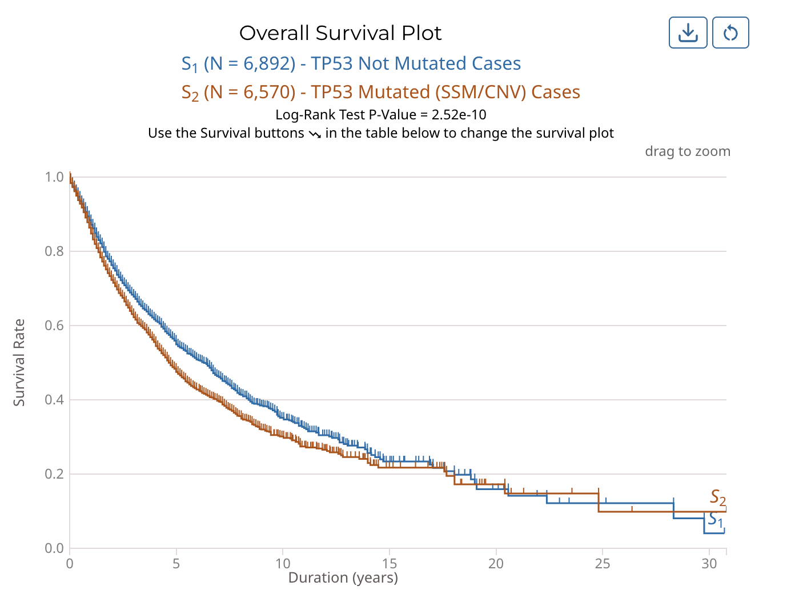
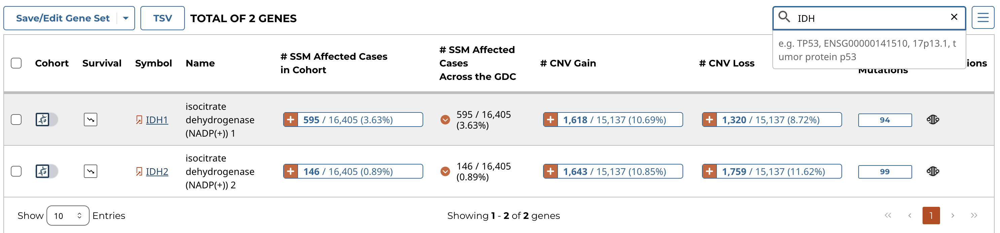
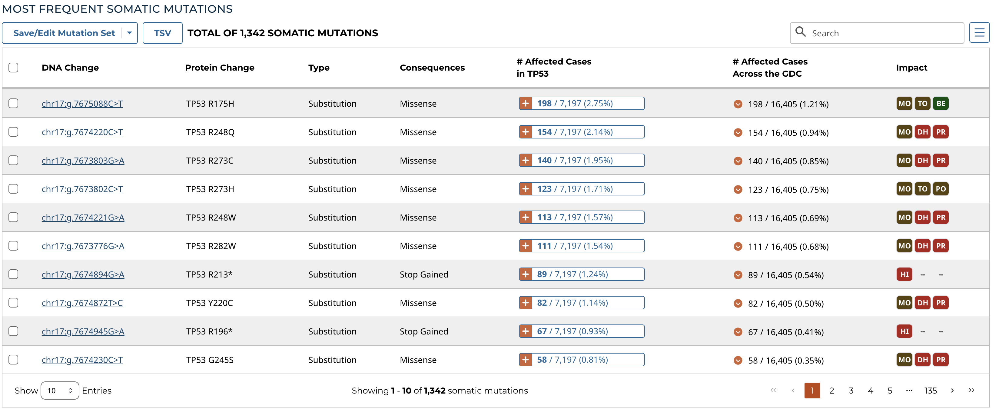

# Mutation Frequency

The Mutation Frequency tool visualizes the most frequently mutated genes and the most frequent somatic mutations for the active cohort. To launch the Mutation Frequency tool, click on its card from the Tools section of the Analysis Center.

This tool includes the following visualizations:

## Mutated Genes Histogram

The most frequently mutated genes are represented with a histogram that shows the percentage of cases affected within the active cohort. The histogram can be downloaded as an image (SVG/PNG) or raw data (JSON) using the button at the top right of the graphic.

## Survival Plot for Mutated Genes and Mutations

The mutation frequency survival plot is represented with a Kaplan-Meier curve for the active cohort. This can also be separated into two curves based on cases with and without a specific mutation or mutated gene. The Log-Rank Test p-value is also displayed here. The survival plot can be downloaded as an image (SVG/PNG) or raw data (JSON/TSV) and the view can be reset using the buttons at the top right of the graphic.

## Gene/Mutation Table

<!-- The gene/mutation table displays the most frequently mutated genes or the most frequent mutations in the active cohort by percent frequency in descending order. Additional columns show CNV information as well as the number of affected cases. The "Cohort" toggle can be used to filter the current cohort by a specific gene or mutation, and the "Survival" button allows the user to modify the survival plot. The red arrow button allows for the percentage of affected cases to be displayed on a project-level. The data displayed in the table can be exported as a JSON or TSV using the buttons at the top left of the table.

Additionally, the table can be searched using the field at the top right of the table.

 -->

The gene/mutation table displays the most frequently mutated genes or the most frequent mutations in the active cohort by percent frequency in descending order. Additional columns show CNV information as well as the number of affected cases. The "Cohort" toggle can be used to filter the current cohort by a specific gene or mutation, and the "Survival" button allows the user to modify the survival plot. The red arrow button allows for the percentage of affected cases to be displayed on a project-level. The data displayed in the table can be exported as a JSON or TSV using the buttons at the top left of the table. Additional cohorts can be created using buttons located within the table.

Additionally, the table can be searched using the field at the top right of the table.

### Gene and Mutation Summary Pages

Users can click on the Symbol links in the Genes Table and the DNA Change links in the Mutations Table to view the Gene and Mutation Summary Pages, respectively. These pages display information about specific genes and mutations, along with visualizations and data showcasing the relationship between themselves, the projects, and cases within the GDC. The gene and mutation data that is visualized on these pages are produced from the Open-Access MAF files available for download on the GDC Portal.

Gene Summary Pages describe each gene with mutation data and provide results related to the analyses that are performed on these genes.  

__Summary__

The summary section of the gene page contains the following information:

* __Symbol:__ The gene symbol
* __Name:__ Full name of the gene
* __Synonyms:__ Synonyms of the gene name or symbol, if available
* __Type:__ A broad classification of the gene
* __Location:__ The chromosome on which the gene is located and its coordinates
* __Strand:__ If the gene is located on the forward (+) or reverse (-) strand
* __Description:__ A description of gene function and downstream consequences of gene alteration
* __Annotation:__ A notation/link that states whether the gene is part of [The Cancer Gene Census](http://cancer.sanger.ac.uk/census/)

__External References__ 

A list with links that lead to external databases with additional information about each gene is displayed here. These external databases include: [Entrez](https://www.ncbi.nlm.nih.gov/gquery/), [Uniprot](http://www.uniprot.org/), [Hugo Gene Nomenclature Committee](http://www.genenames.org/), [Online Mendelian Inheritance in Man](https://www.omim.org/), [Ensembl](http://may2015.archive.ensembl.org/index.html), and [CIViC](https://civicdb.org/home).

__Cancer Distribution__ 

A table and two bar graphs (one for mutations, one for CNV events) show how many cases are affected by mutations and CNV events within the gene as a ratio and percentage. Each row/bar represents the number of cases for each project.  The final column in the table lists the number of unique mutations observed on the gene for each project.

__Most Frequent Mutations__

The 20 most frequent mutations in the gene are displayed as a bar graph that indicates the number of cases that share each mutation.  

A table is displayed below that lists information about each mutation including:

* __DNA Change:__ The chromosome and starting coordinates of the mutation are displayed along with the nucleotide differences between the reference and tumor allele
* __Protein Change:__ The gene and amino acid change
* __Type:__ A general classification of the mutation
* __Consequences:__ The effects the mutation has on the gene coding for a protein (i.e. synonymous, missense, non-coding transcript)
* __# Affected Cases in Gene:__ The number of affected cases, expressed as number across all mutations within the Gene
* __# Affected Cases Across GDC:__ The number of affected cases, expressed as number across all projects. Choosing the arrow next to the percentage will expand the selection with a breakdown of each affected project
* __Impact:__ A subjective classification of the severity of the variant consequence. This is determined using [Ensembl VEP](http://www.ensembl.org/info/genome/variation/predicted_data.html), [PolyPhen](http://genetics.bwh.harvard.edu/pph/), and [SIFT](http://sift.jcvi.org/). The categories are outlined [here](https://docs.gdc.cancer.gov/Data/File_Formats/MAF_Format/#impact-categories).

*Note: The Mutation UUID can be displayed in this table by selecting it from the Customize Columns button, represented by three parallel lines*

The Mutation Summary Page contains information about one somatic mutation and how it affects the associated gene. Each mutation is identified by its chromosomal position and nucleotide-level change.

__Summary__

* __UUID:__ A unique identifier (UUID) for this mutation
* __DNA Change:__ Denotes the chromosome number, position, and nucleotide change of the mutation
* __Type:__ A broad categorization of the mutation
* __Reference Genome Assembly:__ The reference genome in which the chromosomal position refers to
* __Allele in the Reference Assembly:__ The nucleotide(s) that compose the site in the reference assembly
* __Functional Impact:__ A subjective classification of the severity of the variant consequence.

__External References__

  A separate panel contains links to databases that contain information about the specific mutation. These include [dbSNP](https://www.ncbi.nlm.nih.gov/projects/SNP/), [COSMIC](http://cancer.sanger.ac.uk/cosmic), and [CIViC](https://civicdb.org/home).

__Consequences__

The consequences of the mutation are displayed in a table.  The set of consequence terms, defined by the [Sequence Ontology](http://www.sequenceontology.org).

The fields that describe each consequence are listed below:

  * __Gene:__ The symbol for the affected gene
  * __AA Change:__ Details on the amino acid change, including compounds and position, if applicable
  * __Consequences:__ The biological consequence of each mutation
  * __Coding DNA Change:__ The specific nucleotide change and position of the mutation within the gene
  * __Impact:__ VEP, SIFT, and/or PolyPhen Impact ratings
  * __Gene Strand:__ If the gene is located on the forward (+) or reverse (-) strand
  * __Transcript:__ The transcript(s) affected by the mutation. Each contains a link to the [Ensembl](https://www.ensembl.org) entry for the transcript 

__Cancer Distribution__

A table and bar graph shows how many cases are affected by the particular mutation. Each row/bar represents the number of cases for each project.

The table contains the following fields:

  * __Project__: The ID for a specific project
  * __Disease Type__: The disease associated with the project
  * __Primary Site__: The anatomical site affected by the disease
  * __# SSM Affected Cases__: The number of affected cases and total number of cases displayed as a fraction and percentage

## Custom Gene and Mutation Filters

The `+ Add Custom Gene Filters` button in the left panel of the Mutation Frequency tool allows users to filter mutation frequency by genes. Users can enter unique identifiers (i.e. gene symbols, gene IDs, etc.) directly into the text box as a plain text list or upload a list of unique identifiers as a CSV, TSV, or TXT file. Users can hover over the orange (i) to verify accepted gene identifiers, delimiters, and file formats.

The `+ Add Custom Mutation Filters` button allows users to filter mutation frequency by mutations. Users can enter unique identifiers (i.e. mutation UUIDs, etc.) directly into the text box as a plain text list or upload a list of unique identifiers as a CSV, TSV, or TXT file. Users can hover over the orange (i) to verify accepted mutation identifiers, delimiters, and file formats.

## Mutation Frequency Facet Filters

A set of frequently-used properties are available to filter genes and mutations in the left panel of the Mutation Frequency tool. Using each of these filters will dynamically change the graphics and table to represent the filtered data.

* __Biotype:__  Classification of the type of gene according to Ensembl. The biotypes can be grouped into protein coding, pseudogene, long noncoding and short noncoding. Examples of biotypes in each group are as follows:
    * __Protein coding:__ IGC gene, IGD gene, IG gene, IGJ gene, IGLV gene, IGM gene, IGV gene, IGZ gene, nonsense mediated decay, nontranslating CDS, non stop decay, polymorphic pseudogene, TRC gene, TRD gene, TRJ gene, TRV gene.
    * __Pseudogene:__ Disrupted domain, IGC pseudogene, IGJ pseudogene, IG pseudogene, IGV pseudogene, processed pseudogene, transcribed processed pseudogene, transcribed unitary pseudogene, transcribed unprocessed pseudogene, translated processed pseudogene, translated unprocessed pseudogene, TRJ pseudogene, TRV pseudogene, unprocessed pseudogene.
    * __Long noncoding:__ 3 prime overlapping ncrna, ambiguous orf, antisense, antisense RNA, lincRNA, macro lincRNA, ncrna host, processed transcript, sense intronic, sense overlapping.
    * __Short noncoding:__ miRNA, miRNA pseudogene, miscRNA, miscRNA pseudogene, Mt rRNA, Mt tRNA, rRNA, scRNA, snlRNA, snoRNA, snRNA, tRNA, tRNA pseudogene, vaultRNA.
* __Is Cancer Gene Census:__ Whether or not a gene is part of [The Cancer Gene Census](http://cancer.sanger.ac.uk/census/). Note that this is switched on as a default.
* __Impact:__ A subjective classification of the severity of the variant consequence. These scores are determined using the following three tools:
    * __[VEP](http://useast.ensembl.org/info/genome/variation/prediction/index.html):__
        * __HIGH (H):__ The variant is assumed to have high (disruptive) impact in the protein, probably causing protein truncation, loss of function or triggering nonsense mediated decay.
        * __MODERATE (M):__ A non-disruptive variant that might change protein effectiveness.
        * __LOW (L):__ Assumed to be mostly harmless or unlikely to change protein behavior.
        * __MODIFIER (MO):__ Usually non-coding variants or variants affecting non-coding genes, where predictions are difficult or there is no evidence of impact.
    * __[PolyPhen](http://genetics.bwh.harvard.edu/pph/):__
        * __probably damaging (PR):__ It is with high confidence supposed to affect protein function or structure.
        * __possibly damaging (PO):__ It is supposed to affect protein function or structure.
        * __benign (BE):__ Most likely lacking any phenotypic effect.
        * __unknown (UN):__ When in some rare cases, the lack of data does not allow PolyPhen to make a prediction.
    * __[SIFT](http://sift.jcvi.org/):__
        * __tolerated:__ Not likely to have a phenotypic effect.
        * __tolerated_low_confidence:__ More likely to have a phenotypic effect than 'tolerated'.
        * __deleterious:__ Likely to have a phenotypic effect.
        * __deleterious_low_confidence:__ Less likely to have a phenotypic effect than 'deleterious'.
* __Consequence Type:__  Consequence type of this variation; [sequence ontology](http://www.sequenceontology.org/) terms.
* __Type:__ A general classification of the mutation.

### Saving a Gene or Mutation Set

After filtration, a set of genes or mutations can be saved by choosing the "Save/Edit Gene Set" or "Save/Edit Mutation Set" button at the top left of the table.  
