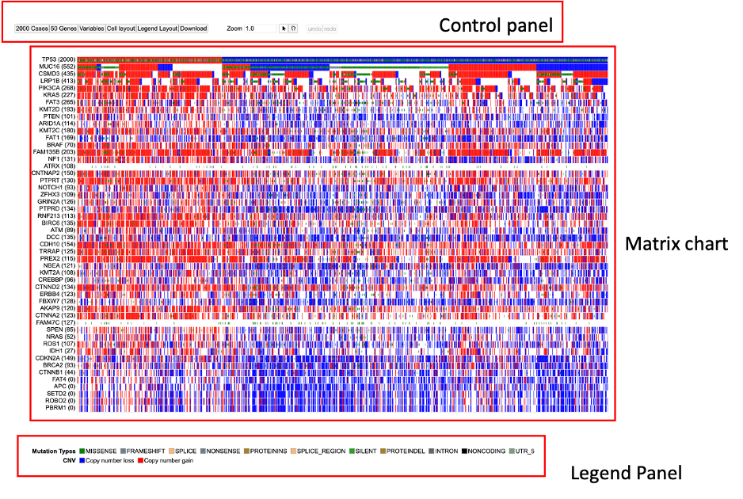
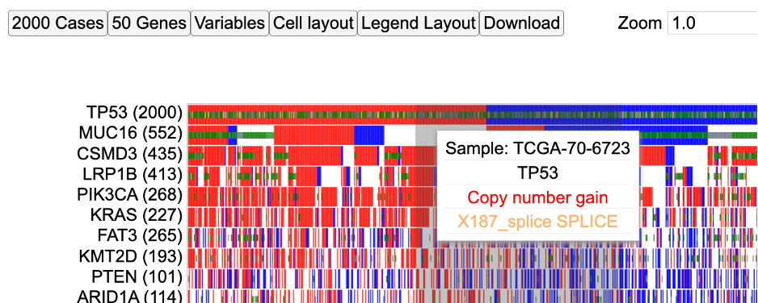
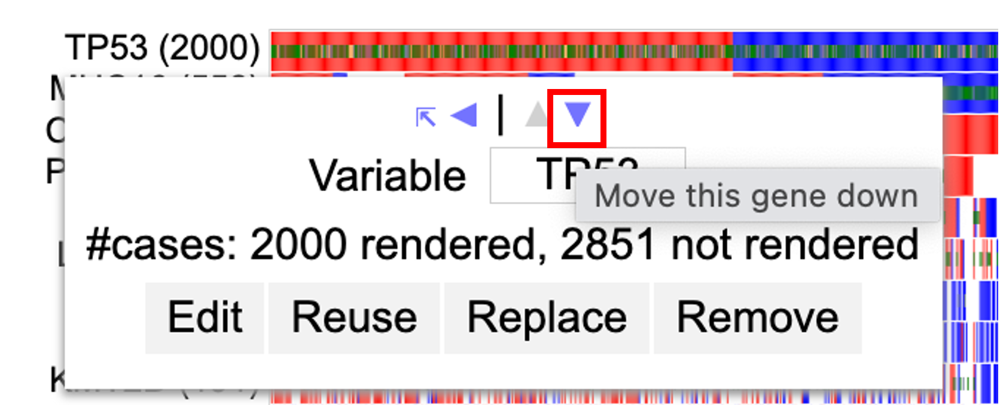
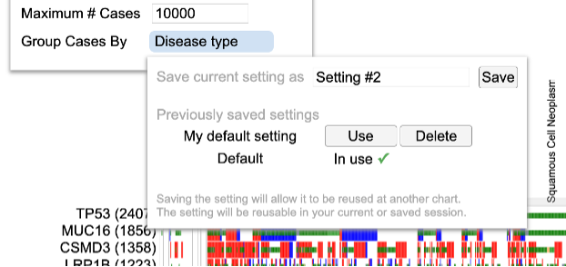

# OncoMatrix

## Introduction to OncoMatrix

The GDC OncoMatrix is a handy tool to visualize coding mutations (Simple Somatic Mutations, or SSM) and copy number variations (here onward referred to as CNV).
Each row is a gene and each cell, or a column represents a case. At any point in the tutorial, hover over a symbol or icon for two-three seconds to display more information about that icon.

## Accessing the Matrix Chart

At the Analysis Center, click on the “OncoMatrix” card to launch the app.

View publicly available genes as well as login with credentials to access controlled data.

## OncoMatrix Features

The following features are viewable once the matrix application is loaded.
There are three main panels as outlined in the figure below i.e., the `Control panel`, `Matrix chart`, and the `Legend panel`.

Each of the features and functionalities are described in detail in the following sections.

## Matrix plot

### Hovering on sample columns

Each column in the matrix represents a sample.
Hover over sample cells/columns to display information about the sample such as case id, gene name, Copy number information and mutation/mutation class (if any provided) as shown below.

### Drag to zoom

A user may click a row label and drag it while keeping the mouse button down, to sort the rows manually. Click and hold on a column of sample and drag the mouse from left to right to form a zoom boundary as shown in the image below and leave the mouse.

This allows for an automatic zoom as shown below. The individual sample columns are now visible with a well demarcated boundary. Above the samples, a slider (as shown in gray) has been provided for moving from one view to another to accommodate the 2000 cases.

Additionally, to have a finer control on the zoom the user may follow the steps outlined in the section - Zooming

### Clicking on Sample columns

In the same zoomed in view as shown above, click on any sample column for TP53. This displays a clickable button `Disco plot` as shown below.

Click on the disco plot button to display a circular plot that shows all the mutations for a given sample as shown below.

The disco plot can also be accessed by following steps outlined in the section - Disco Plot

### Clicking on gene/variable labels

Click on `TP53` gene label to display the following options.

The first row in the options highlighted by a red box as shown in the image above allows the user to sort rows and move rows up and down (please note that rows can also be moved by dragging and dropping as outlined in section Drag and Drop Gene Label/Variable variable). Every time a sorting icon is clicked the chart will update and reload.

Click the first arrow as shown below by clicking the gene label `TP53`. This will sort the samples against the gene at the top left corner which is TP53 in this example.

Next, click on the left arrow as shown below. This allows for sorting samples against the gene.

Now click the down arrow as shown below. This will move the row for that gene downward as shown below.

In the figure below, the row with TP53 cases has moved below MUC16 as shown below.

Click the gene label `TP53` and click the up arrow as shown.

The row containing TP53 cases now moves back up in position 1 above MUC16 as shown.

Click `TP53` again to showcase the edit menu.

Click `Edit` option to display the interactive legend for mutation classes within TP53. Click on `MISSENSE` as shown below to hide those mutations and click apply. NOTE: There are plans to improve this edit menu.

This will hide the corresponding mutation class from view.

Click on `Replace` as shown above to replace TP53 gene variable with `Primary site` as shown below.

The chart updates with the first row as `Primary site` thereby replacing TP53 gene variable as shown below. User may choose to sort samples by clicking the `Primary site` label.

Click on the label `Primary site` and click the option `Remove` as shown below to remove the row completely.

This updates the chart and shows all 2000 samples as shown below. Please note the number of genes displayed is now `49`. User may choose to add back TP53 by following the section - Genes.

### Drag and Drop Gene Label/Variable

The genes on the matrix are sorted by default on the number of cases with the gene having the highest number of cases at the top of the matrix. A user may choose to override this by dragging a gene label and dropping it above or below any other gene to customize their own gene groupings.

Select `TP53` gene label and drag it below the gene labeled `KRAS` as shown. When dragging a gene label, hover over KRAS such that the `KRAS` gene label would appear blue.

When the `KRAS` gene label appears blue, then drop the TP53 gene label row. The display updates to show TP53 below KRAS as shown below.

## Control panel

The control panel as shown below has various functionalities with which users can change or modify the appearance of the matrix. The control panel provides flexibility and a wide range of options to maximize user control.

### Cases

Within the control panel, the first button displays the number of cases that are shown as columns of the matrix. The default view is two thousand samples as shown below.

Click on the `2000 Cases` button to display the following options as shown in the figure below.

- Sort Cases
- Maximum #cases
- Group cases by
- Sort Case Groups
- Case Group Label Max Length
- Case Label Max Length

These sections are described below.

#### Sort Cases

The default sort setting sorts the cases by row with first displaying samples with both CNV and SSM followed by SSM only and lastly CNV only. 
Click the second option `CNV+SSM > SSM only` to change the sorting as shown below.

Sorting ‘By Case name, ID or label’ sorts on the basis of the order of the name of cases or ID as shown below.

#### Maximum #cases

The default number of samples that are shown in the matrix chart is 2000. Users can choose to increase or decrease the number of samples. This allows the chart to re-render and display the number of columns based on the user`s selection. Figure below shows increased cases to 10000. Please note that any high arbitrary number can be selected but the chart will only show the maximum cases that GDC has.

The chart will reload with new cases added. Total cases now shown are 4878.

#### Group cases by

This option allows users to group cases by different variables from the GDC dictionary. Click on the `+` icon shown in blue to display different variables such as demographics, diagnoses, Exposures etc. Users may also search for a variable from the search bar provided in the menu as shown by `Search Variables` below.

Click `Disease type` from the options. The matrix reloads to show the following view.

As shown above, labels for different disease types show up vertically and all cases get distributed with a clearcut separation according to the type of disease.

Click on the `Disease type` (blue pill, as shown below). This opens a short menu with action items. Click on the first item `Edit` as shown below.

Select the number of groups from the dropdown. User has the option to choose 2,3 or 4 groups. Drag types into different groups as shown below. In the figure below, Group 2 contains `Myeloid Leukemias` and `Nevi and Melanoma`.

Drag the type `Acinar Cell Neoplasm` into the box that shows the title `Excluded Categories`. After all the selections have been made, click `Apply`.

The matrix reloads with new groupings where `Myleoid Leukemias` and `Nevi and Melanoma` have been grouped together as Group 2, `Acinar Cell Neoplasm` is excluded from the groupings as well as the UI and Group 1 consists of the rest of the subtypes. The labels for the groups are user controlled and hence can be modified according to user requirements.

Click on the blue pill for `Disease type` and click `Cancel Grouping`. This will clear the groups and reload the default view with the types of diseases.

The next option after edit is the `Reuse`. Click on this button to display the following.

Rename the title `Setting #1` as `My default setting` and click `Save`. The chart reloads. Click the `Disease type` option and click `Reuse` again from the menu. Figure below shows that user defined setting has been saved and applied as shown by a green checkmark.

This way a user can save multiple settings or delete them as required. Click the `Reuse` button again and click the `Use` button for the default setting. Once the default setting is applied `My default setting` will show a `Delete` button. Click this button to delete a setting.

Click on the blue pill for `Disease type` again and click `Replace`. Select `Primary site` as shown below

The matrix reloads with the new variable distribution.

The last option on the menu is `Remove`. Click on the `4912 Cases` button, followed by `Primary site` shown in blue to reveal the menu option. Click `Remove` to completely get rid of any variable as shown below.

This will remove all and any groupings and show the default view again.

#### Sort Case Groups

Add the variable `Disease type` using the `Group Cases by` button as shown in the previous section. By default, groups are loaded ordered by their name. Change the selection to `Case count` as shown below. 

Now groups are ordered by the count of cases within the groups as shown above by the number of cases in parentheses in vertically shown group labels. The third selection option `Hits` orders the groupings based on the number of gene variants for a particular case or case group for the genes in display. Click `Hits` under `Sort Case Groups` to change the order of groupings as shown below. 

Hover over the first group label `Adenomas and Adenocarcinomas (763)` as shown below.

This shows the number of cases in parenthesis of the group label and the breakdown for the  number of variants and CNV for all the samples within that group for the genes in display.

## Genes

The gene panel as shown below has several options as listed below for modifying the genes visible on the plot as well as their appearance/style.

- Display Case Counts for Gene
- Row Group Label Max Length
- Row Label Max Length
- Rendering Style
- Sort Genes
- Maximum # Genes
- Gene Set

### Display Case Counts for Gene

This option allows change in the number of cases that is represented in parentheses next to the gene variable label as shown below. By default, the number of cases for each gene is an `Absolute`.

Click on the button `50 Genes` to display the menu and select `Percent` as shown below.

This shows the case counts as a percentage of the absolute values as shown below. TP53 has 100% case count that is, all 2000 cases show a mutation/CNV for TP53.

User has the option to hide the display of case counts. Click `50 Genes` button again and select `None` for `Display Case Counts for Gene` as shown below

This hides all the case counts as shown below.

### Rendering Style

The style of rendering for the sample cells/columns is an Oncoprint style by default. Click on `Stacked` option via `50 Genes` button as shown below.

The mutations and CNV are now stacked on top of each other as shown below.

### Sort Genes

The default sorting option for genes is `By Case Count`. This means the genes are sorted by the number of cases from increasing to decreasing order. Click `50 Genes` button on the control panel, and select `By Input Data Order` under the `Sort Genes` as shown below.

The genes will now sort according to the order that is stored in the dataset and queried. However, please note that the sorting order can be overridden by the users choice as described in the section - Drag and Drop Gene Label/Variable.

### Maximum # Genes

The number of genes to display on the matrix plot can be modified by the input option as shown below. Click `50 Genes` button and change input number for `Maximum # Genes` to 70.

The chart updates and loads the extra 20 genes. User can modify the set of genes by using the `Gene set` option next.

### Editing gene set

Gene groups can be edited using the `Gene set` option as shown below. Click `50 Genes` button to display this option and then click the `Edit` button in the `Gene set` as shown.

Select or deselect the blue checkbox to change the display to show `Cancer Gene Census` (CGC) genes only as shown below.

More information about CGC can be found at https://cancer.sanger.ac.uk/census. Figure displays the top 50 CGC genes.

User may choose to remove single genes one at a time by clicking over the genes shown above in gray.

Hover over TP53 as shown in the image below. A red cross mark appears with a description box. Click `TP53` to delete the gene as shown below.

User may choose to delete all genes from view by clicking the `Clear` button as shown below. However, a gene/variable selection is mandatory for the chart to load.

After deleting the genes as required and making specific selections, click the `Submit` to update the matrix chart. In the figure below, several genes have been deleted such as TP53, KRAS, PTEN and MUC16 as shown. The matrix updates to reflect the deleted genes.

### MSigDB genes

The MSigDB database (Human Molecular Signatures Database) has 33591 gene sets divided into 9 major collections and several subcollections. Users can choose to view the gene sets on the matrix plot.

Click on the `50 Genes` button. Then click on the `Gene set - Edit`. Here user can see a button with a dropdown for loading MSigDB genes.

Click on this dropdown to display a tree for the different gene sets.

Select `C2: curated gene sets` and select `NABA_COLLAGENS` as shown below.

This loads the following genes as shown below.

Click `Submit` and the matrix will update to reflect the selected MSigDB gene set as shown below.

## Variables

The third button from the left called ``Variables` allows user to add in additional variables in the form of rows on the matrix. Click `Variables` to display a tree of variables and select `Disease type`, `Index date` and `Primary site`. Click the button `Submit 3 variables` as shown below.

This updates the chart to display the selected variables on the very top of the matrix as shown below. User may choose to configure these rows by following steps outlined in section Clicking on gene/variable labels.

User may also choose to add numerical variables. Click the `Variable` button from the control panel to display the following menu. Search and select the variable `Days to Birth` and hit `Submit 1 term` button as shown.

Once the matrix updates with the numerical variable on top, click on the label `Days to Birth` and click `Edit`. This shows the following menu. 

From this menu, select `Continuous` and hit `Apply`. This updates the matrix as shown below.

## Cell Layout

The cell layout menu enables customization of the appearance such as cell dimensions, spacing, font sizes, and borders. You may mouseover an input to see the description for that input, or try checking or editing inputs to test the effects of the control input and undo/redo as needed.

## Legend Layout

The legend layout menu enables customization of the appearance of the legend, such as dimensions, spacing, and font sizes. These customizations can help avoid or minimize the need for post-download edits when generating figures.

## Zooming

The matrix plot offers an interactive zoom panel as shown below with which a user can zoom in to view individual samples. There are two ways to use this panel. One by changing the input number and second by sliding the zoom bar to a desired zoom level as shown.

Change zoom level to 10+ as shown.

Scroll down to view individual samples at the bottom of the plot as shown below.

The zoom action can also be implemented by following steps as outlined in section - 'Drag to zoom'.

## Disco Plot

Click on any sample to reveal a second type of plot called as the `Disco Plot` as shown.

Click on `Disco plot` as shown above in gray. This loads a new chart above the matrix plot as shown below.

This plot shows all the mutations and CNV associated with that sample id as shown above. The plot also displays the legend for the mutation class and the CNV.

To reset the zoom level to default, click on the `Reset` button as shown. This will reset the zoom level to a default of 1.0

## Undo/Redo/Restore

User may also choose to undo settings by clicking the `undo` button on the control panel as shown below.

Click `undo` to go back to the previous zoom level as shown above.

User may also choose to restore the initial state by clicking the `Restore` button as shown below.

This restores the chart back to default settings as shown.

## Download

The control panel shows an option to download the plot as an svg after user has specified their customizations. Select the `Download` button as shown below to save the svg.

The download will get saved to the default download folder as shown at the bottom of the browser window.

## Legend

The legend for the matrix is below the plot and shows color coding for different mutation classes as well as color codes for CNV as shown here. (this is not interactive yet but will be in the near future).

