# OncoMatrix

## Introduction to OncoMatrix

The OncoMatrix tool is a web-based tool for visualizing coding mutations such as Simple Somatic Mutations (SSM) and Copy Number Variations (CNV) from the NCI Genomic Data Commons (GDC).

## Accessing the OncoMatrix Chart

At the Analysis Center, click on the 'OncoMatrix' card to launch the app.

Users can view publicly available genes as well as login with credentials to access controlled data.

## Quick Reference Guide

There are three main panels in the OncoMatrix tool: [control panel](#control-panel), [matrix plot](#matrix-plot), and [legend panel](#legend-panel).

### Control Panel

The control panel has various functionalities with which users can change or modify the appearance of the matrix. The control panel provides flexibility and a wide range of options to maximize user control.

__Control Panel:__

* __Cases:__ Choose how to sort the cases, specify the maximum number of cases to display, group cases according to selected GDC variables, and adjust the visible characters of the case labels
* __Genes:__ Modify how cases are represented for each gene (Absolute, Percent, or None), row group and label lengths, rendering style, how genes are sorted, the maximum number of genes displayed, and the existing gene set
    * __Edit Group:__ Displays a panel of currently selected genes, which can be modified by clicking on a gene to remove it from the gene set, searching for a particular gene to add, loading top variably expressed genes, or loading a pre-defined gene set provided by the MSigDB database
    * __Create Group:__ Create a new gene set by searching for a particular gene, loading top mutated genes, or loading a pre-defined gene set provided by the MSigDB database
* __Variables:__ Search and select variables to add to the bottom of the matrix
* __Cell Layout:__ Modify the format of the cells by changing colors, cell dimensions and spacing, and label formatting
* __Legend Layout:__ Alter the legend by changing the font size, dimensions and spacing, and other formatting preferences
* __Download:__ Download the matrix in svg format
* __Zoom:__ Adjust the zoom level by using the up and down arrows on the input box, entering a number, or using the sliding scale to view the case lables
* __Undo:__ Undo changes made to the matrix
* __Redo:__ Redo changes made to the matrix
* __Restore:__ Restore the matrix to its default settings

### Matrix Plot

The OncoMatrix plot displays the genes along the left panel with each column representing a case.

#### Matrix cells

Each column in the matrix represents a case. Hovering over a cell will display the corresponding case submitter_id, gene name, copy number information, and mutation class if any are provided. Clicking on a cell also gives users the option to launch the Disco Plot.

The Disco Plot is a circular plot that shows all the mutations and CNVs for a given case. The Disco Plot also displays the legend for the mutation class and the CNV.

#### Automatic Zoom

To perform an automatic zoom, users can click on and hold a case column then drag the mouse from left to right to form a zoom boundary. From the pop-up window, users can choose to zoom in to the cases, list all highlighted cases, or create a cohort of the selected cases.

The individual case columns are now visible with a demarcated boundary. Above the cases, a slider has been provided for moving from one view to another to accommodate all cases.

#### Genes

In the panel of genes on the left, users can hover over a gene to view the number of mutated samples, a breakdown of consequence type, and copy number gain and loss counts.

Clicking on a gene opens a pop-up window where users can rename it, launch the [ProteinPaint Lollipop plot](proteinpaint_lollipop.md), display the [Gene Summary Page](mutation_frequency.md#gene-and-mutation-summary-pages), and replace or remove the gene.

#### Variables

Any variables added to the matrix appear at the bottom of the plot. Users can hover over a cell in a variable row to display the case submitter_id and their value for the given variable.

Clicking on a variable allows users to rename it, edit it by excluding categories, replace it with a different variable, or remove it entirely.

#### Drag and drop genes and variables

By default, the genes in the matrix are sorted in descending order according to which genes have the highest number of rendered cases. Users can override this by dragging and dropping gene and variable row labels to sort the rows manually.

### Legend Panel

Below the matrix, the legend displays color coding for mutation classes, CNV, as well as each variable that is selected to appear in the plot.

Clicking on `Consequences` offers options to show only truncating mutations, show only protein-changing mutations, or hide consequences.

Clicking on `CNV` allows users to hide CNV.

Additionally, users can click on a variable's category to hide a specific group, only show a specific group, or show all groups for the selected variable.

## Features

The following features are viewable once the matrix application is loaded.
There are three main panels as outlined in the figure below i.e., the `Control panel`, `Matrix chart`, and the `Legend panel`.

Each of the features and functionalities are described in detail in the following sections.

## Matrix plot

### Hovering on sample columns

Each column in the matrix represents a sample.
Hover over sample cells/columns to display information about the sample such as case id, gene name, Copy number information and mutation/mutation class (if any provided) as shown.

### Drag to zoom

A user may click a row label and drag it while keeping the mouse button down, to sort the rows manually. Click and hold on a column of sample and drag the mouse from left to right to form a zoom boundary as shown in the image and leave the mouse.

This allows for an automatic zoom as shown. The individual sample columns are now visible with a well demarcated boundary. Above the samples, a slider (as shown in gray) has been provided for moving from one view to another to accommodate all cases.

Additionally, to have a finer control on the zoom the user may follow the steps outlined in the section - Zooming

### Clicking on Sample columns

In the same zoomed in view as shown above, click on any sample column for TP53. This displays a clickable button `Disco plot` as shown.

Click on the disco plot button to display a circular plot that shows all the mutations for a given sample as shown.

The disco plot can also be accessed by following steps outlined in the section - Disco Plot

### Clicking on gene/variable labels

Click on `TP53` gene label to display the following options.

The first row in the options highlighted by a red box as shown in the image above allows the user to sort rows and move rows up and down (please note that rows can also be moved by dragging and dropping as outlined in section Drag and Drop Gene Label/Variable variable). Every time a sorting icon is clicked the chart will update and reload.

Click the first arrow as shown by clicking the gene label TP53. This will sort the samples against the gene at the top left corner which is TP53 in this example.

Next, click on the left arrow as shown. This allows for sorting samples against the gene.

[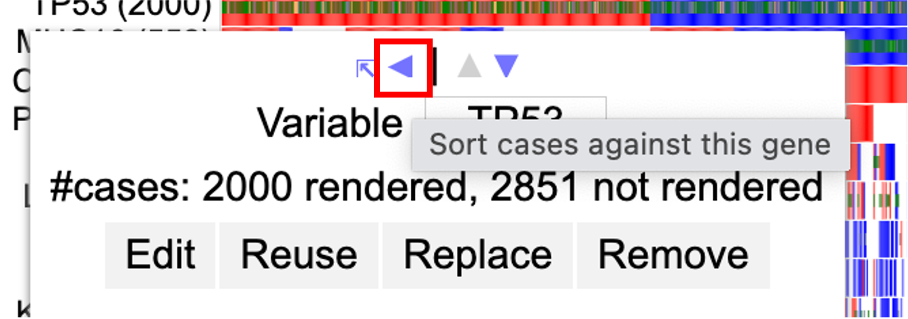](./images/oncomatrix/10-left_arrow.png 'Click to see the full image.')

Now click the down arrow as shown.
The row with TP53 cases will move below ATRX.

Click the gene label `TP53` and click the up arrow as shown.

The row containing TP53 cases now moves back up in position 1 above ATRX.

Click TP53 again to showcase the edit menu.

Click on 'Replace' as shown above to replace TP53 gene variable with 'Primary site' as shown below. The chart updates with the first row as 'Primary site' thereby replacing TP53 gene variable as shown below. User may choose to sort samples by clicking the 'Primary site' label.

[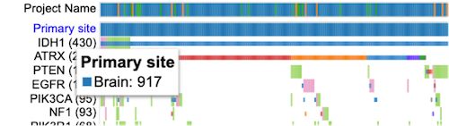](./images/oncomatrix/14-term-replaced.png 'Click to see the full image.')

Click on the label 'Primary site' and click the option 'Remove' as shown to remove the row completely.

This updates the chart. User may choose to add back TP53 through the gene panel.

Click on `Replace` as shown above to replace TP53 gene variable with `Primary site` as shown below.

### Drag and Drop Gene Label/Variable

The genes on the matrix are sorted by default on the number of cases with the gene having the highest number of cases at the top of the matrix. A user may choose to override this by dragging a gene label and dropping it above or below any other gene in order to customize their own gene groupings.

Select 'PTEN' gene label and drag it below the gene labeled 'EGFR' as shown. When dragging a gene label, hover over EGFR such that the EGFR gene label would appear blue.

When the EGFR gene label appears blue, then drop the PTEN gene label row. The display updates to show PTEN below EGFR as shown below.

## Control panel

The control panel as shown has various functionalities with which users can change or modify the appearance of the matrix. The control panel provides flexibility and a wide range of options to maximize user control.

### Cases

Within the control panel, the first button displays the number of cases that are shown as columns of the matrix. The default view is as shown.

Click on the `917 Cases` button to display the following options as shown.

1. Sort Cases
2. Maximum #cases
3. Group cases by
4. Sort Case Groups
5. Case Group Label Max Length
6. Case Label Max Length

These sections are described below.

#### Sort Cases

The default sort setting sorts the cases by row with first displaying samples with both CNV and SSM followed by SSM only and lastly CNV only.

Click the second option 'CNV+SSM > SSM only'' to change the sorting as shown.

#### Maximum #cases

There is a default number of samples that are shown in the matrix chart. Users can choose to increase or decrease the number of samples. This allows the chart to re-render and display the number of columns based on the user's selection. Figure below shows increased cases to 10000. Please note that any high arbitrary number can be selected but the chart will only show the maximum cases that GDC has.

The chart will reload with new cases added.

#### Group cases by

This option allows users to group cases by different variables from the GDC dictionary. Click on the `+` icon shown in blue to display different variables such as demographics, diagnoses, Exposures etc. Users may also search for a variable from the search bar provided in the menu as shown by `Search Variables`.

[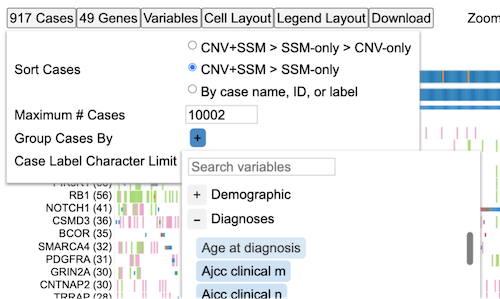](./images/oncomatrix/group-cases-by.png 'Click to see the full image.')

Click 'Age at diagnosis' from the options. The matrix reloads to show the following view.

[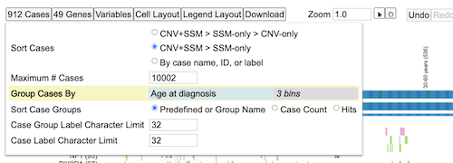](./images/oncomatrix/22-group-age-at-diag.png 'Click to see the full image.')

As shown above, labels for different age groups show up vertically and all cases get distributed with a clearcut separation according to the age bins.

Click on the 'Age at diagnosis' (blue pill, as shown). This opens a short menu with action items. Click on the first item 'Edit' as shown.

Drag the red lines on the density distribution to select binning or input numbers for custom binning and select 'Apply'.

[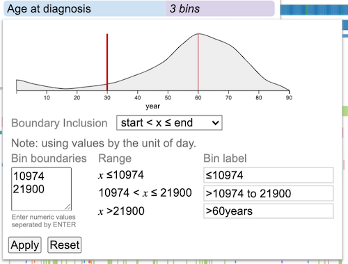](./images/oncomatrix/24-binning.png 'Click to see the full image.')

The matrix reloads with new bin groupings The labels for the groups are user controlled and hence can be modified according to user requirements.

Click on the blue pill for 'Age at diagnosis' again and click 'Replace'. Select 'Primary site' as shown.

[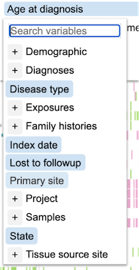](./images/oncomatrix/25-replace-group.png 'Click to see the full image.')

The matrix reloads with the new variable distribution.

The last option on the menu is 'Remove'. Click on the '917 Cases' button, followed by 'Age at diagnosis' shown in blue to reveal the menu option. Click 'Remove' to completely get rid of any groups.

[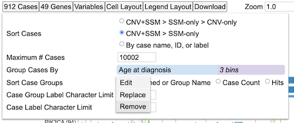](./images/oncomatrix/26-remove-group.png 'Click to see the full image.')

This will remove all and any groupings and show the default view again.

### Sort Case Groups

Add the variable 'Age at diagnosis' again using the 'Group Cases by' button as shown in the previous section. By default, groups are loaded ordered by their name. Change the selection to 'Case count' as shown below.

The third selection option 'Hits' orders the groupings based on the number of gene variants for a particular case or case group for the genes in display. Click 'Hits' under 'Sort Case Groups' to change the order of groupings.

Next, hover over the first group label '<=30 years (81)' as shown below.

This shows the number of cases in parenthesis of the group label and the breakdown for the  number of variants and CNV for all the samples within that group for the genes in display.

## Genes

The gene panel as shown below has several options as listed below for modifying the genes visible on the plot as well as their appearance/style.

- Display Case Counts for Gene
- Rendering Style
- Sort Genes
- Maximum # Genes
- Gene Set

### Display Case Counts for Gene

This option allows change in the number of cases that is represented in parentheses next to the gene variable label as shown below. By default, the number of cases for each gene is an `Absolute`.

Click on the button `50 Genes` to display the menu and select `Percent` as shown below.

[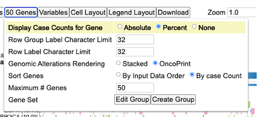](./images/oncomatrix/29-genes-percent.png 'Click to see the full image.')

This shows the case counts as a percentage of the absolute values as shown.

[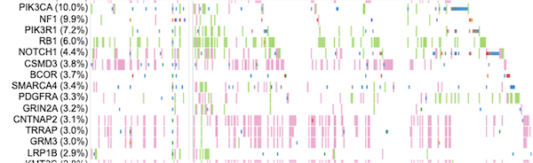](./images/oncomatrix/30-genes-percent-display.png 'Click to see the full image.')

User has the option to hide the display of case counts. Click `Genes` button again and select `None` for `Display Case Counts for Gene` as shown below

This hides all the case counts as shown.

### Rendering Style

The style of rendering for the sample cells/columns is an Oncoprint style by default. Click on `Stacked` option via `50 Genes` button as shown below.

The mutations and CNV are now stacked on top of each other as shown below.

### Sort Genes

The default sorting option for genes is `By Case Count`. This means the genes are sorted by the number of cases from increasing to decreasing order. Click `50 Genes` button on the control panel, and select `By Input Data Order` under the `Sort Genes` as shown below.

The genes will now sort according to the order that is stored in the dataset and queried. However, please note that the sorting order can be overridden by the users choice as described in the section - Drag and Drop Gene Label/Variable.

### Maximum # Genes

The number of genes to display on the matrix plot can be modified by the input option as shown below. Click `50 Genes` button and change input number for `Maximum # Genes` to 70.

The chart updates and loads the extra 20 genes. User can modify the set of genes by using the `Gene set` option next.

### Editing gene set

Gene groups can be edited using the `Gene set` option as shown below. Click `50 Genes` button to display this option and then click the `Edit` button in the `Gene set` as shown.

[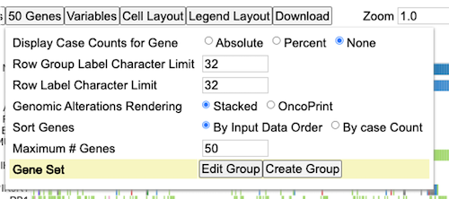](./images/oncomatrix/37-geneset_edit1.png 'Click to see the full image.')

Select or deselect the blue checkbox to change the display to show `Cancer Gene Census` (CGC) genes only as shown below.

More information about CGC can be found at https://cancer.sanger.ac.uk/census. Figure displays the top 50 CGC genes.
User may choose to remove single genes one at a time by clicking over the genes.To do so, hover over TP53 as shown in the image below. A red cross mark appears with a description box. Click TP53 to delete the gene as shown below.

User may choose to delete all genes from view by clicking the `Clear` button as shown below. However, a gene/variable selection is mandatory for the chart to load.

### MSigDB genes

The MSigDB database (Human Molecular Signatures Database) has 33591 gene sets divided into 9 major collections and several subcollections. Users can choose to view the gene sets on the matrix plot.

Click on the `50 Genes` button. Then click on the `Gene set - Edit`. Here user can see a button with a dropdown for loading MSigDB genes.

Click on this dropdown to display a tree for the different gene sets.

Select `C2: curated gene sets` and select `NABA_COLLAGENS` as shown below.

This loads the following genes as shown below.

Click `Submit` and the matrix will update to reflect the selected MSigDB gene set as shown.

## Variables

The third button from the left called `Variables` allows user to add in additional variables in the form of rows on the matrix. Click `Variables` to display a tree of variables and select `Disease type`, `Index date` and `Primary site`. Click the button `Submit 3 variables` as shown.

[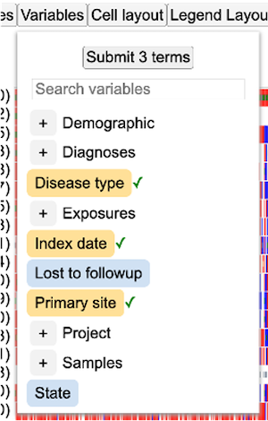](./images/oncomatrix/46-variables.png 'Click to see the full image.')

This updates the chart to display the selected variables on the very top of the matrix as shown below. User may choose to configure these rows by following steps outlined in section Clicking on gene/variable labels.

## Cell Layout

The cell layout menu enables customization of the appearance such as cell dimensions, spacing, font sizes, and borders. You may mouseover an input to see the description for that input, or try checking or editing inputs to test the effects of the control input and undo/redo as needed.

## Legend Layout

The legend layout menu enables customization of the appearance of the legend, such as dimensions, spacing, and font sizes. These customizations can help avoid or minimize the need for post-download edits when generating figures.

## Zooming

The matrix plot offers an interactive zoom panel as shown below with which a user can zoom in to view individual samples. There are two ways to use this panel. One by changing the input number and second by sliding the zoom bar to a desired zoom level as shown.

Change zoom level to 10+ as shown.

Scroll down to view individual samples at the bottom of the plot as shown below.

The zoom action can also be implemented by following steps as outlined in section - Drag to zoom.

## Disco Plot

Click on any sample to reveal a second type of plot called as the `Disco Plot` as shown.

Click on `Disco plot` as shown above in gray. This loads a new chart above the matrix plot as shown below.

This plot shows all the mutations and CNV associated with that sample id as shown above. The plot also displays the legend for the mutation class and the CNV.

To reset the zoom level to default, click on the `Reset` button as shown. This will reset the zoom level to a default of 1.0

## Undo/Redo/Restore

User may also choose to undo settings by clicking the undo button on the control panel as shown below.

Click `undo` to go back to the previous zoom level as shown above.

User may also choose to restore the initial state by clicking the Restore button as shown.

This restores the chart back to default settings as shown.

## Download

The control panel shows an option to download the plot as an svg after user has specified their customizations. Select the `Download` button as shown below to save the svg.

The download will get saved to the default download folder as shown at the bottom of the browser window.

[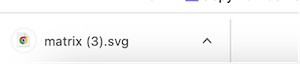](./images/oncomatrix/60-download_svg2.png 'Click to see the full image.')

## Legend

The legend for the matrix is below the plot and shows color coding for different mutation classes as well as color codes for CNV as shown here. This legend is interactive and user may choose to hide or show features such as mutation classes or copy number changes.

Click on the legend icons to hide anything.

