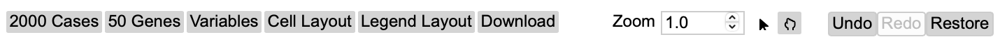
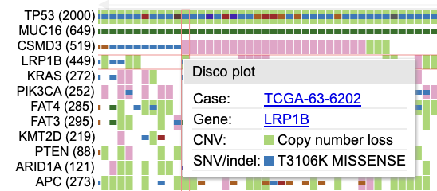
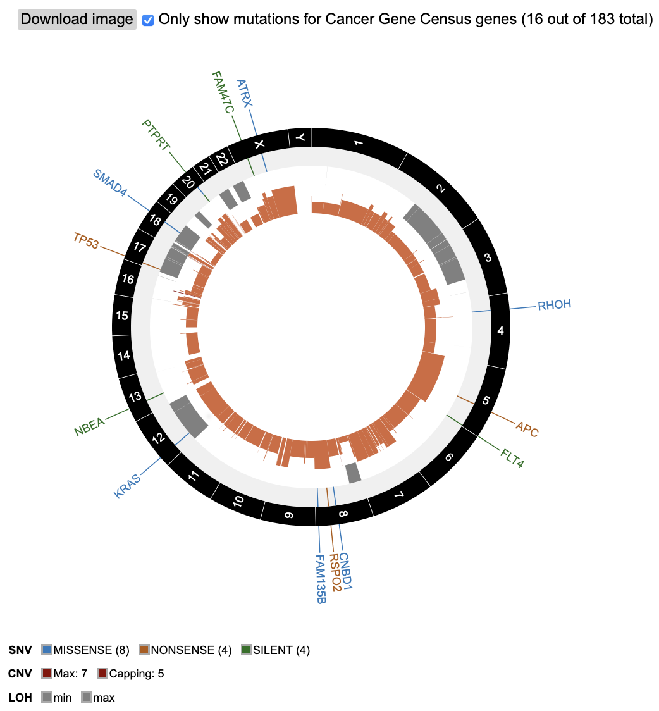
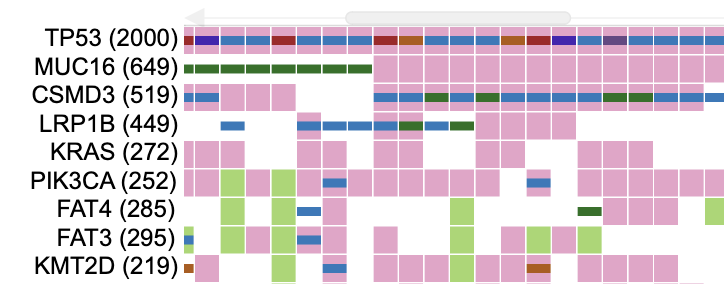
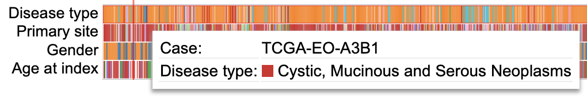
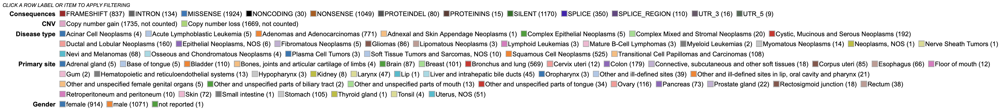
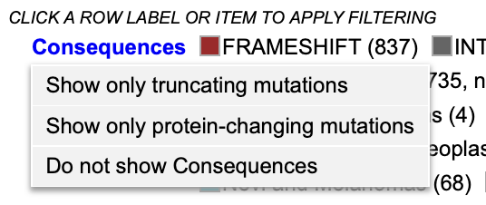
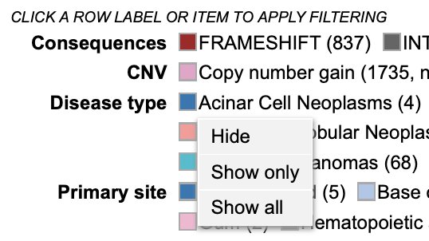

# OncoMatrix

## Introduction to OncoMatrix

The OncoMatrix tool is a web-based tool for visualizing coding mutations such as Simple Somatic Mutations (SSM) and Copy Number Variations (CNV) from the NCI Genomic Data Commons (GDC).

## Accessing the OncoMatrix Chart

At the Analysis Center, click on the 'OncoMatrix' card to launch the app.

Users can view publicly available genes as well as login with credentials to access controlled data.

## OncoMatrix Features

There are three main panels in the OncoMatrix tool: [control panel](#control-panel), [matrix plot](#matrix-plot), and [legend panel](#legend-panel).

### Control Panel

The control panel has various functionalities with which users can change or modify the appearance of the matrix. The control panel provides flexibility and a wide range of options to maximize user control.

__Control Panel:__

* __Cases:__ Choose how to sort the cases, specify the maximum number of cases to display, group cases according to selected GDC variables, and adjust the visible characters of the case labels
Adjust the visible characters of the case labels
* __Genes:__ Modify how cases are represented for each gene (Absolute, Percent, or None), row group and label lengths, rendering style, how genes are sorted, the maximum number of genes displayed, and the existing gene set
    * __Edit Group:__ Displays a panel of currently selected genes, which can be modified by clicking on a gene to remove it from the gene set, searching for a particular gene to add, loading top variably expressed genes, or loading a pre-defined gene set provided by the MSigDB database
    * __Create Group:__ Create a new gene set by searching for a particular gene, loading top mutated genes, or loading a pre-defined gene set provided by the MSigDB database
* __Variables:__ Search and select variables to add to the bottom of the matrix
* __Cell Layout:__ Modify the format of the cells by changing colors, cell dimensions and spacing, and label formatting
* __Legend Layout:__ Alter the legend by changing the font size, dimensions and spacing, and other formatting preferences
* __Download:__ Download the matrix in svg format
* __Zoom:__ Adjust the zoom level by using the up and down arrows on the input box, entering a number, or using the sliding scale to view the case lables
* __Undo:__ Undo changes made to the matrix
* __Redo:__ Redo changes made to the matrix
* __Restore:__ Restore the matrix to its default settings

### Matrix Plot

The OncoMatrix plot displays the genes along the left panel with each column representing a case.

#### Matrix cells

Each column in the matrix represents a case. Hovering over a cell will display the corresponding case submitter_id, gene name, copy number information, and mutation(s)/mutation class(es) if any are provided.

Clicking on a cell also gives users the option to launch the Disco Plot.

The Disco Plot is a circular plot that shows all the mutations and CNVs for a given case. The Disco Plot also displays the legend for the mutation class and the CNV.

#### Drag to zoom

To perform an automatic zoom, users can click on and hold a case column then drag the mouse from left to right to form a zoom boundary. From the pop-up window, users can choose to zoom in to the cases, list all highlighted cases, or create a cohort of the selected cases.

The individual case columns are now visible with a demarcated boundary. Above the cases, a slider has been provided for moving from one view to another to accommodate all cases.

#### Genes

In the panel of genes on the left, users can hover over a gene to view the number of mutated samples, a breakdown of consequence type, and the counts of copy number gains and losses.

Clicking on a gene opens a pop-up window where users can rename it, launch the [ProteinPaint Lollipop plot](proteinpaint_lollipop.md), display the GDC [Gene Summary Page](mutation_frequency.md#gene-and-mutation-summary-pages), and replace or remove the gene.

#### Variables

Any variables added to the matrix appear at the bottom of the plot. Users can hover over a cell in a variable row to display the case submitter_id and their value for the given variable.

Clicking on a variable allows users to rename it, edit it by excluding categories, replace it with a different variable, or remove it entirely. 

#### Drag and drop genes and variables

By default, the genes in the matrix are sorted in descending order according to which genes have the highest number of rendered cases. Users can override this by dragging and dropping gene and variable row labels to sort the rows manually.

### Legend Panel

Below the matrix, the legend displays color coding for mutation classes, CNV, as well as each variable that is selected to appear in the plot.

Clicking on `Consequences` offers options to show only truncating mutations, show only protein-changing mutations, or hide consequences.

Clicking on `CNV` allows users to hide CNV.

Additionally, users can click on a variable's category to hide a specific group, only show a specific group, or show all groups for the selected variable.

