# ProteinPaint Sequence Reads Tool

## Introduction to ProteinPaint Sequence Reads

Sequence Reads is a web-based tool that uses the ProteinPaint BAM track and NCI Genomic Data Commons (GDC) BAM Slicing API to allow users to visualize read alignments from a BAM file. Given a variant (i.e. Chromosome number, Position, Reference Allele and Alternative Allele), the Sequence Reads tool can classify reads supporting the reference and alternative allele into separate groups.

## Quick Reference Guide

At the Analysis Center, click on the 'Sequence Reads' card to launch the app.

[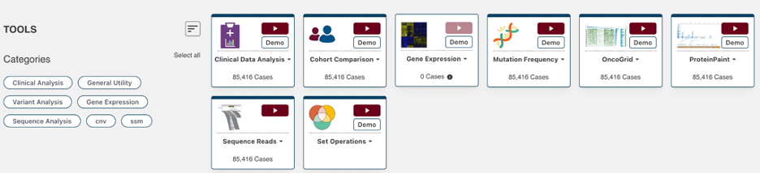](images/seq_read_vis.png "Click to see the full image.")

This feature requires access to controlled data, which is maintained by the Database of Genotypes and Phenotypes (dbGaP) [See Obtaining Access to Controlled Data](https://gdc.cancer.gov/access-data/obtaining-access-controlled-data). In order to use this tool, users must be logged in with valid credentials. Otherwise, users will be prompted to login.

### Selecting BAM Files and Variants

Once logged in, the Sequence Reads tool will display a search bar, as well as a link to browse the first 1,000 available BAM files for the active cohort. Users can choose to select a BAM from the available list, or search for a specific BAM file by entering four types of inputs: file name, file UUID, case ID, or case UUID.

The tool will verify the query string and return all matching GDC BAM files in a table, from which the user can select one or multiple to use with the tool.

If an exact match is entered (i.e. a file name or file UUID), the Sequence Reads tool will find that BAM and present brief information about the file.

[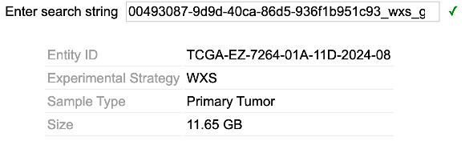](images/file_info.png "Click to see the full image.")

In the subsequent section, the mutation table displays somatic mutations catalogued by the GDC for this case, if available. Users can select a mutation to visualize read alignments on this variant.

Alternatively, the `Gene or position` button at the top of the mutation table allows users to enter a custom genomic region for BAM visualization.

[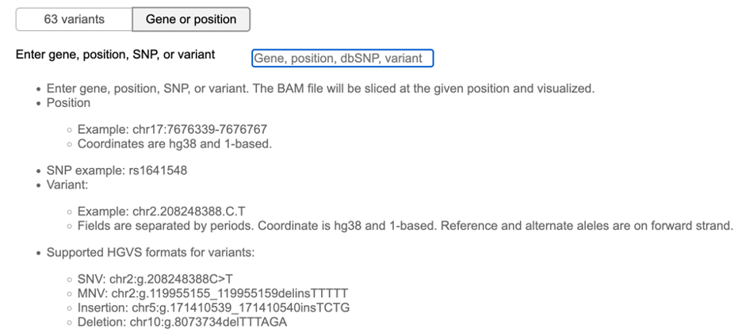](images/gene_search.png "Click to see the full image.")

Once at least one BAM file is selected and a gene, position, SNP, or variant is entered, the Sequence Reads tool will display the BAM visualization.

[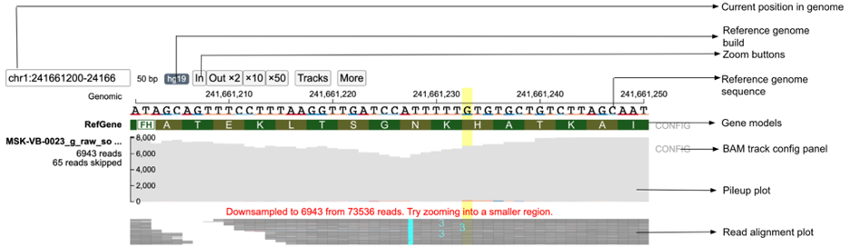](images/pp_gen_browse.png "Click to see the full image.")

### Toolbar

* __Current Position in Genome:__ Displays the coordinates of the region currently displayed
* __Reference Genome Build:__ Refers to the genome build that was used for mapping the reads; the GDC uses Reference Genome Build 38 (hg38)
* __Zoom Buttons:__ Zooms in (`In`) or out (`Out x2`, `x10`, and `x50`) of the current view

### Reference Genome Sequence

The Reference Genome Sequence displays the reference genome build against which the reads have been aligned.

### Gene Models

The Genome Models row displays the gene model structure from the view range. When zoomed into a coding exon, the letters correspond to the 1-letter amino acid code for each amino acid and are placed under its corresponding 3-letter nucleotide codon under the reference genome sequence. The arrows describe the orientation of the strand of the gene model being displayed (right arrow for forward strand and left arrow for reverse strand).

Graphical representations of the reads are displayed as they are aligned on the chromosome. Sequence can be read when zoomed in.

### ProteinPaint BAM Track

#### Pileup Plot

The Pileup Plot shows the total read depth at each nucleotide position of the region being displayed.

#### Read Alignment Plot

This visual contains the main read alignment plot of the reads from the BAM file.

When completely zoomed out, base-pair quality of each nucleotide in each read is not displayed. Users can zoom into the plot via the toolbar or by dragging on the genomic ruler (a) to zoom into the selected region (b).

[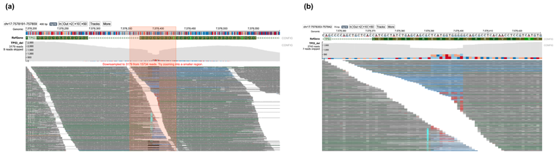](images/zoom.png "Click to see the full image.")

Clicking on a read in the plot launches a window that displays the alignment between the read and reference sequence, as well as the chromosome, coordinates, read length, template length, CIGAR score, flag, and name. If the read is paired, the position of the other segment will be displayed below. This pop-up also contains two buttons, `Copy read sequence` and `Show gene model`, which copy the nucleotide sequence of the read to the computer clipboard and display the gene model, respectively.

[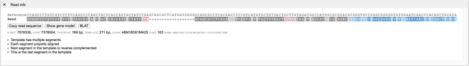](images/read_info.png "Click to see the full image.")

#### Mutation Rendering

Mutations are rendered as follows:

* __Insertion:__ The alphabet representing the nucleotides is displayed between the two reference nucleotides in cyan color, with the shade scaled by base quality
    * If more than one nucleotide is inserted, a number is printed between the two reference nucleotides indicating the number of inserted nucleotides
    * Clicking the read with multiple insertions will display the complete inserted nucleotide sequence

    [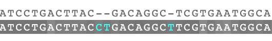](images/sn_insert4.png "Click to see the full image.")

* __Deletion:__ A black line represents the span of deleted bases

    

* __Substitution or Mismatch:__ The substituted nucleotide is highlighted in red background, with the shade of red scaled by base quality

    

* __Splicing:__ The different fragments of a read separated due to splicing are joined by a gray line

    [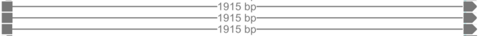](images/splicing.png "Click to see the full image.")

#### Color Coding of Reads

Color codes in the background of the read describe the quality of the read alignment and its mate (in case of paired-end sequencing). These colors are assigned both on the basis of the CIGAR sequence (if it contains a softclip) and the flag value of both the read and its mate.

* __Gray:__ Suggests that both the read (at least part of it) and its mate are properly aligned and the insert size is within expected range
* __Blue:__ Indicates that part of the read is soft clipped
* __Brown:__ Indicates that the mate of the read is unmapped
* __Green:__ Indicates that the template has the wrong insert size
* __Pink:__ Indicates that the orientation of the read and its mate is not correct
* __Orange:__ Indicates the read and its mate are mapped in different chromosomes

#### BAM Track Configuration Panel

The BAM Track Configuration Panel, which can be accessed by clicking the `CONFIG` option next to the Pileup plot, provides buttons for toggling between single-end and paired-end mode.

In single-end display each read is displayed individually without displaying any connections with its respective mate. In case of the paired-end display the two paired reads are joined by a gray dotted-line if the coordinates of the two reads do not overlap. When the coordinates of the two read-pairs overlap, the overlapped region is highlighted by a blue line.

The BAM Track Configuration Panel also provides a check box to show/hide PCR and optical duplicated reads.

## Launch the Sequence Reads Tool
At the Analysis Center, click on the "Sequence Reads" card to launch the app.

A user needs to be logged in to use this feature. If not, the user will be prompted to log in.
Once the user logs in, a search bar and submit button will appear as below.

## Find and Display BAM Files in GDC
To find a BAM file in GDC, a user can enter four types of inputs including file name, file UUID, case ID, or case UUID. The tool will verify the query string and return matching BAM files.

As an example, using case ID "TCGA-06-0211" will return 9 BAM files available from this case displayed in a table. One or multiple BAM files from this table must be selected to proceed.

When a file name or UUID is provided, it will display brief information about the file. A user does not need to select anything here as the file is automatically selected.

The subsequent section displays somatic mutations catalogued by GDC for this case, if available. A user can select a mutation to visualize read alignment on this variant.

Alternatively, a user can enter a custom genomic region for BAM visualization. At the toggle button on top of the mutation table, click the "Gene or position" option to show the gene search box.

Follow the instructions to enter gene, position, SNP, or variant. Press ENTER to validate the input.

Lastly, press the "Submit" button to view read alignment from the selected BAM file over the selected mutation or genomic region. The server will verify the user's access to the requested BAM file and query the GDC API to slice the BAM file at the selected region. This may take from 10 seconds to a minute.

An error message will appear if the user does not have access to the requested BAM file. Please follow the instructions to obtain access.

Once the BAM visualization is successfully displayed, the search interface is hidden, and a button named "Back to input form" is shown. Clicking the button will bring the user back to the search interface so a user can change the BAM file or mutation.

Click the "Download GDC BAM Slice" button to download the BAM slice file used in this visualization.

## Using ProteinPaint Genome Browser

Various fields labeled in the above figure are described below:

## Current Position in Genome  
The Current Position in Genome text box displays the coordinates of the region currently displayed on the screen. It initially shows the coordinates specified in the URL. On pan/zoom by the user, this region displays the updated coordinates of the view region.

## Reference Genome Build
The Reference Genome Build button refers to the genome build specified by the user that was used for mapping the reads. The GDC uses Reference Genome Build 38 (hg38).

## Zoom Buttons
A user can zoom in/out of the current view by clicking the "In" (zoom in) or "Out x2" (zoom out) buttons. By clicking on the x10 and x50 button, a user can zoom out 10 and 50-fold respectively. Alternatively, a user may choose to zoom into a smaller region by dragging on the genomic ruler (a) to zoom into the selected region (b) as shown below.

## Reference Genome Sequence
The Reference Genome Sequence displays the reference genome build against which the reads have been aligned.

## Gene Models
This Genome Models row displays the gene model structure from the view range. When zoomed into a coding exon, the letters correspond to the 1-letter amino acid code for each amino acid and are placed under its corresponding 3-letter nucleotide codon under the reference genome sequence. The arrows describe the orientation of the strand of the gene model being displayed (right arrow for forward strand and left arrow for reverse strand).

# ProteinPaint BAM Track Features

## Pileup Plot

The Pileup Plot shows the total read depth at each nucleotide position of the region being displayed.
Color codes of bars representing various possibilities:

Gray - Reference allele nucleotides
Blue - Soft clipped nucleotides
Mismatches:
* nucleotide "A" - Red (color code: #ca0020)
* nucleotide "T" - Orange (color code: #f4a582)
* nucleotide "C" - Light blue (color code: #92c5de)
* nucleotide "G" - Dark blue (color code: #0571b0)

## Read Alignment Plot

The Read Alignment Plot contains the main read alignment plot of the reads from the BAM file.

## Rendering of Various Mutations

### Insertion
In case of a single nucleotide insertion, the alphabet representing the nucleotide (A/T/C/G) is displayed between the two reference nucleotides in cyan color.

Darkness of the inserted nucleotide is determined by the base quality, as an example below of an inserted T with low quality.

If more than one nucleotide is inserted, a number is printed between the two reference nucleotides indicating the number of inserted nucleotides. The text color is full cyan and does not account for the quality of inserted bases. Showing below is a read with two insertions, first with 2 bases, and second with T.

On clicking this read, [the read information panel](#Read information panel)the read information panel is displayed where the complete inserted nucleotide sequence is shown in cyan color.

### Deletion
A black line represents the span of deleted bases.

### Substitution (or Mismatch)
In case of substitutions (or mismatches), the substituted nucleotide ("A") is highlighted in red background, with the shade of red scaled by base quality.

### Splicing
In case of splicing, the different fragments of a read separated due to splicing are joined by a gray line as shown below. In the example below, the reads contain spliced fragments that are separated by a 1915bp intron.

## Zooming the Read Alignment Plot
The rendering of the reads depends upon the zoom level (horizontal zoom) chosen by the user and the number of reads mapped at the display region (vertical zoom).

### Horizontal Zoom   
The BAM track has three levels of horizontal zoom:

### Overview Level
This is the completely zoomed out mode (shown below). [At this resolution,](https://proteinpaint.stjude.org/?genome=hg19&block=1&bamfile=TP53_del,proteinpaint_demo/hg19/bam/TP53_del.bam&position=chr17:7575308-7580395&bedjfilterbyname=NM_000546) base-pair quality of each nucleotide in each read is not displayed as each read occupies a very small area on the screen. Also the [reference sequence](#Reference genome sequence) at the top is not displayed. Only reads which contain big insertions/deletions/softclips or are discordant are represented by their respective colors Also the [(see color codes of various reads)](#Color coding of reads).

[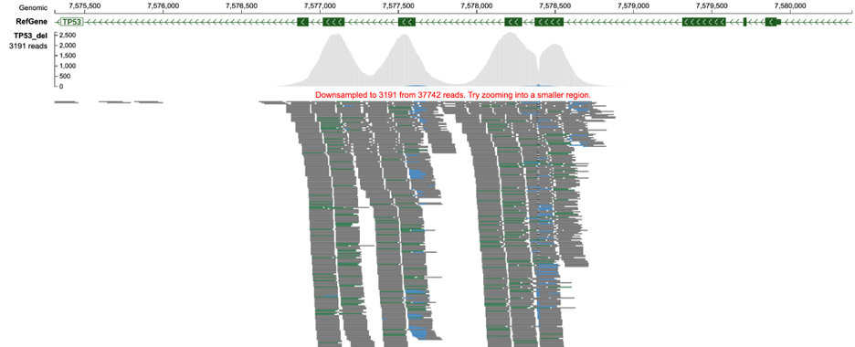](images/overview.png "Click to see the full image.")

### Base-pair Quality Level
[At this level of zoom](https://proteinpaint.stjude.org/?genome=hg19&block=1&bamfile=TP53_del,proteinpaint_demo/hg19/bam/TP53_del.bam&position=chr17:7577215-7578486&bedjfilterbyname=NM_000546) (shown below), in addition to color codes of reads, the phred base pair quality score of each read is also displayed. Poor base-pair quality of nucleotides is represented by lighter shades of the respective color and darker shades represent high base-pair quality. For example, dark gray color represents a higher quality nucleotide in a properly mapped read than light gray which represents poor base-pair quality.

### Base-pair Resolution Level
[At this resolution](https://proteinpaint.stjude.org/?genome=hg19&block=1&bamfile=TP53_del,proteinpaint_demo/hg19/bam/TP53_del.wrongbp.bam&position=chr17:7578371-7578417&bedjfilterbyname=NM_000546), all information including the read sequence of each read is displayed along with reference genome nucleotides at the top. For simplicity (as discussed later under [vertical zoom](#Vertical zoom: examining subset of reads)), only a few reads are shown in the figure below.

### Vertical Zoom: Examining Subset of Reads
ppBAM can display up to 7000 reads, and will downsample if the number of reads in a region is over 7000. This is especially helpful for displaying high-depth sequencing data. However, displaying nucleotides from each read for such a large number of reads is not feasible. Therefore, the pixel width of each read is reduced to accommodate all reads in the region (Panoramic view, figure below). When the user clicks on a read, that part of the alignment stack is enlarged to show the nucleotides within each read (Nucleotide view, figure below) stacked near the cursor click. Reads at the top and bottom of the stack can be viewed by scrolling up/down with the scroll-bar. The top/bottom of the green scroll-bar can be adjusted to display more reads on the screen by reducing the individual width of each read. On clicking the gray area of the scroll bar region, the panoramic view is displayed again.

# BAM Track Configuration Panel

The BAM Track Configuration Panel can be accessed by clicking the "CONFIG" option next to the pileup plot. The BAM Track Configuration Panel (shown below) provides buttons for toggling between single-end and paired-end mode. It also provides a check box to show/hide PCR and optical duplicated reads.

## BAM track configuration panel figure

## Single and Paired-end Read
[The configuration panel](#BAM track configuration panel) (above) provides a toggle to change view between single-end (default) and paired-end view (shown below: see [Link](https://proteinpaint.stjude.org/?genome=hg19&block=1&bamfile=crebbp_del,proteinpaint_demo/hg19/bam/crebbp.bam&position=chr16:3800245-3803429) for example). In single-end display each read is displayed individually without displaying any connections with its respective mate. In case of the paired-end display the two paired reads are joined by a gray dotted-line if the coordinates of the two reads do not overlap. When the coordinates of the two read-pairs overlap, the overlapped region is highlighted by a blue line.

The following shows reads in single-end mode.

The same track above shows in paired mode.

## Show/Hide Read Names
Read names are available only when the [variant](https://docs.google.com/document/d/1LeadJcW9LBbUidsXo_j2m-O3ytNRUrj0zoHBNh3aGx4/edit#heading=h.8xbzrcxbtx60) field is specified. There is a checkbox that displays read names on the left side of the main BAM track as shown below. The read names are only displayed when the main BAM track has [base-pair level resolution](#Base-pair resolution level) and is in nucleotide view ([vertical zoom](#Vertical zoom: examining subset of reads) in case of high-depth sequencing data).

[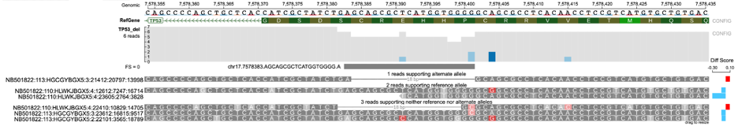](images/BAM_track.png "Click to see the full image.")

## Displaying PCR and Optical Duplicated Reads

The [checkbox](#BAM track configuration panel) in the configuration panel can be toggled to switch on/off the display of PCR and optical duplicates. [In the above figure](https://proteinpaint.stjude.org/?genome=hg19&block=1&bamfile=long_del,proteinpaint_demo/hg19/bam/PCRopticalduplicates.bam&position=chrX:129150008-129150048&variant=chrX.129150027.GGAAAGCGTAGGGGTCTTTGCTTGCAAGAACAA.GT&Bedjfilterbyname=NM_001184772), a total of 29 reads are shown when PCR/optical duplicates are displayed (Figure a) whereas a total of 19 reads are displayed supporting the alternative allele when PCR/optical duplicates are not displayed (default, Figure b).

## Strictness
[Strictness](#Strictness in on-the-fly genotyping) of the on-the-fly genotyping analysis. This option is available when the BAM track is performing on-the-fly genotyping against a variant. The user can toggle between Lenient and Strict (default) mode as shown in the ppBAM [configuration panel figure](#BAM track configuration panel figure).

# Read Information Panel

For displaying the various features of individual reads, on clicking a particular read (in nucleotide view) a new panel opens displaying the information about the selected read (as shown below).

In this panel (as shown above), the top row shows the reference sequence that is aligned to the read. The second row shows the nucleotide sequence of the read. The colors of the nucleotides of the read are based on the CIGAR sequence of the read and follow the color codes as described in the section [color coding of reads](#Color coding of reads). In the third row, three clickable buttons are available which have the following functions as described below. The fourth row contains the start, stop, read length, template length, CIGAR sequence, flag and name of read.

## Copy Read Sequence
The Copy Read Sequence feature copies the nucleotide sequence of the read being displayed to the computer clipboard so that it can be pasted outside of ppBAM.

## Show Gene Models
On clicking the Show Gene Models button, the gene model (as shown below) (as described for the [ProteinPaint Genome Browser](#Using ProteinPaint genome browser) figure) is displayed.

[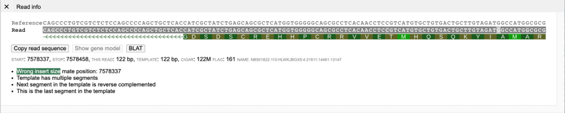](images/gene_model.png "Click to see the full image.")

## BLAT

On clicking the BLAT button, the read sequence is aligned against the given reference genome build using BLAT (as shown below).

Each of the columns obtained from BLAT alignment are explained below:

* **QScore** -Score of the BLAT alignment. Generally higher scores mean better alignment.

* **QStart** -Start position of alignment with respect to read i.e. from which nucleotide position the alignment started in the read.

* **QStop** -Stop position of alignment with respect to read i.e. from which nucleotide position the alignment stopped in the read.

* **QAlignLen** -Number of nucleotides in query sequence aligned to the reference genome.

* **RChr** -Chromosome of reference region aligned.

* **RStart** -Start position of alignment in reference genome.

* **RStop** -Stop position of alignment in reference genome.

* **RAlignLen** -Alignment length in the reference genome.

## Read Details

The fourth row contains details about the read present in the BAM file

* **START** -Contains the start position of the read.

* **STOP** -Contains the stop position of the read.

* **This Read** -Contains length of the read.

* **TEMPLATE** -Contains length of the template of which the current read is part of.

* **CIGAR** -Contains CIGAR sequence of the read.

* **FLAG** -Contains the flag number (from BAM file) of the read.

* **NAME** -Contains the name of the read.

## Color Coding of Reads

(a)    Paired-end view

(b)    Base-pair resolution mode showing nucleotides of each of the reads

In the figure above, [structural](https://proteinpaint.stjude.org/?genome=hg19&block=1&bamfile=crebbp_del,proteinpaint_demo/hg19/bam/crebbp.bam&position=chr16:3800245-3803429) variant deletion in the CREBBP gene is shown. Reads near the vicinity of the deletion have various colors (gray, green, brown and blue) based on their features as explained below. In the paired-end view (a) an overview of the deletion is shown. In Base-pair resolution mode (b) showing nucleotides of each of the reads there are softclipped reads starting near position chr16: 3,801,439.

Color codes in the background (as shown above) of the read describe the quality of the alignment of the read and its mate (in case of paired-end sequencing). These colors are assigned both on the basis of the CIGAR sequence (if it contains a softclip) and the flag value of both the read and its mate.

### Gray
Presence of gray background nucleotides in a read suggests that both the read (at least part of it) and its mate are properly aligned and the insert size is within expected range (as shown below).

[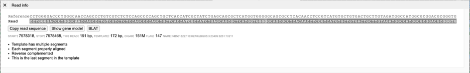](images/gray_bg.png "Click to see the full image.")

### Blue
Presence of blue-background nucleotides in a read indicates that part of the read is soft clipped (as shown below). The last 94 nucleotides in the read below are softclipped based on CIGAR sequence (57M94S).

[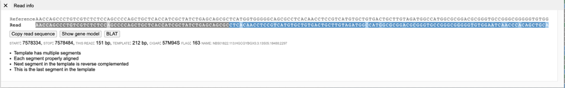](images/blue_bg.png "Click to see the full image.")

### Brown
A brown colored background (in the main [read alignment plot](#Read alignment plot)) indicates that the mate of the read is unmapped. Such reads have a [flag](#FLAG) value that contains the 0x8 bit. On clicking a read with unmapped mate in the read information panel, the current read sequence is displayed along with a button "Show unmapped mate".

[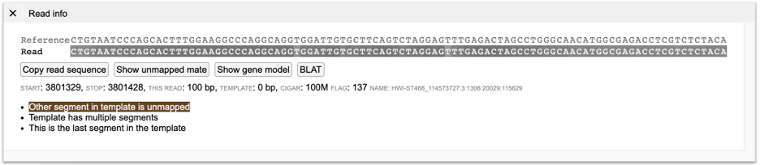](images/brown_bg.png "Click to see the full image.")

On clicking the button "Show unmapped mate", the sequence of the unmapped mate is also displayed.

[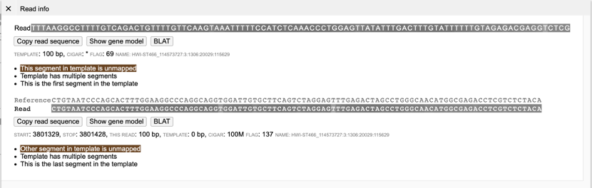](images/unmapped_mate.png "Click to see the full image.")

### Green
A green background (shown below) indicates that the template has the wrong insert size. As shown in the Read Info figure below, the reads labeled green have a higher insert size than normal (gray) reads because of the structural deletion. In [paired-end](https://docs.google.com/document/d/1LeadJcW9LBbUidsXo_j2m-O3ytNRUrj0zoHBNh3aGx4/edit#heading=h.n23ig5kapnl) view, generally such read-pairs have a much longer gray-dashed line than properly aligned (Gray) read-pairs.

[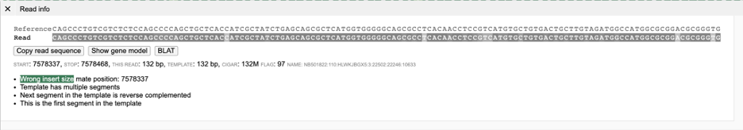](images/green_bg.png "Click to see the full image.")

### Pink
A pink color background indicates that the orientation of the read and its mate is not correct (See Link to wrong orientation [example](https://proteinpaint.stjude.org/?genome=hg19&block=1&bamfile=test,proteinpaint_demo/hg19/bam/CBFB-MYH11.bam&position=chr16:67115893-67117379)). Several orientations are taken into consideration. The figure below displays an example of an inversion caused due to CBFB-MYH11 gene fusion found in [Acute Myeloid Leukemia (AML) patients](https://pubmed.ncbi.nlm.nih.gov/32015759/). Here the read and its mate are oriented in the reverse direction (R1R2).
* F1F2 - When both read and its mate are pointing in the forward direction (-> ->).
* R1R2 - When both read and its mate are pointing in the reverse direction (<- <-).
* F1R2 - When both read and its mate are pointing in forward and reverse direction but are pointing in opposite directions (<-  ->).

[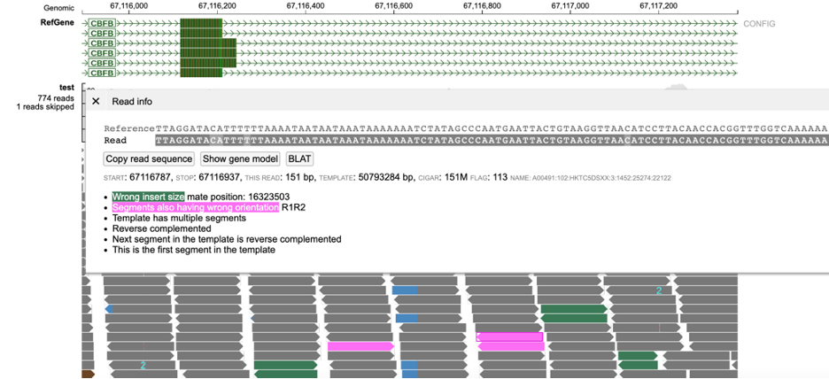](images/pink_bg.png "Click to see the full image.")

### Orange
Orange background color indicates the read and its mate are mapped in different chromosomes ([as shown below](https://proteinpaint.stjude.org/?genome=hg38&block=1&bamfile=SJACT019118_G1%20WGS,proteinpaint_demo/hg19/bam/discordant_reads.bam&position=chr7:16464-16464&hlregion=chr7:16463-16463)). The displayed read is mapped in chr7:16363-16512 whereas its mate is mapped in chr16.

[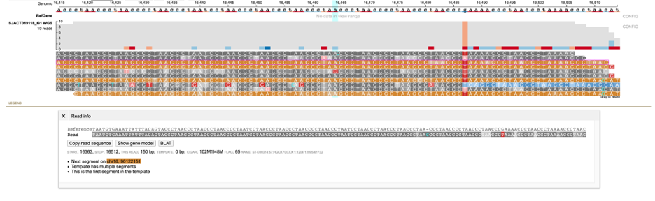](images/orange_bg.png "Click to see the full image.")

# Variant Mode

Variant Mode provides an intuitive view of a variant specified by the user inside ppBAM. On specifying the chromosome, position, reference and alternative allele; the reads covering the variant region are displayed and classified into groups supporting the reference allele, alternative allele, none (neither reference nor alternative allele) and ambiguous groups. This mode is invoked when the "[variant](https://docs.google.com/document/d/1LeadJcW9LBbUidsXo_j2m-O3ytNRUrj0zoHBNh3aGx4/edit#heading=h.8xbzrcxbtx60)" field is specified containing the chromosome, position, reference and alternative allele of the variant.

## Alternative, Reference, None and Ambiguous Read Classification Groups

For a given variant (SNV or indel), reads mapping to the variant region are classified into Reference, Alternative, None (neither reference nor alternative allele) and Ambiguous (unclassified reads) groups by using the Smith-Waterman alignment (as shown in figure above). The difference (Diff score) between the ratio of sequence similarities (Number of matches in read alignment / Length of alignment) of the read with alternative sequence and with that of the reference sequence is used to classify the read as alternative (Diff score > 0) or reference supporting read (Diff score < 0). Reads with alleles which are neither reference nor alternative are classified into none group (when [strictness](#Strictness in on-the-fly genotyping) level = 'Strict') and those that have equal similarity (Diff score = 0) to both reference and alternative allele are classified into the [ambiguous](#Ambiguous reads) group. This Diff score barplot on the right displays the Diff score (red if Diff score > 0 and blue if Diff score < 0) for each read. This barplot is especially helpful in analyzing reads classified into the none group by indicating the alternative/reference allele with which it has maximum sequence similarity.

[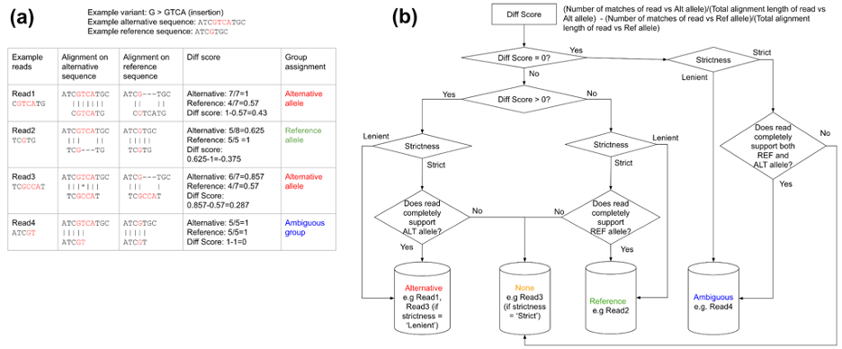](images/read_class.png "Click to see the full image.")

The above figure describes the methodology for classification of reads into Reference, Alternative, None (neither reference nor alternative allele) and Ambiguous groups. Classification of four reads are described for a variant (G/GTCA). (a) Sequence alignment of various reads to alternative and reference alleles (red colored nucleotides represent alternative and reference allele nucleotides): Read1 and Read2 completely support the alternative and reference allele respectively. Read3 has higher sequence similarity to the alternative allele but has a mismatch. Read4 has equal similarity to both reference and alternative groups. (b) Flow chart for classification of reads into four groups: Read1 and Read2 completely support alternative and reference allele respectively and are classified into these groups irrespective of strictness. Read3 contains a mismatch and is classified into none group when [strictness](#Strictness in on-the-fly genotyping) = 'Strict' and into alternative group when [strictness](#Strictness in on-the-fly genotyping) = 'Lenient'. Read4 has equal similarity (Diff score = 0) towards both alternative as well as reference sequences and is classified into the [ambiguous](#Ambiguous reads) group.

## Ambiguous Reads

In certain indels such as in the [TP53 example](https://proteinpaint.stjude.org/?genome=hg19&block=1&bamfile=TP53_del,proteinpaint_demo/hg19/bam/TP53_del.bam&position=chr17:7578191-7578591&variant=chr17.7578383.AGCAGCGCTCATGGTGGGG.A&bedjfilterbyname=NM_000546), certain reads in the variant region can have equal similarity towards both the reference and alternative allele. A large number of ambiguous reads are on the left-side of the indel (Figure a below) because the deletion starts with the sequence GCAGCGC which is also found in the right flanking sequence resulting in equal similarity to both reference and alternative alleles for any read ending within this part of the indel region (as shown in figure below). On viewing the read alignment for the ambiguous read (Figure b below) through the read information panel, it is observed that the read has equal similarity to both reference and alternative alleles. Nucleotides highlighted in red indicate those which are part of reference/alternative allele.

## Fisher-strand Analysis to Check for Strand Bias in Variants
Fisher-strand (FS) analysis on ratio of forward/reverse strand reads in the alternative and reference groups can help in detecting possible [strand bias](https://gatk.broadinstitute.org/hc/en-us/articles/5358832960539-FisherStrand) that may be present in the variant of interest. The FS score is the Phred-scaled p-value from the Fisher test of the contingency table consisting of forward/reverse strand reads from both the alternative and reference alleles (as shown in figure below). To increase performance for high-depth sequencing examples, when the sequencing depth is greater than 300 the chi-square test is used (if equal or lower than this number, the fisher's exact test is used). If FS score is [greater than 60](https://gatk.broadinstitute.org/hc/en-us/articles/360035890471), the FS score is highlighted in red (as shown below) indicating that there may be a possible strand bias in the variant.

In the figure above, an example of a complex indel is shown containing fisher strand bias. The FS score is highlighted in red indicating this particular variant may contain strand bias.

## Strictness in On-the-fly Genotyping
A user can also optionally change the strictness of the algorithm to Lenient/Strict (default) from the [ppBAM configuration panel](#BAM track configuration panel). For strictness level = 'Lenient', reads are classified based on higher sequence similarity to reference/alternative allele. In case of strictness level = 'Strict', the exact sequence of the reference/alternative allele in the read is compared against the allele sequence given by the user. Reads that do not match either allele are classified into the none group.

The lenient strictness level can be helpful, when the user wants a lenient estimate of the number of reads supporting the particular indel of interest or when the user is confident that only one alternative allele exists. This can also be helpful when there are reads with low base-pair quality calls near the variant region. In contrast when the strictness level is set to 'Strict', a more conservative estimate of the read support is provided for each allele and may indicate the presence of a wrong variant call (if present) or may indicate presence of multiple alternative alleles.

In case of the TP53 deletion example, select reads with wrong base pair calls are [shown](https://proteinpaint.stjude.org/?genome=hg19&block=1&bamfile=TP53_del,proteinpaint_demo/hg19/bam/TP53_del.wrongbp.bam&position=chr17:7578371-7578417&variant=chr17.7578383.AGCAGCGCTCATGGTGGGG.A&bedjfilterbyname=NM_000546). For strictness level = 'Lenient', there are two reads that support the alternative allele. However, read NB501822:110:HLWKJBGX5:4:22410:10829:14705 has a wrong base pair call at position 7578401. When the strictness level is changed to 'Strict', this read is classified into the none group. Similarly, reads NB501822:113:HGCGYBGX5:3:23612:16815:9517 (wrong base-pair call at 7578401) and NB501822:113:HGCGYBGX5:2:22101:3565:18789 (wrong base-pair call at 7578391) are classified in the reference allele group when strictness level = 'Lenient' but are classified into the none group when strictness level is set to 'Strict'.  

The 'Lenient' strictness level is generally only helpful in cases where only one alternative allele is present as it assumes only the given reference and alternative allele are the only possible cases. For multi-allelic variants or when a region has a large number of reads with low Phred base-pair quality nucleotides, the 'Strict' (default) level should be used.

## Realignment using Clustal Omega
In the original alignment shown in the main BAM track view, all the reads are aligned against the reference genome. Therefore, in the alternative allele group reads may be mapped differently although they have the same sequence in the variant region. For example, in the reads supporting the alternative allele in the [TP53 example](https://proteinpaint.stjude.org/?genome=hg19&block=1&bamfile=TP53_del,proteinpaint_demo/hg19/bam/TP53_del.bam&position=chr17:7578191-7578591&variant=chr17.7578383.AGCAGCGCTCATGGTGGGG.A&bedjfilterbyname=NM_000546) , the reads either have mismatches, deletions, soft clips or a combination of all three. Figure (a) shows the complete alternative allele group, whereas in Figure (b) selected set of reads from alternative allele group are displayed displaying various kinds of mapping inconsistencies.

In Figure (c), the reads from (b) are realigned to the alternative allele using Clustal Omega (ClustalO) by clicking on the link showing the number of reads aligned to the alternative allele. This provides an intuitive view confirming the accuracy of the classification of reads to the designated allele. See subset of different reads with same sequence near variant region [mapped differently](https://proteinpaint.stjude.org/?genome=hg19&block=1&bamfile=TP53_del,proteinpaint_demo/hg19/bam/TP53_del.altreads.bam&position=chr17:7578371-7578417&variant=chr17.7578383.AGCAGCGCTCATGGTGGGG.A&bedjfilterbyname=NM_000546).

## Display of Read Alignment with Respect to Reference and Alternative Allele

In case of reads that are classified into the none group (when strictness level = 'Strict') it can be difficult to understand the classification into that group. For example, in case of insertions with the wrong nucleotide (with respect to the predicted alternative allele) the sequence of the inserted nucleotides is not shown in the main BAM track and can only be viewed through the [read information panel](#Read information panel). As an example, a [4bp insertion in NPM1 exon](https://proteinpaint.stjude.org/?genome=hg38&block=1&bamfile=NPM1,proteinpaint_demo/hg19/bam/NPM1.bam&position=chr5:171410519-171410549&variant=chr5.171410539.C.CTCTG) is discussed below. In Figure (a) (shown below) most reads with 4bp insertion have been classified into the alternative allele. However, there are some reads (as highlighted in Figure a) with 4bp insertions that are classified into the none group. The diff score plot suggests that these reads have higher sequence similarity to the alternative allele (and are classified into the alternative group when strictness = 'Lenient') and they seem to support the alternative allele. However, when we click on this read (Fig. b) and click on the "Read Alignment" button (which is available only when the [variant](https://docs.google.com/document/d/1LeadJcW9LBbUidsXo_j2m-O3ytNRUrj0zoHBNh3aGx4/edit#heading=h.8xbzrcxbtx60) field is specified in the URL) the Smith-Waterman alignment of the read with the reference and alternative allele is displayed (Figure b). The indel nucleotides are highlighted in red. In case of the read in the none group (HWUSI-EAS576_109189803:5:56:16862:16609), a mismatch is observed in the indel region between the read and the alternative allele (highlighted by '*' in the alignment row) which explains the classification into the none group. In contrast, the read shown from the alternative allele group (HWUSI-EAS576_109189803:5:6:1383:8635) has a complete match with the alternative allele and is therefore classified into the alternative allele group.

Display of read alignment of the read with respect to both the reference and alternative allele helps provide an intuitive view for describing classification of a read into its respective group.

[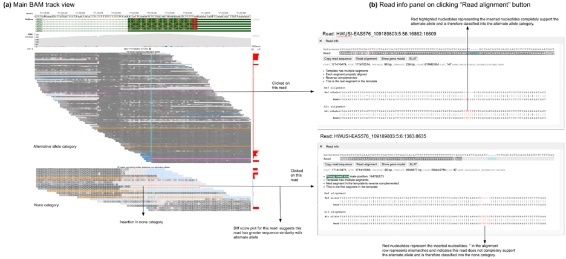](images/read_align.png "Click to see the full image.")
