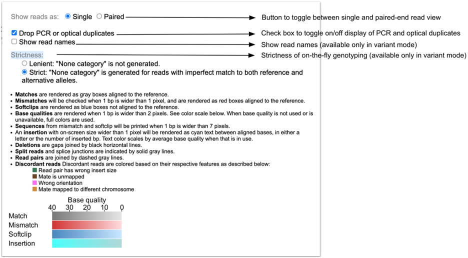

# ProteinPaint Sequence Reads Tool

## Introduction to ProteinPaint Sequence Reads

Sequence Reads is a web-based tool that uses the ProteinPaint BAM track (ppBAM) and NCI Genomic Data Commons (GDC) BAM Slicing API to allow users to visualize read alignments from a BAM file. Given a variant (i.e. Chromosome number, Position, Reference Allele and Alternative Allele), the Sequence Reads tool can classify reads supporting the reference and alternative allele into separate groups.

## Accessing the Sequence Reads Tool

At the Analysis Center, click on the 'Sequence Reads' card to launch the app.

This features requires access to controlled data, which is maintained by the Database of Genotypes and Phenotypes (dbGaP) [See Obtaining Access to Controlled Data](https://gdc.cancer.gov/access-data/obtaining-access-controlled-data). In order to use this tool, users must be logged in with valid credentials. Otherwise, users will be prompted to login.

## Selecting BAM Files and Variants

Once logged in, the Sequence Reads tool will display a search bar, as well as a link to browse the first 1,000 available BAM files for the active cohort. Users can choose to select a BAM from the available list, or search for a specific BAM file by entering four types of inputs: file name, file UUID, case ID, or case UUID. 

The tool will verify the query string and return all matching GDC BAM files in a table, from which the user can select one or multiple to use with the app.

If an exact match is entered (i.e. a file name or file UUID), the Sequence Reads tool will find that BAM and present brief information about the file. 

In the subsequent section, the mutation table displays somatic mutations catalogued by the GDC for this case, if available. Users can select a mutation to visualize read alignments on this variant.

Alternatively, the `Gene or position` button at the top of the mutation table allows users to enter a custom genomic region for BAM visualization.

Once at least one BAM file is selected and a gene, position, SNP, or variant is entered, the Sequence Reads tool will display the BAM visualization.

## Sequence Reads Features

There are multiple features in the Sequence Reads tool: [toolbar](#Toolbar), [Reference genome build](#Reference-Genome-Sequence), [Gene models](Gene-Models), [BAM track](#ProteinPaint-BAM-Track), and [Read alignment plot](#Read-alignment-plot).

### Toolbar

* __Current Position in Genome:__ Displays the coordinates of the region currently displayed
* __Reference Genome Build:__ Refers to the genome build that was used for mapping the reads; the GDC uses Reference Genome Build 38 (hg38)
* __Zoom Buttons:__ Zooms in (`In`) or out (`Out x2`, `x10`, and `x50`) of the current view

### Reference Genome Sequence

The Reference Genome Sequence displays the reference genome build against which the reads have been aligned.

### Gene Models

The Genome Models row displays the gene model structure from the view range. When zoomed into a coding exon, the letters correspond to the 1-letter amino acid code for each amino acid and are placed under its corresponding 3-letter nucleotide codon under the reference genome sequence. The arrows describe the orientation of the strand of the gene model being displayed (right arrow for forward strand and left arrow for reverse strand).

Graphical representation of the reads as they are aligned on the chromosome. Sequence can be read when zoomed in

### ProteinPaint BAM Track

#### Pileup Plot

The Pileup Plot shows the total read depth at each nucleotide position of the region being displayed.

The bars are color-coded to represent various possibilities with gray corresponding to reference allele nucleotides, blue corresponding to soft clipped nucleotides, and the following mismatches:

* nucleotide "A" - Red (color code: #ca0020)
* nucleotide "T" - Orange (color code: #f4a582)
* nucleotide "C" - Light blue (color code: #92c5de)
* nucleotide "G" - Dark blue (color code: #0571b0)

#### Read Alignment Plot

This visual contains the main read alignment plot of the reads from the BAM file. 

When completely zoomed out, base-pair quality of each nucleotide in each read is not displayed. Users can zoom into the plot via the toolbar or by dragging on the genomic ruler (a) to zoom into the selected region (b).

Clicking on a read in the plot launches a window that displays the alignment between the read and reference sequence, as well as the chromosome, coordinates, read length, template length, CIGAR score, flag, and name. If the read is paired, the position of the other segment will be displayed below. This pop-up also contains two buttons, `Copy read sequence` and `Show gene model`, which copy the nucleotide sequence of the read to the computer clipboard and display the gene model, respectively.

__Rendering of Various Mutations__

Various mutations are rendered as follows:

* __Insertion:__ The alphabet representing the nucleotide (A/T/C/G) is displayed between the two reference nucleotides in cyan color, with the shade scaled by base quality
    * If more than one nucleotide is inserted, a number is printed between the two reference nucleotides indicating the number of inserted nucleotides 
    * Clicking the read with multiple insertions will display the complete inserted nucleotide sequence

    

* __Deletion:__ A black line represents the span of deleted bases

    

* __Substitution or Mismatch:__ The substituted nucleotide is highlighted in red background, with the shade of red scaled by base quality

    

* __Splicing:__ The different fragments of a read separated due to splicing are joined by a gray line

    

__Color Coding of Reads__

Color codes in the background of the read describe the quality of the read alignment and its mate (in case of paired-end sequencing). These colors are assigned both on the basis of the CIGAR sequence (if it contains a softclip) and the flag value of both the read and its mate.

* __Gray:__ Suggests that both the read (at least part of it) and its mate are properly aligned and the insert size is within expected range
* __Blue:__ Indicates that part of the read is soft clipped 
* __Brown:__ Indicates that the mate of the read is unmapped 
* __Green:__ Indicates that the template has the wrong insert size 
* __Pink:__ Indicates that the orientation of the read and its mate is not correct 
* __Orange:__ Indicates the read and its mate are mapped in different chromosomes 

#### BAM Track Configuration Panel

The BAM Track Configuration Panel, which can be accessed by clicking the `CONFIG` option next to the Pileup plot, provides buttons for toggling between single-end and paired-end mode. 

In single-end display each read is displayed individually without displaying any connections with its respective mate. In case of the paired-end display the two paired reads are joined by a gray dotted-line if the coordinates of the two reads do not overlap. When the coordinates of the two read-pairs overlap, the overlapped region is highlighted by a blue line.

The BAM Track Configuration Panel also provides a check box to show/hide PCR and optical duplicated reads.