# ProteinPaint Tool

## Introduction to ProteinPaint

ProteinPaint is a web based, dynamic visualization tool that displays a lollipop chart based on the multidimensional skewer version 3 (mds3 track). This tool utilizes variant annotations from GDC datasets. Given a particular gene, it displays variants associated with that gene as well as the occurrence, disease type, and demographic information of the associated case given a case.

### Accessing the Lollipop Chart
At the Analysis Center, click on the “ProteinPaint” card to launch the app.

[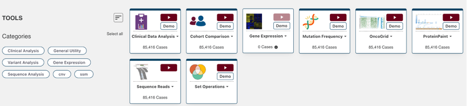](images/lollipop1.png "Click to see the full image.")

Users can view publicly available variants as well as login with credentials in order to access controlled data.

## ProteinPaint Features
When selected, ProteinPaint will display the search-box as illustrated below. Once a user enters a gene symbol, alias, or GENCODE accession, a lollipop frame is displayed with the name of the chart in the header. The example below is of the gene AKT1. All gene symbols are based on the [HGNC](https://www.genenames.org/about/guidelines/) guidelines.

[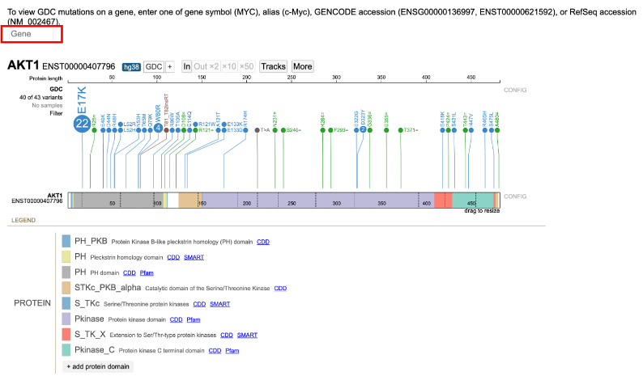](images/lollipop2.png "Click to see the full image.")

There are 3 main panels as outlined in the figure below:

1. Search box
2. Lollipop chart panel
3. Legend panel

[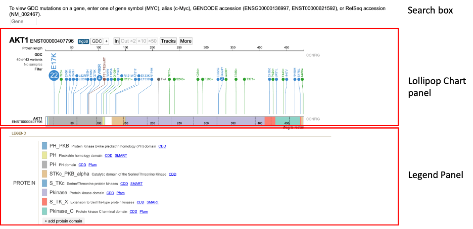](images/lollipop3.png "Click to see the full image.")

### Search Box

[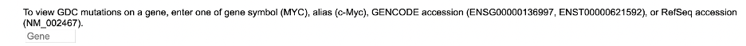](images/lollipop4.png "Click to see the full image.")

The example below uses the KRAS gene. The name of the gene (e.g., ‘KRAS’), GENCODE accession no. (e.g., [ENST00000311936](http://useast.ensembl.org/Homo_sapiens/Transcript/Summary?db=core;g=ENSG00000133703;r=12:25205246-25250936;t=ENST00000311936), [ENSP00000308495](http://useast.ensembl.org/Homo_sapiens/Transcript/ProteinSummary?db=core;g=ENSG00000133703;r=12:25205246-25250936;t=ENST00000311936)) or RefSeq accession (e.g., NM_004985) can be used as the search item. In case a wrong gene is entered, the search box will display an error. For gene searches only, typing a few letters reveals a menu of possible matches. Choose from either a menu option or hit enter.

[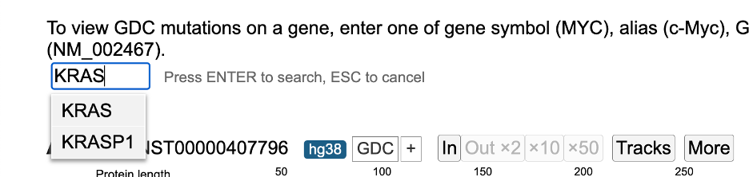](images/lollipop5.png "Click to see the full image.")

### Lollipop Chart Panel

### Protein View
After searching for KRAS, the Protein View for the default isoform appears in a new frame. The Protein View displays the nucleotides, codons in the exon region, introns, and protein domains as shown below.

[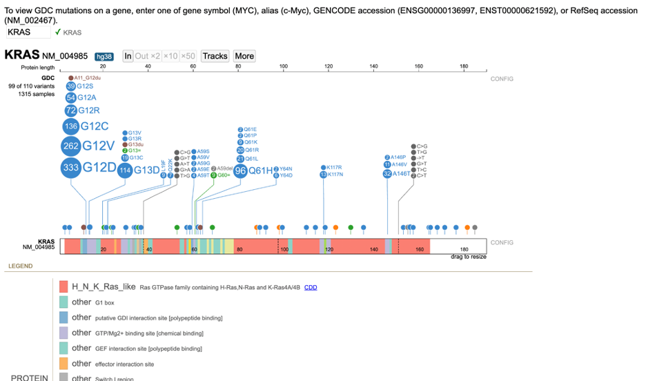](images/lollipop6.png "Click to see the full image.")

The legend offers simple filtering for the variants showing in the lollipop. Clicking the color for a protein domain on the right of PROTEIN for example, hides that protein domain. Clicking on the color again shows the protein domain. Similar show/hide functions are available by clicking on the legend labels.

The default isoform for KRAS on hg38 genome build is NM_004985. Hovering over the isoform label will highlight it as shown below.

[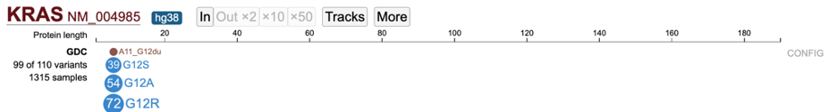](images/lollipop7.png "Click to see the full image.")

A user can select the isoform by clicking on the isoform number as shown in the figure above. Clicking this will open a display to view all the other isoforms as well as the option to switch the display track as shown below in the figure.

[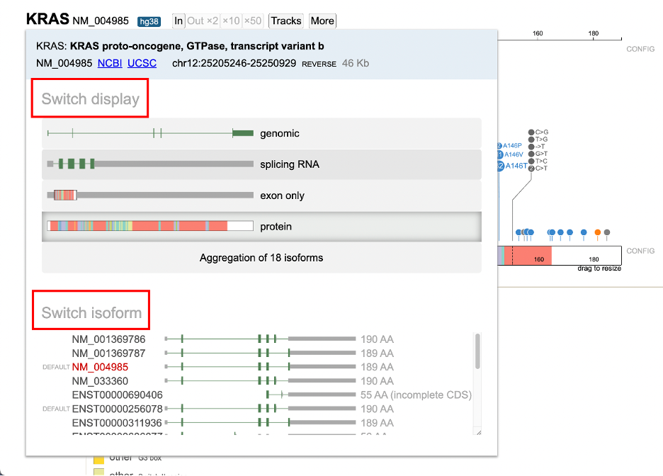](images/lollipop8.png "Click to see the full image.")

From **Switch Display**, a user can update to one of the following:
1. Genomic display
2. Splicing RNA
3. Exon only
4. Protein track
5. Aggregate of all isoforms

The Protein track is the primary area in which a user will visualize and interact with protein coding regions.

#### Protein Track

Under **Switch Isoform**, the available RefSeq and Ensembl isoform builds are listed. A condensed display and the protein length is shown for each isoform. The current selection appears in red text. The default KRAS isoform for example, is NM_004985 with 189 amino acids. To change the isoform, click on the appropriate line highlighted in yellow.

[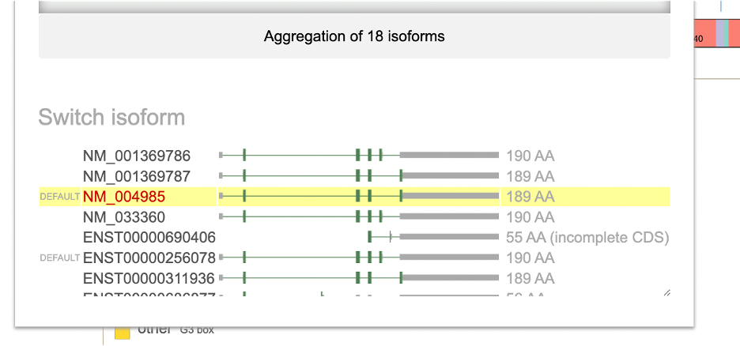](images/lollipop9.png "Click to see the full image.")

The pop-up window disappears and the lollipop track rerenders with the newly selected isoform.

# Lollipop Charts

The lollipop chart for the GDC variants appears above the Protein View. The circular disc for each variant is proportional to the number of occurrences. Variants in the same position are arranged in descending order of magnitude. There are eight types of variants found in the lollipop chart (see legend).

[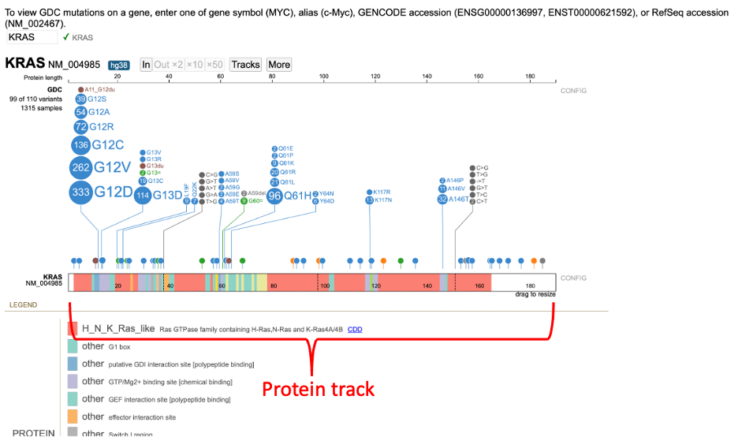](images/lollipop10.png "Click to see the full image.")

Exon variants report the amino acid change at the referenced codon. For example, G12D is a G > D substitution at the 12th codon of the protein.

Clickable links for the number of cases (e.g. 1315 samples) and number of variants (e.g. 99 out of 110 variants) appear to the left of the lollipop. Clicking on these links reveals detailed annotations about the samples and variants, described in [Viewing Variants and Case Samples](#Viewing Variants and Case Samples).

[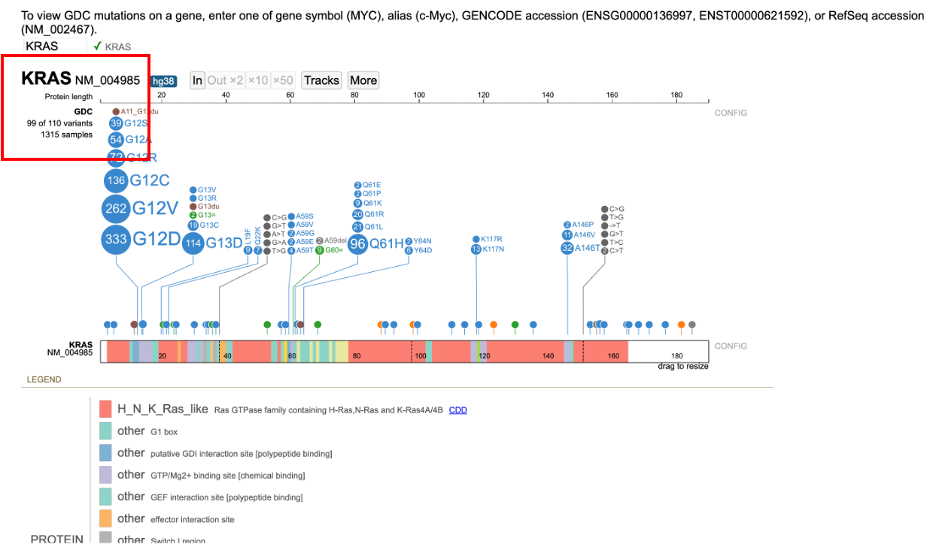](images/lollipop11.png "Click to see the full image.")

## Viewing Variants and Case Samples

### Variant Annotations and Chart Manipulation
Click on the number of variants linked to the left of the lollipop for viewing annotations and manipulating the lollipop. For variant annotation, click on ‘List’.

[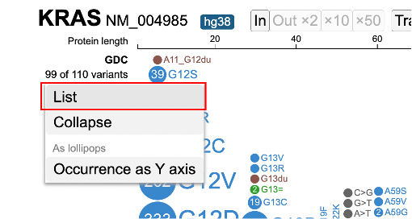](images/lollipop12.png "Click to see the full image.")

A pop-up window appears with the entire list of variants, as shown below.

[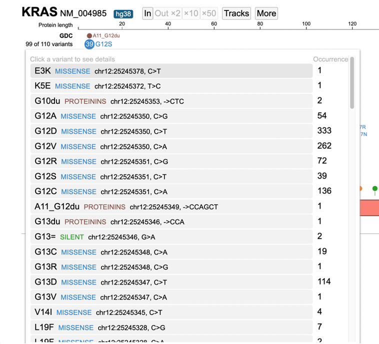](images/lollipop13.png "Click to see the full image.")

Click on the variant of interest and a new annotation table appears. From the table, view various associated features per sample such as: Disease type, Primary site, Project id, Gender, Race, Ethnicity, and Tumor DNA Mutant Allele Frequency(MAF). In the figure below, 333 occurrences are shown for the G12D variant, which represents a missense mutation at chromosome chr12:25245350 C>T.  
[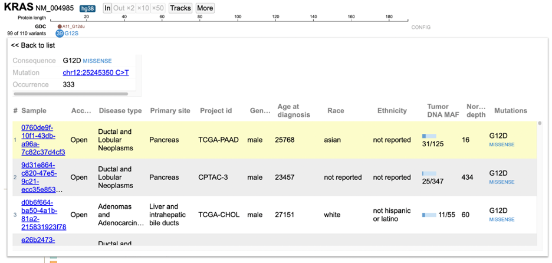](images/lollipop14.png "Click to see the full image.")

The first sample that is highlighted in yellow is a male with ductal and lobular neoplasms with a tumor DNA MAF of 31/125. This indicates 31 mutant alleles were found out of 125 total alleles.

The GDC dataset includes an ‘Access’ column to indicate whether the data is controlled or open. Users must obtain permission from dbGaP to view controlled data [See Obtaining Access to Controlled Data](https://gdc.cancer.gov/access-data/obtaining-access-controlled-data). Click on the sample hyperlink and the GDC’s case summary for the sample will appear in a new tab.

Click ‘Back to list’ and select another sample, as shown below.

[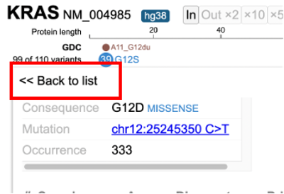](images/lollipop15.png "Click to see the full image.")

After clicking on the variant menu again, select the ‘Collapse’ option to collapse all skewers in the lollipop.

[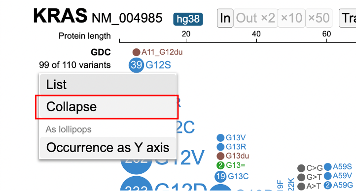](images/lollipop16.png "Click to see the full image.")

To expand any previously collapsed skewers, open the variant menu, and click on ‘Expand’.

[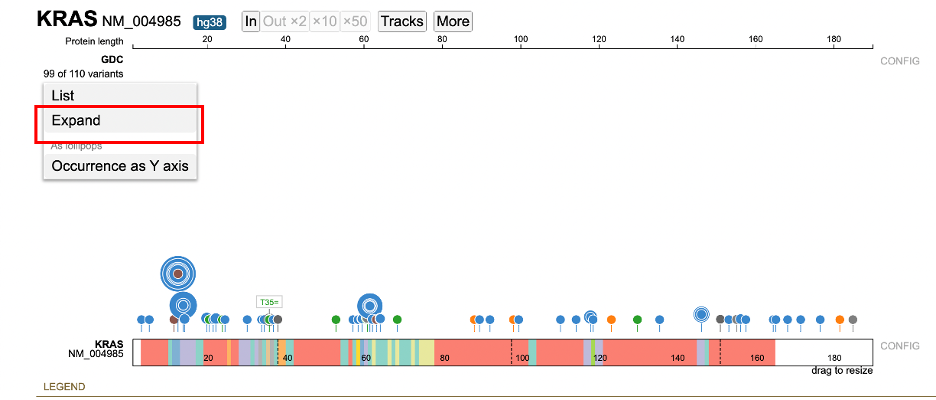](images/lollipop17.png "Click to see the full image.")

The lollipop chart includes an option to arrange variants by the range of occurrences. Open the variant menu and click on  ‘Occurrence as Y axis’.

[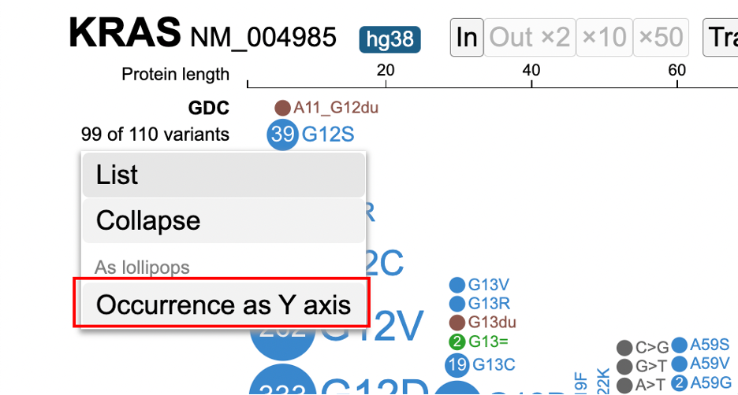](images/lollipop18.png "Click to see the full image.")

The lollipop re-renders with the variants sorted on the y-axis from lowest and highest occurrence. Hover over a variant to display the number of occurrences. In the example below, a user is hovering over G12D to display 333 occurrences of this variant.

[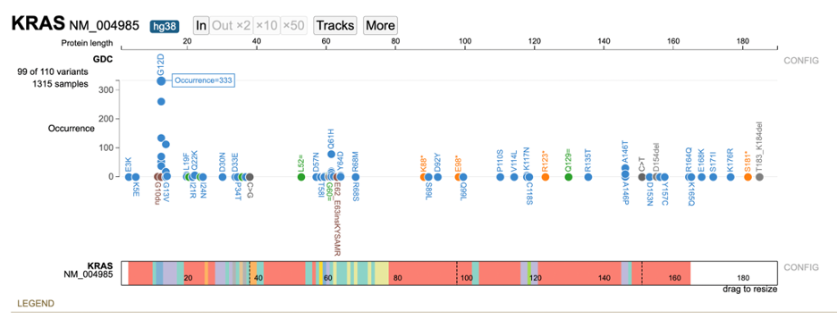](images/lollipop19.png "Click to see the full image.")

Clicking on the variant loads the sample table again as shown below.

[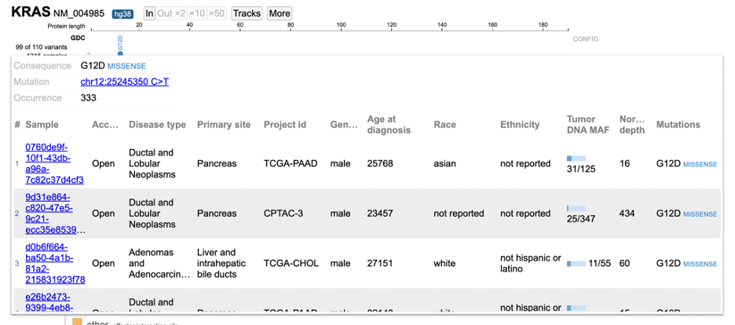](images/lollipop20.png "Click to see the full image.")

### Case Filtering

Clicking on the sample hyperlink on the left of the lollipop (e.g. 1315 samples) opens a menu to list all samples. Aggregate data for all samples by attribute appears in a series of tabs. The ability for advanced filtering and creating subtracks is available from this new display.

[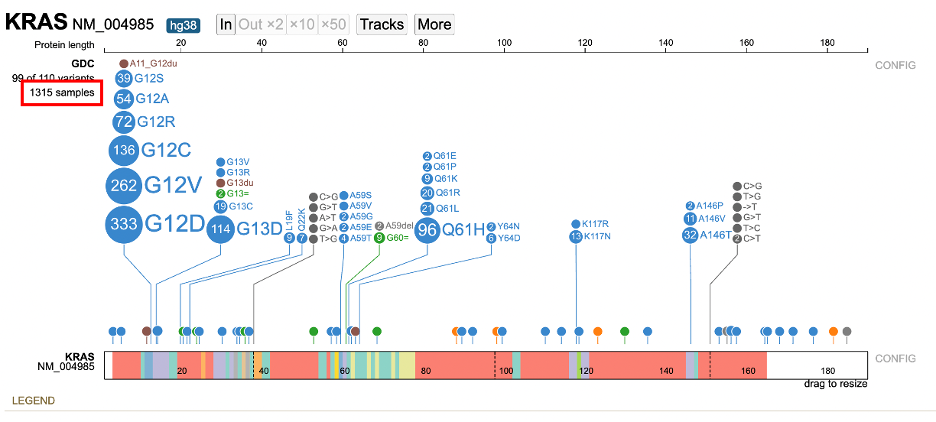](images/lollipop21.png "Click to see the full image.")

Click on 1315 samples to view annotations grouped by attributes such as: Disease type, Primary site, Project id, Gender, Race, Ethnicity, etc.. For each attribute, the number of values is represented by ‘n’ to the right of the group label. In the figure below, 21 values for Disease type are reported.

[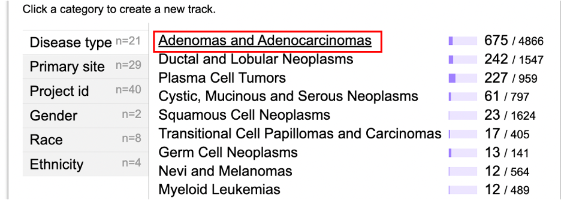](images/lollipop22.png "Click to see the full image.")

To start filtering, click on the value label or the value’s sample fraction. Clicking on ‘Adenomas and Adenocarcinomas’ or ‘675/ 4866’ for example, loads a new lollipop subtrack underneath the main GDC lollipop track.

[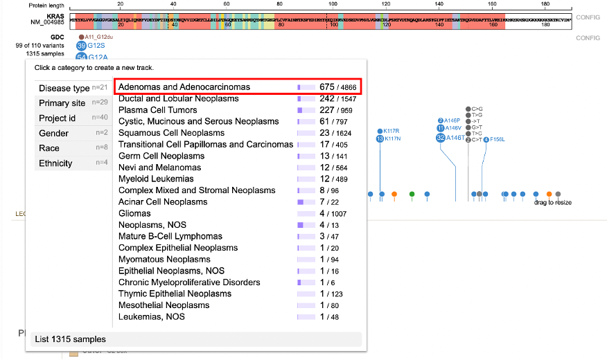](images/lollipop23.png "Click to see the full image.")

This new subtrack only shows the 675 Adenomas and Adenocarcinomas samples. This side-by-side view allows for a comparison between the mutations in the main track vs the subtrack.

[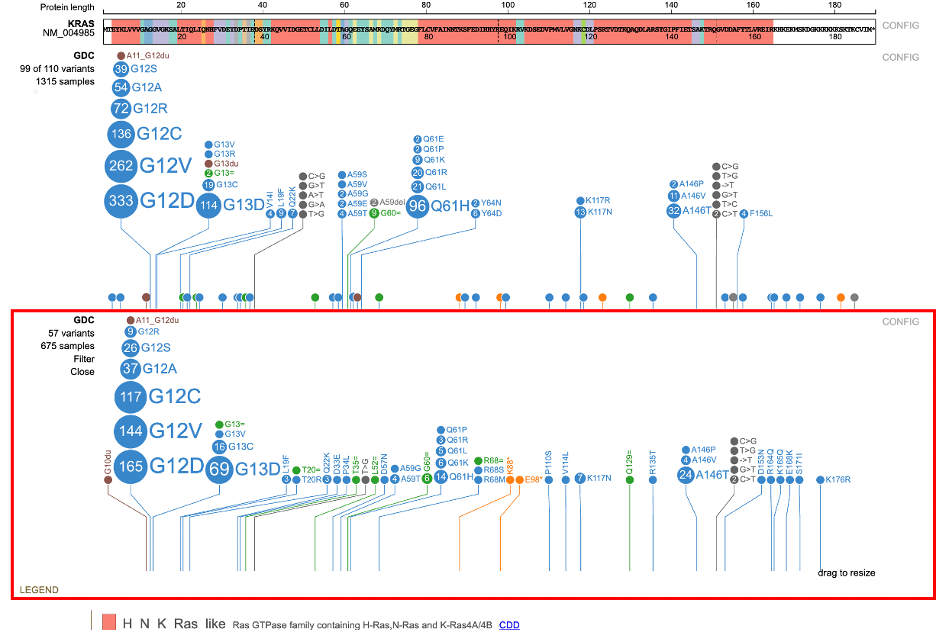](images/lollipop24.png "Click to see the full image.")

Each subtrack offers advanced filtering, shown below, for users to narrow down particular features.

[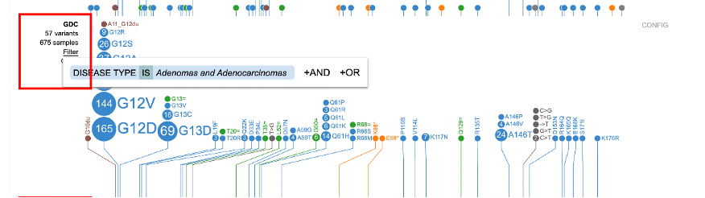](images/lollipop25.png "Click to see the full image.")

Clicking on ‘Filter’ displays a pop-up window with the feature the user selected previously from the sample annotation menu (e.g. Disease type: Adenomas and Adenocarcinomas). Clicking on either +AND or +OR displays a new pop-up with a search bar. Search for the desired term and click on the term’s button. In the image below a user selected ‘gender’ by clicking the ‘+AND’.

[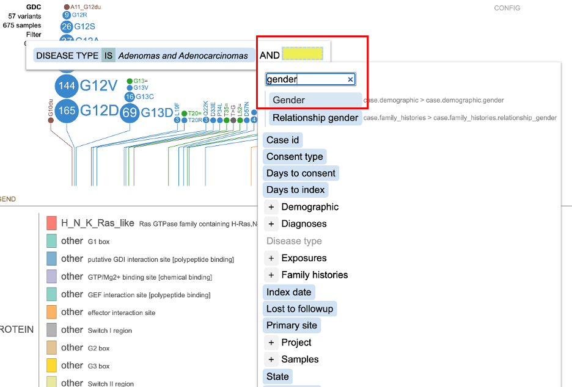](images/lollipop26.png "Click to see the full image.")

By clicking on ‘Gender’, all available values appear with checkboxes (i.e. male and female) as shown below. In this example, male with 293 data points is selected.

[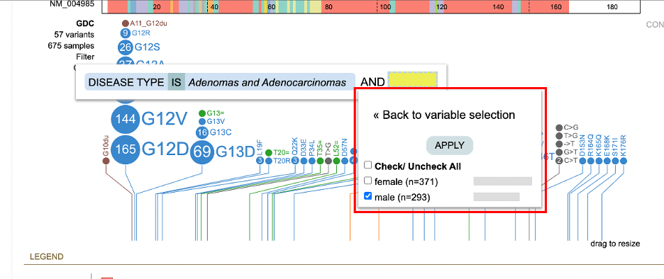](images/lollipop27.png "Click to see the full image.")

Click ‘Apply’ and the subtrack re-renders to reflect the updated filter. In the example below, the subtrack reduces from 675 samples to the 293 male samples with adenomas and adenocarcinomas. The figure shows the difference in mutations in the two tracks. Out of the original 333 samples, 72 of 293 males report the G12D mutation.

[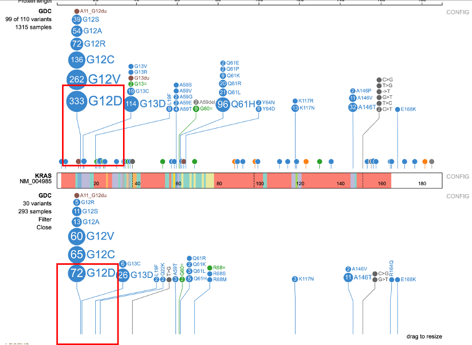](images/lollipop28.png "Click to see the full image.")

Click on the ‘Close’ option to remove the subtrack from the page.

[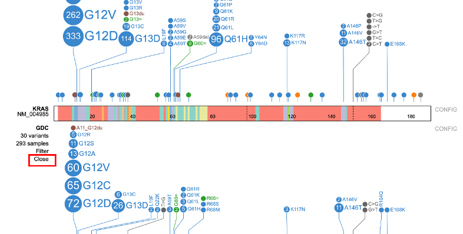](images/lollipop29.png "Click to see the full image.")

### Viewing in the Lollipop Display
In the lollipop chart, users can drag the protein track down by clicking the name of the gene on the left of the protein track and pulling it below the lollipop chart.

[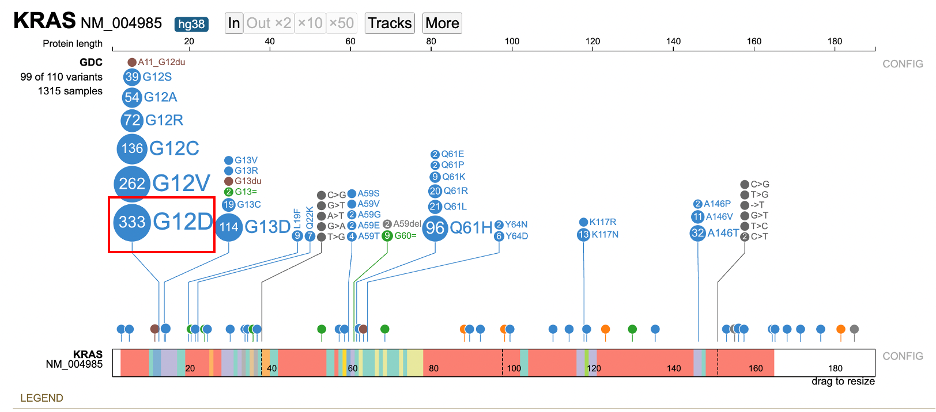](images/lollipop30.png "Click to see the full image.")

Detailed variant annotation is viewable by clicking on the variant disc next to the label. For G12D highlighted in a red outline in the image above, click on the ‘333’ disc. A sunburst chart will appear, shown below.

The center displays the occurrence of the variant (333) above the variant label. The ring

[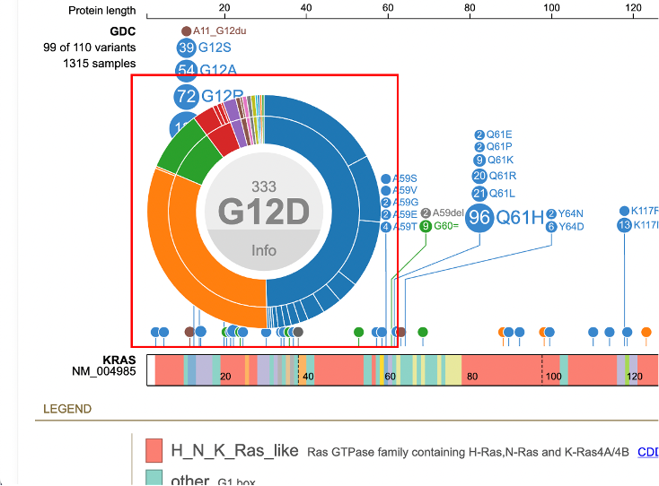](images/lollipop31.png "Click to see the full image.")

hierarchy is arranged by disease types then broken down by primary sites. Hovering over the inner ring displays the disease type, number of samples, and cohort size. In this example, the inner green ring displays ‘Plasma Cell Tumors’ with 28 samples out of a total 949 samples.

The outer ring represents the primary sites. Hovering over the primary site displays the number of samples relative to the disease type. In the figure below, for Ductal and lobular

[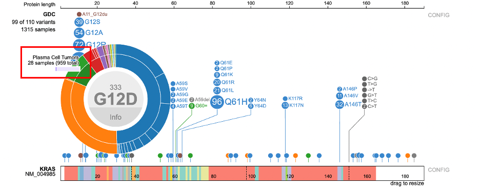](images/lollipop32.png "Click to see the full image.")

neoplasms, there are 105 samples with the primary site as pancreas out of 316 total samples.  

[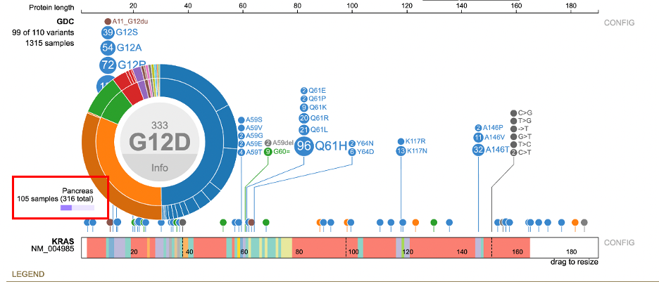](images/lollipop33.png "Click to see the full image.")

Clicking on a node displays a sample table for the disease type or primary site. In the figure below, the user selected ‘Plasma Cell Tumors’. The sample annotation table appears for all Plasma Cell Tumors.

[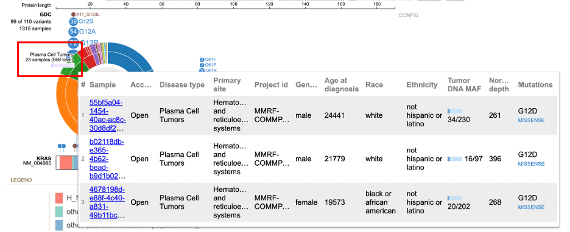](images/lollipop34.png "Click to see the full image.")

An aggregate sample table is available by clicking the ‘Info’ button in the center of the sunburst. This displays all the samples associated with that variant. In the screen recording below the aggregate sample table appears for KRAS - G12D.

[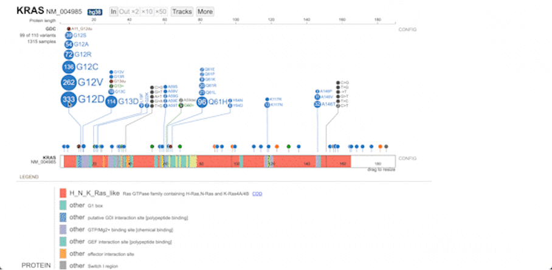](images/lollipop35.gif "Click to see the full image.")

Clicking on the sample name hyperlink opens a new tab to the sample’s  GDC Case Summary page.

Clicking on the variant label in the center removes the sunburst chart.

[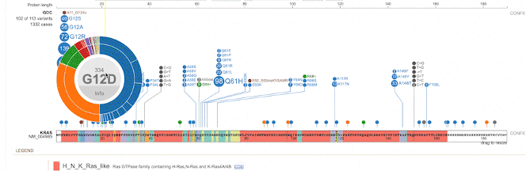](images/lollipop36.gif "Click to see the full image.")

### Working With the Protein Track
There are two zoom methods: highlighting a region and zoom buttons in the toolbar. For viewing a nucleotide of interest, click and drag the mouse in the top, x-axis, Protein length scale. The region appears highlighted in red with the calculated protein length in center.

Once the mouse is released, the lollipop re-renders as the selected region.

The zoom buttons in the toolbar is the second option to zoom in and out based on the center position of the lollipop. For zooming out, users can choose to zoom out 2x, 10x or 50x times.

[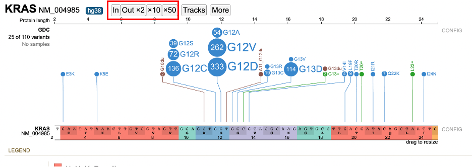](images/lollipop36.png "Click to see the full image.")

Zooming in causes the protein track to display the codons and the nucleotides as shown below. Hovering over the nucleotide position displays a tooltip with the exon, amino acids position, RNA position, and protein domain. As shown in the image below, at codon 12, the second exon of the transcript, RNA position 225 bp, the reference allele is a ‘G’. There is a substitution at ‘G’ to A, V and D in the KRAS gene for isoform NM_004985 for which the cases are as shown below.

[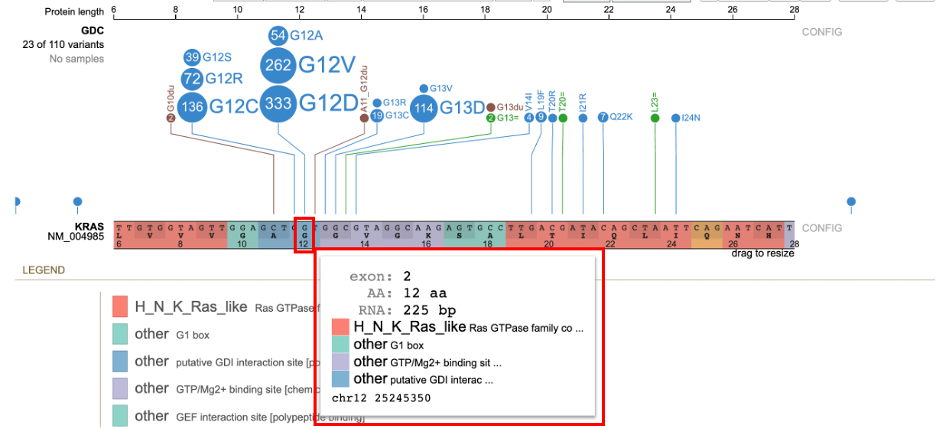](images/lollipop37.png "Click to see the full image.")

# Legend Panel

The protein track color codes regions by the protein domain present on the full-length protein region in the exon display. For KRAS, the protein domains are shown in the red box in the image below.

[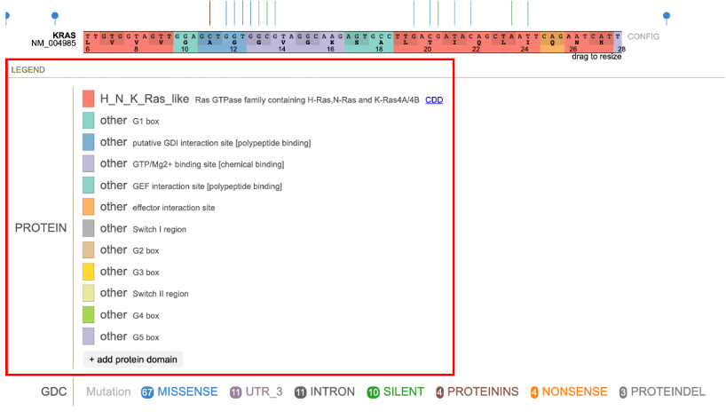](images/lollipop38.png "Click to see the full image.")

### Protein Domain Legend
Clicking on the colored box next to the protein domain label removes the color from the protein track, as depicted below.

[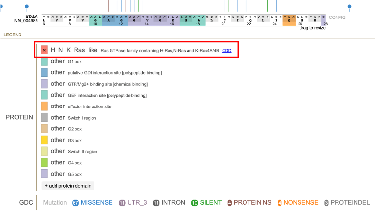](images/lollipop39.png "Click to see the full image.")

Custom protein domains are added by clicking on the ‘+add protein domain’ button at the bottom of the list. An input box appears requiring the following information:
1. Name, text with space, no semicolon: This is the name of the protein domain
2. Range, two integers joined by space: This is the codon position – start and stop
3. Color (e.g., red, #FF0000, rgb (255,0,0)): This is the color to assign to the protein domain.

### GDC Mutations
The lollipop discs are color coded per GDC mutation classes. The legend for the mutations appears below the protein domains with more advanced show/hide functions.

[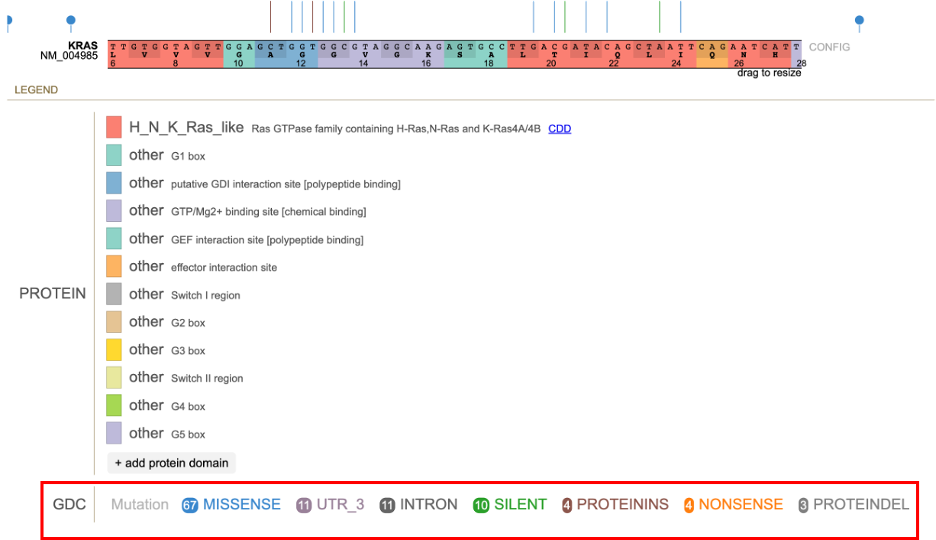](images/lollipop40.png "Click to see the full image.")

The classification for the type of variant is color coded as follows:

[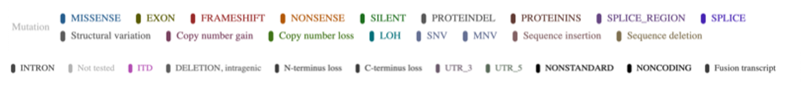](images/lollipop41.png "Click to see the full image.")

Clicking on a mutation prompts a pop-up menu to appear with the description of the mutation. Options to ‘hide’ or ‘show only’ are specific to the mutation. The option ‘show all’ includes all previously hidden mutations. Selecting ‘MISSENSE’ shown in the figure below by the yellow highlight displays the initial menu with the ‘hide’ and ‘show only’ buttons.

[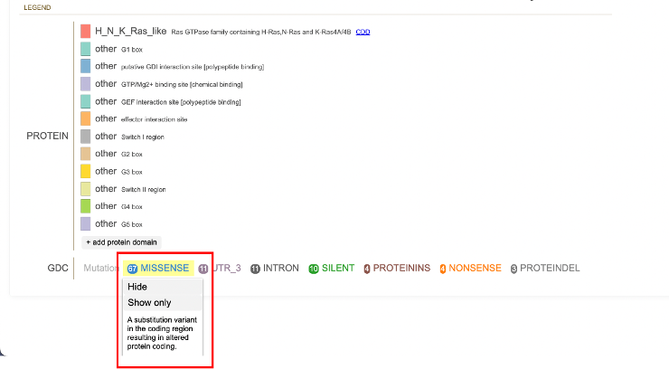](images/lollipop42.png "Click to see the full image.")

Clicking ‘Hide’ removes all of the mutation discs from the lollipop. The mutation is reordered to the end of the list and the font is striked through and grayed out. The discs reappear when the mutation label is clicked again.

[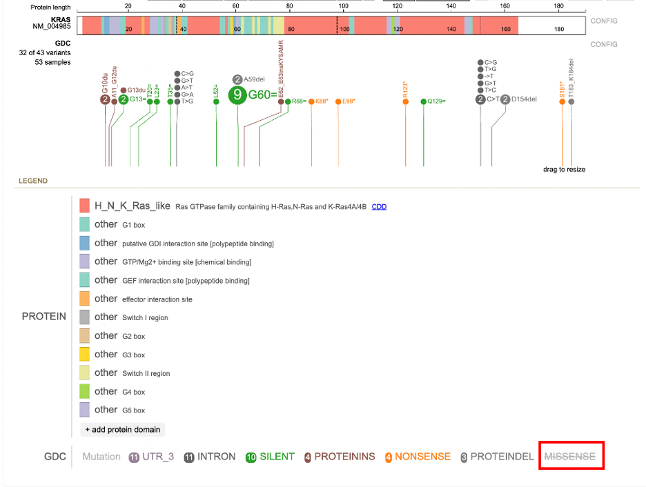](images/lollipop43.png "Click to see the full image.")

# More Options

ProteinPaint offers methods to download figures and data. Click the ‘More’ button in the toolbar to display various options as shown below.

[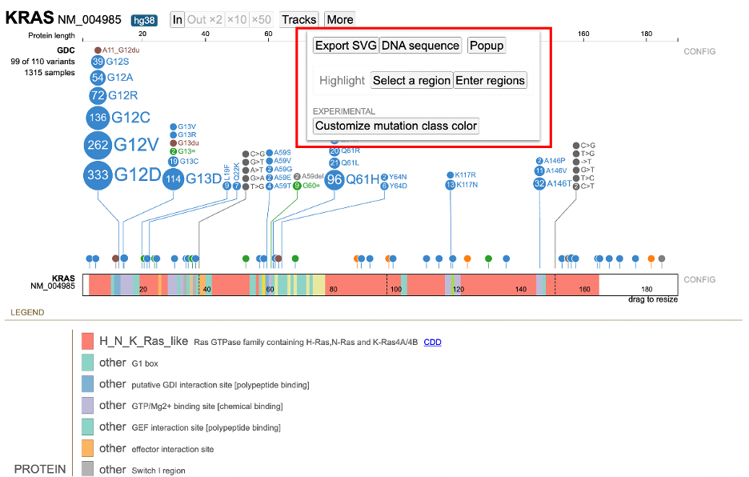](images/lollipop44.png "Click to see the full image.")

### Exporting the Figure

Click “Export SVG” to download the lollipop and legend as an SVG file.

[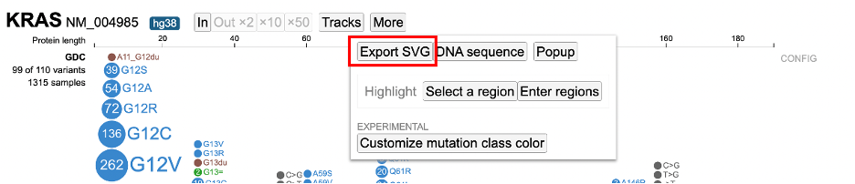](images/lollipop45.png "Click to see the full image.")

The exported figure will contain following contents, reflecting a user’s customization:
* Displayed datasets, including custom data
* Expand/fold states of all mutations
* Sequences in the protein if at zoom-in level
* Show/hide state of exon boundaries
* Sunburst charts
* Protein domains without the hidden ones
* All mutations without the hidden classes or origins
* Legend for protein domain, mutation class and origin

### Copying the DNA Sequence

The ‘More’ button also includes a ‘DNA sequence’ button.

[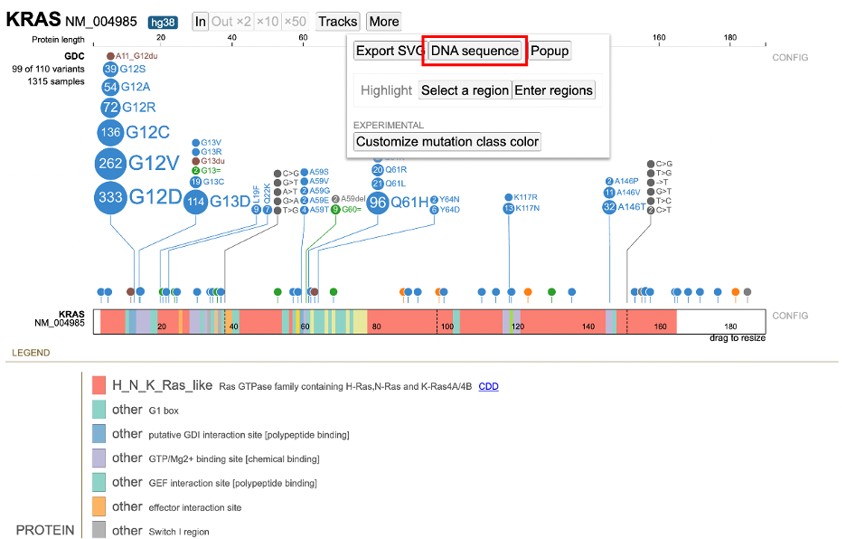](images/lollipop46.png "Click to see the full image.")

Clicking on ‘DNA sequence’ displays the DNA sequence as plain text for easy copying and pasting.

[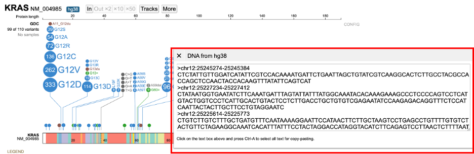](images/lollipop47.png "Click to see the full image.")

### Popup Option

The pop up option under the More button allows for popping open another window with the same lollipop display selected by the user. Below is an example.

[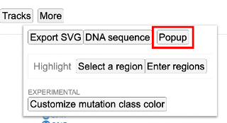](images/lollipop48.png "Click to see the full image.")

[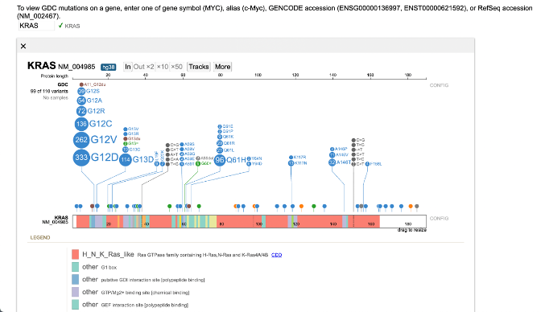](images/lollipop49.png "Click to see the full image.")
