# ProteinPaint Tool

## Introduction to ProteinPaint

ProteinPaint is a web-based, dynamic visualization tool that displays a lollipop chart based on the multidimensional skewer version 3 (mds3 track). This tool utilizes variant annotations from GDC datasets. Given a particular gene, it displays variants associated with that gene as well as the occurrence, disease type, and demographic information of the associated case given a case.

## Accessing the Lollipop Chart

At the Analysis Center, click on the 'ProteinPaint' card to launch the app.

[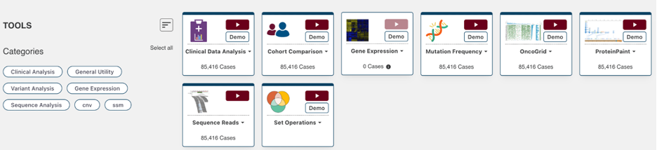](images/lollipop1.png "Click to see the full image.")

Users can view publicly available variants as well as login with credentials in order to access controlled data.

## ProteinPaint Features

When launched, ProteinPaint will display a search box where users can enter a gene symbol, alias, or GENCODE accession. Once a gene is entered, a lollipop frame is displayed with the name of the chart in the header.

[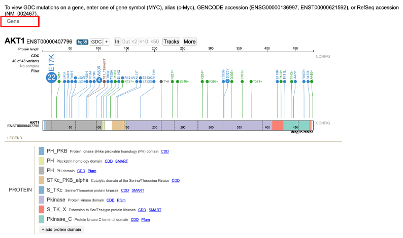](images/lollipop2.png "Click to see the full image.")

There are three main panels in the ProteinPaint tool: [search box](#Search-Box), [Lollipop chart](#Lollipop-Chart-Panel), and [legend](#Legend-panel).

### Search Box

The search box allows users to enter a gene symbol, GENCODE accession, or RefSeq accession. All gene symbols are based on the [HGNC](https://www.genenames.org/about/guidelines/) guidelines. 

When searching for a gene, the text box will auto-complete with possible matches. If a gene is incorrectly entered, the search box will display an error. 

### Lollipop Chart Panel

After entering a gene, the tool will display a Lollipop chart for the GDC variants as well as a Protein View for the default isoform. 

#### Lollipop Chart

In the Lollipop chart, the circular discs for each variant are color coded per GDC mutation classes and are proportional to the number of occurrences. Variants in the same position are arranged in descending order of magnitude.

Exon variants report the amino acid change at the referenced codon. For example, G12D is a G > D substitution at the 12th codon of the protein.

The default isoform will appear directly to the right of the gene name. Clicking on the isoform number will open a display to view all other isoforms. From this window, users have the options to switch the display [track](#protein-view) and isoform.

To the left of the Lollipop, users can click on the number of variants and number of samples links to reveal detailed annotations.

[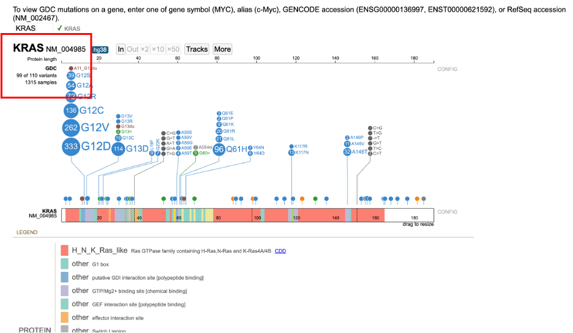](images/lollipop11.png "Click to see the full image.")

Clicking on the number of variants link opens a menu where users can view annotations and manipulate the Lollipop:

* __List:__ Display all variants, each of which can be selected to launch the annotation table which displays consequence, mutation, sample submitter_id, and other data related to the sample
    * __Mutation:__ Clicking on the mutation hyperlink will launch the [GDC Mutation Summary Page](mutation_frequency.md#gene-and-mutation-summary-pages)
    * __Sample:__ Clicking on the sample hyperlink will launch the [GDC Case Summary Page](quick_start.md#cohort-case-table). Users also have the ability to create a new cohort or launch the [Disco plot](oncomatrix.md#disco-plot)
* __Collapse/Expand:__ Collapse or expand all skewers in the lollipop
* __Download:__ Download the mutations in a TXT file
* __As lollipops:__ Display variants via circular discs proportional to the number of occurrences
* __Occurrence as Y axis:__ Sort variants on the y-axis by number of occurrences

Clicking on the number of samples hyperlink opens a window to view annotations grouped by GDC case-related fields such as Disease type and Primary site. Selecting a value label or value's sample fraction adds a new Lollipop subtrack that displays only the samples with the given value. This side-by-side view allows for a comparison between the mutations in the main track versus the subtrack.

[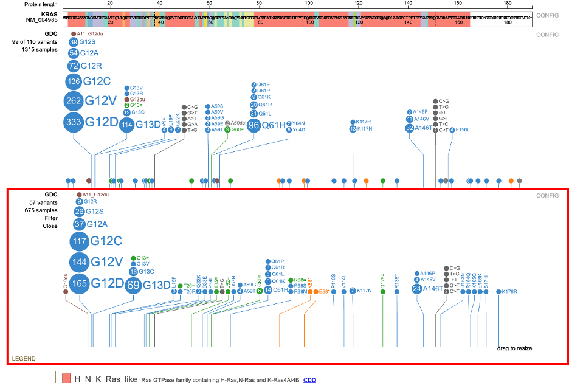](images/lollipop24.png "Click to see the full image.")

Each subtrack offers advanced filtering for users to narrow down particular features. Clicking on the value to the right of the Lollipop launches a pop-up window where users can add subsequent filters using the `+AND` or `+OR` options.

[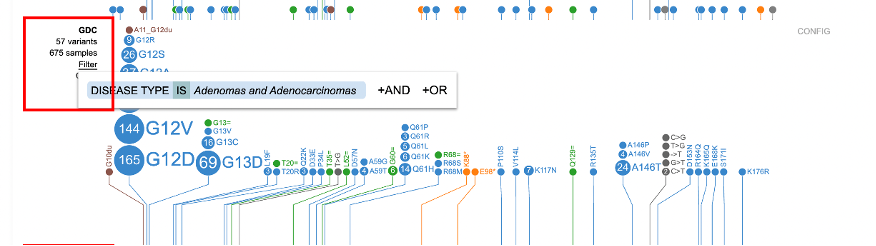](images/lollipop25.png "Click to see the full image.")

Detailed variant annotation is viewable by clicking on the disc next to the variant label. The sunburst chart is composed of a ring hierarchy, arranged by disease types then broken down by primary sites. 

[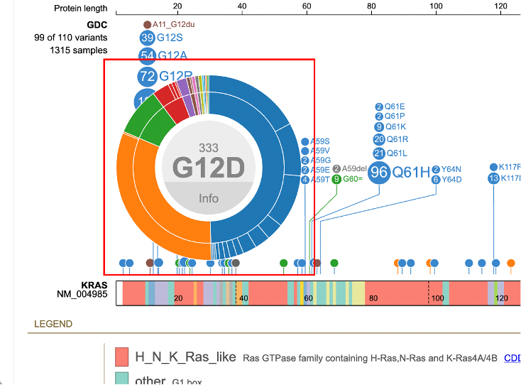](images/lollipop31.png "Click to see the full image.")

Hovering over the inner and outer rings displays the disease type or primary site, number of samples, and cohort size. 

[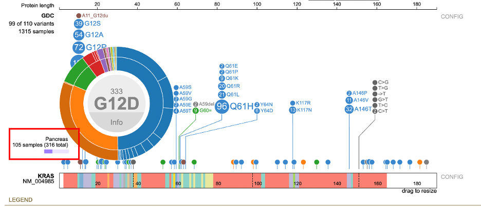](images/lollipop33.png "Click to see the full image.")

An aggregate table displaying all the samples associated with that variant is available by clicking the 'Info' button in the center of the sunburst.

[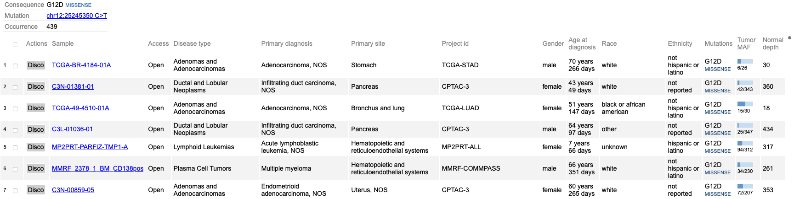](images/lollipop_sample_table.png "Click to see the full image.")

The top of the table displays consequence, mutation, and occurrence count with a hyperlink to the [GDC Mutation Summary Page](mutation_frequency.md#gene-and-mutation-summary-pages). 

The sample table contains a number of columns for various associated features per sample such as Disease type, Mutations, and Tumor DNA Mutant Allele Frequency (MAF). Users can create a new cohort by selecting the checkboxes in the first column then clicking 'Create Cohort' in the bottom right corner of the table. The table also includes options to launch the [Disco plot](oncomatrix.md#disco-plot) and the [GDC Case Summary Page](quick_start.md#cohort-case-table) for each sample.

#### Protein View

The Protein View, which displays the nucleotides, codons in the exon region, introns, and protein domains, is the primary area in which a user will visualize and interact with protein coding regions. 

[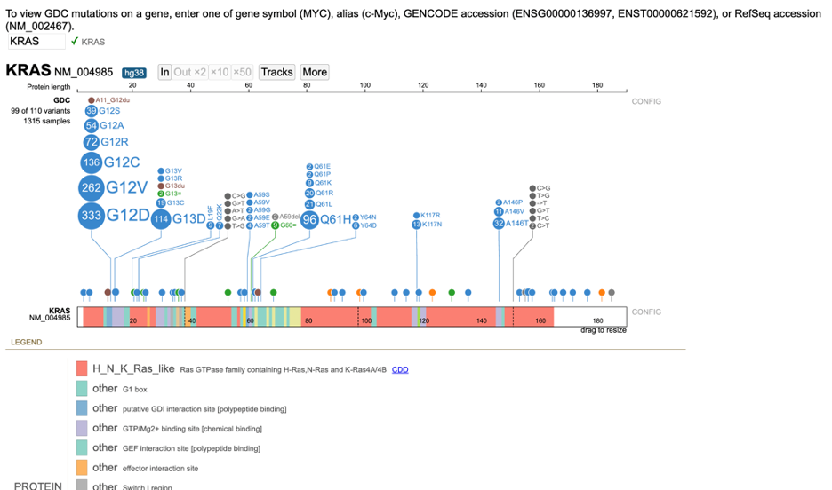](images/lollipop6.png "Click to see the full image.")

To zoom into the Protein View, users can highlight a region or use the zoom buttons (`In`, `Out x2`, `x10`, and `x50`) in the toolbar. For viewing a nucleotide of interest, click and drag the mouse in the top, x-axis, Protein length scale. The region appears highlighted in red with the calculated protein length in center.

Zooming in to the protein track displays the codons and the nucleotides. Hovering over the nucleotide position displays a tooltip with the exon, amino acids position, RNA position, and protein domain.

[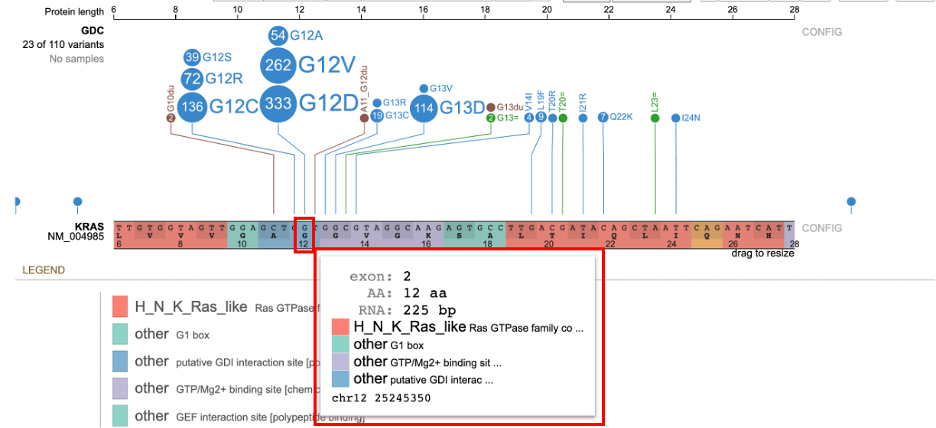](images/lollipop37.png "Click to see the full image.")

By clicking on the isoform number in the Lollipop chart, users can switch the display track between genomic, splicing RNA, exon only, protein, and aggregate of all isoforms.

### Legend Panel

#### Protein Domains

The Protein View color codes regions by the protein domain present on the full-length protein region in the exon display.

The legend offers simple filtering for the variants shown in the lollipop. To the right of `PROTEIN`, users can click on the color to hide that particular protein domain. Clicking on the color again shows the protein domain.

Custom protein domains are added by clicking on the `+ add protein domain` button at the bottom of the list. An input box appears requiring the following information:

1. Name, text with space, no semicolon: Name of the protein domain
2. Range, two integers joined by space: Codon position - start and stop
3. Color (e.g., red, #FF0000, rgb (255,0,0)): Color to assign to the protein domain

The protein domains also include hyperlinks to databases of protein families such as the [Conserved Domains Database (CDD)](https://www.ncbi.nlm.nih.gov/cdd/), [Simple Modular Architecture Research Tool (SMART)](https://smart.embl.de), and [Pfam](https://www.ebi.ac.uk/interpro/).

#### GDC Mutation Class 

The GDC mutation class color coding for the lollipop discs appears below the legend for the protein domains.

[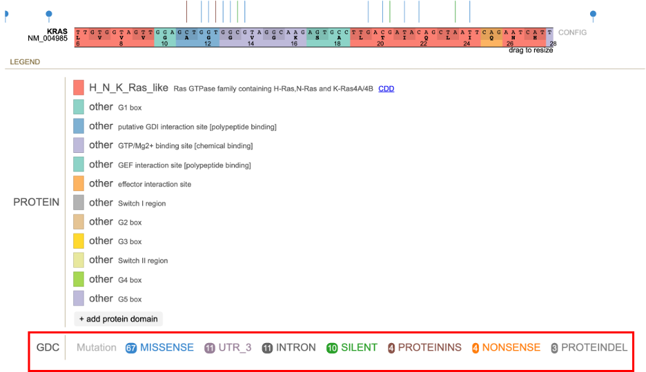](images/lollipop40.png "Click to see the full image.")

The classification for the type of variant is color coded as follows:

[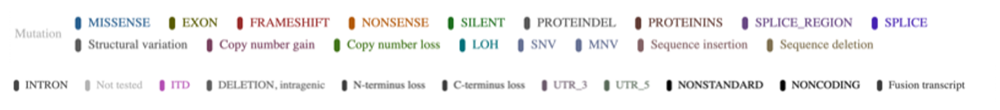](images/lollipop41.png "Click to see the full image.")

Clicking on a mutation class opens a pop-up menu with show/hide functionalities:

* __Hide:__ Remove all of the lollipop discs for the particular mutation class
* __Show only:__ Only show the lollipop discs for the particular mutation class
* __Show all:__ Display the lollipop discs for all mutation classes

[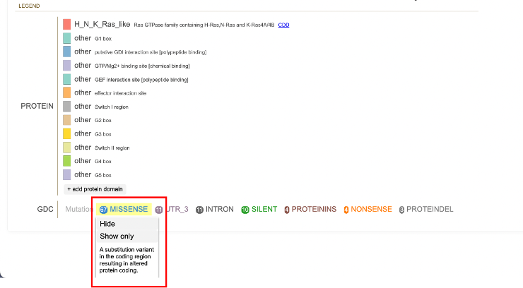](images/lollipop42.png "Click to see the full image.")

### Additional Features

In the toolbar, the `More` button offers methods to download figures and data: 

[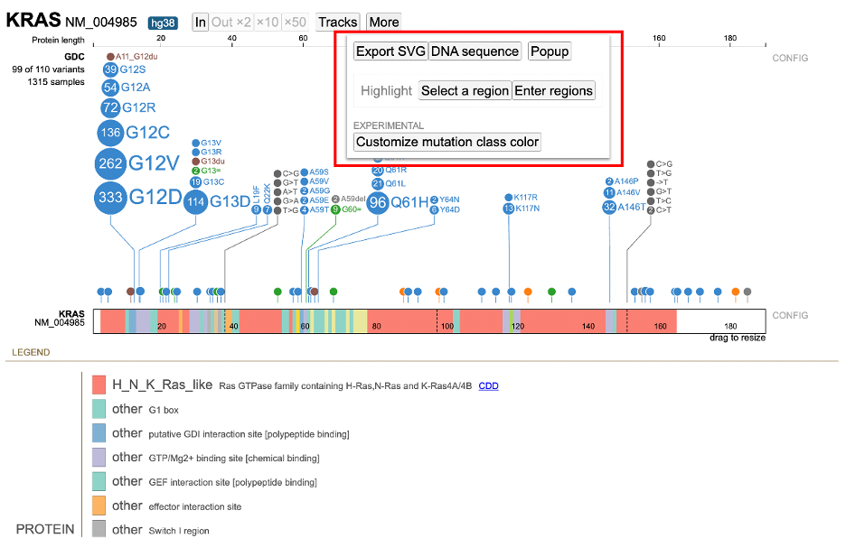](images/lollipop44.png "Click to see the full image.")

* __Export SVG:__ Download the Lollipop and legend as an SVG file
* __Reference DNA Sequence:__ Display the DNA sequence as plain text for easy copying and pasting
* __Highlight:__ Highlight a region in the Lollipop by selecting it in the chart or entering it in a text box