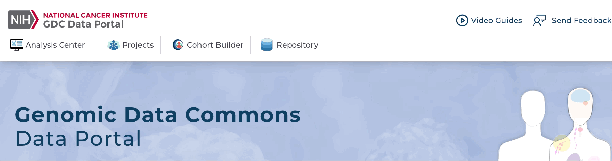

# Quick Start Page

Start at [https://portal.gdc.cancer.gov/](https://portal.gdc.cancer.gov/).

## Building a Cohort Flow

__Step 1:__ Go to the Cohort Builder at the top left of the Data Portal.

  
<i>Click to Expand/Collapse Animation</i>

__Step 2:__ Use the filters in the Cohort Builder to filter down the full set of GDC cases to a subset you are interested in. Filter categories can be selected in the left panel.

  
<i>Click to Expand/Collapse Animation</i>

__Step 3:__ Save your cohort by clicking the "Save" icon in the cohort bar, choosing "Save", and naming your cohort when prompted.

  
<i>Click to Expand/Collapse Animation</i>

__Step 4:__ The cohort you created is now your active cohort.  Go to the Analysis Center at the top left of the Data Portal.  Choose the tool you would like to use from the list.  The analysis will apply to the data from your cohort.

  
<i>Click to Expand/Collapse Animation</i>

