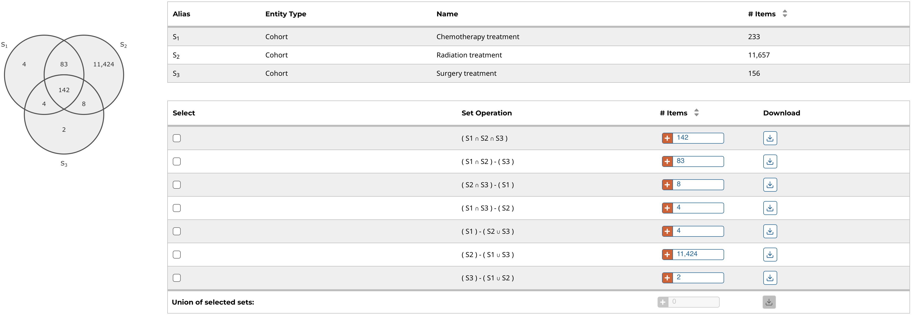

# Set Operations

Up to three cohorts, gene sets, and mutation sets can be compared and exported based on complex overlapping subsets. The features of this page include:

* __Venn Diagram:__ Visually displays the overlapping items included within the three cohorts or sets. Subsets based on overlap can be selected by clicking one or many sections of the Venn diagram. As sections of the Venn Diagram become highlighted in blue, their corresponding row in the overlap table becomes selected.  

* __Summary Table:__ Displays the alias, entity type, and name for each set included in this analysis.

* __Overlap Table:__ Displays the number of overlapping items with set operations rather than a visual diagram. Subsets can be selected by checking boxes in the "Select" column, which will highlight the corresponding section of the Venn Diagram. As rows are selected, the "Union of selected sets" row is populated. Each row has an option to create a new set or cohort from the subset, or export the subset as a TSV.