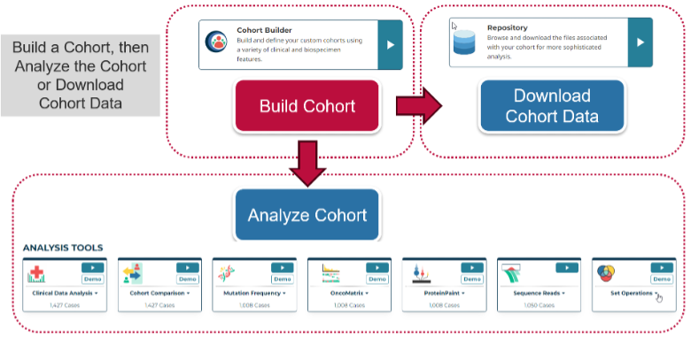

# Tutorial Videos

## Overview

The GDC Data Portal 2.0 (https://portal.gdc.cancer.goc) centers around the idea of building cohorts, or groups of cases, before analyzing or downloading data (Figure 1).

In this GDC 2.0 Video Tutorial, learn how to:

* Build a cohort
* Analyze a cohort using GDC analysis tools
* Download data associated with a cohort

GDC 2.0 Videos are available in the [NCI GDC YouTube Playlist](XXXLINK2PlaylistXXX). For additional details, please see the [GDC 2.0 User’s Guide](../quick_start.md).

## Build Cohort

<table>
<tr>
<td>
Cohorts are created using the __Cohort Builder__, which allows users to specify cases with custom filters for things like disease characteristics, patient demographics, data type, and more.

In this video, learn how to use the __Cohort Builder__ to build a cohort of patients with lung cancer, that are over the age of 50, and have harmonized RNA-Seq data.
</td>

<td><iframe width="320" height="240" src="https://www.youtube.com/embed/tk1nEX2gnqk" frameborder="0" allow="autoplay; encrypted-media" allowfullscreen> </iframe>

</td></tr>
</table>

## Analysis Center

<table>
<tr>
<td>
Once a cohort is created, the cohort can be analyzed using an analysis tool in the __Analysis Center__.

In this video, learn how to analyze a cohort in the __Analysis Center__. Instructional videos are available for each analysis tool.

</td>

<td><iframe width="320" height="240" src="https://www.youtube.com/embed/tk1nEX2gnqk" frameborder="0" allow="autoplay; encrypted-media" allowfullscreen> </iframe>
 
The Cohort Builder video provides an overview of building a cohort, saving a cohort, and how to import/export cohorts.  
</td></tr>
</table>

## Analysis Tools

A cohort can be analyzed by selecting an analysis tool in the Analysis Center. The GDC provides analysis tools for performing both gene-level variant analysis and clinical data analysis. Table 1 identifies and describes each tool, and provides video instruction.

<table>
<tr><td>__Tool__</td> <td>__Description__</td><td>__Video__</td></tr>

<tr>
<td>__Clinical Data Analysis__</td>
<td>Use clinical variables to perform basic statistical analysis of your cohort</td>
<td><iframe width="240" height="160" src="https://www.youtube.com/embed/ucKM6JxzljM" frameborder="0" allow="autoplay; encrypted-media" allowfullscreen > </iframe>
</td>
</tr>
<tr>
<td>__Cohort Comparison__</td>
<td>Display the survival analysis of your cohorts and compare characteristics such as gender, vital status and age at diagnosis</td>
<td><iframe width="240" height="160" src="https://www.youtube.com/embed/ucKM6JxzljM" frameborder="0" allow="autoplay; encrypted-media" allowfullscreen > </iframe>
</td>
</tr>
<tr>
<td>__Mutation Frequency__</td>
<td>Visualize most frequently mutated genes and somatic mutations</td>
<td><iframe width="240" height="160" src="https://www.youtube.com/embed/ucKM6JxzljM" frameborder="0" allow="autoplay; encrypted-media" allowfullscreen > </iframe>
</td>
</tr>
<tr>
<td>__OncoMatrix__</td>
<td>Visualize the top most mutated cases and genes affected by high impact mutations in your cohort</td>
<td><iframe width="240" height="160" src="https://www.youtube.com/embed/ucKM6JxzljM" frameborder="0" allow="autoplay; encrypted-media" allowfullscreen > </iframe>
</td>
</tr>
<tr>
<td>__ProteinPaint__</td>
<td>Visualize mutations in protein-coding genes by consequence type and protein domain</td>
<td><iframe width="240" height="160" src="https://www.youtube.com/embed/ucKM6JxzljM" frameborder="0" allow="autoplay; encrypted-media" allowfullscreen > </iframe>
</td>
</tr>
<tr>
<td>__Sequence Reads__</td>
<td>Visualize sequencing reads for a given gene, position, SNP, or variant</td>
<td><iframe width="240" height="160" src="https://www.youtube.com/embed/ucKM6JxzljM" frameborder="0" allow="autoplay; encrypted-media" allowfullscreen > </iframe>
</td>
</tr>
<tr>
<td>__Set Operations__</td>
<td>Display a Venn diagram and compare/contrast your cohorts or sets of the same type</td>
<td><iframe width="240" height="160" src="https://www.youtube.com/embed/ucKM6JxzljM" frameborder="0" allow="autoplay; encrypted-media" allowfullscreen > </iframe>
</td>
</tr>
</table>
